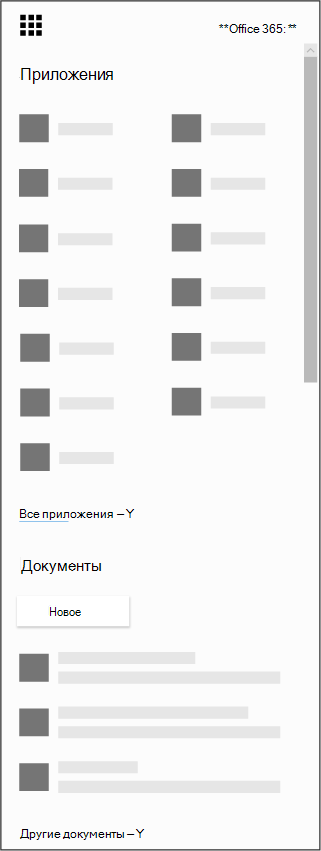

# Получите приложение Microsoft Bookings для iOS и Android

Благодарим за скачивание приложения Microsoft Резервирования! Microsoft Bookings доступна в качестве мобильного приложения для iOS и Android. Приложение Bookings для iOS теперь доступно во всех регионах и странах, поддерживаемых компанией Apple. Вы можете скачать его в магазине [iTunes App Store](https://apps.apple.com/app/microsoft-bookings/id1065657468). Приложение Bookings для Android доступно для скачивания из [магазина Google Play в](https://play.google.com/store/apps/details?id=com.microsoft.exchange.bookings) США и Канаде.

Прежде чем приступить к его использованию, необходимо настроить Bookings в Интернете.

1. Не можете найти приложение, которое ищете? Из запуска приложения выберите все приложения, чтобы увидеть алфавитный список доступных Microsoft 365 приложений. Оттуда можно искать определенное приложение

   

2. Добрался [до Office страницы и](https://office.com) из запуска приложения, выберите **Bookings**.

3. Выберите **Включить**.

4. Укажите название и тип вашей компании, например "парикмахерская" или "стоматология", а затем выберите **В Bookings**.

5. Теперь вы готовы настроить бронирование для вашей организации. Выполните действия в разделе [Microsoft Bookings,](bookings-overview.md) чтобы завершить настройку резервирования. Выйдите из приложения на мобильном устройстве. Снова войдите в него, чтобы перейти к новому календарю.

## Режим только для просмотра

Любой пользователь, которому не предоставляется доступ к записи чтения в Bookings, по-прежнему может использовать мобильное приложение в режиме только для просмотра. Каждый, у кого есть лицензия Bookings, которая добавляется в календарь бронирования, может увидеть расписание и расписание своих коллег, сведения о встрече и бизнес-сведения. Пользователь с доступом только для просмотра не может вносить изменения или изменения и не может получить доступ к списку клиентов.
