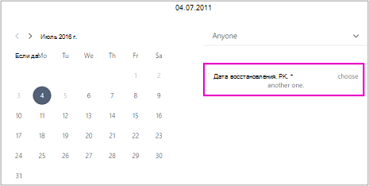
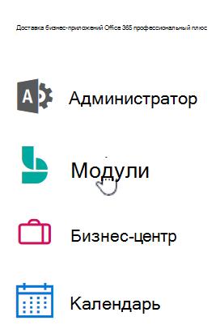

# Планирование нерабочих дней и отпусков

Иногда вы захотите закрыть свою деятельность на праздники или мероприятия в группе, иначе сотрудникам потребуется отключать их, когда они болеют, в отпуске или недоступны по другим причинам. Вы можете запланировать время отключки из календаря Microsoft Bookings, и сотрудник будет недоступен для резервирования в указанное время. После того как сотрудники вернутся к работе, на странице резервирования для них будут указаны заданные часы работы.

Посмотрите это видео или выполните действия ниже, чтобы запланировать закрытие предприятия или отключение сотрудников.

> [!VIDEO https://www.microsoft.com/videoplayer/embed/RE2TxDC]

## Добавление нерабочих дней компании

1. В Microsoft 365 выберите приложение для запуска, а затем выберите Bookings.

1. В области навигации выберите **Календарь** \> **Нерабочее время**.

   

1. Заполните нужные сведения, включая название, дату и время начала и окончания, место и примечания.

1. Выберите **Событие на целый день**.

1. Выберите всех сотрудников.

1. Нажмите кнопку **Сохранить**.

Когда клиент попытается запланировать визит на нерабочий день, на странице резервирования появится сообщение.

   

## Добавление нерабочих дней сотрудника

1. В Microsoft 365 выберите приложение для запуска, а затем выберите **Bookings.**

   

1. В области навигации выберите **Календарь** \> **Нерабочее время**.

   

1. Заполните нужные сведения, включая название, дату и время начала и окончания, место и примечания. Если сотрудник будет отсутствовать целый день или нескольких дней, выберите **Событие на целый день**.

1. Выберите нужных сотрудников.

1. Нажмите кнопку **Сохранить**.
