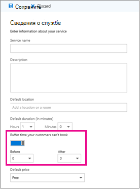

# Настройка запаса времени в Microsoft Bookings

Для некоторых встреч может потребоваться время до или после того, как вы намерены отвечать на ваши клиенты для настройки, очистки или сброса помещения и оборудования. Или, если вы находитесь между встречами пользователей, вам может потребоваться время, чтобы вы и ваша команда могли перемещаться между встречами без ожидания клиента.

Вы можете задать время буферизации до начала встреч, после окончания встреч или и то, и другое, чтобы предоставить сотрудникам дополнительное время, необходимое для подготовки к следующей встрече.

> [!NOTE]
> Для клиентов, у которых есть подписки Microsoft 365 бизнес Standard, Microsoft 365 a3 или Microsoft 365 A5, резервирование включается по умолчанию. Кроме того, они доступны пользователям Office 365 корпоративный E3 и Office 365 корпоративный, но по умолчанию она отключена. Чтобы приступить к работе, ознакомьтесь [со статьей получение доступа к книгам Майкрософт](get-access.md). Чтобы включить или отключить резервирование, ознакомьтесь со статьей [Включение или отключение учета для Организации](turn-bookings-on-or-off.md).

## Настройка запаса времени по умолчанию

Значения по умолчанию для времени буфера задаются на странице " **сведения о службе** " в разделе резервирования. Как и все значения по умолчанию для служб, установленные на этой странице, эти значения по умолчанию можно изменить для определенного резервирования в соответствии с конкретными потребностями клиентов.

Параметр время буфера можно найти сразу под заданной **по умолчанию** службой "сведения о длительности" на странице " **сведения о службе** ". Прежде чем его можно будет настроить для данной службы, необходимо включить параметр время буфера, установив переключатель время буфера. Это приводит к отображению раскрывающихся элементов **до** и **после** , которые используются для выбора стандартного времени хранения до и после каждого резервирования, как показано ниже:

   

## Запас времени и время встречи

Чтобы избежать путаницы относительно того, когда клиенты ожидают соответствия требованиям, при резервировании отображается время буферизации и фактическое время встреч (время, в течение которого клиенты ожидают вас) в календаре, а также в подтверждениях электронной почты и напоминаниях соответствующему сотруднику. Например, ниже показано, что вы видите в разделе резервирования для встречи с клиентом, включающим 15 минут времени в буфере до встречи.

Обратите внимание, что само событие (слева на изображении ниже) показывает более светлую заливку для времени буфера и более темную заливку для фактической встречи с клиентом. Вызываемая встреча (которая открывается при выборе события) указывает, что встреча от 9:00AM до 10:00AM с Валентины, а включает 15 минут времени буфера до встречи и 0 минут после встречи. Подтверждения и напоминания сотрудникам аналогично обращаются к определенному времени буфера и встречи, пока клиент получит только подтверждения и напоминания, которые ссылаются на 9:00AM до 10:00AMое время встречи.

   

## Запас времени и доступность

Клиенты не видят напрямую и не могут изменить заданное время буфера. Тем не менее, так как время буферизации используется для вычисления общей длительности обслуживания, клиенты будут видеть вас и ваших подходящих сотрудников, как они зарезервированы в течение как в буфере, так и в обычной встрече. Кроме того, пользователи видят сведения о доступности для вас и сотрудников, если для встречи и времени их буфера достаточно времени.

Например, однократная встреча с временным буфером до 15 минут требует наличия доступного временного блока по крайней мере в 1 часа и 15 минут. Таким образом, встреча для этой службы заполнит в календаре период времени 75 минут и требует 75 минут доступности для книги без конфликтов.
