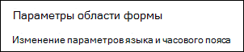
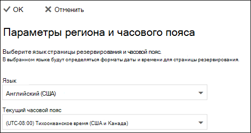

# Настройка языка и часовых поясов в Microsoft Bookings

Если вы используете Microsoft Bookings и заказы создаются в неправильное время, возможно, потребуется изменить параметры часовой зоны. Кроме того, если некоторые заказы находятся на неправильном языке, вам может потребоваться изменить параметры языка.

Для bookings существует два отдельных языковых и часового пояса. Первый параметр управляет языком и часовой зоной календаря бронирования и устанавливается с помощью Outlook веб-параметров для личного календаря входящего пользователя. Второй параметр влияет на страницу самообслуживки, которую используют клиенты, и устанавливается с помощью страницы "Региональные параметры", которая контролирует язык и часовой пояс только для этой страницы.

## Настройка языка и часового пояса для календаря резервирования

В календаре бронирования используются параметры языка и часового пояса пользователя, входящего в систему. Например, если часовой пояс пользователя, во время входа в систему, установлен в восточном стандартном времени (EST), в календаре бронирования покажутся существующие время начала и окончания встречи в EST. Этот часовой пояс изначально был заданной при Microsoft 365 и Outlook веб-учетных записей.

Чтобы установить язык и часовой пояс для календаря бронирования:

1. Войдите Microsoft 365 и выберите Outlook плитку на посадочной странице (как показано на скриншоте ниже) или в Microsoft 365 App Launcher.

   

1. После Outlook, выберите значок  передач в верхнем правом углу экрана, чтобы открыть личные и учетные записи, а  затем поиск "часового пояса" в поле поиска Параметры панели поиска. В области параметров вы увидите текущие значения языка и часового пояса для этой учетной записи. Как было отмечено ранее, эти значения используются также в календаре резервирования.

1. Измените язык или часовой пояс, выбрав стрелку в поле **Язык** или Текущий часовой пояс и выбрав нужный параметр.

1. Щелкните **Сохранить**. Панель Параметры закрывается, Outlook перезапусков веб-страниц, применяются новые параметры языка и часового пояса.

## Настройка языка и часового пояса для страницы резервирования

1. В Microsoft 365 выберите запуск приложения, а затем выберите **Bookings**.

1. В области навигации выберите страницу **Booking и** выберите параметры языка изменения **и часового пояса.**

   

1. Выберите язык и текущий часовой пояс и выберите ОК.

   
