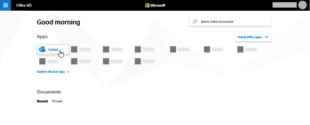

# Настройка языка и часовых поясов в Microsoft Bookings

Если вы используете резервирование Microsoft и создание резервирований выполняется в неправильное время, может потребоваться изменить параметры часового пояса. Аналогично, если некоторые резервирования относятся к неправильному языку, может потребоваться изменить языковые параметры.

Существует два отдельных параметра языка и часового пояса для резервирований. Первый параметр определяет язык и часовой пояс календаря резервирования и задается с помощью Outlook в Интернете для личного календаря пользователя, вошедшего в систему. Второй параметр влияет на страницу самообслуживания резервирования, используемую клиентами, и задается с помощью страницы "региональные параметры", которая управляет языком и часовым поясами только для этой страницы.

> [!NOTE]
> Для клиентов, у которых есть подписки Microsoft 365 бизнес Standard, Microsoft 365 a3 или Microsoft 365 A5, резервирование включается по умолчанию. Кроме того, они доступны пользователям Office 365 корпоративный E3 и Office 365 корпоративный, но по умолчанию она отключена. Чтобы приступить к работе, ознакомьтесь [со статьей получение доступа к книгам Майкрософт](get-access.md). Чтобы включить или отключить резервирование, ознакомьтесь со статьей [Включение или отключение учета для Организации](turn-bookings-on-or-off.md).

## Настройка языка и часового пояса для календаря резервирования

В календаре резервирования используются параметры языка и часового пояса пользователя, вошедшего в систему. Например, если в часовом поясе вошедшего пользователя задано стандартное восточное время (EST), календарь резервирования будет показывать время начала и окончания текущей встречи в средстве EST. Этот часовой пояс был изначально установлен при создании веб-учетных записей пользователей Microsoft 365 и Outlook.

Чтобы задать язык и часовой пояс для календаря резервирования, выполните следующие действия:

1. Войдите в Microsoft 365 и выберите плитку Outlook на целевой странице (как показано на снимке экрана ниже) или в средстве запуска приложений Microsoft 365.

   

1. После открытия Outlook нажмите **значок шестеренки** в верхнем правом углу экрана, чтобы открыть личные параметры и параметры учетной записи, а затем выполните поиск по запросу "часовой пояс" в поле поиска на панели **Параметры** . В области параметров вы увидите текущие значения языка и часового пояса для этой учетной записи. Как было отмечено ранее, эти значения используются также в календаре резервирования.

1. Измените язык или часовой пояс, щелкнув стрелку раскрывающегося списка в поле **язык или текущий часовой пояс** и выбрав нужный параметр.

1. Щелкните **Сохранить**. Панель параметров закрывается, Outlook на веб-сайте перезапускается, и применяются новые параметры языка и часового пояса.

## Настройка языка и часового пояса для страницы резервирования

1. В Microsoft 365 выберите средство запуска приложений, а затем выберите пункт **резервирования**.

1. В области навигации выберите пункт **резервирование страницы** и выберите пункт **изменить параметры языка и часового пояса**.

   

1. Выберите язык и текущий часовой пояс и нажмите кнопку ОК.

   
