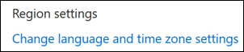

# Настройка языка и часовых поясов в Microsoft BookingsSet language and time zones in Microsoft Bookings

Если вы используете Microsoft Bookings и резервирования создаются в неправильное время, может потребоваться изменить параметры часовой пояс.If you are using Microsoft Bookings and bookings are created at the wrong time, then your time zone settings might need to be changed. Аналогичным образом, если некоторые резервирования находятся на неправильном языке, может потребоваться изменить языковые параметры.Likewise, if some bookings are in the wrong language, you might need to change your language settings.

Существует два отдельных параметра языка и часового пояса для Bookings.There are two separate language and time zone settings for Bookings. Первый параметр управляет языком и часовным поясом календаря резервирования и настраивается с помощью параметров Outlook в Интернете для личного календаря воходящего пользователя.The first setting controls the language and time zone of the booking calendar and is set using the Outlook on the web settings for the personal calendar of the logged-in user. Второй параметр влияет на страницу самостоятельного резервирования, которую используют ваши клиенты, и настраивается на странице "Региональные параметры", которая управляет языком и часовой пояс только для этой страницы.The second setting affects the self-service booking page that your customers use and is set using a "regional settings" page that controls language and time zone only for that page.

## Настройка языка и часового пояса для календаря резервированияSetting language and time zone for a booking calendar

В календаре резервирования используются параметры языка и часового пояса во время входа пользователя.The booking calendar uses the logged-in user’s language and time zone settings. Например, если для часового пояса во время входа пользователя установлено восточное стандартное время (EST), то в календаре резервирования будет по-настоящему отсвеяться время начала и окончания встречи в EST.For example, If the logged-in user’s time zone is set to Eastern Standard Time (EST), then the booking calendar will show existing appointment start and end times in EST. Этот часовой пояс был изначально установлен при создания учетных записей Пользователя в Microsoft 365 и Outlook в Интернете.This time zone was originally set when the user’s Microsoft 365 and Outlook on the web accounts were created.

Чтобы настроить язык и часовой пояс для календаря резервирования:To set the language and time zone for the booking calendar:

1. Войдите в Microsoft 365 и выберите плитку Outlook на странице решения (как показано на снимке экрана ниже) или в microsoft 365 App Launcher.Log into Microsoft 365 and select the Outlook tile on the landing page (as shown in the screenshot below) or in the Microsoft 365 App Launcher.

   

1. После открытия Outlook  выберите значок шестеренки в верхнем правом углу экрана, чтобы открыть параметры личных  учетных записей и учетных записей, а затем наберите "часовой пояс" в поле поиска на панели параметров.After Outlook opens, select the **gear icon** in the upper, right-hand corner of the screen to open your personal and account settings, then search for “time zone” in the **Settings** panel search box. В области параметров вы увидите текущие значения языка и часового пояса для этой учетной записи.The panel will update to show your current personal language and time zone settings for this account. Как было отмечено ранее, эти значения используются также в календаре резервирования.As noted above, this setting also controls the language and time zone of the booking calendar.

1. Измените язык или часовой пояс, выбрав стрелку в поле "Язык" или "Текущий часовой пояс" и выбрав нужный параметр. Change the language or time zone by selecting the drop-down arrow in the **Language or Current time zone** box and choosing the desired setting.

1. Нажмите кнопку **Сохранить**.Click **Save**. Панель параметров закрывается, Outlook в Интернете перезапускается, применяются новые параметры языка и часового пояса.The Settings panel closes, Outlook on the web restarts, and the new language and time zone settings are applied.

## Настройка языка и часового пояса для страницы резервированияSetting the language and time zone for the booking page

1. В Microsoft 365 выберите приложение для запуска, а затем выберите **Bookings.**In Microsoft 365, select the app launcher, and then select **Bookings**.

1. В области навигации выберите страницу **"Резервирование"** и выберите "Изменить **язык и часовой пояс".**In the navigation pane, select **Booking page** and select **Change language and time zone settings**.

   

1. Выберите язык и текущий часовой пояс и выберите "ОК".Select your language and current time zone and choose OK.

   
