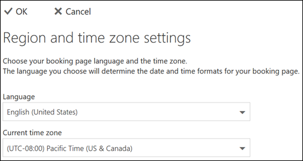

# Настройка языка и часовых поясов в Microsoft BookingsSet language and time zones in Microsoft Bookings

Если вы используете резервирование Microsoft и создание резервирований выполняется в неправильное время, может потребоваться изменить параметры часового пояса.If you are using Microsoft Bookings and bookings are created at the wrong time, then your time zone settings might need to be changed. Аналогично, если некоторые резервирования относятся к неправильному языку, может потребоваться изменить языковые параметры.Likewise, if some bookings are in the wrong language, you might need to change your language settings.

Существует два отдельных параметра языка и часового пояса для резервирований.There are two separate language and time zone settings for Bookings. Первый параметр определяет язык и часовой пояс календаря резервирования и задается с помощью Outlook в Интернете для личного календаря пользователя, вошедшего в систему.The first setting controls the language and time zone of the booking calendar and is set using the Outlook on the web settings for the personal calendar of the logged-in user. Второй параметр влияет на страницу самообслуживания резервирования, используемую клиентами, и задается с помощью страницы "региональные параметры", которая управляет языком и часовым поясами только для этой страницы.The second setting affects the self-service booking page that your customers use and is set using a "regional settings" page that controls language and time zone only for that page.

> [!NOTE]
> Для клиентов, у которых есть подписки Microsoft 365 бизнес Standard, Microsoft 365 a3 или Microsoft 365 A5, резервирование включается по умолчанию.Bookings is turned on by default for customers who have the Microsoft 365 Business Standard, Microsoft 365 A3, or Microsoft 365 A5 subscriptions. Кроме того, они доступны пользователям Office 365 корпоративный E3 и Office 365 корпоративный, но по умолчанию она отключена.Bookings is also available to customers who have Office 365 Enterprise E3 and Office 365 Enterprise E5, but it is turned off by default. Чтобы приступить к работе, ознакомьтесь [со статьей получение доступа к книгам Майкрософт](get-access.md).To get started, see [Get access to Microsoft Bookings](get-access.md). Чтобы включить или отключить резервирование, ознакомьтесь со статьей [Включение или отключение учета для Организации](turn-bookings-on-or-off.md).To turn Bookings on or off, see [Turn Bookings on or off for your organization](turn-bookings-on-or-off.md).

## Настройка языка и часового пояса для календаря резервированияSetting language and time zone for a booking calendar

В календаре резервирования используются параметры языка и часового пояса пользователя, вошедшего в систему.The booking calendar uses the logged-in user’s language and time zone settings. Например, если в часовом поясе вошедшего пользователя задано стандартное восточное время (EST), календарь резервирования будет показывать время начала и окончания текущей встречи в средстве EST.For example, If the logged-in user’s time zone is set to Eastern Standard Time (EST), then the booking calendar will show existing appointment start and end times in EST. Этот часовой пояс был изначально установлен при создании веб-учетных записей пользователей Microsoft 365 и Outlook.This time zone was originally set when the user’s Microsoft 365 and Outlook on the web accounts were created.

Чтобы задать язык и часовой пояс для календаря резервирования, выполните следующие действия:To set the language and time zone for the booking calendar:

1. Войдите в Microsoft 365 и выберите плитку Outlook на целевой странице (как показано на снимке экрана ниже) или в средстве запуска приложений Microsoft 365.Log into Microsoft 365 and select the Outlook tile on the landing page (as shown in the screenshot below) or in the Microsoft 365 App Launcher.

   

1. После открытия Outlook нажмите **значок шестеренки** в верхнем правом углу экрана, чтобы открыть личные параметры и параметры учетной записи, а затем выполните поиск по запросу "часовой пояс" в поле поиска на панели **Параметры** .After Outlook opens, select the **gear icon** in the upper, right-hand corner of the screen to open your personal and account settings, then search for “time zone” in the **Settings** panel search box. В области параметров вы увидите текущие значения языка и часового пояса для этой учетной записи.The panel will update to show your current personal language and time zone settings for this account. Как было отмечено ранее, эти значения используются также в календаре резервирования.As noted above, this setting also controls the language and time zone of the booking calendar.

1. Измените язык или часовой пояс, щелкнув стрелку раскрывающегося списка в поле **язык или текущий часовой пояс** и выбрав нужный параметр.Change the language or time zone by selecting the drop-down arrow in the **Language or Current time zone** box and choosing the desired setting.

1. Щелкните **Сохранить**.Click **Save**. Панель параметров закрывается, Outlook на веб-сайте перезапускается, и применяются новые параметры языка и часового пояса.The Settings panel closes, Outlook on the web restarts, and the new language and time zone settings are applied.

## Настройка языка и часового пояса для страницы резервированияSetting the language and time zone for the booking page

1. В Microsoft 365 выберите средство запуска приложений, а затем выберите пункт **резервирования**.In Microsoft 365, select the app launcher, and then select **Bookings**.

1. В области навигации выберите пункт **резервирование страницы** и выберите пункт **изменить параметры языка и часового пояса**.In the navigation pane, select **Booking page** and select **Change language and time zone settings**.

   

1. Выберите язык и текущий часовой пояс и нажмите кнопку ОК.Select your language and current time zone and choose OK.

   
