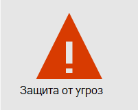
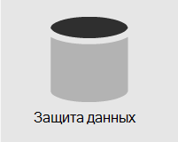
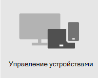

# Обзор безопасности

> [!VIDEO https://www.microsoft.com/videoplayer/embed/RE4mzxI?autoplay=false]

Microsoft 365 бизнес премиум предоставляет функции защиты от угроз, защиты данных и управления устройствами, которые помогут защитить компанию от сетевых угроз и несанкционированного доступа, а также защитить и управлять данными компании на телефонах, планшетах и компьютерах.

| [Защита от угроз](#threat-protection)|  [Защита данных](#data-protection) |   [Управление устройствами](#device-management) |
|--|--|--|

## Защита от угроз

Microsoft 365 бизнес премиум включает Office 365 Advanced Threat Protection (ATP), облачную службу фильтрации электронной почты, которая защищает вас от вредоносных программ, программ-вымогателей, вредоносных ссылок и других. Ссылки Сейф ATP защищают вас от вредоносных URL-адресов в электронной почте или Office документах. Вложения Сейф ATP защищают вас от вредоносных программ и вирусов, присоединенных к сообщениям или документам.

Многофакторная проверка подлинности (MFA) или двухступенчатая проверка требует, чтобы перед доступом к ресурсам была представлена вторая форма проверки подлинности, например код проверки.  

Защитник Windows предоставляет всестороннюю защиту для вашей системы, файлов и действий в Интернете от вирусов, вредоносных программ, программ-шпионов и других угроз.

## Защита данных

Функции защиты данных в Microsoft 365 бизнес премиум обеспечивают безопасность важных данных и доступ к ним имеют только уполномоченные люди.

Политики предотвращения потери данных (DLP) можно использовать для идентификации и управления конфиденциальной информацией, например номерами социального страхования или кредитных карт, чтобы они не использовались по ошибке. 

шифрование сообщений Office 365 объединяет возможности шифрования и прав доступа, чтобы гарантировать, что только предполагаемые получатели могут просматривать содержимое сообщений. шифрование сообщений Office 365 работает с Outlook.com, Yahoo!, Gmail и другими службами электронной почты.

Exchange Online Archiving является облачным решением архивирования, которое работает с Microsoft Exchange или Exchange Online для предоставления расширенных возможностей архивирования, включая хранения и избыточность данных. Вы можете использовать политики хранения, чтобы помочь вашей организации снизить обязательства, связанные с электронной почтой и другими коммуникациями. Если ваша компания должна хранить сообщения, связанные с судебными разбирательствами, вы можете использовать In-Place и тяжбы для сохранения связанной электронной почты.

## Управление устройствами

Microsoft 365 бизнес премиум расширенные функции управления устройствами позволяет отслеживать и контролировать то, что пользователи могут делать с зарегистрированными устройствами. Эти функции включают условный доступ, управление мобильными устройствами (MDM), BitLocker и автоматические обновления.

Вы можете использовать политики условного доступа, чтобы требовать дополнительных мер безопасности для определенных пользователей и задач. Например, может потребоваться многофакторная проверка подлинности (MFA) или блокировка клиентов, не поддерживаюющих условный доступ.

С помощью MDM вы можете обеспечить безопасность мобильных устройств пользователей, таких как iPhone, iPad, Android и Windows телефонов. Вы можете создавать и управлять политиками безопасности устройств, удаленно стирать устройство, чтобы удалить все данные компании, сбросить устройство в заводские параметры и просмотреть подробные отчеты об устройстве. 

Вы можете BitLocker шифрование, чтобы защитить данные в случае потери или кражи устройства, а также включить Windows Exploit Guard для обеспечения расширенных средств защиты от программ-вымогателей.

Вы можете настроить автоматические обновления, чтобы последние функции безопасности и обновления применялись на всех устройствах пользователей. 

## Рекомендуемые рекомендации по безопасности

Если у вас есть Premium Microsoft Business, самый быстрый способ настройки безопасности и безопасного начала совместной работы — следовать указаниям в этой библиотеке: Microsoft 365 для небольших предприятий и [кампаний.](../campaigns/index.md) Это руководство было разработано в сотрудничестве с командой Microsoft Defending Democracy для защиты всех клиентов малого бизнеса от киберугроз, запущенных сложными хакерами.