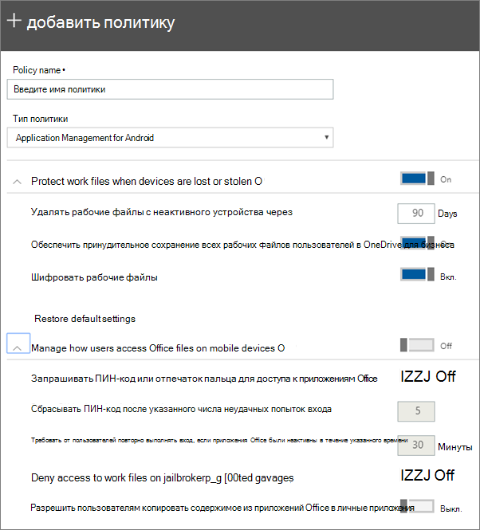

# Настройка параметров защиты приложений для устройств с Android и iOSSet app protection settings for Android or iOS devices

Эта статья применима к Microsoft 365 Бизнес Премиум.This article applies to Microsoft 365 Business Premium.

## Создание политики управления приложениямиCreate an app management policy

1. Перейдите в Центр администрирования <a href="https://go.microsoft.com/fwlink/p/?linkid=837890" target="_blank">https://admin.microsoft.com</a>.Go to the admin center at <a href="https://go.microsoft.com/fwlink/p/?linkid=837890" target="_blank">https://admin.microsoft.com</a>. 
    
2. В левом nav выберите **Политики устройств** \>  \> **Добавить**.In the left nav, choose **Devices** \> **Policies** \> **Add**.
  
3. На панели **Добавить политику** введите уникальное имя политики.On the **Add policy** pane, enter a unique name for this policy. 
    
4. В **соответствии с типом** политики выберите управление приложениями для **Android** или Application Management **для iOS** в зависимости от набора политик, которые вы хотите создать.Under **Policy type**, choose **Application Management for Android** or **Application Management for iOS**, depending on which set of policies you want to create. 
    
5. **Расширите защиту файлов, когда устройства** потеряны или украдены, и управляйте доступом пользователей к **файлам Office на мобильных устройствах.**Expand **Protect work files when devices are lost or stolen** and **Manage how users access Office files on mobile devices**. Настройте параметры так, как вам хотелось бы.Configure the settings how you would like. **Управление доступом пользователей к файлам Office** на мобильных устройствах  отключено по умолчанию, но рекомендуется включить его и принять значения по умолчанию. **Manage how users access Office files on mobile devices** is **Off** by default, but we recommend that you turn it **On** and accept the default values. Дополнительные сведения см. в [сайте Доступные параметры](#available-settings).For more information, see [Available settings](#available-settings). 
    
    Вы всегда можете вернуться к значениям по умолчанию с помощью ссылки **Восстановление параметров по умолчанию**.You can always use the **Reset default settings** link to return to the default setting. 
    
    
  
6. Next decide **Who will get these settings?**Next decide **Who will get these settings?** Если вы не хотите использовать  группу безопасности всех пользователей по умолчанию, выберите **Изменение**, выберите группы безопасности, которые получают эти параметры \> **Выберите**.If you don't want to use the default **All Users** security group, choose **Change**, choose the security groups that get these settings \> **Select**.
    
7. Нажмите кнопку **Готово**, чтобы сохранить политику и назначить ее устройствам.Finally, choose **Done** to save the policy, and assign it to devices. 
    
## Изменение политики управления приложениямиEdit an app management policy

1. На карте **Политики** выберите политику **Редактирование**.On the **Policies** card, choose **Edit policy**.
    
2. На панели **Изменить политику** выберите политику, которую хотите изменить.On the **Edit policy** pane, choose the policy you want to change 
    
3. Щелкните **Изменить** рядом с каждым параметром политики, чтобы изменить его значение.Choose **Edit** next to each setting to change the values in the policy. При изменении значения оно автоматически сохранено в политике.When you change a value, it's automatically saved in the policy.
    
4. По завершению закрой области **политики редактирования.**When you're finished, close the **Edit policy** pane. 
    
## Удаление политики управления приложениямиDelete an app management policy

1. На странице **Политики** выберите политику и **удалите**.On the **Policies** page, choose a policy and then **Delete**.
    
2. На области **Политики удаления** выберите **Подтвердите** удаление выбранной политики или политик.On the **Delete policy** pane, choose **Confirm** to delete the policy or policies you chose. 
    
## Доступные параметрыAvailable settings

В следующих таблицах подробно описаны параметры, доступные для защиты файлов работы на устройствах, а также параметры, которые контролируют доступ пользователей к файлам Office с мобильных устройств.The following tables give detailed information about settings available to protect work files on devices and the settings that control how users access Office files from their mobile devices.
  
 Дополнительные сведения см. в [веб-сайте How do protection features in Microsoft 365 Business Premium map to Intune settings.](map-protection-features-to-intune-settings.md)For more information, see [How do protection features in Microsoft 365 Business Premium map to Intune settings](map-protection-features-to-intune-settings.md). 
  
### Параметры для защиты рабочих файловSettings that protect work files

Для защиты рабочих файлов в случае потери или кражи устройства доступны следующие параметры:The following settings are available to protect work files if a user's device is lost or stolen:
  
|||
|:-----|:-----|
|SettingSetting    |ОписаниеDescription    |
|Удалять рабочие файлы с неактивного устройства через указанное количество днейDelete work files from an inactive device after this many days    |Если устройство не используется в течение определенного числа дней, все файлы работы, хранимые на устройстве, будут удалены автоматически.If a device isn't used for the number of days that you specify here, any work files stored on the device will be deleted automatically.    |
|Обеспечить принудительное сохранение всех рабочих файлов пользователей в OneDrive для бизнесаForce users to save all work files to OneDrive for Business    |Если этот параметр **работает,** единственным доступным расположением сохранения для файлов работы является OneDrive для бизнеса.If this setting is **On**, the only available save location for work files is OneDrive for Business.    |
|Шифровать рабочие файлыEncrypt work files    |Оставьте этот параметр **включенным**, чтобы защитить рабочие файлы с помощью шифрования.Keep this setting **On** so that work files are protected by encryption. Даже если устройство потеряно или украдено, никто не может прочитать данные вашей компании.Even if the device is lost or stolen, no one can read your company data.    |
   
### Параметры, управляющие доступом пользователей к файлам Office с мобильных устройствSettings that control how users access Office files on mobile devices

Управлять доступом пользователей к рабочим файлам Office можно с помощью следующих параметров:The following settings are available to manage how users access Office work files:
  
|||
|:-----|:-----|
|SettingSetting    |ОписаниеDescription    |
|Запрашивать ПИН-код или отпечаток пальца для доступа к приложениям OfficeRequire a PIN or fingerprint to access Office apps    |Если этот параметр **используется** для пользователей, необходимо предоставить другую форму проверки подлинности, помимо имени пользователя и пароля, прежде чем они смогут использовать приложения Office на своих мобильных устройствах.If this setting is **On** users must provide another form of authentication, in addition to their username and password, before they can use Office apps on their mobile devices.  |
|Сбрасывать ПИН-код после указанного числа неудачных попыток входаReset PIN when login fails this many times    |Чтобы запретить несанкционированным пользователям случайным образом подбирать ПИН-код, он будет сброшен после указанного вами числа неудачных попыток ввода.To prevent an unauthorized user from randomly guessing a PIN, the PIN will reset after the number of wrong entries that you specify.    |
|Требовать от пользователей повторно выполнять вход, если приложения Office были неактивны в течение указанного времениRequire users to sign in again after Office apps have been idle for    |Этот параметр определяет, как долго пользователь может простаивать до того, как им будет предложено войти снова.This setting determines how long a user can be idle before they're prompted to sign in again.    |
|Запретить доступ к рабочим файлам на устройствах со снятой защитой или с включенным привилегированным доступомDeny access to work files on jailbroken or rooted devices    |На устройствах технически осведомленных пользователей может быть снята защита или включен привилегированный доступ. Это означает, что пользователь может изменять операционную систему, из-за чего устройство может стать более уязвимым к вредоносным программам. Когда этот параметр **включен**, такие устройства блокируются.  Clever users may have a device that is jailbroken or rooted. This means that the user can modify the operating system, which can make the device more subject to malware. These devices are blocked when this setting is **On**.    |
|Не позволяйте пользователям копировать контент из приложений Office в личные приложенияDon't allow users to copy content from Office apps into personal apps    |По умолчанию такая возможность существует, но если этот параметр **включен**, то пользователь может копировать сведения из рабочих файлов в личные.We do allow this by default, but if the setting is **On**, the user could copy information in a work file to a personal file. Если этот параметр **отключен**, пользователь не сможет копировать сведения из рабочей учетной записи в личные приложения или учетные записи.If the setting is **Off**, the user will be unable to copy information from a work account into a personal app or personal account.    |
