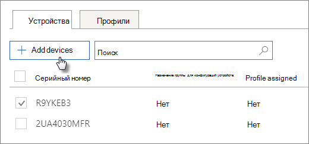

# Создание и изменение устройств AutoPilot

## Отправка списка устройств

Вы можете использовать [пошаговую](add-autopilot-devices-and-profile.md) руководство для загрузки устройств, но вы также можете загружать устройства на вкладке **Devices.** 
  
Устройства должны соответствовать этим требованиям:
  
- Windows 10, версия 1703 или более поздней версии
    
- Новые устройства, которые не прошли через windows вне окна

1. В центре администрирования Microsoft 365 выберите **Devices** \> **AutoPilot**.
  
2. На странице **АвтоПилот** выберите вкладку **Устройства** \> **Добавить устройства.**
    
    
  
3. На панели **Добавить устройства** просмотрите [CSV-файл списка](../admin/misc/device-list.md) устройств, который вы подготовили \> **Сохранить** \> **закрыть**.
    
    Эти сведения можно получить у поставщика оборудования или с помощью скрипта [Get-WindowsAutoPilotInfo PowerShell](https://www.powershellgallery.com/packages/Get-WindowsAutoPilotInfo) для создания CSV-файла. 
    
## Назначение профиля устройству или группе устройств

1. На странице **Подготовка Windows** выберите вкладку **Устройства** и выберите поле рядом с одним или более устройствами. 
    
2. На панели **Устройство** выберите профиль в раскрывающемся списке **Назначенный профиль**. 
    
    Если у вас еще нет профилей, см. инструкции в статье [Создание и изменение профилей AutoPilot](create-and-edit-autopilot-profiles.md). 
