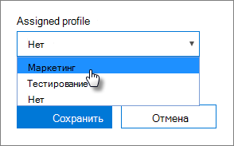

# Создание и изменение профилей AutoPilotCreate and edit AutoPilot profiles

## Создание профиляCreate a profile

Профиль относится к устройству или группе устройств.A profile applies to a device, or a group of devices,
  
1. В Центре администрирования Microsoft 365 выберите **"Устройства** \> **AutoPilot".**In the Microsoft 365 admin center, choose **Devices** \> **AutoPilot**.
  
2. На странице **AutoPilot** выберите вкладку **"Профили"** \> **"Создать профиль".**On the **AutoPilot** page, choose the **Profiles** tab \> **Create profile**.
    
3. На странице **"Создание профиля"** введите имя профиля, которое поможет идентифицировать его, например "Маркетинг".On the **Create profile** page, enter a name for the profile that helps you identify it, for example Marketing. Включите нужный параметр и выберите **"Сохранить".**Turn on the setting you want, and then choose **Save**. Дополнительные сведения о параметрах профиля AutoPilot см. в сведениях о параметрах [профиля AutoPilot.](autopilot-profile-settings.md)For more information about AutoPilot profile settings, see [About AutoPilot Profile settings](autopilot-profile-settings.md).
    
    
  
### Применение профиля к устройствуApply profile to a device

После создания профиля его можно применить к устройству или группе устройств.After you create a profile, you can apply it to a device or a group of devices. Вы можете выбрать существующий  профиль в пошаговом руководстве и применить его к новым устройствам или заменить существующий профиль для устройства или группы устройств.You can pick an existing profile in the [step-by-step guide](add-autopilot-devices-and-profile.md) and apply it to new devices, or replace an existing profile for a device or group of devices. 
  
1. На странице **Подготовка Windows** перейдите на вкладку **Устройства**.On the **Prepare Windows** page, choose the **Devices** tab. 
    
2. Выберите этот список рядом с именем  устройства и на панели  устройств выберите профиль в выпадающее списке "Сохранить" назначенного \> **профиля.**Select the check box next to a device name, and in the **Device** panel, choose a profile from the **Assigned profile** drop-down list \> **Save**.
    
    
  
## Изменение и удаление профиляEdit, delete, or remove a profile

После назначения профиля устройству вы можете изменить его, даже если вы уже выдали устройство пользователю. Когда устройство подключается к Интернету, в процессе настройки на него скачивается последняя версия профиля. Когда пользователь сбрасывает устройство до заводских настроек, на него снова скачивается обновленный профиль.Once you've assigned a profile to a device, you can update it, even if you've already given the device to a user. When the device connects to the internet, it downloads the latest version of your profile during the setup process. If the user restores their device to its factory default settings, the device will again download the latest updates to your profile. 
  
### Изменение профиляEdit a profile

1. На странице **Подготовка Windows** перейдите на вкладку **Профили**.On the **Prepare Windows** page, choose the **Profiles** tab. 
    
2. Выберите этот параметр рядом с именем устройства и на панели **профилей** обновите все доступные параметры \> **"Сохранить".**Select the check box next to a device name, and in the **Profile** panel, update any of the available settings \> **Save**.
    
    Если сделать это до того, как устройство подключится к Интернету, профиль будет применен в процессе настройки.If you do this before a user connects the device to the internet, then the profile gets applied to the setup process.
    
### Удаление профиляDelete a profile

1. На странице **Подготовка Windows** перейдите на вкладку **Профили**.On the **Prepare Windows** page, choose the **Profiles** tab. 
    
2. Рядом с именем устройства выберите "Удалить  профиль", а затем на панели "Профиль" выберите  \> **"Удалить профиль".**Select the check box next to a device name, and in the **Profile** panel, select **Delete profile** \> **Save**.
    
    При удалении профиля он перестает действовать для устройства или группы устройств, которым он был назначен.When you delete a profile, it gets removed from a device or a group of devices it was assigned to.
    
### Отмена назначения профиляRemove a profile

1. На странице **Подготовка Windows** перейдите на вкладку **Устройства**.On the **Prepare Windows** page, choose the **Devices** tab. 
    
2. Выберите этот список рядом с именем устройства и  на панели  устройств выберите "Нет" в выпадающее списке "Сохранить"  назначенного \> профиля.Select the check box next to a device name, and in the **Device** panel, choose **None** from the **Assigned profile** drop-down list \> **Save**.
    
