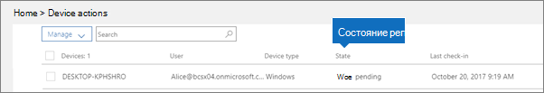

# Состояния устройств

Эта статья применима к Microsoft 365 Бизнес Премиум.

Устройства в списке **Действия устройств** (домашняя страница администратора \> **Действия устройств**) могут находиться в перечисленных ниже состояниях.
  

  
|**Состояние**|**Описание**|
|:-----|:-----|
|Под управлением Intune    |Управление Microsoft 365 Бизнес Премиум.    |
|Снятие с учета ожидается    |Microsoft 365 Business Premium готовится удалить данные компании с устройства.    |
|Снятие с учета выполняется    |Microsoft 365 Business Premium в настоящее время удаляет данные компании с устройства.    |
|Не удалось снять с учета    | Не удалось удалить данные компании.    |
|Отмена отмены    |Действие по отмене было отменено.    |
|Ожидает очистки    |Ожидается сброс до заводских настроек.    |
|Очистка выполняется    |Сброс до заводских настроек был инициирован.    |
|Не удалось выполнить очистку    |Не удалось сделать заводской сброс.    |
|Wipe canceled    |Стирка фабрики была отменена.    |
|Неработоспособное    |Действие ожидается (или находится в процессе), но устройство не регистрируется более 30 дней.    |
|Ожидает удаления    |Ожидается удаление.    |
|Обнаружено    |Microsoft 365 Business Premium обнаружила устройство.    |
   
