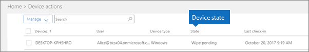

# Состояния устройствDevice states

Эта статья применима к Microsoft 365 бизнес премиум.This article applies to Microsoft 365 Business Premium.

Устройства в списке **Действия устройств** (домашняя страница администратора \> **Действия устройств**) могут находиться в перечисленных ниже состояниях.Devices in the **Device actions** list (Admin home \> **Device actions**) can have the following states.
  

  
|**Состояние****Status**|**Описание****Description**|
|:-----|:-----|
|Под управлением IntuneManaged by Intune    |Управляемый Microsoft 365 бизнес премиум.Managed by Microsoft 365 Business Premium.    |
|Снятие с учета ожидаетсяRetire pending    |Microsoft 365 бизнес премиум готовится удалить данные компании с устройства.Microsoft 365 Business Premium is getting ready to remove company data from the device.    |
|Снятие с учета выполняетсяRetire in progress    |Microsoft 365 бизнес премиум в настоящее время удаляет данные компании с устройства.Microsoft 365 Business Premium is currently removing company data from the device.    |
|Не удалось снять с учетаRetire failed    | Не удалось удалить данные компании.Remove company data action failed.    |
|Отмена отменыRetire canceled    |Действие по отмене было отменено.Retire action was canceled.    |
|Ожидает очисткиWipe pending    |Ожидается сброс до заводских настроек.Waiting for factory reset to start.    |
|Очистка выполняетсяWipe in progress    |Сброс до заводских настроек был инициирован.Factory reset has been issued.    |
|Не удалось выполнить очисткуWipe failed    |Не удалось сделать заводской сброс.Couldn't do factory reset.    |
|Wipe canceledWipe canceled    |Стирка фабрики была отменена.Factory wipe was canceled.    |
|НеработоспособноеUnhealthy    |Действие ожидается (или находится в процессе), но устройство не регистрируется более 30 дней.An action is pending (or in progress), but the device hasn't checked in for 30+ days.    |
|Ожидает удаленияDelete pending    |Ожидается удаление.Delete action is pending.    |
|ОбнаруженоDiscovered    |Microsoft 365 бизнес премиум обнаружено устройство.Microsoft 365 Business Premium has detected the device.    |
   
