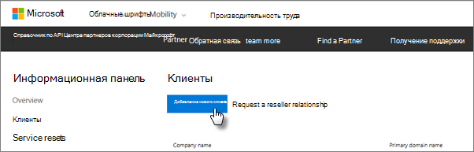

# Получить Microsoft 365 бизнес премиумGet Microsoft 365 Business Premium

## Получение Microsoft 365 бизнес премиум от МайкрософтGet Microsoft 365 Business Premium from Microsoft

Если у вас нет партнера и вы хотите получить Microsoft 365 бизнес премиум, вы можете [приобрести его здесь](https://www.microsoft.com/en-US/microsoft-365/business).If you don't have a partner and want to get Microsoft 365 Business Premium, you can [buy it here](https://www.microsoft.com/en-US/microsoft-365/business).

Подробные инструкции приведены в [статье регистрация для Microsoft 365 Business Premium](sign-up.md) .See [sign up for Microsoft 365 Business Premium](sign-up.md) for detailed instructions.

Вы также можете приступить к работе с Microsoft [Store](https://www.microsoft.com/en-us/store/locations/find-a-store?icid=en_US_Store_UH_FAS) для приобретения Microsoft 365 Business Premium и получения справки по программе установки.You can also head over to a [Microsoft Store](https://www.microsoft.com/en-us/store/locations/find-a-store?icid=en_US_Store_UH_FAS) to buy Microsoft 365 Business Premium and get setup help.
  
## Получение Microsoft 365 бизнес премиум из центра партнеров МайкрософтGet Microsoft 365 Business Premium from Microsoft Partner Center

1. Войдите в [Центр партнеров Майкрософт](https://go.microsoft.com/fwlink/p/?linkid=849910) с учетными данными, созданными при регистрации в программе поставщика облачных решений.Sign in at [Microsoft Partner Center](https://go.microsoft.com/fwlink/p/?linkid=849910) by using the credentials you created when you enrolled to the Cloud Service Provider (CSP) program. 
    
2. На информационной панели партнера выберите **Клиенты**, а затем выберите клиента или добавьте нового клиента, прежде чем приступать к работе с Microsoft 365 Business Premium.On the Partner Dashboard, choose **Customers**, then select your customer or add a new customer before you get Microsoft 365 Business Premium.
    
    
  
3. На странице **Подписка** клиента выберите **Добавить подписку**, выберите параметр малый бизнес в разделе Каталог, а затем выберите **Microsoft 365 бизнес премиум**.On the customer's **Subscription** page, select **Add subscription**, choose the Small business option under Catalog, and then choose **Microsoft 365 Business Premium**.
    
    Выберите нужное количество лицензий (не более 300).Select the number of licenses you need (up to 300). Если у вас больше 300 пользователей, ознакомьтесь со статьей [Microsoft 365 корпоративный](https://go.microsoft.com/fwlink/p/?linkid=862316) .If you have more than 300 users, see [Microsoft 365 Enterprise](https://go.microsoft.com/fwlink/p/?linkid=862316) instead. 
    
    
  
    Выполните остальные действия по добавлению нового клиента, в том числе название организации.Complete the rest of the steps for adding a new customer, including the business name.
    

