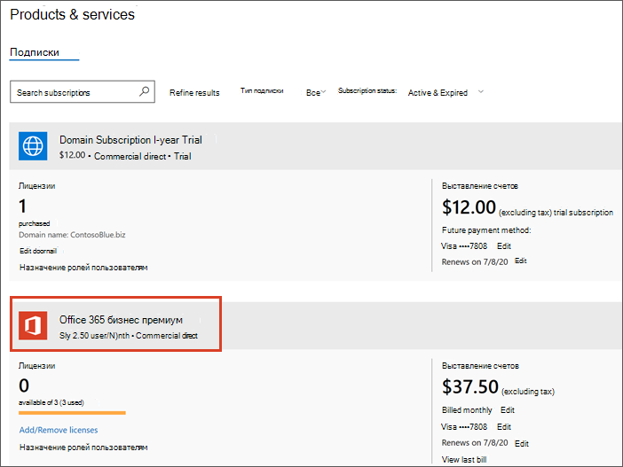

# Обновление до Microsoft 365 Business из Office 365 бизнес премиумUpgrade to Microsoft 365 Business from Office 365 Business Premium

Если у вас есть [Подписка на office 365 для бизнеса](https://products.office.com/compare-all-microsoft-office-products-4-column?activetab=tab:primaryr2), например, Office 365 бизнес премиум, вы можете легко выполнить обновление до Microsoft 365 Business.If you have an [Office 365 for business subscription](https://products.office.com/compare-all-microsoft-office-products-4-column?activetab=tab:primaryr2), for example, Office 365 Business Premium, you can easily upgrade to Microsoft 365 Business. Выполните обновление до Microsoft 365 Business, если хотите добавить:Upgrade to Microsoft 365 Business if you want to add: 
- Windows 10 профессиональная (на компьютерах под управлением Windows 8 или более поздней версии)Windows 10 Pro (to PCs running Windows 8 or later)
- Простые элементы управления, управляющие бизнес-данными на устройствахSimple controls that manage business data on devices
- Расширенные возможности обеспечения безопасности.Advanced security capabilities.
Узнайте больше о Microsoft 365 Business по адресу [Microsoft.com](https://www.microsoft.com/microsoft-365/business)Find out more about Microsoft 365 Business at [Microsoft.com](https://www.microsoft.com/microsoft-365/business)

## В чем разница между Office 365 Business Premium и Microsoft 365 Business?What's the difference between Office 365 Business Premium and Microsoft 365 Business?
Мы добавили параллельное сравнение этих двух планов с [описанием Microsoft 365 Business Service](https://docs.microsoft.com/office365/servicedescriptions/microsoft-365-service-descriptions/microsoft-365-business-service-description).We've added a side-by-side comparison of these two plans to the [Microsoft 365 Business Service Description](https://docs.microsoft.com/office365/servicedescriptions/microsoft-365-service-descriptions/microsoft-365-business-service-description). 

## Прежде чем приступить к работеBefore you get started

- **Когда следует выполнять обновление?****When should I choose to upgrade?** Обновление является правильным выбором, когда необходимо обновить **всех пользователей** , назначенных одному плану.Upgrade is the right choice when you want to upgrade **all users** assigned to a single plan. При выборе варианта обновление все пользователи будут переключаться на другой план одновременно.When you choose upgrade, all plan users get switched to another plan at the same time. Если вы не хотите обновлять все, назначенные одному плану, купите лицензии на новый план (в данном случае Microsoft 365 Business) и [назначьте эти лицензии](https://docs.microsoft.com/office365/admin/manage/assign-licenses-to-users) каждому пользователю, который вы хотите обновить.If you don't want to upgrade everyone assigned to a single plan, buy licenses for the new plan (in this case Microsoft 365 Business), and [assign those licenses individually](https://docs.microsoft.com/office365/admin/manage/assign-licenses-to-users) to each user that you want to upgrade. 
- **Некоторые надстройки могут препятствовать обновлению** Если вы попытаетесь запустить обновление и у вас есть надстройка, из-за которой вы не сможете продолжить работу, сначала можно удалить надстройку, а затем снова добавить ее, если она вам нужна.**Some add-ons might prevent the upgrade** If you try to start an upgrade and you have an add-on that prevents you from continuing, you can remove the add-on first, and then add it back later if you still need it. 
- **Если вы предоплачены план** Непрямолинейный путь обновления для планов предоплаты не предусмотрен.**If you prepaid your plan** There isn't a straightforward upgrade path for prepaid plans. Вы узнаете, что у вас есть план предоплаты, так как вы настроили свой план с помощью идентификатора продукта, который вы приобрели в магазине.You'll know if you have a prepaid plan because you set up your plan using a product ID that you might have purchased in a store. Свяжитесь с партнером, перейдите в Microsoft Store или дождитесь, пока план предоплаты не истечет, чтобы перейти к новому плану.Contact a partner, go to the Microsoft Store, or wait until your prepaid plan expires to switch to a new plan.

## Обновление до Microsoft 365 BusinessUpgrade to Microsoft 365 Business
Приобретите свои лицензии, выполнив следующие действия в [новом центре администрирования](https://docs.microsoft.com/office365/admin/microsoft-365-admin-center-preview):Buy your licenses by following these steps in the [new admin center](https://docs.microsoft.com/office365/admin/microsoft-365-admin-center-preview):
1. Войдите в центр администрирования по адресу <a href="https://go.microsoft.com/fwlink/p/?linkid=837890" target="_blank">https://admin.microsoft.com</a>.Sign into the admin center at <a href="https://go.microsoft.com/fwlink/p/?linkid=837890" target="_blank">https://admin.microsoft.com</a>.
2. Перейдите в область навигации и выберите продукты для **выставления счетов** \> **& службы**.Go to the navigation pane and select **Billing** \> **Products & Services**. Найдите свою подписку на Office 365 и выберите ее, чтобы просмотреть сведения.Find your Office 365 subscription and select it to view the details. 

    

3. На следующей странице выберите **Обновить**.On the next page, select **Upgrade**. 

      

  > [!NOTE]
  > Если вы видите сообщение о том, что **Обновление подписки не поддерживается при лицензировании на основе групп в Azure Active Directory**, вы можете спокойно проигнорировать это сообщение, если Организация не очень крупна.If you see a message that says **Upgrading your subscription is not supported with group-based licensing in Azure Active Directory**, you can safely ignore this unless you have a very large organization. Организации, которые установили этот параметр, будут иметь представление о том, что они используют лицензирование на основе групп.Organizations who have selected this option will be aware that they're using group-based licensing.

4. Теперь вы можете просмотреть список планов Office, до которых вы можете выполнить обновление.Next, you can view a list of Office plans that you can upgrade to. В этом случае найдите Microsoft 365 бизнес-план.In this case, find the Microsoft 365 Business plan. Чтобы просмотреть все приложения и службы Office, включенные в этот план, можно прокрутить вниз.You can scroll down if you want to see all the Office apps and services that are included with this plan. В разделе **microsoft 365 бизнес**нажмите кнопку **Обновить** , чтобы добавить Microsoft 365 бизнес в корзину.Under **Microsoft 365 Business**, select **Upgrade** to add Microsoft 365 Business to your cart.
5. В корзине:In the cart:
    1. Мы автоматически включаем лицензии для всех текущих пользователей.We'll automatically include licenses for all your current users. Если вам требуется больше или меньше лицензий, необходимо [приобрести и назначить их по отдельности](https://docs.microsoft.com/office365/admin/manage/assign-licenses-to-users).If you need more or fewer licenses, you need to [buy and assign those licenses individually](https://docs.microsoft.com/office365/admin/manage/assign-licenses-to-users).  
    2. Вы можете настроить способ оплаты: ежемесячно или ежегодно.You can adjust how you'd like to pay: monthly or yearly. Выберите раскрывающееся меню, чтобы сделать выбор.Select the drop-down menu to make your choice.
6. Нажмите кнопку **Перейти, чтобы** получить сводную информацию о приобретении, в том числе способ оплаты для этой учетной записи.Select **Go to Checkout** where you'll see a summary of your purchase, including the payment method for this account. Вы также можете добавить здесь код рекламного, если таковой имеется.You can also add a promo code here if you have one.
7. Выберите пункт **разместить заказ** , чтобы завершить покупку.Select **Place order** to complete your purchase.
Настройка новых планов обслуживания занимает от Майкрософт несколько минут.It takes Microsoft a few minutes to set up your new service plans. Чтобы проверить ход выполнения, выберите пункт **проверить состояние обновления**.To check on progress, select **Check upgrade status**. 
1. После того как план будет готов, вам может потребоваться выполнить некоторые дополнительные действия по настройке в центре администрирования.Once your plan is ready, you might need to complete some additional setup steps in the admin center. В области навигации выберите элемент **Домашняя** , чтобы выполнить дополнительные действия по настройке.In the navigation pane, select **Home** to complete any additional setup steps.

> [!NOTE]
> Вы получите получение возмещения для лицензий на Office 365, которые больше не нужны.You'll receive a prorated refund for the Office 365 licenses that you no longer need. После настройки нового плана в банковском счете или кредитной карте будет взиматься плата за два дня.Your bank account or credit card will be charged about two days after you set up the new plan.
  
## Защита устройств и файлов пользователейProtect user devices and files

Теперь, когда назначены Microsoft 365 Business Licenses, выполните действия, необходимые для запуска защиты устройств и файлов.Now that Microsoft 365 Business licenses have been assigned, complete steps to start protecting devices and files. В области навигации центра администрирования будут использоваться некоторые новые параметры.You'll use some new options included in the admin center navigation pane.
  
1. В центре администрирования в области навигации перейдите к разделу **политики** **устройств** \> .In the admin center, in the navigation pane, go to **Devices** \> **Policies**.
    
2. На странице " **политики устройств** " нажмите кнопку **Добавить**.On the **Device policies** page, select **Add**.
    
3. В области **Добавление политики** присвойте политике имя (например, защитить рабочие файлы), а затем выберите **тип политики** из раскрывающегося списка.In the **Add policy** pane give the policy a name (for example, Protect work files), and then choose a **Policy type** from the drop-down list. 
    
    Вы можете настроить политики приложений для защиты файлов на устройствах с Android и iPhone, а также в Windows 10, а также настроить политики конфигурации устройств для устройств с Windows 10, принадлежащих компании.You can set up application policies for protecting files on Android and iPhone devices, as well as Windows 10, and you can set up device configuration policies for company owned Windows 10 devices. Для получения подробных сведений ознакомьтесь со следующими ссылками:See the following links for details:
    
  - [Настройка параметров защиты приложений для устройств с Android и iOSSet app protection settings for Android or iOS devices](app-protection-settings-for-android-and-ios.md)
    
  - [Настройка параметров защиты приложений для устройств с Windows 10Set application protection settings for Windows 10 devices](protection-settings-for-windows-10-devices.md)
    
  - [Настройка параметров защиты устройств для компьютеров с Windows 10Set device protection settings for Windows 10 PCs](protection-settings-for-windows-10-pcs.md)
    
  
4. После настройки политик вы и ваши сотрудники смогут настраивать устройства:After you set up policies, you and your employees can set up devices:
    
  - Если на устройствах Windows еще не используется обновление Windows Pro Creator, необходимо [обновить их до обновления Windows Pro Creators](upgrade-to-windows-pro-creators-update.md).If your Windows devices aren't already using the Windows Pro Creator update, you'll need to [upgrade them to Windows Pro Creators Update](upgrade-to-windows-pro-creators-update.md).
    
  - Пошаговые инструкции по [настройке устройств Windows для Microsoft 365 бизнес-пользователей](set-up-windows-devices.md) для устройств с Windows.See [Set up Windows devices for Microsoft 365 Business users](set-up-windows-devices.md) for steps for Windows devices. 
    
  - Выполните действия, описанные в [статье Настройка мобильных устройств для пользователей Microsoft 365 Business](set-up-mobile-devices.md) для телефонов с Android и iPhone.See [Set up mobile devices for Microsoft 365 Business users](set-up-mobile-devices.md) for steps for Android phones and iPhones. 
