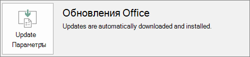

# Подготовка к развертыванию Office по Microsoft 365 для бизнеса

Эта статья применима к Microsoft 365 бизнес премиум.

## Подготовка к автоматической установке приложений Office на клиентские компьютеры

Вы можете Microsoft 365 бизнес премиум автоматически установить 32-Office приложения на Windows 10 и сохранить их в курсе обновлений.
  
Автоматическая установка лучше всего работает, если компьютер пользователя находится на Windows 10 для бизнеса и:
  
- не установлены классические приложения Office (Word, Excel, PowerPoint, Outlook, OneNote, Publisher, Access и OneDrive)
    
    или
    
- установлена версия Office "нажми и работай".
    
Чтобы определить, есть ли на компьютере версия Office "нажми и работай", в любом приложении Office выберите **Файл** \> **Учетная запись** (в Outlook: **Учетная запись Office**). Если вы Office **обновления,** как показано на следующем рисунке, то установка была сделана с помощью click-to-Run. 
  

  
 **Кто преимущества от использования этой функции**
  
Пользователю, компьютер которого удовлетворяет указанным ниже условиям.
  
- **Имеет** лицензию Windows 10 для бизнеса, активную Microsoft 365 для бизнеса, Windows 10 Creators Update и присоединяется к Azure Active Directory. 
    
- **Не имеет** 64-Office приложений (например: Word, Excel, PowerPoint). Если требуется 64-Office приложений, эта функция не подходит, так как нет поддержки для запуска 64-битной версии 2016 года click-to-Run Office из консоли Microsoft 365 для администратора бизнеса. 
    
- На нем **нет** автономных приложений версии 2016, установленных с помощью установщика Windows Installer (MSI) (например, Visio или Project). Microsoft 365 обновления Office до версии Click-to-Run Office 2016 г. и не работают с автономными приложениями MSI Office 2016 г. 
    
В следующей таблице показано, какие действия могут потребоваться конечным пользователям и администраторам в зависимости от их состояния, чтобы иметь успешную 32-битную 32-битную версию развертывания Office из консоли Microsoft 365 для консоли администрирования бизнеса. 

|Начальное состояние экземпляра Office|Действия, которые необходимо Microsoft 365 для Office бизнеса|Конечный результат|
|:-----|:-----|:-----|
|Набор Office не установлен    |Нет    |Office 2016 г. 32-битная система устанавливается с помощью click-to-Run    |
|Есть 32-разрядная версия Office "нажми и работай" (2016 или более ранняя), но нет автономных приложений    |Нет    |Выполнено обновление до последней 32-разрядной версии Office 2016 "нажми и работай", если необходимо **\***   |
|Существующие 32-битные версии 32-битных приложений Office и Click-to-Run 32-bit или 64-bit автономных Office приложений (например, Visio, Project)    |Нет    |Автономные приложения не затронуты. Набор обновлен до 32-разрядной версии Office 2016 "нажми и работай"    |
|Есть 32-разрядная версия Office "нажми и работай", а также любые 32- или 64-разрядные автономные MSI-приложения Office (кроме версии 2016)    |Нет    |Автономные приложения не затронуты. Набор обновлен до 32-разрядной версии Office 2016 "нажми и работай"    |
|Есть любая 64-разрядная версия Office "нажми и работай"    |Удалить 64-Office приложения, если их можно заменить 32-Office приложениями    |При удалении 64-разрядных приложений Office устанавливается 32-разрядная версия Office 2016 "нажми и работай".    |
|Есть MSI-версия Office 2016 при наличии или отсутствии автономных приложений    |Удалите MSI-версию Office 2016.    |Установлена 32-разрядная версия Office 2016 "нажми и работай". Автономные приложения — без изменений.    |
|Есть MSI-версия Office 2013 (или более ранней версии) при наличии или отсутствии автономных приложений Office    |Нет    |Сосуществуют 32-разрядная версия Office 2016 "нажми и работай" и предустановленная MSI-версия Office (и автономные приложения)    |
||||
   
 **( \* Примечание.** Не обновляется до click-to-Run 32-bit версии Office 2016 из-за известной ошибки. Исправление продолжается. 
  
