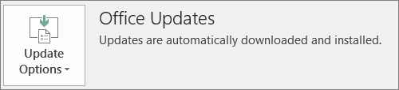

# Подготовка к развертыванию клиента Office с помощью Microsoft 365 для бизнеса

## Подготовка к автоматической установке приложений Office на клиентские компьютеры

Вы можете использовать Microsoft 365 для бизнеса, чтобы автоматически установить 32-разрядные приложения Office на компьютеры с Windows 10 и оставить их в курсе последних обновлений.
  
Автоматическая установка работает лучше, если компьютер конечного пользователя включен в Windows 10 бизнес и:
  
- не установлены классические приложения Office (Word, Excel, PowerPoint, Outlook, OneNote, Publisher, Access и OneDrive)
    
    или
    
- установлена версия Office "нажми и работай".
    
Чтобы определить, есть ли на компьютере версия Office "нажми и работай", в любом приложении Office выберите **Файл** \> **Учетная запись** (в Outlook: **Учетная запись Office**). Если вы видите **обновления Office** , как показано на следующем рисунке, то установка выполнялась с помощью функции "нажми и работай". 
  

  
 **Преимущества этой функции**
  
Пользователю, компьютер которого удовлетворяет указанным ниже условиям.
  
- **У пользователя есть** лицензия на Windows 10 Корпоративная, активная лицензия на Microsoft 365 для бизнеса, обновление Windows 10 для дизайнеров и присоединение к Azure Active Directory. 
    
- **У него нет** 64-разрядных приложений Office (пример: Word, Excel, PowerPoint). Если требуются 64-разрядные приложения Office, эта функция не подходит, так как в консоли администрирования Microsoft 365 для бизнеса не предусмотрена поддержка запуска версии 64-bit 2016 "нажми и работай". 
    
- На нем **нет** автономных приложений версии 2016, установленных с помощью установщика Windows Installer (MSI) (например, Visio или Project). Microsoft 365 для бизнеса обновляет Office до версии "нажми и работай" для Office 2016 и не работает с автономными приложениями Office 2016 MSI. 
    
В следующей таблице показано, какие действия могут потребоваться для пользователей и администраторов в зависимости от их начального состояния, чтобы получить успешную 32-разрядную версию Office от "нажми и работай" с помощью консоли администрирования Microsoft 365 для бизнеса.
  
|**Начальное состояние экземпляра Office**|**Действия, которые необходимо выполнить перед установкой Microsoft 365 для бизнеса Office**|**Конечное состояние**|
|:-----|:-----|:-----|
|Набор Office не установлен    |Нет    |Office 2016 32-bit устанавливается с помощью функции "нажми и работай"    |
|Есть 32-разрядная версия Office "нажми и работай" (2016 или более ранняя), но нет автономных приложений    |Нет    |Выполнено обновление до последней 32-разрядной версии Office 2016 "нажми и работай", если необходимо **\***   |
|Существующая версия Office "нажми и работай: 32-разрядная версия Office" и "нажми и работай", 32-разрядная или 64-bit автономные приложения Office (например, Visio, Project)    |Нет    |Отдельные приложения не затрагиваются. Набор обновлен до 32-разрядной версии Office 2016 "нажми и работай"    |
|Есть 32-разрядная версия Office "нажми и работай", а также любые 32- или 64-разрядные автономные MSI-приложения Office (кроме версии 2016)    |Нет    |Отдельные приложения не затрагиваются. Набор обновлен до 32-разрядной версии Office 2016 "нажми и работай"    ||||
|Есть любая 64-разрядная версия Office "нажми и работай"    |Удалите 64 приложений Office, если их можно заменить на 32 — разрядные приложения Office    |При удалении 64-разрядных приложений Office устанавливается 32-разрядная версия Office 2016 "нажми и работай".    |
|Есть MSI-версия Office 2016 при наличии или отсутствии автономных приложений    |Удалите MSI-версию Office 2016.    |Установлена 32-разрядная версия Office 2016 "нажми и работай". Автономные приложения — без изменений.    |
|Есть MSI-версия Office 2013 (или более ранней версии) при наличии или отсутствии автономных приложений Office    |Нет    |Сосуществуют 32-разрядная версия Office 2016 "нажми и работай" и предустановленная MSI-версия Office (и автономные приложения)    |
||||
   
 **(\*) Примечание:** Обновление до "нажми и работай" до "нажми и работай" для 32-разрядной версии Office 2016 из-за известной ошибки. Выполняется исправление. 
  
