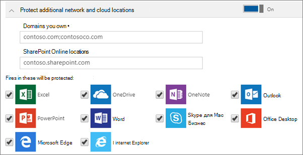

# Настройка параметров защиты приложений для устройств с Windows 10

## Создание политики управления приложениями для Windows 10

Если у ваших пользователей есть личные устройства с Windows 10, используемые для выполнения рабочих задач, на этих устройствах также можно настроить защиту данных компании.
  
1. Перейдите в Центр администрирования <a href="https://go.microsoft.com/fwlink/p/?linkid=837890" target="_blank">https://admin.microsoft.com</a>. 
    
2. В левой панели навигации выберите пункт **Devices** \> **политики** устройств \> **Добавить**.

3. На панели **Добавить политику** введите уникальное имя политики. 
    
4. В поле **Тип политики** выберите **Управление приложениями для Windows 10**.
    
5. В разделе **тип устройства**выберите **персональный** или **принадлежащий компании**.
    
6. Параметр **Шифровать рабочие файлы** включается автоматически. 
    
7. Если вы не хотите, чтобы пользователи сохраняли рабочие файлы на компьютере, **включите** параметр **Запретить копирование данных компании в личные файлы и обязать хранить рабочие файлы в OneDrive для бизнеса**. 
    
9. Разверните узел **Восстановление данных на устройствах с Windows**. Рекомендуем **включить его.**
    
    Прежде чем переходить к расположению сертификата агента восстановления данных, необходимо сначала создать его. Инструкции приведены в разделе [Создание и проверка сертификата агента восстановления шифрованной файловой системы (DRA](https://go.microsoft.com/fwlink/p/?linkid=853700)).
    
    По умолчанию рабочие файлы шифруются с помощью секретного ключа, хранящегося на устройстве и связанного с профилем пользователя. Открыть и расшифровать файл может только пользователь. Однако в случае потери устройства или удаления пользователя файл может остаться в зашифрованном виде. Администратор может использовать сертификат агента восстановления данных (DRA) для расшифровки файла.
    
    
  
10. Разверните раздел **Защита дополнительных сетевых и облачных расположений** , если вы хотите добавить дополнительные домены или расположения SharePoint Online, чтобы обеспечить защиту файлов во всех перечисленных приложениях. Если в каком-либо поле вам нужно ввести несколько элементов, разделяйте их точкой с запятой (;).
    
    
  
11. Next decide **Who will get these settings?** If you don't want to use the default **All Users** security group, choose **Change**, choose the security groups who will get these settings \> **Select**.
    
12. Нажмите кнопку **Добавить**, чтобы сохранить политику и назначить ее устройствам. 
