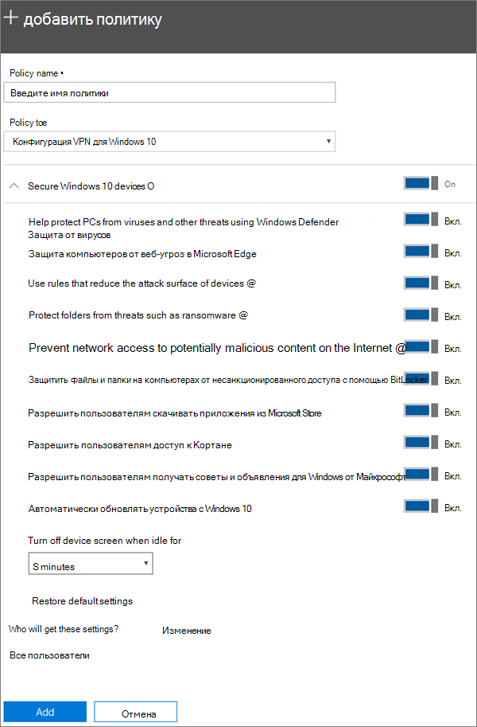

# Настройка параметров защиты устройств для компьютеров с Windows 10

## Защита устройств с Windows 10

Посмотрите видео о том, как защитить устройства с Windows 10 с помощью Microsoft 365 для бизнеса.
  
> [!VIDEO https://www.microsoft.com/videoplayer/embed/a5734146-620a-4cec-8618-536b3ca37972?autoplay=false]
  
1. Перейдите в Центр администрирования <a href="https://go.microsoft.com/fwlink/p/?linkid=837890" target="_blank">https://admin.microsoft.com</a>. 
    
2. В левой панели навигации выберите пункт **Devices** \> **политики** \> устройств **Добавить**.
  
3. На панели **Добавить политику** введите уникальное имя политики. 
    
4. В поле **Тип политики** выберите **Конфигурация устройства с Windows 10**.
    
5. Expand **Secure Windows 10 Devices** \> configure the settings how you would like. Для получения дополнительных сведений просмотрите раздел [Доступные параметры](#available-settings). 
    
    Вы всегда можете вернуться к значениям по умолчанию с помощью ссылки **Восстановление параметров по умолчанию**. 
    
    
  
6. Next decide **Who will get these settings?** If you don't want to use the default **All users** security group, Choose **Change**, search for the security group who will get these settings \> **Select**.
    
7. Нажмите кнопку **Готово**, чтобы сохранить политику и назначить ее устройствам. 
    
## Доступные параметры

Все параметры **включены** по умолчанию. Доступные параметры перечислены ниже.
  
Дополнительные сведения о [функциях защиты в Microsoft 365 Premium сопоставляются с параметрами Intune](map-protection-features-to-intune-settings.md). 
  
|||
|:-----|:-----|
|Параметр    |Описание    |
|Использование антивирусной программы "Защитник Windows"    |Требует включения антивирусной программы "Защитник Windows" для защиты компьютеров, подключенных к Интернету.    |
|Защитите компьютеры от угроз из Интернета в Microsoft Edge    |Включает параметры в Microsoft Edge, которые помогают защитить пользователей от вредоносных сайтов и скачиваний.    |
|Использовать правила для ограничения направлений атак на устройства    |Если этот параметр включен, ограничение направлений атак позволяет блокировать действия и приложения, которые вредоносные программы обычно используют для заражения устройств. Этот параметр доступен, только если включена антивирусная программа "Защитник Windows". Дополнительные сведения см. в статье [Уменьшение уязвимой зоны](https://docs.microsoft.com/windows/security/threat-protection/microsoft-defender-atp/exploit-protection).    |
|Защитить папки от угроз, таких как программы-шантажисты    |Этот параметр использует контролируемый доступ к папкам, чтобы защитить данные компании от изменений подозрительными или вредоносными приложениями, например программой обратной атаки. В этих типах приложений запрещено вносить изменения в защищенные папки. Этот параметр доступен только в том случае, если для антивирусной программы "Защитник Windows" установлено значение Вкл. Чтобы узнать больше, ознакомьтесь со статьей [защита папок с контролируемым доступом к папкам](https://docs.microsoft.com/configmgr/protect/deploy-use/create-deploy-exploit-guard-policy#bkmk_CFA) .    |
|Запретить доступ из сети к потенциально вредоносному содержимому в Интернете    |Используйте этот параметр, чтобы блокировать исходящие подключения пользователей к Интернет-адресам с нежелательным репутацией, которые могут размещать phishing-атаки, эксплойты и другие вредоносные материалы. Этот параметр доступен только в том случае, если для антивирусной программы "Защитник Windows" установлено значение **вкл**. Дополнительную информацию можно узнать в статье [Защита сети](https://docs.microsoft.com/windows/security/threat-protection/windows-defender-antivirus/configure-real-time-protection-windows-defender-antivirus).    |
|Защитить файлы и папки на компьютерах от несанкционированного доступа с помощью BitLocker    |BitLocker защищает данные путем шифрования жестких дисков компьютера и защиты от риска потери данных в случае потери или кражи компьютера. Дополнительные сведения можно найти в статье [вопросы и ответы по BitLocker](https://go.microsoft.com/fwlink/?linkid=871000).    |
|Разрешить пользователям скачивать приложения из Microsoft Store    |Позволяет пользователям скачивать и устанавливать приложения из Microsoft Store. Это касается любых приложений, от инструментов для повышения производительности до игр, поэтому этот параметр **включен**, но его можно отключить, чтобы обеспечить дополнительную защиту.    |
|Разрешить пользователям доступ к Кортане    |Кортана может быть очень полезной. Кортана может включать или отключать параметры, давать указания и следить за временем встреч, поэтому по умолчанию этот параметр следует оставить **включенным** .    |
|Разрешить пользователям получать советы и объявления для Windows от Майкрософт    |Советы для Windows могут оказаться очень кстати. Они помогают пользователям сориентироваться, когда выпускаются новые возможности.    |
|Автоматически обновлять устройства с Windows 10    |Обеспечивает автоматическую установку последних обновлений на устройствах с Windows 10.    |
|Выключать экран устройства, если оно неактивно в течение указанного периода времени    |Обеспечивает защиту корпоративных данных, когда пользователь неактивен. Пользователь может работать в общественном месте, например кафе, и на короткое время отойти или отвлечься. При этом посторонние могут случайно увидеть сведения на экране. Этот параметр управляет временем, на протяжении которого пользователь может оставаться неактивным, прежде чем экран выключится.    |
