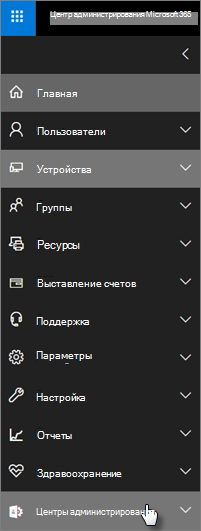

# Microsoft 365 бизнес премиум безопасности и соответствия требованиямMicrosoft 365 Business Premium security and compliance features

Microsoft 365 бизнес премиум предлагает упрощенные функции безопасности для защиты данных на ПК, телефонах и планшетах.Microsoft 365 Business Premium offers simplified security features to help safeguard your data on PCs, phones, and tablets.
    
## Microsoft 365 службы безопасности центра администрированияMicrosoft 365 admin center security features

Вы можете управлять многими функциями Microsoft 365 бизнес премиум безопасности в центре администрирования, что упрощает их отключение или выключение.You can manage many of the Microsoft 365 Business Premium security features in the admin center, which gives you a simplified way to turn these features on or off. В центре администрирования можно сделать следующее:In the admin center, you can do the following:
  
- [Установите параметры управления приложениями для устройств Android или iOS.](app-protection-settings-for-android-and-ios.md)[Set application management settings for Android or iOS devices](app-protection-settings-for-android-and-ios.md) . 
    
    Эти параметры включают удаление файлов с неактивного устройства после определенного периода, шифрование файлов работы, требующее, чтобы пользователи установили ПИН-код и так далее.These settings include deleting files from an inactive device after a set period, encrypting work files, requiring that users set a PIN, and so on.
    
- [Установите параметры защиты приложений для Windows 10 устройств.](protection-settings-for-windows-10-devices.md)[Set application protection settings for Windows 10 devices](protection-settings-for-windows-10-devices.md) . 
    
    Эти параметры можно применить к данным компании как на устройствах, которые принадлежат компании, так и на личном устройстве.These settings can be applied to company data on both company-owned, or personally owned devices.
    
- [Установите параметры защиты устройств для Windows 10 устройств.](protection-settings-for-windows-10-pcs.md)[Set device protection settings for Windows 10 devices](protection-settings-for-windows-10-pcs.md) . 
    
    Вы можете  BitLocker шифрование, чтобы защитить данные в случае потери или кражи устройства, а также включить Windows [Exploit Guard](/windows/security/threat-protection/microsoft-defender-atp/enable-exploit-protection) для обеспечения расширенных средств защиты от программ-вымогателей.You can enable [BitLocker](/windows/security/information-protection/bitlocker/bitlocker-frequently-asked-questions) encryption to help protect data in case a device is lost or stolen, and enable [Windows Exploit Guard](/windows/security/threat-protection/microsoft-defender-atp/enable-exploit-protection) to provide advanced protection against ransomware. 
    
- [Удаление данных организации с устройствRemove company data from devices](remove-company-data.md)
    
    Вы можете удаленно стереть данные компании, если устройство потеряно, украдено или сотрудник покидает вашу компанию.You can remotely wipe company data if a device is lost, stolen, or an employee leaves your company.
    
- [Сброс Windows 10 устройств в их заводские параметры.](reset-devices-to-factory-settings.md)[Reset Windows 10 devices to their factory settings](reset-devices-to-factory-settings.md) . 
    
    Вы можете сбросить Windows 10 устройства, на которых применены параметры защиты устройств.You can reset any Windows 10 devices that have device protection settings applied to them.
    
## Дополнительные функции безопасностиAdditional security features 

Дополнительные функции в составе Microsoft 365 бизнес премиум помогут защитить ваш бизнес от киберугроз и поддержать безопасность конфиденциальной информации.Advanced features in Microsoft 365 Business Premium are available to help you protect your business against cyber-threats and safeguard sensitive information.
  
- **[Microsoft Defender для Office 365](../security/office-365-security/defender-for-office-365.md)****[Microsoft Defender for Office 365](../security/office-365-security/defender-for-office-365.md)**
    
    Microsoft Defender для Office 365 помогает защитить бизнес от сложных атак фишинга и вымогателей, предназначенных для компрометации сведений о сотрудниках или клиентах.Microsoft Defender for Office 365 helps guard your business against sophisticated phishing and ransomware attacks designed to compromise employee or customer information. Поддерживаются перечисленные ниже возможности. Features include:
    
  - Сложное сканирование вложений и анализ на основе AI для обнаружения и отбраковки опасных сообщений.Sophisticated attachment scanning and AI-powered analysis to detect and discard dangerous messages.
    
  - Автоматическая проверка ссылок в электронной почте для оценки того, являются ли они частью схемы фишинга.Automatic checks of links in email to assess if they're part of a phishing scheme. Это обеспечивает безопасность доступа к небезопасным веб-сайтам.This keeps you safe from accessing unsafe websites.

- **[Полные возможности Intune на портале Azure](/mem/intune/fundamentals/what-is-intune)****[The full capabilities of Intune in the Azure portal](/mem/intune/fundamentals/what-is-intune)**
    
    Доступ к центру администрирования Intune на портале Azure позволяет настроить дополнительные функции безопасности, такие как управление устройствами MacOS, устройствами iPhone и Android, а также расширенным управлением устройствами для Windows, которые недоступны через центр администрирования Microsoft 365.Accessing the Intune admin center in the Azure portal allows you to set up additional security features, such as management of MacOS devices, iPhone, and Android devices, along with advanced device management for Windows, that aren't available through Microsoft 365 admin center.
- **Такой [же условный доступ,](/azure/active-directory/conditional-access/overview) как и Premium плана P1 Azure AD****Same [Conditional Access](/azure/active-directory/conditional-access/overview) as Azure AD Premium P1 plan**

    Условный доступ может защитить организацию от риска входов, попыток доступа из неожиданной сети или локального доступа, попыток доступа к рискованным типам устройств и так далее.Conditional Access can help protect your organization from sign-in risk, access attempts from an unexpected network or locale, access attempts from risky device types, and so on. Политики условного доступа применяются после завершения первой проверки подлинности, и она использует сигналы первого события проверки подлинности, чтобы определить, следует ли утверждать, отказано в попытке доступа или требуется ли дополнительное подтверждение (например, вторая форма идентификации).Conditional Access policies are enforced after the first authentication is completed, and it uses signals from the first authentication event to determine if the attempted access should be approved, denied, or if more proof (such as a second form of identification) is required.

    Включенные функции условного доступа:The conditional access features included are:

    - Доступ на основе имени пользователя, группы и ролиAccess based on username, group, and role
    - Доступ [на основе приложения](/azure/active-directory/conditional-access/app-based-conditional-access)Access [based on an app](/azure/active-directory/conditional-access/app-based-conditional-access) 
    - [Доступ в зависимости от расположения;](/azure/active-directory/authentication/howto-registration-mfa-sspr-combined#conditional-access-policies-for-combined-registration)  разрешить доступ только из надежных диапазонов IP или определенных стран[Access based on location](/azure/active-directory/authentication/howto-registration-mfa-sspr-combined#conditional-access-policies-for-combined-registration);  only allow access from trusted IP ranges or specific countries 
    - Требуется MFA для доступаRequire MFA for access
    - Блокировка доступа к приложениям, в которые используется [устаревшая проверка подлинности](/azure/active-directory/conditional-access/block-legacy-authentication)Block access to apps that use [legacy authentication](/azure/active-directory/conditional-access/block-legacy-authentication)
    - Требуется, чтобы приложения использовали [защиту приложений Intune](/azure/active-directory/conditional-access/app-protection-based-conditional-access)Require apps to use [Intune app protection](/azure/active-directory/conditional-access/app-protection-based-conditional-access)
    - Настраиваемая проверка подлинности, например MFA с сторонними поставщиками, например DUO.Custom authentication such as MFA with third-party providers, for example DUO.
   
    Другие возможности:Other features:
    - [Сброс пароля самообслуживки](/azure/active-directory/authentication/concept-sspr-customization) для гибридной Azure AD[Self-service password reset](/azure/active-directory/authentication/concept-sspr-customization) for hybrid Azure AD
    
## Функции обеспечения соответствия требованиямCompliance features

Ваша Microsoft 365 бизнес премиум включает функции, которые помогают поддерживать соответствие требованиям и нормативные стандарты.Your Microsoft 365 Business Premium subscription includes features that help you maintain compliance and regulatory standards.

- **[Сведения о предотвращении потери данных](../compliance/dlp-learn-about-dlp.md))** (DLP).**[Learn about data loss prevention](../compliance/dlp-learn-about-dlp.md))** (DLP). 
    
    Вы можете настроить DLP для автоматического обнаружения конфиденциальных сведений, таких как номера кредитных карт, номера социального страхования и так далее, чтобы предотвратить их непреднамеренное распространение за пределами вашей компании.You can set up DLP to automatically detect sensitive information, like credit card numbers, social security numbers, and so on, to prevent their inadvertent sharing outside your company.
    
- **[Архивация на базе Exchange Online](https://products.office.com/exchange/microsoft-exchange-online-archiving-email)****[Exchange Online Archiving](https://products.office.com/exchange/microsoft-exchange-online-archiving-email)**
    
    Exchange Online Archiving позволяет легко архивировать сообщения с помощью непрерывного резервного копирования данных.Exchange Online Archiving license enables messages to be easily archived with continuous data backup. Он хранит все электронные письма пользователя, включая удаленные элементы, в случае, если они будут необходимы позже для обнаружения или восстановления.It stores all of a user's emails, including deleted items, in case they're needed later for discovery or restoration. Кроме того, вы можете использовать различные политики хранения для сохранения данных электронной почты для хранения судебных хранении, проверки электронных данных или для соответствия требованиям соответствия требованиям.Additionally, you can use different retention policies to preserve email data for litigation holds, eDiscovery, or to meet compliance requirements.
    
- **[Метки конфиденциальности](../compliance/sensitivity-labels.md)****[Sensitivity labels](../compliance/sensitivity-labels.md)**

   Microsoft 365 бизнес премиум содержит все функции [Azure Information Protection Plan 1.](https://go.microsoft.com/fwlink/p/?linkid=871407)Microsoft 365 Business Premium includes all the features of [Azure Information Protection Plan 1](https://go.microsoft.com/fwlink/p/?linkid=871407). С помощью этого плана  можно создать метки "Чувствительность", позволяющие управлять доступом к конфиденциальной информации в электронной почте и документах с помощью элементов управления типа "Не перенадвигайте" и "Не копируйте".With this plan, you can create **Sensitivity labels** that allow you to control access to sensitive information in email and documents, with controls like "Do not forward" and "Do not copy." Вы также можете классифицировать конфиденциальные сведения как "Конфиденциальные" и указать, каким образом секретная информация может быть общими для внешнего и внутри бизнеса.You can also classify sensitive information as "Confidential" and specify how classified information can be shared outside and inside the business. Enterprise шифрование легко применять к электронной почте и документам для сохраняемой личной информации.Enterprise-grade encryption is easy to apply to email and documents to keep your information private. Вы также можете установить клиентскую надстройку Azure Information Protection для Office приложений.You can also install the Azure Information Protection client add-in for Office apps. Дополнительные сведения см. в статье [Клиент унифицированных меток Azure Information Protection](/azure/information-protection/rms-client/unifiedlabelingclient-version-release-history).For more information, see [Azure Information Protection unified labeling client](/azure/information-protection/rms-client/unifiedlabelingclient-version-release-history). Для меток Sensitivity установите **AzInfoProtection_UL.exe**.For Sensitivity labels, install the **AzInfoProtection_UL.exe**.

Вы можете управлять этими функциями в центре соответствия требованиям безопасности &amp; и центре администрирования Intune.You can manage these features in the Security &amp; Compliance center and the Intune admin center. Со временем упрощенные элементы управления будут добавлены в центр Microsoft 365 администрирования.Over time the simplified controls will be added to the Microsoft 365 admin center.
  
    
## Вопросы и ответыFAQ

 ### Доступны ли эти функции безопасности на всех рынках?Are these security features available in all markets?
  
Да, эти функции доступны на всех рынках, где Microsoft 365 бизнес премиум продается.Yes, these features are available in all markets where Microsoft 365 Business Premium is sold.
  
### Как найти центр соответствия &amp; требованиям безопасности?How do I find the Security &amp; Compliance center?
  
1. [Во входе Microsoft 365 бизнес премиум](https://portal.microsoft.com/) с помощью учетных данных администратора.[Sign in to Microsoft 365 Business Premium](https://portal.microsoft.com/) by using your admin credentials. 
    
2. В левом nav найдите **центры администрирования** и расширь его.In the left nav, locate **Admin centers** and expand it. 
    
    
  
3. Выберите **соответствие &amp; требованиям безопасности,** чтобы перейти в центр &amp; соответствия требованиям безопасности.Choose **Security &amp; Compliance** to go to Security &amp; compliance center.
