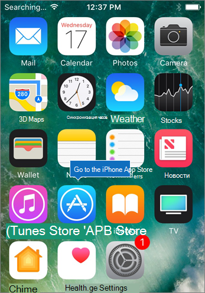
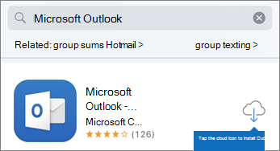
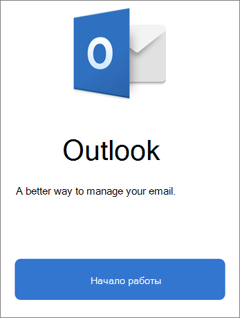
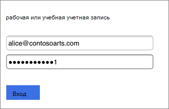
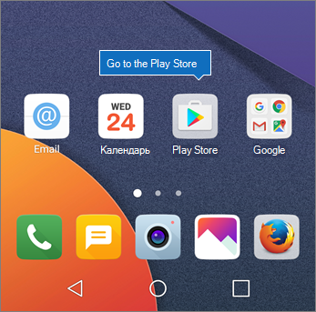
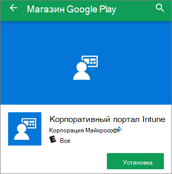

# Настройка мобильных устройств для Microsoft 365 для бизнес-пользователей

Следуя инструкциям на этих вкладках, вы можете установить Office на iPhone или телефоне с Android. После этого ваши файлы, созданные в приложениях Office, будут защищены Microsoft 365 для бизнеса.

Пример приведен для Outlook, но он относится и к другим приложениям Office.
  
## Настройка мобильных устройств

## [iPhone](#tab/iPhone)
  
Просмотрите короткое видео о том, как настроить приложения Office на устройствах с iOS с помощью Microsoft 365 для бизнеса.  

> [!VIDEO https://www.microsoft.com/videoplayer/embed/RWee2n] 

Если это видео помогло вам, ознакомьтесь с [полным учебным курсом для малых предприятий и новых пользователей Microsoft 365](https://support.microsoft.com/office/6ab4bbcd-79cf-4000-a0bd-d42ce4d12816).

Откройте приложение **App store** и в поле поиска введите Microsoft Outlook.
  

  
Нажмите значок облака, чтобы установить Outlook.
  

  
После завершения установки нажмите кнопку **Открыть**, чтобы открыть Outlook, а затем — кнопку **Начало работы**.
  

  
Введите рабочий адрес электронной почты на экране **Добавить** учетную запись учетной записи электронной почты, а затем введите свой \> Microsoft 365 для входа учетных данных \> **бизнеса**.
  

  
Если ваша организация защищает файлы в приложениях, вы увидите диалоговое окно, в котором говорится, что ваша организация сейчас защищает данные в приложении, и для ее использования необходимо перезапустить приложение. Нажмите **ОК** и закройте Outlook. 
  

  
Найдите приложение Outlook на iPhone и перезапустите его. При запросе введите ПИН-код и убедитесь в этом. Теперь приложение Outlook на iPhone готово к работе.
  

  
## [Android](#tab/Android)
  
Просмотрите видео об установке Outlook и Office на устройствах с Android.  

> [!VIDEO https://www.microsoft.com/videoplayer/embed/ecc2e9c0-bc7e-4f26-8b14-91d84dbcfef0] 

Если это видео помогло вам, ознакомьтесь с [полным учебным курсом для малых предприятий и новых пользователей Microsoft 365](https://support.microsoft.com/office/6ab4bbcd-79cf-4000-a0bd-d42ce4d12816).

Чтобы приступить к настройке на android-телефоне, перейдите в магазин Play.
  

  
Введите Microsoft Outlook в поле поиска Google Play и нажмите **кнопку Установить**. После установки Outlook нажмите кнопку **Открыть**.
  

  
В приложении Outlook нажмите кнопку **Начало** работы, затем добавьте учетную запись Microsoft 365 для учетной записи электронной почты для бизнеса Continue и вопишитесь в учетные \> данные организации.
  

  
В диалоговом окне с сообщением о необходимости установить корпоративный портал Intune нажмите кнопку **Перейти в магазин**.
  

  
В Play Store установите портал компании Intune.
  

  
Снова откройте Outlook, затем введите и подтвердите ПИН-код. Теперь приложение Outlook готово к работе.
  

## См. также

[Обучающие видеоролики по Microsoft 365 для бизнеса](https://support.microsoft.com/office/6ab4bbcd-79cf-4000-a0bd-d42ce4d12816)

---
