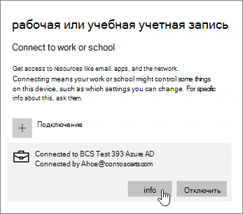

# Настройка устройств с Windows для пользователей Microsoft 365 бизнес премиум

## Необходимые условия для настройки устройств с Windows для пользователей Microsoft 365 бизнес премиум

Прежде чем вы сможете настроить устройства с Windows для пользователей Microsoft 365 бизнес премиум, убедитесь, что все устройства с Windows работают под управлением Windows 10 Pro версии 1703 (Creators Update). Windows 10 Pro является необходимым условием для развертывания Windows 10 Бизнес, который представляет собой набор облачных служб и возможностей управления устройствами, которые дополняют Windows 10 Pro и обеспечивают централизованное управление и управление безопасностью Microsoft 365 бизнес премиум.
  
Если у вас есть устройства с Windows под управлением Windows 7 Pro, Windows 8 Pro или Windows 8.1 Pro, ваша подписка на Microsoft 365 бизнес премиум дает право на обновление до Windows 10.
  
Дополнительные сведения о переводе устройств с Windows на версию Windows 10 Pro Creators Update приведены в следующей статье: [Обновление устройств с Windows до Windows Pro Creators Update](upgrade-to-windows-pro-creators-update.md)
  
[Убедитесь, что устройство подключено к Azure AD,](#verify-the-device-is-connected-to-azure-ad) чтобы убедиться, что вы обновились, или убедитесь, что обновление сработало.

Посмотрите короткое видео о подключении Windows к Microsoft 365.  

> [!VIDEO https://www.microsoft.com/videoplayer/embed/RE3yXh3] 

Если это видео помогло вам, ознакомьтесь с [полным учебным курсом для малых предприятий и новых пользователей Microsoft 365](https://support.microsoft.com/office/6ab4bbcd-79cf-4000-a0bd-d42ce4d12816).
  
## Добавление устройств с Windows 10 в каталог Azure AD организации

Если все устройства с Windows в вашей организации были либо обновлены до Windows 10 Pro Creators Update, либо уже работают под управлением Windows 10 Pro Creators Update, вы можете присоединить эти устройства к Azure Active Directory вашей организации. После присоединить устройства будут автоматически обновлены до Windows 10 Бизнес, которая входит в состав подписки Microsoft 365 бизнес премиум.
  
### Для новых (или недавно переведенных) устройств с Windows 10 Pro

Для новых устройств с системой Windows 10 Pro Creators Update и устройств, которые были переведены на эту версию, но для которых еще не выполнена настройка Windows 10, следуйте инструкциям ниже.
  
1. Начните настройку Windows 10 на устройстве и дойдите до страницы **Выбор способа настройки**. 
    
    
  
2. Здесь выберите **"Настройка для организации",** а затем введите имя пользователя и пароль для Microsoft 365 бизнес премиум. 
    
3. Завершите настройку Windows 10 на устройстве.
    
   После завершения этой процедуры пользователь будет добавлен в каталог Azure AD организации. Чтобы проверить, так ли это, ознакомьтесь со статьей [Проверка подключения устройства к Azure AD](#verify-the-device-is-connected-to-azure-ad). 
  
### Для устройства, на котором уже установлена и настроена система Windows 10 Pro

 **Подключение пользователей к Azure AD**
  
1. На пользовательском компьютере под управлением Windows 10 Pro версии 1703 (Creators Update) (см. [необходимые условия](pre-requisites-for-data-protection.md)) щелкните логотип Windows, а затем значок параметров.
  
   
  
2. В окне **Параметры** выберите элемент **Учетные записи**.
  
   
  
3. На странице **Ваши данные** выберите **Доступ к учетной записи места работы или учебного заведения** \> **Подключить**.
  
   
  
4. В диалоговом окне **Настроить учетную запись компании или учебного заведения** в разделе **Другие действия** выберите **Присоединить это устройство к Azure Active Directory**.
  
   
  
5. On the **Let's get you signed in** page, enter your work or school account \> **Next**.
  
   On the **Enter password** page, enter your password \> **Sign in**.
  
   
  
6. На странице **"Убедитесь, что это ваша организация",** проверьте правильность сведений и выберите "Присоединиться". 
  
   На странице **Готово!** page,se **Done**.
  
   
  
Если вы добавляете файлы в OneDrive для бизнеса, синхронизируйте их в обратном направлении. Если вы использовали стороне средство для переноса профилей и файлов, синхронизируйте их с новым профилем.
  
## Проверка подключения устройства к Azure AD

Чтобы проверить состояние синхронизации, на странице  **"Доступ** к  сведениям о работе или учебном заключении" в параметрах выберите область "Подключен к _", чтобы показать кнопки \<organization name\> **"Сведения"** и **"Отключить".** Выберите **"Сведения",** чтобы получить состояние синхронизации. 
  
На странице **состояния синхронизации** выберите "Синхронизация", чтобы получить последние политики управления мобильными устройствами на компьютере. 
  
Чтобы начать использовать учетную запись Microsoft 365  бизнес премиум, перейдите к кнопке "Перейти" в Windows, щелкните правой кнопкой мыши текущую учетную запись и **перейдите к учетной записи.** Войдите, используя адрес электронной почты и пароль организации.
  

  
## Проверка обновления компьютера до Windows 10 бизнес

Убедитесь, что ваши устройства, которые присоединились к Azure AD для Windows 10, обновлены до Windows 10 бизнес в рамках подписки Microsoft 365 бизнес премиум.
  
1. Выберите **Параметры** \> **Система** \> **Сведения**.
    
2. Убедитесь, что в поле **Выпуск** указано **Windows 10 для бизнеса**.
    
    
  
## Дальнейшие действия

Чтобы настроить мобильные устройства, см. "Настройка мобильных устройств для пользователей [Microsoft 365](set-up-mobile-devices.md)бизнес премиум", "Настройка политик защиты устройств и приложений" в под [управлением Microsoft 365 для бизнеса.](manage.md)
  
## Подробнее о настройке и использовании Microsoft 365 бизнес премиум

[Обучающие видеоролики по Microsoft 365 для бизнеса](https://support.microsoft.com/office/6ab4bbcd-79cf-4000-a0bd-d42ce4d12816)
