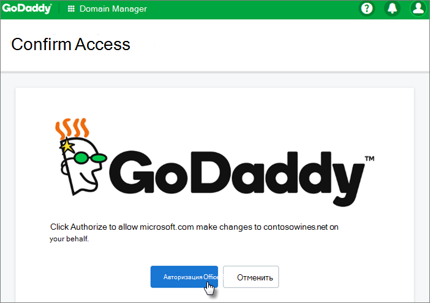
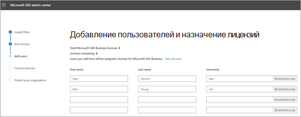

# Настройка Microsoft 365 бизнес премиум в мастере установкиSet up Microsoft 365 Business Premium in the setup wizard

В этом видеоролике приводится обзор программы установки Microsoft 365 Business Premium.Watch this video for an overview of Microsoft 365 Business Premium setup.  

> [!VIDEO https://www.microsoft.com/videoplayer/embed/RE1FYSM] 

Если этот видео помогло вам, ознакомьтесь с [полным учебным курсом для малых предприятий и новых пользователей Microsoft 365](https://support.office.com/article/6ab4bbcd-79cf-4000-a0bd-d42ce4d12816).If you found this video helpful, check out the [complete training series for small businesses and those new to Microsoft 365](https://support.office.com/article/6ab4bbcd-79cf-4000-a0bd-d42ce4d12816).

## Добавление домена, пользователей и Настройка политикAdd your domain, users, and set up policies

При покупке Microsoft 365 Бизнес Премиум вы можете использовать домен, который вы являетесь участником, или приобрести его во время [регистрации](sign-up.md).When you purchase Microsoft 365 Business Premium, you have the option of using a domain you own, or buying one during the [sign-up](sign-up.md).

- Если вы приобрели новый домен при регистрации, все настроенные домены и вы можете перейти к [добавлению пользователей и назначению лицензий](#add-users-and-assign-licenses).If you purchased a new domain when you signed up, your domain is all set up and you can move to [Add users and assign licenses](#add-users-and-assign-licenses).

### Добавление домена для персонализации при входеAdd your domain to personalize sign-in

1. Войдите в [центр администрирования Microsoft 365](https://admin.microsoft.com) с помощью учетных данных глобального администратора.Sign in to [Microsoft 365 admin center](https://admin.microsoft.com) by using your global admin credentials. 

2. Чтобы запустить мастер, нажмите кнопку **Перейти в программу установки** .Choose **Go to setup** to start the wizard.

    

3. На странице **Установка приложений Office** можно дополнительно установить приложения на своем компьютере.On the **Install your Office apps** page, you can optionally install the apps on your own computer.
    
4. На шаге **Добавление домена** введите имя домена, который вы хотите использовать (например, contoso.com).In the **Add domain** step, enter the domain name you want to use (like contoso.com).

    > [!IMPORTANT]
    > Если вы приобрели домен во время регистрации, вы не увидите шаг **Добавить домен** .If you purchased a domain during the sign-up, you will not see **Add a domain** step here. Перейдите к разделу [Добавление пользователей](#add-users-and-assign-licenses) .Go to [Add users](#add-users-and-assign-licenses) instead.

    

    
4. Следуйте указаниям мастера, чтобы [создать записи DNS на любом поставщике услуг хостинга DNS для Office 365](https://docs.microsoft.com/office365/admin/get-help-with-domains/create-dns-records-at-any-dns-hosting-provider) , который подтверждает, что вы владеете доменом.Follow the steps in the wizard to [Create DNS records at any DNS hosting provider for Office 365](https://docs.microsoft.com/office365/admin/get-help-with-domains/create-dns-records-at-any-dns-hosting-provider) that verifies you own the domain. Если вы знаете узел домена, ознакомьтесь с [инструкциями, характерными для узла](https://docs.microsoft.com/office365/admin/get-help-with-domains/set-up-your-domain-host-specific-instructions).If you know your domain host, see also the [host specific instructions](https://docs.microsoft.com/office365/admin/get-help-with-domains/set-up-your-domain-host-specific-instructions).

    Если поставщик услуг размещения — GoDaddy или другой узел, включенный с [подключением к домену](https://docs.microsoft.com/office365/admin/get-help-with-domains/domain-connect), процесс будет прост, и вам будет автоматически предложено войти и проверить подлинность Майкрософт от вашего имени.If your hosting provider is GoDaddy or another host enabled with [domain connect](https://docs.microsoft.com/office365/admin/get-help-with-domains/domain-connect), the process is easy and you'll be automatically asked to sign in and let Microsoft authenticate on your behalf.

    

### Добавление пользователей и назначение лицензийAdd users and assign licenses

Вы можете добавлять пользователей в мастер, но позднее вы можете [Добавить пользователей](add-users-m365b.md) в центре администрирования.You can add users in the wizard, but you can also [add users later](add-users-m365b.md) in the admin center. Кроме того, если у вас есть локальный контроллер домена, вы можете добавить пользователей с помощью [Azure AD Connect](https://docs.microsoft.com/azure/active-directory/hybrid/how-to-connect-install-express).Additionally, if you have a local domain controller, you can add users with [Azure AD Connect](https://docs.microsoft.com/azure/active-directory/hybrid/how-to-connect-install-express).

#### Добавление пользователей в мастерAdd users in the wizard

Для всех пользователей, добавляемых в мастере, автоматически назначается лицензия Microsoft 365 бизнес премиум.Any users you add in the wizard get automatically assigned a Microsoft 365 Business Premium license.

1. Если у вашей подписки Microsoft 365 Business Premium есть существующие пользователи (например, если вы использовали Azure AD Connect), вы получите возможность назначить лицензии для них сейчас.If your Microsoft 365 Business Premium subscription has existing users (for example, if you used Azure AD Connect), you get an option to assign licenses to them now. Добавьте лицензии и для них.Go ahead and add licenses to them as well.

2. После добавления пользователей вы также получите возможность предоставлять учетные данные новым добавленным пользователям.After you've added the users, you'll also get an option to share credentials with the new users you added. Вы можете распечатать их, отправить по электронной почте или скачать.You can choose to print them out, email them, or download them.

### Подключение доменаConnect your domain

> [!NOTE]
> Если вы решили использовать домен onmicrosoft или использовать Azure AD Connect для настройки пользователей, этот шаг не будет отображаться.If you chose to use the .onmicrosoft domain, or used Azure AD Connect to set up users, you will not see this step.
  
Для настройки служб вам необходимо обновить некоторые записи узла DNS или регистратора доменных имен.To set up services, you have to update some records at your DNS host or domain registrar.
  
1. Мастер настройки обычно определяет регистратора и предоставляет ссылку на пошаговые инструкции по обновлению записей NS на его сайте.The setup wizard typically detects your registrar and gives you a link to step-by-step instructions for updating your NS records at the registrar website. Если это не так, [измените серверов доменных имен, чтобы настроить Office 365 для любого регистратора доменных](https://docs.microsoft.com/microsoft-365/admin/get-help-with-domains/change-nameservers-at-any-domain-registrar)имен.If it doesn't, [Change nameservers to set up Office 365 with any domain registrar](https://docs.microsoft.com/microsoft-365/admin/get-help-with-domains/change-nameservers-at-any-domain-registrar). 

    - Если у вас есть существующие записи DNS, например существующий веб-сайт, но ваш узел DNS включен для [подключения к домену](https://docs.microsoft.com/office365/admin/get-help-with-domains/domain-connect), нажмите кнопку **добавить записи**.If you have existing DNS records, for example an existing web site, but your DNS host is enabled for [domain connect](https://docs.microsoft.com/office365/admin/get-help-with-domains/domain-connect), choose **Add records for me**. На странице " **Выбор веб-служб** " примите все параметры по умолчанию и нажмите кнопку **Далее**, а затем — кнопку **авторизовать** на странице узла DNS.On the **Choose your online services** page, accept all the defaults, and choose **Next**, and choose **Authorize** on your DNS host's page.
    - Если у вас есть существующие записи DNS с другими узлами DNS (не включены для подключения к домену), вам потребуется управлять собственными записями DNS, чтобы убедиться, что существующие службы остаются подключенными.If you have existing DNS records with other DNS hosts (not enabled for domain connect), you'll want to manage your own DNS records to make sure the existing services stay connected. Более подробную информацию можно узнать в разделе [domain основы доменов](https://docs.microsoft.com/office365/admin/get-help-with-domains/dns-basics) .See [domain basics](https://docs.microsoft.com/office365/admin/get-help-with-domains/dns-basics) for more info.

        

2. Следуйте указаниям мастера, электронной почты и других служб.Follow the steps in the wizard and email and other services will be set up for you.

### Защита ОрганизацииProtect your organization 

Политики, настроенные в мастере, автоматически применяются к [группе безопасности](https://docs.microsoft.com/office365/admin/create-groups/compare-groups#security-groups) с именем " *все пользователи*".The policies you set up in the wizard are applied automatically to a [Security group](https://docs.microsoft.com/office365/admin/create-groups/compare-groups#security-groups) called *All Users*. Кроме того, можно создать дополнительные группы, чтобы назначить политики в центре администрирования.You can also create additional groups to assign policies to in the admin center.

1. При **увеличении защиты от расширенных угроз кибератак**рекомендуется принять значения по умолчанию, чтобы разрешить [Office 365 Advance Threat protection](https://docs.microsoft.com/microsoft-365/security/office-365-security/office-365-atp) сканировать файлы и ссылки в приложениях Office.On the **Increase protection from advanced cyber threats**, it is recommended that you accept the defaults to let [Office 365 Advance Threat Protection](https://docs.microsoft.com/microsoft-365/security/office-365-security/office-365-atp) scan files and links in Office apps.

    

2. На странице **предотвратить утечки конфиденциальных данных** примите значения по умолчанию, чтобы включить защиту от потери данных (DLP) Office 365 для отслеживания конфиденциальных данных в приложениях Office и предотвращения случайного доступа к ним за преворотами в Организации.On the **Prevent leaks of sensitive data** page, accept the defaults to turn on Office 365 Data Loss Prevention (DLP) to track sensitive data in Office apps and prevent the accidental sharing of these outside your organization.

3. На странице **Защита данных в Office для мобильных устройств** оставьте управление мобильными приложениями включено, разверните параметры и просмотрите их, а затем выберите **создать политику управления мобильными приложениями**.On the **Protect data in Office for mobile** page, leave mobile app management on, expand the settings and review them, and then select **Create mobile app management policy**.

    

## Защита компьютеров с Windows 10Secure Windows 10 PCs

В левой панели навигации выберите пункт **Настройка** , а затем в разделе **Вход и безопасность**выберите **безопасность компьютеров с Windows 10**.On the left nav, select **Setup** and then, under **Sign-in and security**, choose **Secure your Windows 10 computers**. Чтобы приступить к работе, нажмите кнопку **Просмотр** .Choose **View** to get started. Выполните инструкции [в статье Защита компьютеров с Windows 10](secure-win-10-pcs.md) .See [secure your Windows 10 computers](secure-win-10-pcs.md) for complete instructions.

## Развертывание клиентских приложений Office 365Deploy Office 365 client apps

Если вы решили автоматически устанавливать приложения Office во время установки, они будут установлены на устройствах с Windows 10 после входа пользователей в Azure AD с помощью своих рабочих учетных данных.If you chose to automatically install Office apps during setup, the apps will install on the Windows 10 devices once the users have signed in to Azure AD from their Windows devices, using their work credentials.

Чтобы установить Office на мобильные устройства с iOS или Android, ознакомьтесь со статьей [Настройка мобильных устройств для пользователей Microsoft 365 Business Premium](set-up-mobile-devices.md).To install Office on mobile iOS or Android devices, see [Set up mobile devices for Microsoft 365 Business Premium users](set-up-mobile-devices.md).

Вы также можете установить Office по отдельности.You can also install Office individually. Инструкции: [Install Office на ПК или Mac](https://support.office.com/article/4414eaaf-0478-48be-9c42-23adc4716658) .See [install Office on a PC or Mac](https://support.office.com/article/4414eaaf-0478-48be-9c42-23adc4716658) for instructions.

## См. такжеSee also

[Обучающие видеоролики по Microsoft 365 для бизнесаMicrosoft 365 for business training videos](https://support.office.com/article/6ab4bbcd-79cf-4000-a0bd-d42ce4d12816)
