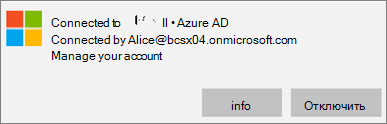

# Проверка параметров защиты приложений на компьютерах с Windows 10

## Проверка отсутствия у пользователей возможности копирования данных компании в личные файлы на корпоративных устройствах

После [настройки политик защиты приложений](protection-settings-for-windows-10-devices.md)это может занять несколько часов, чтобы политика вступила в силу на устройствах пользователей. Если **вы включили** параметр **запретить пользователям копировать данные компании в личные файлы и принудительно сохранить рабочие файлы в настройках OneDrive для бизнеса** для устройств, принадлежащих компании, вы можете проверить это на устройстве пользователя после подключения к Azure AD и входа в систему. 
  
 **Проверка параметров подключения**
  
1. После входа с помощью учетных данных Office 365 бизнес и подключения к Azure AD, как описано в статье [Настройка устройств с Windows для пользователей Microsoft 365 бизнес](set-up-windows-devices.md), откройте **Параметры Windows** \> **Учетные записи** \> **Доступ к учетной записи места работы или учебного заведения**. Выберите пункт **Подключено к Azure AD \<имя клиента\>**, а затем нажмите кнопку **Сведения**.
    
    
  
2. На странице " **Управление с помощью** \<имени\> клиента" можно просмотреть **сведения о подключении** , включающие **адрес сервера управления** , как показано на следующем рисунке. 
    
    
  
 **Проверка отсутствия возможности вставки данных компании в неуправляемое приложение**
  
1. Откройте приложение Outlook 2016, установленное с помощью Office 365 бизнес.
    
2. Откройте письмо и скопируйте его фрагмент.
    
    Откройте Блокнот и попытайтесь вставить в него содержимое.
    
    Вы получите сообщение об ошибке, в котором говорится, что приложение не может получить доступ к контенту.
    
    
  
    Однако это же содержимое можно вставить в Word 2016.
    
## Проверка отсутствия у пользователей возможности копирования данных компании в личные файлы на личных устройствах

 **Проверка параметров подключения**
  
1. На персональном устройстве с Windows 10, в котором вы вошли как локальный пользователь, перейдите в раздел **Параметры Windows**, а затем щелкните или выберите **учетные записи** \> **доступ к работе или учебному заведению**.
    
2. На странице **Доступ к учетной записи места работы или учебного заведения** выберите команду **Подключить**.
    
3. Enter your Microsoft 365 Business credential into the **Set up a work or school account dialog** \> **Sign in**.
    
4. На странице **Доступ к учетной записи места работы или учебного заведения** выберите элемент **Рабочая или учебная учетная запись** и нажмите кнопку **Сведения**.
    
    
  
5. На странице "доступ" на **рабочем месте или учебном заведении** можно просмотреть **сведения о подключении** , включающие **адрес сервера управления** , как показано на следующем рисунке, и содержит слова " *НЗП* " и " *MAM* " в. 
    
    
  
 **Проверка отсутствия возможности вставки данных компании в неуправляемое приложение**
  
1. Откройте Outlook 2016, при необходимости добавьте свою учетную запись Office 365 бизнес и выполните вход с помощью учетных данных Office 365 бизнес.
    
2. Откройте письмо и скопируйте его фрагмент.
    
    Откройте Блокнот и попытайтесь вставить в него содержимое.
    
    Вы получите сообщение об ошибке, в котором приложение не может получить доступ к контенту.
    
    
  
    Однако это же содержимое можно вставить в Word 2016.
    

