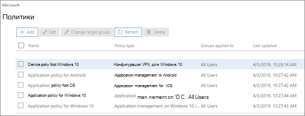
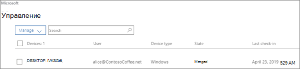

# Просмотр политик и устройств и управление ими

## Просмотр и изменение политик устройств

1.  Перейдите в Центр администрирования <a href="https://go.microsoft.com/fwlink/p/?linkid=837890" target="_blank">https://admin.microsoft.com</a>.
2. В левой панели навигации выберите пункт **Devices** \> **политики**устройств.

    На этой странице можно создать, изменить, изменить целевую группу или удалить политику.

    
  
## Просмотр устройств и управление ими

1. В левой панели навигации выберите Управление **устройствами** \> **Manage**. 
    
    На этой странице вы можете выбрать одно или несколько устройств и удалить данные компании. Для устройств с Windows 10, для которых уже настроены параметры защиты, также можно восстановить заводские параметры.
  
   

