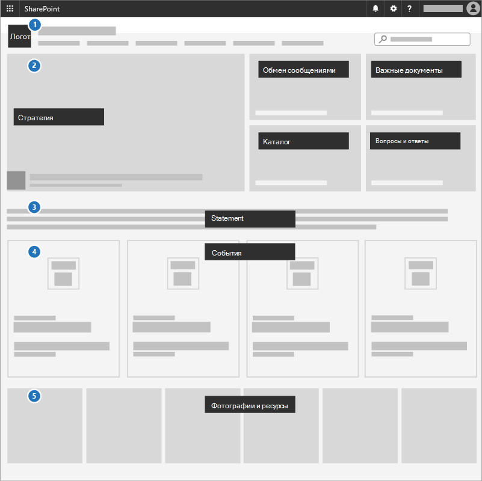

# Создание информационного сайтаCreate a communications site

Отличный способ сообщить о приоритетах, поделиться стратегическими документами и выделить предстоящие события — это использовать сайт связи в SharePoint.A great way to communicate priorities, share strategy documents, and highlight upcoming events is to use a communications site in SharePoint. Сайты коммуникаций для общего доступа к данным в целом по всему бизнесу или кампании; это ваш внутренний сайт стратегии.Communications sites are for sharing things broadly across your whole business or campaign; it's your internal strategy site.

## РекомендацииBest practices

Включите следующие элементы на сайте Communications:Include the following elements in your Communications site:

1. Добавьте логотип и цвета в качестве изображения и темы для загона.Add your logo and colors as a header image and theme.
2. Руководство с помощью стратегии, сообщения, важных документов, каталога и задаваемой темы в веб-части **Hero.**Lead with your strategy, message, important documents, a directory, and FAQ in a **Hero web part**.
3. Включай заявление генерального директора или кандидата в команду в **веб-части Text.**Include a CEO or candidate statement to the team in a **Text web part**.
4. Добавьте события в **веб-часть События,** чтобы все могли видеть, что происходит.Add events to an **Events web part** so everyone can see what's coming up.
5. Добавление фотографий, которые пользователи могут использовать или делиться с веб-частью **галереи изображений.**Add photos that people can use or share to an **Image gallery web part**.

## Инфографика: создание инфографики сайта связиInfographic: Create a Communications Site infographic

Следующие ссылки для PowerPoint и PDF можно скачать и распечатать в формате таблоидов (также известных как книги, 11 x 17 или A3).The following links for PowerPoint and PDF can be downloaded and printed in tabloid format (also known as ledger, 11 x 17, or A3).

[PDF](downloads/M365CampaignsCreateCommunicationSite.pdf)  |  [PowerPoint](downloads/M365CampaignsCreateCommunicationSite.pptx)[PDF](downloads/M365CampaignsCreateCommunicationSite.pdf) | [PowerPoint](downloads/M365CampaignsCreateCommunicationSite.pptx)

## НастройкаSet it up

1. Вход в https://Office.com.Sign in to https://Office.com.
2. В левом верхнем углу страницы выберите значок запуска приложения,  а затем выберите SharePoint плитку.In the top-left corner of the page, select the app launcher icon and then select the **SharePoint** tile. Если вы не видите  плитку SharePoint, щелкните плитку  **Sites** или All, если SharePoint не отображается.If you don't see the **SharePoint** tile, click the **Sites** tile or **All** if SharePoint isn't visible.
3. В верхней части домашней SharePoint нажмите **кнопку + Создайте** сайт и выберите вариант **сайта** Communication.At the top of the SharePoint home page, click **+ Create site** and choose the **Communication site** option.

Узнайте все [о сайтах коммуникаций](https://support.office.com/article/What-is-a-SharePoint-communication-site-94A33429-E580-45C3-A090-5512A8070732) и о создании сайта связи [в SharePoint Online](https://support.microsoft.com/en-us/office/create-a-communication-site-in-sharepoint-online-7fb44b20-a72f-4d2c-9173-fc8f59ba50eb).Learn all [about Communications sites](https://support.office.com/article/What-is-a-SharePoint-communication-site-94A33429-E580-45C3-A090-5512A8070732) and how to [create a communication site in SharePoint Online](https://support.microsoft.com/en-us/office/create-a-communication-site-in-sharepoint-online-7fb44b20-a72f-4d2c-9173-fc8f59ba50eb).

## Параметры администратораAdmin settings

Если вы не видите ссылку **+Create** site, создание сайта самообслуживки может быть недоступным в Microsoft 365.If you don't see the **+ Create** site link, self-service site creation might not be available in Microsoft 365. Чтобы создать сайт группы, свяжитесь с лицом, Microsoft 365 в вашей организации.To create a team site, contact the person administering Microsoft 365 in your organization. Если вы администратор Microsoft 365, см. в SharePoint [Online](/sharepoint/manage-site-creation) создание сайта самообслуживки для  организации или управление сайтами в новом центре администрирования SharePoint для создания сайта из центра администрирования SharePoint Online.If you're a Microsoft 365 admin, see [Manage site creation in SharePoint Online](/sharepoint/manage-site-creation) to enable self-service site creation for your organization or [Manage sites in the new SharePoint admin center](/sharepoint/manage-sites-in-new-admin-center) to create a site from the SharePoint Online admin center.