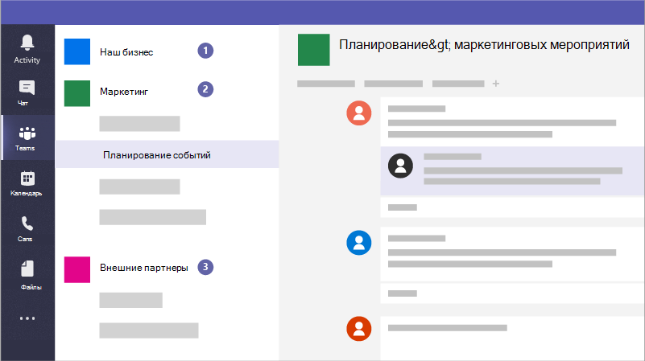

# Создание групп для совместной работы в Microsoft Teams

Microsoft Teams — это приложение для совместной работы, которое помогает сотрудникам оставаться организованными и беседами с любого устройства. Вы можете использовать Microsoft Teams для мгновенных бесед с сотрудниками или гостями за пределами организации. Вы также можете звонить по телефону, проводить собрания и обмениваться файлами.

## Рекомендации

1. Создание частных групп для конфиденциальной информации.
1. Создайте оргкомитет для общения со всеми в вашей организации.
1. Создание групп для определенных проектов и применение нужного количества защиты в зависимости от того, кто должен быть включен.
1. Создайте конкретные группы для общения с внешними партнерами, чтобы они не были конфиденциальными для вашего бизнеса.

Например, бизнес,юридическая фирма или медицинская практика могут создать следующие группы:

1. **Команда для бизнеса, фирмы или практики:** Это для всех, чтобы использовать для ежедневной связи и работы по всему бизнесу. Вы можете использовать эту команду для публикации объявлений или обмена информацией, интересуемой для всей вашей фирмы или практики.
1. **Отдельные команды:** Настройка групп для небольших групп для совместной работы в течение дня.
1. **Команда внешних коммуникаций или группы:** Согласование с поставщиками, партнерами или клиентами, не допуская их к чему-либо конфиденциальному. Настройка различных каналов для определенных групп.

И кампании могли бы создать следующие группы для безопасного общения и совместной работы:

1. **Команда руководства кампании:** Установите его как частную команду, чтобы только ключевые участники кампании могли получить к ней доступ и обсудить потенциально чувствительные проблемы.
2. **Общая группа кампании:** Это для всех, чтобы использовать для ежедневной связи и работы. Отдельные лица, группы или комитеты могут настроить каналы в этой группе для работы. Например, люди, планируя события, могут настроить канал для чата и координации логистики для событий кампании.
3. **Команда партнеров:** Скоординировать свои действия с поставщиками, партнерами или волонтерами, не разрешая им ничего конфиденциального.

При создании команды создается еще один момент:

- Новая группа [Microsoft 365](/MicrosoftTeams/office-365-groups)
- [Веб-сайт SharePoint Online](/MicrosoftTeams/sharepoint-onedrive-interact) и библиотека документов для хранения файлов группы
- Общий [почтовый ящик и](/MicrosoftTeams/exchange-teams-interact) календарь Exchange Online
- Записная книжка OneNote
- Связь с другими приложениями Office 365, такими как Planner и Power BI

Внутри Microsoft Teams можно найти:

1. **Команды:** Найдите каналы, принадлежащие или создайте собственные. Внутри каналов можно проводить встречи на месте, беседы и обмениваться файлами.
2. **Собрания:** См. все, что вы выстроили в очередь за день или неделю. Или запланировать собрание. Этот календарь синхронизируется с календарем Outlook.
3. **Вызовы:** В некоторых случаях, если в организации она настроена, можно вызвать любого из Microsoft Teams, даже если они не используют Microsoft Teams.
4. **Действие:** Догонять все непрочитанные сообщения, @mentions, ответы и другие.

Используйте поле команд в верхней части для поиска определенных элементов или людей, быстрого действия и запуска приложений.

## Настройка

Создайте частную команду только для владельца бизнеса и руководителей, или руководителя кампании и кандидата, как это.

> [!VIDEO https://www.microsoft.com/videoplayer/embed/RWeqWA]

Создайте общеуголовную команду, которую каждый в компании или кампании может использовать для обмена файлами и обмена файлами.

> [!VIDEO https://www.microsoft.com/videoplayer/embed/RE2GCG9]

Создайте команду, которую вы делитесь с гостями за пределами организации, например для рекламы или финансов.

> [!VIDEO https://www.microsoft.com/videoplayer/embed/RE1FQMp]

Дополнительные подробности о microsoft Teams в [технической документации Microsoft Teams](/microsoftteams/microsoft-teams)

## Параметры администратора

Вы должны быть администратором для создания всей организации. Дополнительные сведения см. [в статью Что такое администратор в Microsoft 365?](https://support.office.com/article/what-is-an-admin-e123627e-4892-4461-b9aa-1b6d57a5cfa4?ui=en-US&rs=en-US&ad=US).