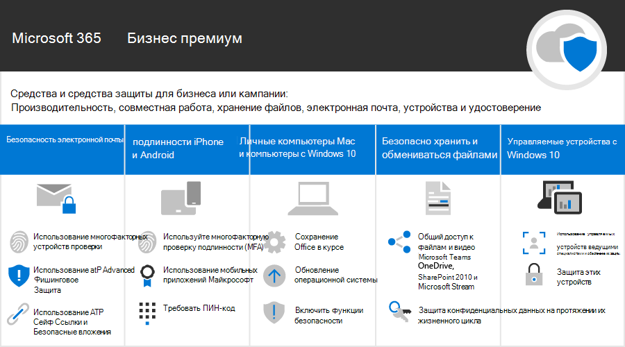

Microsoft 365 для кампанийMicrosoft 365 for Campaigns
===========================

В нашем современном мире обеспечение безопасности данных и коммуникаций является приоритетом, особенно для политических кампаний, медицинской и юридической практики, а также многих других направлений деятельности.In our current world, keeping data and communications secure is a priority, particularly for political campaigns, medical and legal practices, and many other businesses. В Microsoft 365 для кампаний предусмотрен набор рекомендаций, предназначенных для защиты вас и ваших данных.Microsoft 365 for Campaigns comes with a set of recommendations designed to help protect you and your data. Эта библиотека содержит справочную информацию о том, как настроить и использовать такую рекомендуемую среду, даже если вы не являетесь участником кампании.This library includes help for setting up and using this recommended environment, even if you're not a campaign.

> [!VIDEO https://www.microsoft.com/videoplayer/embed/RE3clbH]

Что такое Microsoft 365 для кампаний?What is Microsoft 365 for Campaigns?
------------------------------------

Это рекомендуемая безопасная конфигурация, включающая Microsoft 365 бизнес премиум, благодаря чему вы можете:It's a recommended secure configuration that includes Microsoft 365 Business Premium so that you can:

- Воспользоваться надежными инструментами для совместной работы и обеспечения производительности, такими как Outlook, Word, Excel и другие продукты Office.Rely on trusted business productivity and collaboration tools, such as Outlook, Word, Excel, and other Office products.
- Обеспечить защиту корпоративного уровня для рабочих файлов на всех своих устройствах с iOS, Android и Windows 10.Protect your work files on all of your iOS, Android, and Windows 10 devices with enterprise-grade security that is simple to manage.
- Применить дополнительную защиту для учетных записей пользователей и удостоверений.Apply extra protection for user accounts and identity.

Несмотря на то, что под специальную цену на Microsoft 365 бизнес премиум подпадают федеральные избирательные кампании в США, любая организация, использующая этот план, может воспользоваться настоящим руководством, чтобы настроить повышенный уровень безопасности и узнать, как безопасно выполнять совместную работу.While federal election campaigns in the United States qualify for special pricing for Microsoft 365 Business Premium, any organization with this plan can take advantage of this guidance to configure increased security and learn how to collaborate securely.

В эту библиотеку включены:This library includes the following:

- Конкретные рекомендации по настройке для повышения безопасности.Prescriptive setup guidance for adding increased security.
- Справка для пользователей по настройке устройств для безопасного доступа.Help for users to setup devices for secure access.
- Рекомендации по безопасной совместной работе и общему доступу.Guidance on how to collaborate and share securely.

Дополнительные сведения о включенных возможностях см. в статье [Microsoft 365 бизнес премиум](https://www.microsoft.com/microsoft-365/business).For more information about what's included, see [Microsoft 365 Business Premium](https://www.microsoft.com/microsoft-365/business).

Начало работыGet started
--------------------------

Чтобы приступить к работе, необходимо выполнить указанные ниже действия:Follow these steps to get started:

- [Получить Microsoft 365 для кампанийGet Microsoft 365 campaigns](get-microsoft-365-campaigns.md)
- [Узнать, как ваши пользователи будут работать с Microsoft 365Learn how your users will work with Microsoft 365](m365-campaigns-users.md)
- [Настроить Microsoft 365 для кампанийSet up Microsoft 365 campaigns](microsoft-365-campaigns-setup-overview.md)

Решения для вашей кампании или малого бизнесаSolutions for your campaign or small business
--------------------------

После настройки безопасной среды Microsoft 365, для начала работы можно использовать следующие решения:After you set up your secure Microsoft 365 environment, you can use the following solutions to get working:

| Создание команд для совместной работыCreate teams for collaboration | Организация собраний по сетиSet up online meetings |
| ------------- | ------------- |
|  |  |
| Сотрудничайте с командами ключевых сотрудников, всех сотрудников, партнеров и поставщиков.Collaborate with teams for key staff, all staff, and partners or vendors. [Создание командыCreate your team](create-teams-for-collaboration.md) | Запланируйте собрание с использованием звука, видео и общего доступа в Microsoft Teams.Schedule a meeting with audio, video, and sharing with Microsoft Teams. [Организация собранияSet up a meeting](set-up-meetings.md) |

| Шифрование или присвоение меток конфиденциальным сообщениям электронной почтыEncrypt or label your sensitive email | Создание информационного сайтаCreate a communications site |
| ------------- | ------------- |
|  |  |
| Пользуйтесь шифрованием и метками конфиденциальности для защиты сообщений электронной почты, содержащих конфиденциальные сведения.Use encryption and sensitivity labels to protect email that contains confidential or sensitive information. [Отправка зашифрованных писемSend encrypted email](send-encrypted-email.md) | Делитесь событиями, сообщениями, изображениями и многим другим с вашей командой на внутреннем информационном сайте, созданном с помощью SharePoint.Share events, message, images, and more with your team in an internal communications site created with SharePoint. [Создание своего сайтаCreate your site](create-communications-site.md) |

| Общий доступ к файлам и видеоShare files and videos |
| ------------- |
|  |
| Сохраняйте свои файлы и видео в облаке, чтобы они были доступны всем Save your files and videos to the cloud so they're available to all   соответствующим лицам.of the appropriate people. [Начать совместное использованиеStart sharing](share-files-and-videos.md) |

