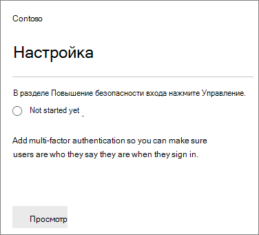

# Требуется многофакторная проверка подлинности и настройка политик условного доступа

Вы защищаете доступ к данным с помощью многофакторной проверки подлинности и политики условного доступа. Они добавляют существенную дополнительную безопасность. Корпорация Майкрософт предоставляет набор базовых политик условного доступа, которые рекомендуется использовать для всех клиентов. Базовые политики — это набор предопределённых политик, которые помогают защитить организации от многих распространенных атак. Эти распространенные атаки могут включать спрей паролей, повтор и фишинг.

Эти политики требуют от администраторов и пользователей ввести вторую форму проверки подлинности (называемую многофакторной проверкой подлинности или MFA) при определенных условиях. Например, если пользователь в вашей организации пытается войти в Microsoft 365 из другой страны или с неизвестного устройства, вход можно считать рискованным. Чтобы доказать свою подлинность, пользователь должен предоставить дополнительную форму проверки подлинности (например, отпечатка пальца или кода).

В настоящее время базовые политики включают следующие политики:

- Настройка центра администрирования Microsoft 365:
  - **Требуется MFA для администраторов:** требуется многофакторная проверка подлинности для наиболее привилегированных ролей администратора, в том числе глобального администратора.
  - **Защита конечных пользователей:** для пользователей требуется многофакторная проверка подлинности только в том случае, если вход является рискованным. 
- Настройка на портале Azure Active Directory:
  - **Блокировка устаревшей** проверки подлинности. Старые клиентские приложения и некоторые новые приложения не используют более новые, более безопасные протоколы проверки подлинности. Эти старые приложения могут обойти политики условного доступа и получить несанкционированный доступ к среде. Эта политика блокирует доступ к клиентам, которые не поддерживают условный доступ. 
  - **Требуется MFA для управления** службами. Требуется многофакторная проверка подлинности для доступа к средствам управления, включая портал Azure (где настраиваются базовые политики).

Рекомендуется включить все эти базовые политики. После включения этих политик администраторам и пользователям будет предложено зарегистрироваться для многофакторной проверки подлинности Azure AD.

Дополнительные сведения об этих политиках см. в дополнительных сведениях [о базовых политиках?](/azure/active-directory/conditional-access/concept-baseline-protection)

## Требование многофакторной идентификации

Чтобы потребовать, чтобы все пользователи зарегистрировались со второй формой ID:

1. Перейдите в центр администрирования и <a href="https://go.microsoft.com/fwlink/p/?linkid=837890" target="_blank">https://admin.microsoft.com</a> выберите **установку.**

2. На странице Настройка выберите **Просмотр** в карточке **Make sign-in более безопасной.**

    
3. На странице Сделать вход более безопасной выберите **Начало работы**.

4. На области безопасности усилите вход, выберите флажки рядом с Require **multi-factor authentication for admins** and **Require users to register for multi-factor authentication and block access if risk is detected**.
    Не забудьте исключить [учетную](m365-campaigns-protect-admin-accounts.md#create-an-emergency-admin-account) запись администратора экстренных служб или "брейк-стекло" из требования MFA в поле **Найти пользователей.**

    

5. Выберите **политику Create** в нижней части страницы.

## Настройка базовых политик

1. Перейдите на портал [Azure,](https://portal.azure.com)а затем перейдите на условный доступ **к безопасности Azure Active Directory,** чтобы создать новую \>  \>  **политику.**

См. следующие инструкции для каждой политики:  
    - [Требовать MFA для администраторов](/azure/active-directory/conditional-access/howto-baseline-protect-administrators)  
    - [Требовать MFA для пользователей](/azure/active-directory/conditional-access/howto-baseline-protect-end-users)  
    - [Блокирование традиционной проверки подлинности](/azure/active-directory/conditional-access/howto-baseline-protect-legacy-auth)  
    - [Требуется MFA для управления службами](/azure/active-directory/conditional-access/howto-baseline-protect-azure)

> [!NOTE]
> Политики предварительного просмотра больше не существуют, и пользователям потребуется создать собственные политики.

Можно настроить дополнительные политики, например, требующие утвержденных клиентских приложений. Дополнительные сведения см. в [документации условного доступа.](/azure/active-directory/conditional-access/)