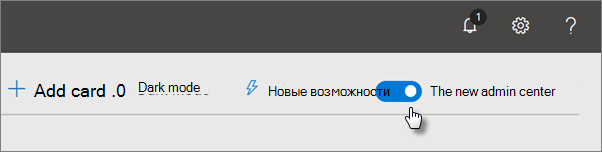
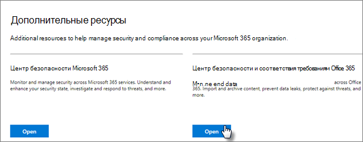
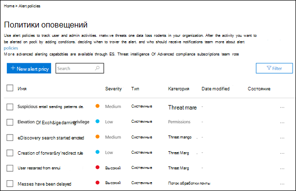
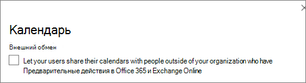
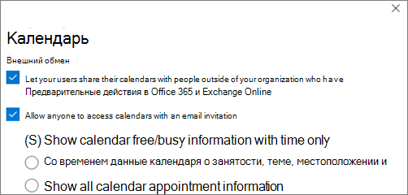

# Повышение защиты от угроз для подписки на Microsoft 365Increase threat protection for Microsoft 365 subscription

Эта статья поможет вам повысить защиту подписки Microsoft 365 от фишинга, вредоносных программ и других угроз.This article helps you increase the protection in your Microsoft 365 subscription to protect against phishing, malware, and other threats. Эти рекомендации подходят для организаций с повышенной потребностью в безопасности, таких как политические кампании, юридические офисы и учреждения здравоохранения.These recommendations are appropriate for organizations with an increased need for security, like political campaigns, law offices, and health care clinics.

Прежде чем начать, проверьте свою оценку безопасности (Майкрософт).Before you begin, check your Microsoft Secure Score. Оценка безопасности (Майкрософт) анализирует безопасность вашей организации на основе ваших обычных действий и параметров безопасности и назначает оценку.Microsoft Secure Score analyzes your organization's security based on your regular activities and security settings and assigns a score. Начните с заметок о текущей оценке.Begin by taking note of your current score. Действия, рекомендуемые в этой статье, увеличивают показатель.Taking the actions recommended in this article increases your score. Цель состоит не в достижении максимального результата, а в том, чтобы иметь возможность защитить среду, которая не отрицательно влияет на производительность пользователей.The goal isn't to achieve the max score, but to be aware of opportunities to protect your environment that don't negatively affect productivity for your users.

Дополнительные сведения см. в [оценке безопасности (Майкрософт).](https://docs.microsoft.com/microsoft-365/security/mtp/microsoft-secure-score)For more information, see [Microsoft Secure Score](https://docs.microsoft.com/microsoft-365/security/mtp/microsoft-secure-score).

## Повышение уровня защиты от вредоносных программ в почтеRaise the level of protection against malware in mail

Среда Office 365 или Microsoft 365 включает защиту от вредоносных программ, но вы можете повысить эту защиту, блокируя вложения с типами файлов, которые обычно используются для защиты от вредоносных программ.Your Office 365 or Microsoft 365 environment includes protection against malware, but you can increase this protection by blocking attachments with file types that are commonly used for malware. Для защиты от вредоносных программ в электронной почте:To bump up malware protection in email:

1. Войдите в учетную запись <https://protection.office.com> администратора и войдите в нее.Go to <https://protection.office.com> and sign in with your admin account credentials.

2. В Центре безопасности & соответствия требованиям в области навигации слева в области управления угрозами выберите **"Политика** защиты от \> **вредоносных программ".**In the Security & Compliance Center, in the left navigation pane, under **Threat management**, choose **Policy** \> **Anti-Malware**.

3. Дважды щелкните политику по умолчанию, чтобы изменить эту политику на всей компании.Double-click the default policy to edit this company-wide policy.

4. Щелкните **Настройки**.Click **Settings**.

5. В **области фильтра общих типов вложений** выберите **"В".**Under **Common Attachment Types Filter**, select **On**. Заблокированные типы файлов перечислены в окне непосредственно под этим управлением.The file types that are blocked are listed in the window directly below this control. Убедитесь, что вы добавили эти типы файлов:Make sure you add these filetypes:

   `ade, adp, ani, bas, bat, chm, cmd, com, cpl, crt, hlp, ht, hta, inf, ins, isp, job, js, jse, lnk, mda, mdb, mde, mdz, msc, msi, msp, mst, pcd, reg, scr, sct, shs, url, vb, vbe, vbs, wsc, wsf, wsh, exe, pif`

   При необходимости можно добавить или удалить типы файлов позже.You can add or delete file types later, if needed.

6. Нажмите кнопку **Сохранить**.Click **Save.**

Дополнительные сведения см. в сведениях о защите [от вредоносных программ в EOP.](https://docs.microsoft.com/microsoft-365/security/office-365-security/anti-malware-protection)For more information, see [Anti-malware protection in EOP](https://docs.microsoft.com/microsoft-365/security/office-365-security/anti-malware-protection).

## Защита от программ-шантажистовProtect against ransomware

Программа-вымогаатель ограничивает доступ к данным путем шифрования файлов или блокировки экранов компьютеров.Ransomware restricts access to data by encrypting files or locking computer screens. Затем он пытается вымогать деньги у пострадавших, запрашивая "выкуп", как правило, в виде майлипов, таких как "Заметь", в обмен на доступ к данным.It then attempts to extort money from victims by asking for "ransom," usually in the form of cryptocurrencies like Bitcoin, in exchange for access to data.

Вы можете защититься от программ-вымогателей, создав одно или несколько правил потока почты,  чтобы заблокировать расширения файлов, которые обычно используются для программ-вымогателей (они были добавлены в повышение уровня защиты от вредоносных программ на этапе почты) или предупредить пользователей, которые получают эти вложения по электронной почте.You can protect against ransomware by creating one or more mail flow rules to block file extensions that are commonly used for ransomware (these were added in the [raise the level of protection against malware in mail](#raise-the-level-of-protection-against-malware-in-mail) step), or to warn users who receive these attachments in email.

В дополнение к файлам, заблокированным на предыдущем шаге, также лучше создать правило, предупреждая пользователей перед открытием вложений Office, которые включают макрос.In addition to the files that you blocked in the previous step, it's also good practice to create a rule to warn users before opening Office file attachments that include macros. Программы-вымогатели могут быть скрыты в макросах, поэтому предупреждайте пользователей о том, что они не открывают эти файлы от людей, которых они не знают.Ransomware can be hidden inside macros, so warn users to not open these files from people they don't know.

Создание правила транспорта почты:To create a mail transport rule:

1. Перейдите в Центр администрирования Exchange и <https://admin.microsoft.com> **выберите "Центры администрирования** \> **Exchange".**Go to the admin center at <https://admin.microsoft.com> and choose **Admin centers** \> **Exchange**.

2. В категории **потока почты** щелкните **правила.**In the **mail flow** category, click **rules**.

3. Щелкните **+** и нажмите **кнопку "Создать новое правило".**Click **+**, and then click **Create a new rule**.

4. Щелкните **дополнительные** параметры в нижней части диалоговых окна, чтобы увидеть полный набор параметров.Click **More options** at the bottom of the dialog box to see the full set of options.

5. Применив параметры в следующей таблице для правила.Apply the settings in the following table for the rule. Оставьте остальные параметры по умолчанию, если вы не хотите их изменить.Leave the rest of the settings at the default, unless you want to change them.

6. Щелкните **Сохранить**.Click **Save**.

|SettingSetting|Предупреждать пользователей перед открытием вложений файлов OfficeWarn users before opening attachments of Office files|
|---|---|
|ИмяName|Правило для борьбы с программами-вымогателями: предупреждать пользователейAnti-ransomware rule: warn users|
|Применив это правило, если .Apply this rule if . .. ..|Любое вложение.Any attachment . .. .. расширение файла соответствует .file extension matches . .. ..|
|Указание слов или фразSpecify words or phrases|Добавьте эти типы файлов:Add these file types:   `dotm, docm, xlsm, sltm, xla, xlam, xll, pptm, potm, ppam, ppsm, sldm`|
|Сделайте следующее.Do the following . .. ..|Уведомление получателя сообщениемNotify the recipient with a message|
|Предоставление текста сообщенияProvide message text|Не открывай файлы этих типов от людей, которых вы не знаете, так как они могут содержать макрос с вредоносным кодом.Do not open these types of files from people you do not know because they might contain macros with malicious code.|

Дополнительные сведения см. в указанных ниже статьях.For more information, see:

- [Программы-вымогали: как снизить рискRansomware: how to reduce risk](https://www.microsoft.com/security/blog/2020/04/28/ransomware-groups-continue-to-target-healthcare-critical-services-heres-how-to-reduce-risk/)

- [Восстановление OneDriveRestore your OneDrive](https://support.microsoft.com//office/fa231298-759d-41cf-bcd0-25ac53eb8a15)

## Остановка автоматической переададки электронной почтыStop auto-forwarding for email

Злоумышленники, которые получают доступ к почтовому ящику пользователя, могут украсть вашу почту, написав в почтовом ящике параметр автоматической пересылки электронной почты.Hackers who gain access to a user's mailbox can steal your mail by setting the mailbox to automatically forward email. Это может произойти даже без осведомленности пользователя.This can happen even without the user's awareness. Это можно предотвратить, настроив правило потока почты.You can prevent this from happening by configuring a mail flow rule.

Чтобы создать правило транспорта почты, посмотрите это [короткое видео](https://support.office.com/article/f9d693ba-5c78-47c0-b156-8e461e062aa7) или выполните следующие действия:To create a mail transport rule, either watch [this short video](https://support.office.com/article/f9d693ba-5c78-47c0-b156-8e461e062aa7) or follow these steps:

1. В Центре администрирования Microsoft 365 щелкните **"Центры администрирования** \> **Exchange".**In the Microsoft 365 admin center, click **Admin centers** \> **Exchange**.

2. В категории **потока почты** щелкните **правила.**In the **mail flow** category, click **rules**.

3. Щелкните **+** и нажмите **кнопку "Создать новое правило".**Click **+**, and then click **Create a new rule**.

4. Щелкните **дополнительные** параметры в нижней части диалоговых окна, чтобы увидеть полный набор параметров.Click **More options** at the bottom of the dialog box to see the full set of options.

5. Применив параметры в следующей таблице.Apply the settings in the following table. Оставьте остальные параметры по умолчанию, если вы не хотите их изменить.Leave the rest of the settings at the default, unless you want to change them.

6. Щелкните **Сохранить**.Click **Save**.

|SettingSetting|Предупреждать пользователей перед открытием вложений файлов OfficeWarn users before opening attachments of Office files|
|---|---|
|ИмяName|Запретить автоматическую переадружение электронной почты на внешние доменыPrevent auto forwarding of email to external domains|
|Применяет это правило, если ...Apply this rule if ...|Отправитель .The sender . .. .. является внешним/внутренним.is external/internal . .. .. Внутри организацииInside the organization|
|Добавление условияAdd condition|Свойства сообщения.The message properties . .. .. включит тип сообщения.include the message type . .. .. Автоматическая переададкаAuto-forward|
|Сделайте следующее...Do the following ...|Заблокируют сообщение.Block the message . .. .. отклонить сообщение и включить объяснение.reject the message and include an explanation.|
|Предоставление текста сообщенияProvide message text|Автоматическая переадружение электронной почты за пределы этой организации запрещена из соображений безопасности.Auto-forwarding email outside this organization is prevented for security reasons.|

## Защита электронной почты от фишинговых атакProtect your email from phishing attacks

Если вы настроили один или несколько пользовательских доменов для среды Office 365 или Microsoft 365, вы можете настроить целевую защиту от фишинга.If you've configured one or more custom domains for your Office 365 or Microsoft 365 environment, you can configure targeted anti-phishing protection. Защита от фишинга , часть Microsoft Defender для Office 365, может помочь защитить вашу организацию от вредоносных фишинговых атак на основе фишинга на основе фишинга и других фишинговых атак.Anti-phishing protection, part of Microsoft Defender for Office 365, can help protect your organization from malicious impersonation-based phishing attacks and other phishing attacks. Если настраиваемый домен не настроен, это не требуется.If you haven't configured a custom domain, you don't need to do this.

Рекомендуем начать работу с этой защитой, создав политику для защиты самых важных пользователей и вашего пользовательского домена.We recommend that you get started with this protection by creating a policy to protect your most important users and your custom domain.

Чтобы создать политику защиты от фишинга в Защитнике office 365, посмотрите это короткое обучающее видео или выполните следующие действия:To create an anti-phishing policy in Defender for Office 365, watch [this short training video](https://support.office.com/article/86c425e1-1686-430a-9151-f7176cce4f2c), or complete the following steps:

1. Перейдите на сайт <https://protection.office.com>.Go to <https://protection.office.com>.

2. В Центре безопасности & соответствия требованиям в левой области навигации в **области** управления угрозами выберите **"Политика".**In the Security & Compliance Center, in the left navigation pane, under **Threat management**, choose **Policy**.

3. На странице **"Политика"** выберите **"Антифишинг"**.On the **Policy** page, choose **Anti-phishing**.

4. На странице **"Антифишинг"** выберите **+Создать.**On the **Anti-phishing** page, select **+ Create**. Запускается мастер, который по шагам определяет политику защиты от фишинга.A wizard launches that steps you through defining your anti-phishing policy.

5. Укажите имя, описание и параметры политики, как рекомендуется на приведенной ниже диаграмме.Specify the name, description, and settings for your policy as recommended in the chart below. Дополнительные сведения см. в сведениях о политике защиты от фишинга в [Параметрах Microsoft Defender для Office 365.](https://docs.microsoft.com/microsoft-365/security/office-365-security/set-up-anti-phishing-policies)For more information, see [Learn about anti-phishing policy in Microsoft Defender for Office 365 options](https://docs.microsoft.com/microsoft-365/security/office-365-security/set-up-anti-phishing-policies).

6. После просмотра параметров выберите "Создать **эту** политику" или "Сохранить". After you've reviewed your settings, choose **Create this policy** or **Save**, as appropriate.

|Параметр или параметрSetting or option|Рекомендуемый параметрRecommended setting|
|---|---|
|ИмяName|Домен и наиболее ценные сотрудникиDomain and most valuable staff|
|ОписаниеDescription|Убедитесь, что наиболее важные сотрудники и наш домен не являются подавными.Ensure most important staff and our domain are not being impersonated.|
|Добавить защищаемых пользователейAdd users to protect|Select **+ Add a condition, The recipient is**.Select **+ Add a condition, The recipient is**. Введите имена пользователей или введите электронный адрес владельцев, партнеров или кандидатов, менеджеров и других важных сотрудников.Type user names or enter the email address of the business owners, partners, or candidate, managers, and other important staff members. Вы можете добавить до 20 внутренних и внешних адресов, которые необходимо защитить от поднастояния.You can add up to 20 internal and external addresses that you want to protect from impersonation.|
|Добавить защищаемые доменыAdd domains to protect|Select **+ Add a condition, The recipient domain is**.Select **+ Add a condition, The recipient domain is**. Введите пользовательский домен, связанный с подпиской на Microsoft 365, если вы ее определили.Enter the custom domain associated with your Microsoft 365 subscription, if you defined one. Можно ввести несколько доменов.You can enter more than one domain.|
|Выберите действияChoose actions|Если сообщение отправляется ненастоящем пользователем: выберите "Перенаправление" на другой адрес электронной почты, а затем введите адрес электронной почты администратора безопасности; например, *  Алиса @contoso.com*.If email is sent by an impersonated user: Choose **Redirect message to another email address**, and then type the email address of the security administrator; for example, *Alice@contoso.com*.   Если сообщение отправляется с олицетворенного домена: выберите **Поместить сообщение в карантин**.If email is sent by an impersonated domain: Choose **Quarantine message**.|
|Аналитика почтовых ящиковMailbox intelligence|По умолчанию аналитика почтовых ящиков выбирается при создании политики защиты от фишинга.By default, mailbox intelligence is selected when you create a new anti-phishing policy. Для достижения наилучших результатов оставьте значение **Вкл.**Leave this setting **On** for best results.|
|Добавить отправителей и домены, которым можно доверятьAdd trusted senders and domains|Здесь вы можете добавить собственный домен или любые другие доверенные домены.Here you can add your own domain, or any other trusted domains.|
|Применяется кApplied to|Выберите **Домен получателя**.Select **The recipient domain is**. В разделе **Любой из этих вариантов** щелкните **Выбрать**.Under **Any of these**, select **Choose**. Выберите **+ Добавить**.Select **+ Add**. Выберите этот поле рядом с именем домена, например *contoso.   com*, в списке, а затем выберите **"Добавить".**Select the check box next to the name of the domain, for example, *contoso.com*, in the list, and then select **Add**. Нажмите кнопку **Готово**.Select **Done**.|

Дополнительные сведения см. в теме "Настройка политик защиты от фишинга [в Защитнике для Office 365".](https://docs.microsoft.com/microsoft-365/security/office-365-security/set-up-anti-phishing-policies)For more information, see [Set up anti-phishing policies in Defender for Office 365](https://docs.microsoft.com/microsoft-365/security/office-365-security/set-up-anti-phishing-policies).

## Защита от вредоносных вложений, файлов и ссылок с помощью Защитника для Office 365Protect against malicious attachments, files, and links with Defender for Office 365

Сначала убедитесь, что в Центре администрирования включена новая предварительная версия <https://admin.microsoft.com> Центра администрирования.First, make sure, in the admin center at <https://admin.microsoft.com> that you have the new admin center preview turned on. Включите выключаель рядом с текстом **"Новый Центр администрирования".**Turn on the toggle next to the text **The new admin center**.

   

Если вы еще не  видите страницу установки с карточками в клиенте, см. эти действия в Центре безопасности & соответствия требованиям.If you don't see the **Setup** page with cards in your tenant yet, see how to complete these steps in Security & Compliance Center. См. ["Настройка безопасных](#set-up-safe-attachments-in-the-security--compliance-center) вложений" в Центре безопасности & соответствия требованиям и "Настройка безопасных ссылок" в Центре безопасности [& соответствия требованиям.](#set-up-safe-links-in-the-security--compliance-center)See [Set up Safe Attachments in the Security & Compliance Center](#set-up-safe-attachments-in-the-security--compliance-center) and [Set up Safe Links in the Security & Compliance Center](#set-up-safe-links-in-the-security--compliance-center).

1. In the left nav, choose **Setup**.In the left nav, choose **Setup**.
2. На странице **"Установка"** выберите **"Просмотр** карты повышения защиты **от расширенных угроз".**On the **Setup** page, choose **View** on the **Increase protection from advanced threats** card.

   

3. На странице **"Повышение защиты от расширенных угроз"** выберите **"Начало работы".**On the **Increase protection from advanced threats** page, choose **Get started**.
4. В открываемой области выберите флажки рядом со ссылками и вложениями в электронной **почте,** сканируйте файлы в **SharePoint, OneDrive** и Teams и сканируйте ссылки в классических приложениях Office и **Office Online** в области "Проверка элементов на предмет вредоносного содержимого". On the pane that opens, select the check boxes next to **Links and attachments in email**, **Scan files in SharePoint, OneDrive, and Teams**, and **Scan links in Office desktop and Office Online apps** under **Scan items for malicious content**.

   Under **Links and attachments in email**, Type in All Users, or the specific users whose email you want scanned.Under **Links and attachments in email**, Type in All Users, or the specific users whose email you want scanned.

   

5. Выберите **"Создать политики",** чтобы включить безопасные вложения и безопасные ссылки.Choose **Create policies** to turn on Safe Attachments and Safe Links.

### Настройка безопасных вложений в Центре безопасности & соответствия требованиямSet up Safe Attachments in the Security & Compliance Center

Люди регулярно отправляют, получают и совместно получают вложения, такие как документы, презентации, электронные таблицы и другие.People regularly send, receive, and share attachments, such as documents, presentations, spreadsheets, and more. Не всегда легко определить, является ли вложение безопасным или вредоносным, просто посмотрев на сообщение электронной почты.It's not always easy to tell whether an attachment is safe or malicious just by looking at an email message. Microsoft Defender для Office 365 включает защиту безопасных вложений, но эта защита не включена по умолчанию.Microsoft Defender for Office 365 includes Safe Attachment protection, but this protection is not turned on by default. Мы рекомендуем создать новое правило, чтобы начать использовать эту защиту.We recommend that you create a new rule to begin using this protection. Эта защита распространяется на файлы в SharePoint, OneDrive и Microsoft Teams.This protection extends to files in SharePoint, OneDrive, and Microsoft Teams.

Чтобы создать политику безопасных вложений, посмотрите [это короткое](https://support.office.com/article/e7e68934-23dc-4b9c-b714-e82e27a8f8a5)видео или выполните следующие действия:To create an Safe Attachment policy, either watch [this short video](https://support.office.com/article/e7e68934-23dc-4b9c-b714-e82e27a8f8a5), or complete the following steps:

1. Войдите <https://protection.office.com> в учетную запись администратора и войдите в нее.Go to <https://protection.office.com> and sign in with your admin account.

2. В Центре безопасности & соответствия требованиям в левой области навигации в **области** управления угрозами выберите **"Политика".**In the Security & Compliance Center, in the left navigation pane, under **Threat management**, choose **Policy**.

3. На странице "Политика" выберите **"Безопасные вложения".**On the Policy page, choose **Safe Attachments**.

4. На странице "Безопасные вложения" широко применив эту защиту, включив ATP для **SharePoint, OneDrive** и Microsoft Teams.On the Safe attachments page, apply this protection broadly by selecting the **Turn on ATP for SharePoint, OneDrive, and Microsoft Teams** check box.

5. Выберите, **+** чтобы создать новую политику.Select **+** to create a new policy.

6. Применив параметры в следующей таблице.Apply the settings in the following table.

7. После просмотра параметров выберите "Создать  **эту политику"** или "Сохранить".After you review your settings, choose **Create this policy** or **Save**, as appropriate.

|Параметр или параметрSetting or option|Рекомендуемый параметрRecommended setting|
|---|---|
|ИмяName|Блокировать текущие и будущие сообщения электронной почты с обнаруженными вредоносными программами.Block current and future emails with detected malware.|
|ОписаниеDescription|Блокировать текущие и будущие сообщения электронной почты и вложения с обнаруженными вредоносными программами.Block current and future emails and attachments with detected malware.|
|Сохранение неизвестных ответов на вредоносные программы для вложенийSave attachments unknown malware response|Select **Block - Block the current and future emails and attachments with detected malware**.Select **Block - Block the current and future emails and attachments with detected malware**.|
|Перенаправление вложения при обнаруженииRedirect attachment on detection|Включить перенаправление (выберите это поле)Enable redirection (select this box)   Введите учетную запись администратора или настройку почтового ящика для карантина.Enter the admin account or a mailbox setup for quarantine.   Применив вышеуказанное выделение, если время проверки на вредоносные программы для вложений не превышает времени или возникает ошибка (выберите это поле).Apply the above selection if malware scanning for attachments times out or error occurs (select this box).|
|Применяется кApplied to|Домен получателя: .The recipient domain is . .. .. выберите свой домен.select your domain.|

Дополнительные сведения см. в теме "Настройка политик защиты от фишинга [в Защитнике для Office 365".](https://docs.microsoft.com/microsoft-365/security/office-365-security/set-up-anti-phishing-policies)For more information, see [Set up anti-phishing policies in Defender for Office 365](https://docs.microsoft.com/microsoft-365/security/office-365-security/set-up-anti-phishing-policies).

### Настройка безопасных ссылок в Центре безопасности & соответствия требованиямSet up Safe Links in the Security & Compliance Center

Злоумышленники иногда скрывают вредоносные веб-сайты по ссылкам в электронной почте или других файлах.Hackers sometimes hide malicious websites in links in email or other files. Безопасные ссылки, которые являются частью Microsoft Defender для Office 365, могут помочь защитить организацию, предоставив проверку url-адресов (URL-адресов) в электронных сообщениях и документах Office.Safe Links, part of Microsoft Defender for Office 365, can help protect your organization by providing time-of-click verification of web addresses (URLs) in email messages and Office documents. Защита определяется с помощью политик безопасных ссылок.Protection is defined through Safe Links policies.

Рекомендуется сделать следующее:We recommend that you do the following:

- Измените политику по умолчанию, чтобы повысить уровень защиты.Modify the default policy to increase protection.

- Добавьте новую политику, ориентированную на всех получателей в вашем домене.Add a new policy targeted to all recipients in your domain.

Чтобы настроить безопасные ссылки, посмотрите [это короткое](https://support.office.com/article/61492713-53c2-47da-a6e7-fa97479e97fa)обучающее видео или выполните следующие действия:To set up Safe Links, watch [this short training video](https://support.office.com/article/61492713-53c2-47da-a6e7-fa97479e97fa), or complete the following steps:

1. Войдите <https://protection.office.com> в учетную запись администратора и войдите в нее.Go to <https://protection.office.com> and sign in with your admin account.

2. В Центре безопасности & соответствия требованиям в левой области навигации в **области** управления угрозами выберите **"Политика".**In the Security & Compliance Center, in the left navigation pane, under **Threat management**, choose **Policy**.

3. На странице "Политика" выберите **"Безопасные ссылки".**On the Policy page, choose **Safe Links**.

Изменение политики по умолчанию:To modify the default policy:

1. На странице "Безопасные ссылки" в области **"Политики",** которые применяются для всей организации, выберите политику **по** умолчанию.On the Safe links page, under **Policies that apply to the entire organization**, select the **Default** policy.

2. В **параметрах, которые применяются к содержимому,** кроме электронной почты, выберите **приложения Microsoft 365 для предприятий, Office для iOS и Android.**Under **Settings that apply to content except email**, select **Microsoft 365 Apps for enterprise, Office for iOS and Android**.

3. Щелкните **Сохранить**.Click **Save**.

Чтобы создать новую политику, ориентированную на всех получателей в вашем домене:To create a new policy targeted to all recipients in your domain:

1. На странице "Безопасные ссылки" в области "Политики", которые применяются для всей организации, щелкните, **+** чтобы создать новую политику.On the Safe links page, under **Policies that apply to the entire organization**, click **+** to create a new policy.

2. Применив параметры, указанные в следующей таблице.Apply the settings listed in the following table.

3. Щелкните **Сохранить**.Click **Save**.

|Параметр или параметрSetting or option|Рекомендуемый параметрRecommended setting|
|---|---|
|ИмяName|Политика безопасных ссылок для всех получателей в доменеSafe links policy for all recipients in the domain|
|Выберите действие для неизвестных потенциально вредоносных URL-адресов в сообщенияхSelect the action for unknown potentially malicious URLs in messages|Выберите **"В сети" URL-адреса** будут перезаписаны и проверены на наличие списка известных вредоносных ссылок, когда пользователь щелкает ссылку.Select **On - URLs will be rewritten and checked against a list of known malicious links when user clicks on the link**.|
|Использование безопасных вложений для проверки загружаемого содержимогоUse Safe Attachments to scan downloadable content|Выберите это поле.Select this box.|
|Применяется кApplied to|Домен получателя: .The recipient domain is . .. .. выберите свой домен.select your domain.|

Дополнительные сведения [см. в "Безопасных ссылках" в Защитнике Office 365.](https://docs.microsoft.com/microsoft-365/security/office-365-security/atp-safe-links)For more information, see [Safe Links in Defender for Office 365](https://docs.microsoft.com/microsoft-365/security/office-365-security/atp-safe-links).

## Включить единый журнал аудитаTurn on the Unified Audit Log

После того как вы включите поиск в журнале аудита в Центре безопасности & соответствия требованиям, вы сможете сохранить в журнале действия администратора и других пользователей и найти его.After you turn on the audit log search in the Security & Compliance Center, you can retain the admin and other user activity in the log and search it.

Чтобы включить или отключить поиск в журнале аудита в подписке На Microsoft 365, вам должна быть назначена роль журналов аудита в Exchange Online.You must be assigned the Audit Logs role in Exchange Online to turn audit log search on or off in your Microsoft 365 subscription. По умолчанию эта роль назначена группам ролей "Управление соответствием требованиям" и "Управление организацией" на странице "Разрешения" в Центре администрирования Exchange.By default, this role is assigned to the Compliance Management and Organization Management role groups on the Permissions page in the Exchange admin center. Глобальные администраторы в Microsoft 365 по умолчанию являются членами этой группы.Global admins in Microsoft 365 are members of this group by default.

1. Чтобы включить поиск в журнале аудита, перейдите в Центр администрирования и выберите пункт "Безопасность" в центре администрирования <https://admin.microsoft.com> в левой области.  To turn on the audit log search, go to the admin center at <https://admin.microsoft.com> and then choose **Security** under **Admin centers** in the left nav.
2. На странице **"Безопасность Microsoft 365"** выберите  "Дополнительные ресурсы", а затем откройте карточку Центра безопасности и соответствия & Office **365.**On the **Microsoft 365 Security** page, choose **More resources**, and then **Open** on the **Office 365 Security & Compliance Center** card.

    
3. На странице "Безопасность и соответствие требованиям" выберите **"Поиск** и поиск **в журнале аудита".**On the security and compliance page, choose **Search** and then **Audit log search**.
4. В верхней части страницы поиска **журнала аудита** выберите **"Включить аудит".**On the top of the **Audit log search** page, choose **Turn on auditing**.

После того как функция включена, вы можете искать файлы, папки и множество действий.After the feature is turned on, you can search for files, folders, and many activities. Дополнительные сведения [см. в журнале аудита.](https://docs.microsoft.com/microsoft-365/compliance/search-the-audit-log-in-security-and-compliance)For more information, see [search the audit log](https://docs.microsoft.com/microsoft-365/compliance/search-the-audit-log-in-security-and-compliance).

## Настройка параметров анонимного общего доступа для файлов и папок SharePoint и OneDriveTune-up anonymous sharing settings for SharePoint and OneDrive files and folders

(измените срок действия анонимных ссылок по умолчанию на 14 дней, измените тип общего доступа по умолчанию на "Определенные люди") Чтобы изменить параметры общего доступа для OneDrive и SharePoint:(change default anonymous link expiration to 14 days, change default sharing type to "Specific People") To change the sharing settings for OneDrive and SharePoint:

1. Go to the admin center at <https://admin.microsoft.com> and then choose **SharePoint** under **Admin centers** in the left nav.Go to the admin center at <https://admin.microsoft.com> and then choose **SharePoint** under **Admin centers** in the left nav.
2. В Центре администрирования SharePoint перейдите к разделу **"Общий доступ к** \> **политикам".**In the SharePoint admin center, go to **Policies** \> **Sharing**.
3. На  странице "Общий доступ" в разделе "Ссылки на файлы и папки" выберите "Конкретные люди" и в разделе "Дополнительные параметры" для ссылок **"Любой человек"** выберите "Эти ссылки должны истечь в течение этого количества дней" и введите 14 (или другое число дней, на которые вы хотите ограничить срок действия ссылки).On the **Sharing** page, under **File and folder links**, select **Specific people**, and under **Advanced settings for "Anyone" links**, select **These links must expire within this many days**, and type in 14 (or another number of days you want to restrict the link lifetime to).

   

## Оповещения об активностиActivity alerts

Оповещения об активности можно использовать для отслеживания действий администратора и пользователя, а также обнаружения инцидентов защиты от вредоносных программ и потери данных в организации.You can use activity alerts to track admin and user activities and detect malware and data loss prevention incidents in your organization. Ваша подписка включает набор политик по умолчанию, но вы также можете создавать настраиваемые политики.Your subscription includes a set of default policies, but you can also create custom ones. Дополнительные сведения [см. в политиках оповещений.](https://docs.microsoft.com/microsoft-365/compliance/alert-policies)For more information, see [alert policies](https://docs.microsoft.com/microsoft-365/compliance/alert-policies). Например, если вы сохраняете важный файл в SharePoint, который никто не должен делиться внешними данными, вы можете создать уведомление с предупреждением о том, что кто-то поделитесь им.For example, if you store an important file in SharePoint that you don't want anyone to share externally, you can create a notification that alerts you if someone does share it.

На следующем рисунке показаны политики по умолчанию, включенные в Microsoft 365.The following figure shows the default policies that are included with Microsoft 365.

## Отключение общего доступа к календарю или управление имDisable or manage calendar sharing

Вы можете запретить людям в вашей организации делиться своими календарями или управлять тем, что они могут делиться.You can prevent people in your organization from sharing their calendars, or you can also manage what they can share. Например, можно ограничить общий доступ только временем занятости.For example, you can restrict the sharing to free/busy times only.

1. Перейдите в Центр администрирования и <https://admin.microsoft.com> выберите **"Параметры** \> **организации"**.Go to the admin center at <https://admin.microsoft.com> and choose **Settings** \> **Org Settings**.
2. На странице **"Службы"** выберите "Календарь" и выберите, могут ли люди в вашей организации делиться своими календарями с людьми за пределами Office 365 или Exchange, а также с любыми людьми. On the **Services** page, choose **Calendar**, and choose whether people in your organization can share their calendars with people outside who have Office 365 or Exchange, or with anyone.

   Если вы выберете вариант "Поделиться с кем-либо", вы также можете поделиться сведениями о занятости.If you choose the share with anyone option, you can decide to also only share free/busy information.

3. Выберите **"Сохранить изменения"** в нижней части страницы.Choose **Save changes** on the bottom of the page.

   На следующем рисунке показано, что общий доступ к календарю запрещен.The following figure shows calendar sharing not allowed.

   

   На следующем рисунке показаны параметры, когда разрешен общий доступ к календарю с помощью ссылки электронной почты только со сведениями о занятости.The following figure shows the settings when calendar sharing is allowed with an email link with only free/busy information.

   

Если вашим пользователям разрешено делиться  своими календарями, см. эти инструкции по совместному доступу из Outlook в Интернете.If your users are allowed to share their calendars, see [these instructions](https://support.office.com/article/7ecef8ae-139c-40d9-bae2-a23977ee58d5) for how to share from Outlook on the web.
