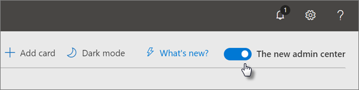

# Повышение защиты от угроз для подписки на Microsoft 365

Эта статья поможет вам повысить защиту подписки Microsoft 365 от фишинга, вредоносных программ и других угроз. Эти рекомендации подходят для организаций с повышенной потребностью в безопасности, таких как политические кампании, юридические офисы и учреждения здравоохранения.

Прежде чем начать, проверьте свою оценку безопасности (Майкрософт). Оценка безопасности (Майкрософт) анализирует безопасность вашей организации на основе ваших обычных действий и параметров безопасности и назначает оценку. Начните с заметок о текущей оценке. Действия, рекомендуемые в этой статье, увеличивают показатель. Цель состоит не в достижении максимального результата, а в том, чтобы иметь возможность защитить среду, которая не отрицательно влияет на производительность пользователей.

Дополнительные сведения см. в [оценке безопасности (Майкрософт).](https://docs.microsoft.com/microsoft-365/security/mtp/microsoft-secure-score)

## Повышение уровня защиты от вредоносных программ в почте

Среда Office 365 или Microsoft 365 включает защиту от вредоносных программ, но вы можете повысить эту защиту, блокируя вложения с типами файлов, которые обычно используются для защиты от вредоносных программ. Для защиты от вредоносных программ в электронной почте:

1. Войдите в учетную запись <https://protection.office.com> администратора и войдите в нее.

2. В Центре безопасности & соответствия требованиям в области навигации слева в области управления угрозами выберите **"Политика** защиты от \> **вредоносных программ".**

3. Дважды щелкните политику по умолчанию, чтобы изменить эту политику на всей компании.

4. Щелкните **Настройки**.

5. В **области фильтра общих типов вложений** выберите **"В".** Заблокированные типы файлов перечислены в окне непосредственно под этим управлением. Убедитесь, что вы добавили эти типы файлов:

   `ade, adp, ani, bas, bat, chm, cmd, com, cpl, crt, hlp, ht, hta, inf, ins, isp, job, js, jse, lnk, mda, mdb, mde, mdz, msc, msi, msp, mst, pcd, reg, scr, sct, shs, url, vb, vbe, vbs, wsc, wsf, wsh, exe, pif`

   При необходимости можно добавить или удалить типы файлов позже.

6. Нажмите кнопку **Сохранить**.

Дополнительные сведения см. в сведениях о защите [от вредоносных программ в EOP.](https://docs.microsoft.com/microsoft-365/security/office-365-security/anti-malware-protection)

## Защита от программ-шантажистов

Программа-вымогаатель ограничивает доступ к данным путем шифрования файлов или блокировки экранов компьютеров. Затем он пытается вымогать деньги у пострадавших, запрашивая "выкуп", как правило, в виде майлипов, таких как "Заметь", в обмен на доступ к данным.

Вы можете защититься от программ-вымогателей, создав одно или несколько правил потока почты,  чтобы заблокировать расширения файлов, которые обычно используются для программ-вымогателей (они были добавлены в повышение уровня защиты от вредоносных программ на этапе почты) или предупредить пользователей, которые получают эти вложения по электронной почте.

В дополнение к файлам, заблокированным на предыдущем шаге, также лучше создать правило, предупреждая пользователей перед открытием вложений Office, которые включают макрос. Программы-вымогатели могут быть скрыты в макросах, поэтому предупреждайте пользователей о том, что они не открывают эти файлы от людей, которых они не знают.

Создание правила транспорта почты:

1. Перейдите в Центр администрирования Exchange и <https://admin.microsoft.com> **выберите "Центры администрирования** \> **Exchange".**

2. В категории **потока почты** щелкните **правила.**

3. Щелкните **+** и нажмите **кнопку "Создать новое правило".**

4. Щелкните **дополнительные** параметры в нижней части диалоговых окна, чтобы увидеть полный набор параметров.

5. Применив параметры в следующей таблице для правила. Оставьте остальные параметры по умолчанию, если вы не хотите их изменить.

6. Щелкните **Сохранить**.

|Setting|Предупреждать пользователей перед открытием вложений файлов Office|
|---|---|
|Имя|Правило для борьбы с программами-вымогателями: предупреждать пользователей|
|Применив это правило, если . . .|Любое вложение. . . расширение файла соответствует . . .|
|Указание слов или фраз|Добавьте эти типы файлов:   `dotm, docm, xlsm, sltm, xla, xlam, xll, pptm, potm, ppam, ppsm, sldm`|
|Сделайте следующее. . .|Уведомление получателя сообщением|
|Предоставление текста сообщения|Не открывай файлы этих типов от людей, которых вы не знаете, так как они могут содержать макрос с вредоносным кодом.|

Дополнительные сведения см. в указанных ниже статьях.

- [Программы-вымогали: как снизить риск](https://www.microsoft.com/security/blog/2020/04/28/ransomware-groups-continue-to-target-healthcare-critical-services-heres-how-to-reduce-risk/)

- [Восстановление OneDrive](https://support.microsoft.com//office/fa231298-759d-41cf-bcd0-25ac53eb8a15)

## Остановка автоматической переададки электронной почты

Злоумышленники, которые получают доступ к почтовому ящику пользователя, могут украсть вашу почту, написав в почтовом ящике параметр автоматической пересылки электронной почты. Это может произойти даже без осведомленности пользователя. Это можно предотвратить, настроив правило потока почты.

Чтобы создать правило транспорта почты, посмотрите это [короткое видео](https://support.office.com/article/f9d693ba-5c78-47c0-b156-8e461e062aa7) или выполните следующие действия:

1. В Центре администрирования Microsoft 365 щелкните **"Центры администрирования** \> **Exchange".**

2. В категории **потока почты** щелкните **правила.**

3. Щелкните **+** и нажмите **кнопку "Создать новое правило".**

4. Щелкните **дополнительные** параметры в нижней части диалоговых окна, чтобы увидеть полный набор параметров.

5. Применив параметры в следующей таблице. Оставьте остальные параметры по умолчанию, если вы не хотите их изменить.

6. Щелкните **Сохранить**.

|Setting|Предупреждать пользователей перед открытием вложений файлов Office|
|---|---|
|Имя|Запретить автоматическую переадружение электронной почты на внешние домены|
|Применяет это правило, если ...|Отправитель . . . является внешним/внутренним. . . Внутри организации|
|Добавление условия|Свойства сообщения. . . включит тип сообщения. . . Автоматическая переададка|
|Сделайте следующее...|Заблокируют сообщение. . . отклонить сообщение и включить объяснение.|
|Предоставление текста сообщения|Автоматическая переадружение электронной почты за пределы этой организации запрещена из соображений безопасности.|

## Защита электронной почты от фишинговых атак

Если вы настроили один или несколько пользовательских доменов для среды Office 365 или Microsoft 365, вы можете настроить целевую защиту от фишинга. Защита от фишинга , часть Microsoft Defender для Office 365, может помочь защитить вашу организацию от вредоносных фишинговых атак на основе фишинга на основе фишинга и других фишинговых атак. Если настраиваемый домен не настроен, это не требуется.

Рекомендуем начать работу с этой защитой, создав политику для защиты самых важных пользователей и вашего пользовательского домена.

Чтобы создать политику защиты от фишинга в Защитнике office 365, посмотрите это короткое обучающее видео или выполните следующие действия:

1. Перейдите на сайт <https://protection.office.com>.

2. В Центре безопасности & соответствия требованиям в левой области навигации в **области** управления угрозами выберите **"Политика".**

3. На странице **"Политика"** выберите **"Антифишинг"**.

4. На странице **"Антифишинг"** выберите **+Создать.** Запускается мастер, который по шагам определяет политику защиты от фишинга.

5. Укажите имя, описание и параметры политики, как рекомендуется на приведенной ниже диаграмме. Дополнительные сведения см. в сведениях о политике защиты от фишинга в [Параметрах Microsoft Defender для Office 365.](https://docs.microsoft.com/microsoft-365/security/office-365-security/set-up-anti-phishing-policies)

6. После просмотра параметров выберите "Создать **эту** политику" или "Сохранить". 

|Параметр или параметр|Рекомендуемый параметр|
|---|---|
|Имя|Домен и наиболее ценные сотрудники|
|Описание|Убедитесь, что наиболее важные сотрудники и наш домен не являются подавными.|
|Добавить защищаемых пользователей|Select **+ Add a condition, The recipient is**. Введите имена пользователей или введите электронный адрес владельцев, партнеров или кандидатов, менеджеров и других важных сотрудников. Вы можете добавить до 20 внутренних и внешних адресов, которые необходимо защитить от поднастояния.|
|Добавить защищаемые домены|Select **+ Add a condition, The recipient domain is**. Введите пользовательский домен, связанный с подпиской на Microsoft 365, если вы ее определили. Можно ввести несколько доменов.|
|Выберите действия|Если сообщение отправляется ненастоящем пользователем: выберите "Перенаправление" на другой адрес электронной почты, а затем введите адрес электронной почты администратора безопасности; например, *  Алиса @contoso.com*.   Если сообщение отправляется с олицетворенного домена: выберите **Поместить сообщение в карантин**.|
|Аналитика почтовых ящиков|По умолчанию аналитика почтовых ящиков выбирается при создании политики защиты от фишинга. Для достижения наилучших результатов оставьте значение **Вкл.**|
|Добавить отправителей и домены, которым можно доверять|Здесь вы можете добавить собственный домен или любые другие доверенные домены.|
|Применяется к|Выберите **Домен получателя**. В разделе **Любой из этих вариантов** щелкните **Выбрать**. Выберите **+ Добавить**. Выберите этот поле рядом с именем домена, например *contoso.   com*, в списке, а затем выберите **"Добавить".** Нажмите кнопку **Готово**.|

Дополнительные сведения см. в теме "Настройка политик защиты от фишинга [в Защитнике для Office 365".](https://docs.microsoft.com/microsoft-365/security/office-365-security/set-up-anti-phishing-policies)

## Защита от вредоносных вложений, файлов и ссылок с помощью Защитника для Office 365

Сначала убедитесь, что в Центре администрирования включена новая предварительная версия <https://admin.microsoft.com> Центра администрирования. Включите выключаель рядом с текстом **"Новый Центр администрирования".**

   

Если вы еще не  видите страницу установки с карточками в клиенте, см. эти действия в Центре безопасности & соответствия требованиям. См. ["Настройка безопасных](#set-up-safe-attachments-in-the-security--compliance-center) вложений" в Центре безопасности & соответствия требованиям и "Настройка безопасных ссылок" в Центре безопасности [& соответствия требованиям.](#set-up-safe-links-in-the-security--compliance-center)

1. In the left nav, choose **Setup**.
2. На странице **"Установка"** выберите **"Просмотр** карты повышения защиты **от расширенных угроз".**

   

3. На странице **"Повышение защиты от расширенных угроз"** выберите **"Начало работы".**
4. В открываемой области выберите флажки рядом со ссылками и вложениями в электронной **почте,** сканируйте файлы в **SharePoint, OneDrive** и Teams и сканируйте ссылки в классических приложениях Office и **Office Online** в области "Проверка элементов на предмет вредоносного содержимого". 

   Under **Links and attachments in email**, Type in All Users, or the specific users whose email you want scanned.

   

5. Выберите **"Создать политики",** чтобы включить безопасные вложения и безопасные ссылки.

### Настройка безопасных вложений в Центре безопасности & соответствия требованиям

Люди регулярно отправляют, получают и совместно получают вложения, такие как документы, презентации, электронные таблицы и другие. Не всегда легко определить, является ли вложение безопасным или вредоносным, просто посмотрев на сообщение электронной почты. Microsoft Defender для Office 365 включает защиту безопасных вложений, но эта защита не включена по умолчанию. Мы рекомендуем создать новое правило, чтобы начать использовать эту защиту. Эта защита распространяется на файлы в SharePoint, OneDrive и Microsoft Teams.

Чтобы создать политику безопасных вложений, посмотрите [это короткое](https://support.office.com/article/e7e68934-23dc-4b9c-b714-e82e27a8f8a5)видео или выполните следующие действия:

1. Войдите <https://protection.office.com> в учетную запись администратора и войдите в нее.

2. В Центре безопасности & соответствия требованиям в левой области навигации в **области** управления угрозами выберите **"Политика".**

3. На странице "Политика" выберите **"Безопасные вложения".**

4. На странице "Безопасные вложения" широко применив эту защиту, включив ATP для **SharePoint, OneDrive** и Microsoft Teams.

5. Выберите, **+** чтобы создать новую политику.

6. Применив параметры в следующей таблице.

7. После просмотра параметров выберите "Создать  **эту политику"** или "Сохранить".

|Параметр или параметр|Рекомендуемый параметр|
|---|---|
|Имя|Блокировать текущие и будущие сообщения электронной почты с обнаруженными вредоносными программами.|
|Описание|Блокировать текущие и будущие сообщения электронной почты и вложения с обнаруженными вредоносными программами.|
|Сохранение неизвестных ответов на вредоносные программы для вложений|Select **Block - Block the current and future emails and attachments with detected malware**.|
|Перенаправление вложения при обнаружении|Включить перенаправление (выберите это поле)   Введите учетную запись администратора или настройку почтового ящика для карантина.   Применив вышеуказанное выделение, если время проверки на вредоносные программы для вложений не превышает времени или возникает ошибка (выберите это поле).|
|Применяется к|Домен получателя: . . . выберите свой домен.|

Дополнительные сведения см. в теме "Настройка политик защиты от фишинга [в Защитнике для Office 365".](https://docs.microsoft.com/microsoft-365/security/office-365-security/set-up-anti-phishing-policies)

### Настройка безопасных ссылок в Центре безопасности & соответствия требованиям

Злоумышленники иногда скрывают вредоносные веб-сайты по ссылкам в электронной почте или других файлах. Безопасные ссылки, которые являются частью Microsoft Defender для Office 365, могут помочь защитить организацию, предоставив проверку url-адресов (URL-адресов) в электронных сообщениях и документах Office. Защита определяется с помощью политик безопасных ссылок.

Рекомендуется сделать следующее:

- Измените политику по умолчанию, чтобы повысить уровень защиты.

- Добавьте новую политику, ориентированную на всех получателей в вашем домене.

Чтобы настроить безопасные ссылки, посмотрите [это короткое](https://support.office.com/article/61492713-53c2-47da-a6e7-fa97479e97fa)обучающее видео или выполните следующие действия:

1. Войдите <https://protection.office.com> в учетную запись администратора и войдите в нее.

2. В Центре безопасности & соответствия требованиям в левой области навигации в **области** управления угрозами выберите **"Политика".**

3. На странице "Политика" выберите **"Безопасные ссылки".**

Изменение политики по умолчанию:

1. На странице "Безопасные ссылки" в области **"Политики",** которые применяются для всей организации, выберите политику **по** умолчанию.

2. В **параметрах, которые применяются к содержимому,** кроме электронной почты, выберите **приложения Microsoft 365 для предприятий, Office для iOS и Android.**

3. Щелкните **Сохранить**.

Чтобы создать новую политику, ориентированную на всех получателей в вашем домене:

1. На странице "Безопасные ссылки" в области "Политики", которые применяются для всей организации, щелкните, **+** чтобы создать новую политику.

2. Применив параметры, указанные в следующей таблице.

3. Щелкните **Сохранить**.

|Параметр или параметр|Рекомендуемый параметр|
|---|---|
|Имя|Политика безопасных ссылок для всех получателей в домене|
|Выберите действие для неизвестных потенциально вредоносных URL-адресов в сообщениях|Выберите **"В сети" URL-адреса** будут перезаписаны и проверены на наличие списка известных вредоносных ссылок, когда пользователь щелкает ссылку.|
|Использование безопасных вложений для проверки загружаемого содержимого|Выберите это поле.|
|Применяется к|Домен получателя: . . . выберите свой домен.|

Дополнительные сведения [см. в "Безопасных ссылках" в Защитнике Office 365.](https://docs.microsoft.com/microsoft-365/security/office-365-security/atp-safe-links)

## Включить единый журнал аудита

После того как вы включите поиск в журнале аудита в Центре безопасности & соответствия требованиям, вы сможете сохранить в журнале действия администратора и других пользователей и найти его.

Чтобы включить или отключить поиск в журнале аудита в подписке На Microsoft 365, вам должна быть назначена роль журналов аудита в Exchange Online. По умолчанию эта роль назначена группам ролей "Управление соответствием требованиям" и "Управление организацией" на странице "Разрешения" в Центре администрирования Exchange. Глобальные администраторы в Microsoft 365 по умолчанию являются членами этой группы.

1. Чтобы включить поиск в журнале аудита, перейдите в Центр администрирования и выберите пункт "Безопасность" в центре администрирования <https://admin.microsoft.com> в левой области.  
2. На странице **"Безопасность Microsoft 365"** выберите  "Дополнительные ресурсы", а затем откройте карточку Центра безопасности и соответствия & Office **365.**

    
3. На странице "Безопасность и соответствие требованиям" выберите **"Поиск** и поиск **в журнале аудита".**
4. В верхней части страницы поиска **журнала аудита** выберите **"Включить аудит".**

После того как функция включена, вы можете искать файлы, папки и множество действий. Дополнительные сведения [см. в журнале аудита.](https://docs.microsoft.com/microsoft-365/compliance/search-the-audit-log-in-security-and-compliance)

## Настройка параметров анонимного общего доступа для файлов и папок SharePoint и OneDrive

(измените срок действия анонимных ссылок по умолчанию на 14 дней, измените тип общего доступа по умолчанию на "Определенные люди") Чтобы изменить параметры общего доступа для OneDrive и SharePoint:

1. Go to the admin center at <https://admin.microsoft.com> and then choose **SharePoint** under **Admin centers** in the left nav.
2. В Центре администрирования SharePoint перейдите к разделу **"Общий доступ к** \> **политикам".**
3. На  странице "Общий доступ" в разделе "Ссылки на файлы и папки" выберите "Конкретные люди" и в разделе "Дополнительные параметры" для ссылок **"Любой человек"** выберите "Эти ссылки должны истечь в течение этого количества дней" и введите 14 (или другое число дней, на которые вы хотите ограничить срок действия ссылки).

   

## Оповещения об активности

Оповещения об активности можно использовать для отслеживания действий администратора и пользователя, а также обнаружения инцидентов защиты от вредоносных программ и потери данных в организации. Ваша подписка включает набор политик по умолчанию, но вы также можете создавать настраиваемые политики. Дополнительные сведения [см. в политиках оповещений.](https://docs.microsoft.com/microsoft-365/compliance/alert-policies) Например, если вы сохраняете важный файл в SharePoint, который никто не должен делиться внешними данными, вы можете создать уведомление с предупреждением о том, что кто-то поделитесь им.

На следующем рисунке показаны политики по умолчанию, включенные в Microsoft 365.

## Отключение общего доступа к календарю или управление им

Вы можете запретить людям в вашей организации делиться своими календарями или управлять тем, что они могут делиться. Например, можно ограничить общий доступ только временем занятости.

1. Перейдите в Центр администрирования и <https://admin.microsoft.com> выберите **"Параметры** \> **организации"**.
2. На странице **"Службы"** выберите "Календарь" и выберите, могут ли люди в вашей организации делиться своими календарями с людьми за пределами Office 365 или Exchange, а также с любыми людьми. 

   Если вы выберете вариант "Поделиться с кем-либо", вы также можете поделиться сведениями о занятости.

3. Выберите **"Сохранить изменения"** в нижней части страницы.

   На следующем рисунке показано, что общий доступ к календарю запрещен.

   

   На следующем рисунке показаны параметры, когда разрешен общий доступ к календарю с помощью ссылки электронной почты только со сведениями о занятости.

   

Если вашим пользователям разрешено делиться  своими календарями, см. эти инструкции по совместному доступу из Outlook в Интернете.
