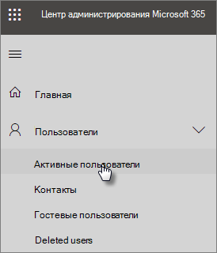
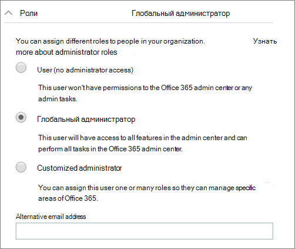

# Защита учетных записей администраторов

Поскольку учетные записи администраторов имеют повышенные привилегии, они являются ценными целями для злоумышленников и киберпреступных. В этой статье описываются:

- Настройка дополнительной учетной записи администратора для экстренных ситуаций.
- Как защитить эти учетные записи.

Когда вы зарегистрируетсяе в Microsoft 365 и введите свою информацию, вы автоматически станете глобальным администратором. Глобальный администратор полностью контролирует учетные записи пользователей и все остальные параметры в Центре администрирования Майкрософт, но существует множество различных типов учетных записей администраторов с различной степенью доступа. Сведения [о различных уровнях](https://docs.microsoft.com/office365/admin/add-users/about-admin-roles) доступа для каждой роли администратора см. в сведениях о ролях администраторов.

## Создание дополнительных учетных записей администраторов

Используйте учетные записи администратора только для администрирования. Администраторы должны иметь отдельную учетную запись пользователя для регулярного использования приложений Office и использовать административную учетную запись только при необходимости для управления учетными записями и устройствами, а также при работе с другими функциями администратора. Кроме того, имеется хорошая идея удалить лицензию Microsoft 365 из учетных записей администраторов, чтобы вам не нужно было платить за них.

Вам необходимо настроить по крайней мере одну дополнительную учетную запись глобального администратора, чтобы предоставить администратору доступ другому надежному сотруднику. Вы также можете создать отдельные учетные записи администраторов для управления пользователями (эта роль называется **администратором управления пользователями).** Дополнительные сведения см. [в сведениях о ролях администраторов.](https://docs.microsoft.com/office365/admin/add-users/about-admin-roles)

Чтобы создать дополнительные учетные записи администраторов:

 1. Перейдите в <a href="https://go.microsoft.com/fwlink/p/?linkid=837890" target="_blank">Центр администрирования и</a> выберите **"Активные** \> **пользователи" в** левой области.

    

 2. На странице **"Активные пользователи"** выберите "Добавить пользователя" в  верхней части страницы, а на панели "Новый пользователь" введите имя и другие сведения. 
 3. **Разоберем** раздел "Роли" и выберите **"Глобальный администратор",** чтобы предоставить этому пользователю доступ глобального администратора. Можно также выбрать **настраиваемого администратора** и выбрать любую из отображаемых ролей.

    Введите альтернативное сообщение электронной почты в **текстовом поле "Альтернативный адрес электронной** почты". Этот адрес можно использовать для восстановления данных пароля в случае блокировки. Для глобальных администраторов на этот адрес также будет отправлена выписка по счету.

    

 4. В разделе **"Лицензии** на продукты" переместим селектор  **для Microsoft 365 бизнес** в выключенный и "Создать пользователя **без** лицензии на продукт" в **"Включите"**.

    

## Создание учетной записи администратора экстренных служб

Кроме того, следует создать резервную учетную запись, которая не настроена для многофакторной проверки подлинности (MFA), чтобы случайно не заблокировать себя (например, если вы теряете телефон, который используется в качестве второй формы проверки подлинности). Убедитесь, что пароль для этой учетной записи является фразой или длиной не менее 16 символов. Это часто называется "учетной записью для взлома".

## Создание учетной записи пользователя для себя

Используйте свою учетную запись пользователя для участия в совместной работе с организацией, включая проверку почты. Это означает, что учетные данные администратора могут быть похожи на *Alice.Chavez  @Contoso.org,* а обычная учетная запись пользователя может быть похожа на * Алису @Contoso.com.*

Чтобы создать новую учетную запись пользователя:

1. Перейдите в <a href="https://go.microsoft.com/fwlink/p/?linkid=837890" target="_blank">Центр администрирования и</a> выберите **"Активные** \> **пользователи" в** левой области.
2. На странице **"Активные пользователи"** выберите "Добавить пользователя" в  верхней части страницы, а на панели "Новый пользователь" введите имя и другие сведения. 
3. Раз expand the **Roles** section, and choose **User (no administrative access)**.
4. В разделе **"Лицензии на** продукты" переместим селектор **для Microsoft 365 бизнес** в **"Ветвь".**

## Регистрация каждой из этих учетных записей для многофакторной проверки подлинности

Убедитесь, что эти учетные записи используют [многофакторную проверку подлинности.](m365-campaigns-multifactor-authenication.md)

## Дополнительные рекомендации

- Убедитесь, что учетные записи администраторов также настроены для многофакторной проверки подлинности. Мы покажем, как это сделать в настройках политик [условного доступа.](m365-campaigns-conditional-access.md)
- Перед использованием учетных записей администратора закроем все несвязанные сеансы браузера и приложения, включая личные учетные записи электронной почты. Также можно использовать в частных окнах браузера или окнах браузера инкогнито.
- После выполнения задач администрирования не забудьте выйти из сеанса браузера.
