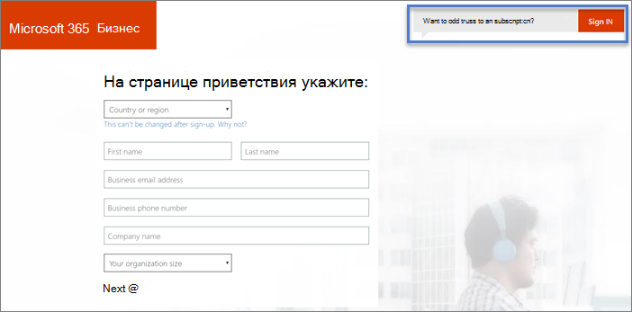

# Sign up for Microsoft 365 for Campaigns 

Вот как завершить регистрацию в Microsoft 365 для кампаний.

## Перед началом работы:

- Получите приглашение в Microsoft 365 для кампаний, выполив действия, которые необходимо предпринять в [рамках получения Microsoft 365 для кампаний.](get-microsoft-365-campaigns.md#get-microsoft-365-for-campaigns)
- Откройте приглашение по электронной почте от Корпорации Майкрософт. Приглашение имеет уникальную ссылку для регистрации в вашей организации. Это необходимо для получения специальных цен для кампаний.
- Подготовьтесь к визитной карточке и телефону.

    > [!TIP]
    > Ссылка для регистрации уникальна для вашей кампании. Это работает только один раз, поэтому убедитесь, что у вас достаточно времени для завершения регистрации. Вам потребуется около десяти минут.

## Действия для регистрации

1. В приглашении на электронную почту Microsoft 365 для кампаний выберите **"РЕГИСТРАЦИЯ ОРГАНИЗАЦИИ >.** После этого вы сможете зарегистрироваться в Microsoft 365.
    > [!NOTE]
    > Если у вас уже есть подписка на Microsoft 365 для бизнеса и вы хотите добавить в нее предложение Microsoft 365 для кампаний, добавьте [Microsoft 365 для](#steps-to-add-microsoft-365-for-campaigns-to-an-existing-subscription)кампаний в существующую подписку.
1. **На странице Microsoft 365 бизнес** введите сведения о компании. Для **бизнеса используйте текущий** адрес электронной почты. Нам нужен только этот адрес, чтобы оставаться на связи с вами во время процесса установки. Нажмите кнопку **Далее**.
1. **На странице "Создание ИД пользователя"**:
    1. In **Username**, enter the name or alias you want for your email address. Например, может потребоваться, чтобы вас знали только Алисой или Бобом. В более крупной кампании алиса или АлисаChavez могут иметь больший смысл.
    2. В **своей компании** введите название кампании, для которого вы работаете. Например, ContosoCampaign. Если вы уже владеете доменом, используйте это имя здесь. 
    3. In **Select a domain**, select **.onmicrosoft.com** for now. Мы можем настроить домен позже или помочь вам установить подключение Microsoft 365 к домену, который вы уже владеете.
    4. Создайте пароль и выберите **"Создать мою учетную запись".**
    > [!NOTE]
    > Если вашей кампании или стороне не принадлежит домен, и вы решили, какой домен вы хотите, вы можете приобрести его, выбрав его.

4. **Докажите. Да. Нет. Робот. page**:
    1. Подготовьтесь к телефону и выберите **"Текст"** (или **позвоните** мне, если хотите). Затем введите номер телефона. 
    2. При выборе **текстового сообщения** мы отправим вам код проверки. Или мы будем вызывать вас с кодом, если вы выберете **"Позвонить мне".**
    3. Введите код из текстового сообщения (или звонка) и выберите **"Далее".** Ожидается короткое ожидание. 
5. **Где вы будете использовать эту страницу:** введите основные сведения о месте работы кампании и номер телефона. Нажмите кнопку **Далее**.
6. **Как выглядит эта страница:**
    1. Убедитесь, что стоимость на пользователя составляет 5,00 долларов США. 
    2. Если вы хотите настроить себя только сейчас, выберите **"Далее".** 
    3. Необязательно: добавьте дополнительные лицензии, изменив номер в **поле** пользователя. [Сотрудникам, с которые вы работаете,](../business/add-users-m365b.md?toc=/microsoft-365/campaigns/toc.json) в любое время могут быть назначены лицензии на Microsoft 365.
7. **Как вы хотите оплатить? Страница** **:Выберите** новую кредитную карту, введите данные визитной карточки и выберите заказ на **место.** При этом также можно использовать банковский счет.
8. **Эта страница может занять некоторое** время: вы найдете сведения о том, где необходимо войти, и свой ИД пользователя. Мы также отправим эти сведения на адрес электронной почты, который вы ввели на шаге 2 выше.

Ваши действия по регистрации завершены! Если вы хотите продолжить следующие действия, выберите "Запустить установку" или вернемся позже, чтобы завершить эти действия.  Когда все будет готово, проверьте свою электронную почту (с шага 2), чтобы найти имя пользователя и пароль, чтобы в следующий раз войти в систему. Они называются учетными данными администратора или глобального администратора.

## Действия по добавлению Microsoft 365 для кампаний в существующую подписку

Если у вас уже есть подписка на Microsoft 365 для бизнеса, например Microsoft 365 бизнес стандартный, вы можете добавить в нее лицензии с помощью предложения Microsoft 365 for Campaigns.
> [!IMPORTANT]
> Вы не можете добавить предложение Microsoft 365 для кампаний в существующую учетную запись Microsoft 365.

1. В приглашении на электронную почту Microsoft 365 для кампаний выберите **"РЕГИСТРАЦИЯ ОРГАНИЗАЦИИ >.** После этого вы сможете зарегистрироваться в Microsoft 365.
2. На странице **"Добро пожаловать",** щелкните или нажмите кнопку "Хотите добавить его в **существующую подписку"? Во sign in**.
    
    
3. На странице входа введите псевдоним администратора для существующей подписки, например Alice@VoteContoso * .org,* choose **Next**, enter your password, and then choose **Sign in**.
4. Введите **количество пользователей и** выберите "Далее".  Здесь не нужно вводить промокод, так как он уже включен в URL-адрес приглашения.
5. На странице **"Как вы хотите оплатить?"** введите метод оплаты и выберите **"Place order" (Разместить заказ).**

После завершения этих действий вы можете  назначить новые лицензии сотрудникам кампании.

## Что дальше?

- [Настройка Microsoft 365](../business/set-up.md?toc=/microsoft-365/campaigns/toc.json) для завершения работы с Microsoft 365 для кампаний.
- [Добавьте пользователей](../business/add-users-m365b.md?toc=/microsoft-365/campaigns/toc.json) в план. Включаем кандидата кампании, всех старших сотрудников кампании и всех, кто будет иметь доступ к конфиденциальной информации о кампании или стороне.
- [Защита для кампании](m365-campaigns-security-overview.md)