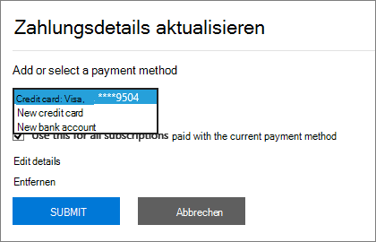
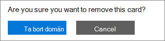

# Добавление, удаление и обновление способов оплатыAdd, update, or remove your payment methods

::: moniker range="o365-21vianet"

> [!NOTE]
> Изменяется центр администрирования.The admin center is changing. Если ваш интерфейс не отвечает указанным здесь сведениям, ознакомьтесь [со статьей о новом центре администрирования Microsoft 365](https://docs.microsoft.com/microsoft-365/admin/microsoft-365-admin-center-preview?view=o365-21vianet).If your experience doesn't match the details presented here, see [About the new Microsoft 365 admin center](https://docs.microsoft.com/microsoft-365/admin/microsoft-365-admin-center-preview?view=o365-21vianet).

::: moniker-end

::: moniker range="o365-worldwide"
Вы можете приобрести продукты и услуги от корпорации Майкрософт с помощью кредитной или дебетовой карты или банковского счета.You can purchase products and services from Microsoft with a credit or debit card, or bank account. Платежные данные можно ввести на странице **Способы оплаты** или при оформлении покупки.You can enter your payment information on the **Payment methods** page, or when you make a purchase.

Вы можете управлять только добавленными вами методами оплаты.You can only manage payment methods that you've added.

> [!NOTE]
> Возможность оплаты с помощью банковского счета недоступна в некоторых странах или регионах.The option to pay with a bank account is not available in some countries or regions.
>
> Необходимо использовать кредитную карту, выданную в той же стране, что и клиент.You must use a credit card issued from the same country as your tenant.

**Отображается ли интерфейс, не совпадающий с указанным в этой статье?****Does the interface you see not match the one described in this article?** Если это так, ознакомьтесь со статьей [Управление методами оплаты](manage-payment-methods.md).If so, see [Manage payment methods](manage-payment-methods.md).

## Добавление способа оплатыAdd a payment method

1. В центре администрирования перейдите на > страницу <a href="https://go.microsoft.com/fwlink/p/?linkid=2018806" target="_blank">платежных</a> **ведомостей &** > оплаты оплаты оплате **оплате** .In the admin center, go to the **Billing** > **Bills & payments** > <a href="https://go.microsoft.com/fwlink/p/?linkid=2018806" target="_blank">Payment methods</a> page.
2. Выберите элемент **Добавление метода оплаты**.Select **Add a payment method**.
3. На странице **Методы оплаты** выберите метод оплаты в раскрывающемся меню.On the **Payment methods** page, pick a payment method from the drop-down menu.
4. Введите сведения о новой карточке или банковском счете, а затем нажмите кнопку **Добавить**.Enter the information for the new card or bank account, then select **Add**.

## Обновление существующего способа оплатыUpdate an existing payment method

Вы не можете изменить номер существующей карты или банковского счета.You can't change the number on an existing card or bank account. Если номер карты или банковского счета изменился, добавьте его в качестве нового метода оплаты.If the card or bank account number has changed, add it as a new payment method. Затем выберите его в качестве способа оплаты для вашей подписки, а затем удалите существующую карточку или банковский счет.Next, pick it as the payment option for your subscription, then remove the existing card or bank account. Необходимо использовать карточку, выданную в той же стране, что и клиент.You must use a card issued from the same country as your tenant.

1. В центре администрирования перейдите на > страницу <a href="https://go.microsoft.com/fwlink/p/?linkid=2018806" target="_blank">платежных</a> **ведомостей &** > оплаты оплаты оплате **оплате** .In the admin center, go to the **Billing** > **Bills & payments** > <a href="https://go.microsoft.com/fwlink/p/?linkid=2018806" target="_blank">Payment methods</a> page.
2. На странице **способы оплаты** выберите карточку или банковский счет для обновления, а затем нажмите кнопку **изменить**.On the **Payment methods** page, pick the card or bank account to update, then select **Edit**.
3. Обновите сведения о методе оплаты (имя в карточке или банковском счете, адрес выставления счета, номер телефона или срок действия), а затем нажмите кнопку **сохранить**.Update your payment method information (name on the card or bank account, billing address, phone number, or expiration date), then select **Save**.

## Изменение способа оплатыChange a payment method

Вы можете изменить способ оплаты, используемый для оплаты одной подписки.You can change the payment method that is used to pay for a single subscription. Вы также можете переместить все подписки из одного способа оплаты на другой.You can also move all subscriptions from one payment method to another.

### Изменение способа оплаты, используемого для одной подпискиChange the payment method used for a single subscription

1. В центре администрирования перейдите на страницу **выставление счетов** > по <a href="https://go.microsoft.com/fwlink/p/?linkid=842054" target="_blank">продуктам</a> .In the admin center, go to the **Billing** > <a href="https://go.microsoft.com/fwlink/p/?linkid=842054" target="_blank">Your products</a> page.
2. Выберите подписку, которую вы хотите оплатить, с помощью новой карточки или банковского счета.Select the subscription that you want to pay for with the new card or bank account. В разделе **выставление счетов**рядом с пунктом метод оплаты нажмите кнопку **изменить**.Under **Billing**, next to the payment method, select **Edit**.
3. Рядом с существующим методом оплаты нажмите кнопку **изменить**.Next to your existing payment method, select **Change**.
4. В раскрывающемся меню выберите другой способ оплаты или нажмите, чтобы добавить метод оплаты.From the drop-down menu, select an alternate payment method, or choose to add a payment method.
5. Если вы добавляете метод оплаты, введите сведения об карточке или учетной записи, а затем нажмите кнопку **сохранить**.If you add a payment method, enter the card or account details, then select **Save**.
6. Убедитесь, что выбранный метод оплаты задан правильно, а затем нажмите кнопку **сохранить**.Verify that the selected payment method is correct, then select **Save**.

### Изменение способа оплаты, используемого для нескольких подписокChange the payment method used for multiple subscriptions

1. В центре администрирования перейдите на > страницу <a href="https://go.microsoft.com/fwlink/p/?linkid=2018806" target="_blank">платежных</a> **ведомостей &** > оплаты оплаты оплате **оплате** .In the admin center, go to the **Billing** > **Bills & payments** > <a href="https://go.microsoft.com/fwlink/p/?linkid=2018806" target="_blank">Payment methods</a> page.
2. Рядом с методом оплаты, который требуется изменить, выберите меню **больше** (три точки), а затем выберите **Изменить подписки**.Next to the payment method you want to change, select the **More** menu (three dots), and then select **Change subscriptions**.
3. В области **способ оплаты изменить** перечислены существующие подписки, которые используют этот способ оплаты.The **Change payment method** pane lists existing subscriptions that use that payment method.
4. В раскрывающемся списке **выберите метод оплаты** выберите другой способ оплаты, а затем нажмите кнопку **сохранить**.From the **Select payment method** drop-down, select a different payment method, then select **Save**.

> [!NOTE]
> Вы можете изменить только между существующими методами оплаты в области **способ оплаты изменений** .You can only change between existing payment methods in the **Change payment method** pane. Если вы хотите изменить оплату по счету, ознакомьтесь со статьей [изменение с кредитной карты или банковского счета на счет](change-payment-method.md#change-from-credit-card-or-bank-account-to-invoice).If you want to change to pay by invoice, see [Change from credit card or bank account to invoice](change-payment-method.md#change-from-credit-card-or-bank-account-to-invoice).

## Удаление способа оплатыRemove a payment method

Вы можете удалить кредитную или дебетовую карту или банковский счет из списка способов оплаты, если они не присоединены к подписке.You can only remove a credit or debit card or bank account from your list of payment methods if it's not attached to a subscription. Это относится ко всем подпискам, независимо от их состояния.This applies to all subscriptions, whatever their status. Добавьте метод оплаты для подписки, а затем удалите старую из этой подписки.Add a payment method for the subscription, then remove the old one from that subscription. Если метод оплаты связан с профилем выставления счетов, измените метод оплаты, используемый для профиля выставления счетов, а затем удалите метод оплаты.If the payment method is associated with a billing profile, change the payment method used for the billing profile, and then remove the payment method.

### Удаление метода оплатыDelete a payment method

Если ваш способ оплаты не связан с какой-либо подпиской, вы можете сразу удалить его.If your payment method isn't associated with any subscriptions, you can immediately delete it.

1. В центре администрирования перейдите на > страницу <a href="https://go.microsoft.com/fwlink/p/?linkid=2018806" target="_blank">платежных</a> **ведомостей &** > оплаты оплаты оплате **оплате** .In the admin center, go to the **Billing** > **Bills & payments** > <a href="https://go.microsoft.com/fwlink/p/?linkid=2018806" target="_blank">Payment methods</a> page.
2. Наведите указатель мыши на карточку или банковский счет, а затем щелкните значок "Удалить".Hover over the card or bank account, then select the delete icon.
3. В нижней части области **метод удаления платежа** нажмите кнопку **Удалить**.At the bottom of the **Delete payment method** pane, select **Delete**.

### Добавление альтернативного способа оплаты, используемого для оплаты по подпискамAdd an alternate payment method used to pay for subscriptions

Если метод оплаты связан с подписками и у вас нет альтернативного метода оплаты для файла, сначала добавьте метод оплаты.If your payment method is associated with any subscriptions and you don't have an alternate payment method on file, first add a payment method. Затем измените способ оплаты, используемый для оплаты подписок.Next, change the payment method used to pay for the subscriptions. Затем вы можете удалить метод оплаты.Then you can delete the payment method.

1. В центре администрирования перейдите на > страницу <a href="https://go.microsoft.com/fwlink/p/?linkid=2018806" target="_blank">платежных</a> **ведомостей &** > оплаты оплаты оплате **оплате** .In the admin center, go to the **Billing** > **Bills & payments** > <a href="https://go.microsoft.com/fwlink/p/?linkid=2018806" target="_blank">Payment methods</a> page.
2. Наведите указатель мыши на карточку или банковский счет, а затем щелкните значок "Удалить".Hover over the card or bank account, then select the delete icon.
3. На панели **Удаление метода оплаты** перечислены существующие подписки, которые используют этот способ оплаты.The **Delete payment method** pane lists existing subscriptions that use that payment method.
4. Выберите элемент **Добавление метода оплаты**.Select **Add a payment method**.
5. Выберите тип метода оплаты, который нужно добавить, введите сведения об учетной записи, а затем нажмите кнопку **Добавить**.Select the type of payment method you want to add, enter the account information, then select **Add**.
6. Выберите новый метод оплаты в раскрывающемся списке, а затем нажмите кнопку **изменить**.Select the new payment method from the drop-down list, then select **Change**.
    > [!WARNING]
    > Все подписки будут перемещены на новый метод оплаты.This will move all subscriptions to the new payment method.
7. Выберите **Удалить**.Select **Delete**.

### Изменение способа оплаты, используемого для оплаты по подпискамChange the payment method used to pay for subscriptions

Если ваш способ оплаты связан с подписками и у вас есть по крайней мере один альтернативный метод оплаты для файла, сначала измените способ оплаты, используемый для оплаты подписок.If your payment method is associated with any subscriptions, and you have at least one alternate payment method on file, first change the payment method used to pay for the subscriptions. Затем вы можете удалить метод оплаты.Then you can delete the payment method.

1. В центре администрирования перейдите на > страницу <a href="https://go.microsoft.com/fwlink/p/?linkid=2018806" target="_blank">платежных</a> **ведомостей &** > оплаты оплаты оплате **оплате** .In the admin center, go to the **Billing** > **Bills & payments** > <a href="https://go.microsoft.com/fwlink/p/?linkid=2018806" target="_blank">Payment methods</a> page.
2. Наведите указатель мыши на карточку или банковский счет, а затем щелкните значок "Удалить".Hover over the card or bank account, then select the delete icon.
3. На панели **Удаление метода оплаты** перечислены существующие подписки, которые используют этот способ оплаты.The **Delete payment method** pane lists existing subscriptions that use that payment method.
4. Выберите команду **изменить способ оплаты**.Select **Change payment method**.
5. Выберите другой способ оплаты в раскрывающемся списке, а затем нажмите кнопку **изменить**.Select an alternate payment method from the drop-down list, then select **Change**.
    > [!WARNING]
    > При этом все подписки будут перемещены на альтернативный метод оплаты.This will move all subscriptions to the alternate payment method.
6. Выберите **Удалить**.Select **Delete**.

### Изменение способа оплаты для профиля выставления счетовChange the payment method for a billing profile

Если метод оплаты связан с профилем выставления счетов и не используется для прямого платежа по другим подпискам, сначала измените связанный с ней способ оплаты.If your payment method is associated with a billing profile and isn't also used to directly pay for other subscriptions, first change the payment method associated with it. Затем вы можете удалить метод оплаты.Then you can delete the payment method.

1. В центре администрирования перейдите на страницу > <a href="https://go.microsoft.com/fwlink/p/?linkid=2103629" target="_blank">профилей выставления счетов</a> **для выставления счетов за** > выставленные \*\*векселя &amp; \*\* .In the admin center, go to the **Billing** > **Bills &amp; payments** > <a href="https://go.microsoft.com/fwlink/p/?linkid=2103629" target="_blank">Billing profiles</a> page.
2. Выберите профиль выставления счетов, который вы хотите обновить.Select the billing profile you want to update.
3. На странице "сведения профиля выставления счетов" в разделе **метод оплаты**нажмите кнопку **изменить**.On the billing profile details page, under **Payment method**, select **Edit**.
4. При добавлении альтернативного способа оплаты выберите **Добавить метод оплаты**.If you add an alternate payment method, select **Add a payment method**. Введите данные учетной записи, а затем нажмите кнопку **Добавить**.Enter your account information, then select **Add**.
5. В раскрывающемся списке **выберите метод оплаты** выберите другой способ оплаты, а затем нажмите кнопку **сохранить**.From the **Select a payment method** drop-down, select a different payment method, then select **Save**.
6. Выполните действия, описанные в статье [Удаление метода оплаты](#delete-a-payment-method).Follow the steps in [Delete a payment method](#delete-a-payment-method).

### Изменение способа оплаты, используемого как для профиля выставления счетов, так и для подписокChange the payment method used for both a billing profile and subscriptions

Если метод оплаты связан с профилем выставления счетов и также используется для прямого платежа по любой из подписок, сначала измените метод оплаты, связанный с профилем выставления счетов.If your payment method is associated with a billing profile and is also used to directly pay for any subscriptions, first change the payment method associated with the billing profile. Затем измените способ оплаты, используемый для оплаты подписок.Next, change the payment method used to pay for the subscriptions. Затем вы можете удалить метод оплаты.Then you can delete the payment method.

1. Выполните шаги с 1 по 5 в разделе [изменение способа оплаты для профиля выставления счетов](#change-the-payment-method-for-a-billing-profile).Follow steps 1 through 5 in [Change the payment method for a billing profile](#change-the-payment-method-for-a-billing-profile).
2. Если у вас нет альтернативного способа оплаты, выполните действия, описанные в статье [Добавление альтернативного способа оплаты, используемого для оплаты по подпискам](#add-an-alternate-payment-method-used-to-pay-for-subscriptions).If you have no alternate payment method, follow the steps in [Add an alternate payment method used to pay for subscriptions](#add-an-alternate-payment-method-used-to-pay-for-subscriptions).
3. Если у вас уже есть другие методы оплаты, выполните действия, описанные в статье [изменение способа оплаты](#change-a-payment-method).If you already have other payment methods available, follow the steps in [Change a payment method](#change-a-payment-method).

## Устранение неполадок, связанных со способом оплатыTroubleshoot payment methods

|**Проблема****Issue**|**Инструкции по устранению****Troubleshooting steps**|
|:-----|:-----|
|**Получено сообщение об ошибке "браузер блокирует файлы cookie".****I get an error message that says, "The browser is currently set to block cookies."**   |Разрешите в настройках своего браузера прием файлов cookie от сторонних сайтов и повторите попытку.Set your browser to allow third-party cookies and try again.    |
|**Кредитная или дебетовая карта отклонена.****My credit or debit card was declined.**   |При оплате кредитной или дебетовой картой, если ваша карта отклонена, вы получите сообщение электронной почты с сообщением о том, что корпорации Майкрософт не удалось обработать платеж.If you pay by credit or debit card, and your card is declined, you receive an email that says Microsoft was unable to process the payment. Дважды убедитесь, что номер &mdash; карточки, Дата окончания срока действия, имя карточки и адрес, включая город, область и почтовый индекс, отображаются точно так же, как в карточке и в операторе.Double-check that the card details &mdash; card number, expiration date, name on the card, and address, including city, state, and ZIP code — appear exactly as they do on the card and your statement. Вы можете обновить сведения о карточке и сразу отправите платеж с помощью ссылки **сопоставление сальдо** в разделе **выставление счетов** на странице сведения о подписке.You can update your card information and immediately submit the payment by using the **Settle balance** link in the **Billing** section of the subscription details page. Чтобы получить дополнительные сведения, посмотрите, [что делать, если кредитная карта отклонена и срок платежа просрочен?](pay-for-your-subscription.md#what-if-my-credit-card-was-declined-and-my-payment-is-past-due).For more information, see [What if my credit card was declined and my payment is past due?](pay-for-your-subscription.md#what-if-my-credit-card-was-declined-and-my-payment-is-past-due).      Если кредитная карта все равно отклоняется, обратитесь в банк.If you continue to see the "declined" message, contact your bank. Возможно, ваша карта неактивна.It's possible that your card isn't active. Если вы недавно получали открытую в почте карточку с обновленным сроком действия, убедитесь, что она активирована.If you recently received the card in the mail with an updated expiration date, make sure it's activated. В вашем банке можно также указать, является ли ваша карта неутвержденной для интерактивных, международных и повторяющихся транзакций.Your bank can also tell you whether your card isn't approved for online, international, or recurring transactions.    |
|**Я хочу обновить номер карты или банковского счета.****I want to update a card or bank account number.**   |Вы не можете изменить номер существующей карты или банковского счета.You can't change the number on an existing card or bank account. Если номер карты или банковского счета изменился, добавьте другой номер карты или банковский счет.If your card or bank account number has changed, add another card number or bank account. Затем переместите все активные подписки из старой карточки или учетной записи на новый.Next, move any active subscriptions from the old card or account to the new one. Затем удалите старую карточку или учетную запись.Then delete the old card or account. Дополнительную информацию можно узнать [в статье Добавление метода оплаты](#add-a-payment-method) или [изменение способа оплаты](#change-a-payment-method).For more information, see [Add a payment method](#add-a-payment-method) or [Change a payment method](#change-a-payment-method). |
|**В моей учетной записи есть только одна карточка или банковский счет, и их нужно удалить.****I only have one card or bank account on my account and I want to remove it.**   |При попытке удалить только одну карточку или банковский счет отображается сообщение об ошибке.If you only have one card or bank account, you see an error message when you try to remove it. Чтобы устранить эту ошибку, убедитесь, что вы используете другой способ оплаты для оплаты всех ваших подписок, а затем попробуйте удалить карту или банковский счет еще раз.To fix the error, make sure that you're using a different payment method to pay for all your subscriptions, then try removing the card or bank account again.    |
|**Не удается добавить карточку или банковский счет.****I can't add my card or bank account.**   |Если у вас возникли проблемы с вводом сведений о карте или банковском счете, [обратитесь в службу поддержки](../../admin/contact-support-for-business-products.md).If you have trouble entering your card or bank account information, you can [contact support](../../admin/contact-support-for-business-products.md).    |

::: moniker-end

::: moniker range="o365-21vianet"

Для выполнения описанных в этой статье действий необходимы права глобального администратора или администратора по выставлению счетов.You must be a Global Admin or a Billing Admin to do the tasks described in this article.
  
 **Вы не являетесь администратором?****Not an admin?** Обратитесь за помощью к ИТ ИТ. У [кого есть разрешения администратора в моей организации?](../../admin/admin-overview/admin-overview.md#who-has-admin-permissions-in-my-business)Contact your IT administrator for help.[Who has admin permissions in my business?](../../admin/admin-overview/admin-overview.md#who-has-admin-permissions-in-my-business)

> [!NOTE]
> Возможность оплаты с помощью банковского счета недоступна в некоторых странах или регионах.The option to pay with a bank account is not available in some countries or regions.
>
> Необходимо использовать кредитную карту, выданную в той же стране, что и клиент.You must use a credit card issued from the same country as your tenant.

## Добавление кредитной карты или банковского счетаAdd a credit card or bank account

1. В Центре администрирования выберите страницу **Выставление счетов** \><a href="https://go.microsoft.com/fwlink/p/?linkid=850626" target="_blank">Подписки</a>.In the admin center, go to the **Billing** \> <a href="https://go.microsoft.com/fwlink/p/?linkid=850626" target="_blank">Subscriptions</a> page.

2. Выберите подписку, которую вы хотите оплатить, с помощью новой кредитной карты или банковского счета, а затем выберите **Обновить сведения об оплате**.Pick the subscription you want to pay for with the new credit card or bank account, then select **Update payment details**.

    
  
3. Выберите стрелку раскрывающегося списка **Добавить или выбрать способ оплаты**, а затем выберите **Новый кредитная карта** или **новый банковский счет**.Select the drop-down arrow under **Add or select a payment method**, then select **New credit card** or **New bank account**.

    
  
4. Введите данные для новой кредитной карты или банковского счета, а затем нажмите кнопку **послать**.Enter the information for the new credit card or bank account, then select **Submit**.

    > [!NOTE]
    > Новую кредитную карту или банковский счет будут использоваться только для подписки, выбранной на шаге 2.The new credit card or bank account will only be used for the subscription you chose in step 2. Если с помощью новой кредитной карты или банковского счета вы планируете оплачивать другие подписки, измените карту или счет для каждой из них, следуя инструкциям из этой статьи.If you have other subscriptions that you want to use the new credit card or bank account for, follow the steps in this article to change the credit card or bank account used to pay for each subscription.

::: moniker-end

::: moniker range="o365-germany"
## Добавление кредитной карты или банковского счетаAdd a credit card or bank account

Для выполнения описанных в этой статье действий необходимы права глобального администратора или администратора по выставлению счетов.You must be a Global Admin or a Billing Admin to do the tasks described in this article.
  
 **Вы не являетесь администратором?** Обратитесь за помощью к ИТ-администратору. [У кого есть разрешения администратора в моей организации?](../../admin/admin-overview/admin-overview.md#who-has-admin-permissions-in-my-business)**Not an admin?** Contact your IT administrator for help. [Who has admin permissions in my business?](../../admin/admin-overview/admin-overview.md#who-has-admin-permissions-in-my-business)
  
> [!NOTE]
> Возможность оплаты с помощью банковского счета недоступна в некоторых странах или регионах.The option to pay with a bank account is not available in some countries or regions.
>
> Необходимо использовать кредитную карту, выданную в той же стране, что и клиент.You must use a credit card issued from the same country as your tenant.

1. В Центре администрирования выберите страницу **Выставление счетов** \><a href="https://go.microsoft.com/fwlink/p/?linkid=847745" target="_blank">Подписки</a>.In the admin center, go to the **Billing** \> <a href="https://go.microsoft.com/fwlink/p/?linkid=847745" target="_blank">Subscriptions</a> page.

2. Выберите подписку, которую вы хотите оплатить, с помощью новой кредитной карты или банковского счета, а затем выберите **Обновить сведения об оплате**.Pick the subscription you want to pay for with the new credit card or bank account, then select **Update payment details**.

    
  
3. Выберите стрелку раскрывающегося списка **Добавить или выбрать способ оплаты**, а затем выберите **Новый кредитная карта** или **новый банковский счет**.Select the drop-down arrow under **Add or select a payment method**, then select **New credit card** or **New bank account**.

    
  
4. Введите данные для новой кредитной карты или банковского счета, а затем нажмите кнопку **послать**.Enter the information for the new credit card or bank account, then select **Submit**.

    > [!NOTE]
    > Новую кредитную карту или банковский счет будут использоваться только для подписки, выбранной на шаге 2.The new credit card or bank account will only be used for the subscription you chose in step 2. Если с помощью новой кредитной карты или банковского счета вы планируете оплачивать другие подписки, измените карту или счет для каждой из них, следуя инструкциям из этой статьи.If you have other subscriptions that you want to use the new credit card or bank account for, follow the steps in this article to change the credit card or bank account used to pay for each subscription.

::: moniker-end

::: moniker range="o365-21vianet"
## Обновление данных существующей кредитной карты или существующего банковского счетаUpdate an existing credit card or bank account

> [!NOTE]
> Изменить номер существующей кредитной карты или существующего банковского счета невозможно.You can't change the number on an existing credit card or bank account. Если номер кредитной карты или банковского счета изменился, добавьте его в качестве новой кредитной карты или банковского счета.If the credit card or bank account number has changed, add it as a new credit card or bank account. Затем выберите его в качестве способа оплаты для вашей подписки, а затем удалите существующую кредитную карту или банковский счет.Next, pick it as the payment option for your subscription, then remove the existing credit card or bank account.
> Необходимо использовать кредитную карту, выданную в той же стране, что и клиент.You must use a credit card issued from the same country as your tenant.

1. В Центре администрирования выберите страницу **Выставление счетов** \><a href="https://go.microsoft.com/fwlink/p/?linkid=850626" target="_blank">Подписки</a>.In the admin center, go to the **Billing** \> <a href="https://go.microsoft.com/fwlink/p/?linkid=850626" target="_blank">Subscriptions</a> page.

2. Выберите подписку, которую вы приобрели с банковским счетом кредитных карт, которую вы хотите обновить, и выберите **Обновить сведения об оплате**.Pick the subscription you bought with the credit card bank account that you want to update, then select **Update payment details**.

    > [!NOTE]
    > Если подписка была приобретена другим администратором, вы не сможете обновить для нее данные кредитной карты или банковского счета.If another admin purchased the subscription, you won't be able to update the credit card or bank account information for it. Если срок действия кредитной карты истечет, а другой администратор не может ее обновить, можно предотвратить перерыв в обслуживании, если вы добавите другую кредитную карту или новый банковский счет для подписки.If the credit card is about to expire and the other administrator isn't able to update it, you can prevent service interruption if you add a different credit card or new bank account for the subscription.
  
    
  
3. Выберите стрелку раскрывающегося списка **Добавить или выбрать способ оплаты**.Select the drop-down arrow under **Add or select a payment method**. Выберите кредитную карту или банковский счет, которые требуется обновить, а затем нажмите кнопку **изменить сведения**.Select the credit card or bank account that you want to update, then select **Edit details**.

    
  
4. Обновите сведения о кредитной карте или банковском счете (имя на кредитной карте или банковском счете, адрес для выставления счета).Update your credit card or bank account information (name on the credit card or bank account, billing address. номер телефона или Дата окончания срока действия), а затем нажмите кнопку " **послать**".phone number, or expiration date) as needed, then select **Submit**.

5. Появится сообщение с подтверждением.A confirmation message appears. Если это не так, обратитесь к разделу "Устранение неполадок кредитных карт и банковских счетов" Далее в этой статье.If it doesn't, see "Troubleshooting credit cards and bank accounts" later in this article.

    

::: moniker-end

::: moniker range="o365-germany"
## Обновление данных существующей кредитной карты или существующего банковского счетаUpdate an existing credit card or bank account

> [!NOTE]
> Изменить номер существующей кредитной карты или существующего банковского счета невозможно.You can't change the number on an existing credit card or bank account. Если номер кредитной карты или банковского счета изменился, добавьте его в качестве новой кредитной карты или банковского счета.If the credit card or bank account number has changed, add it as a new credit card or bank account. Затем выберите его в качестве способа оплаты для вашей подписки, а затем удалите существующую кредитную карту или банковский счет.Next, pick it as the payment option for your subscription, then remove the existing credit card or bank account.
> Необходимо использовать кредитную карту, выданную в той же стране, что и клиент.You must use a credit card issued from the same country as your tenant.

1. В Центре администрирования выберите страницу **Выставление счетов** \><a href="https://go.microsoft.com/fwlink/p/?linkid=847745" target="_blank">Подписки</a>.In the admin center, go to the **Billing** \> <a href="https://go.microsoft.com/fwlink/p/?linkid=847745" target="_blank">Subscriptions</a> page.

2. Выберите подписку, которую вы приобрели с банковским счетом кредитных карт, которую вы хотите обновить, и выберите **Обновить сведения об оплате**.Pick the subscription you bought with the credit card bank account that you want to update, then select **Update payment details**.

    > [!NOTE]
    > Если подписка была приобретена другим администратором, вы не сможете обновить для нее данные кредитной карты или банковского счета.If another admin purchased the subscription, you won't be able to update the credit card or bank account information for it. Если срок действия кредитной карты истечет, а другой администратор не может ее обновить, можно предотвратить перерыв в обслуживании, если вы добавите другую кредитную карту или новый банковский счет для подписки.If the credit card is about to expire and the other administrator isn't able to update it, you can prevent service interruption if you add a different credit card or new bank account for the subscription.
  
    
  
3. Выберите стрелку раскрывающегося списка **Добавить или выбрать способ оплаты**.Select the drop-down arrow under **Add or select a payment method**. Выберите кредитную карту или банковский счет, которые требуется обновить, а затем нажмите кнопку **изменить сведения**.Select the credit card or bank account that you want to update, then select **Edit details**.

    
  
4. Обновите сведения о кредитной карте или банковском счете (имя на кредитной карте или банковском счете, адрес для выставления счета).Update your credit card or bank account information (name on the credit card or bank account, billing address. номер телефона или Дата окончания срока действия), а затем нажмите кнопку " **послать**".phone number, or expiration date) as needed, then select **Submit**.

5. Появится сообщение с подтверждением.A confirmation message appears. Если это не так, обратитесь к разделу "Устранение неполадок кредитных карт и банковских счетов" Далее в этой статье.If it doesn't, see "Troubleshooting credit cards and bank accounts" later in this article.

    

::: moniker-end

::: moniker range="o365-21vianet"
## Удаление кредитной карты или банковского счетаRemove a credit card or bank account

1. В Центре администрирования выберите страницу **Выставление счетов** \><a href="https://go.microsoft.com/fwlink/p/?linkid=850626" target="_blank">Подписки</a>.In the admin center, go to the **Billing** \> <a href="https://go.microsoft.com/fwlink/p/?linkid=850626" target="_blank">Subscriptions</a> page.

2. Выберите любую подписку и щелкните **Обновить сведения об оплате**.Pick any subscription, then select **Update payment details**.

    
  
3. Выберите стрелку раскрывающегося списка **Добавить или выбрать способ оплаты**.Select the drop-down arrow under **Add or select a payment method**.

4. Выберите кредитную карту или банковский счет, а затем нажмите кнопку **Удалить**.Select the credit card or bank account, then select **Remove**.

    
  
5. Нажмите кнопку **Удалить** еще раз, чтобы удалить кредитную карту или банковский счет.Select **Remove** again to delete the credit card or bank account.

    
  
    > [!NOTE]
    > Вы не сможете удалить кредитную карту или банковский счет, если он в настоящее время используется для оплаты подписки.You won't be able to remove a credit card or bank account if it's currently used to pay for a subscription. Если вы попробуете, отобразится следующее сообщение: If you try, you see a message like this:   
    > Чтобы удалить кредитную карту или банковский счет, нажмите кнопку **назад** и выполните действия, описанные в этой статье, чтобы изменить кредитную карту или банковский счет, которые используются для оплаты подписки.To remove the credit card or bank account, select **Back** and follow the steps in this article to change the credit card or bank account that you use to pay for the subscription. После этого попытайтесь удалить кредитную карту или банковский счет снова.Then try removing the credit card or bank account again.

::: moniker-end

::: moniker range="o365-germany"
## Удаление кредитной карты или банковского счетаRemove a credit card or bank account

1. В Центре администрирования выберите страницу **Выставление счетов** \><a href="https://go.microsoft.com/fwlink/p/?linkid=847745" target="_blank">Подписки</a>.In the admin center, go to the **Billing** \> <a href="https://go.microsoft.com/fwlink/p/?linkid=847745" target="_blank">Subscriptions</a> page.

2. Выберите любую подписку и щелкните **Обновить сведения об оплате**.Pick any subscription, then select **Update payment details**.

    
  
3. Выберите стрелку раскрывающегося списка **Добавить или выбрать способ оплаты**.Select the drop-down arrow under **Add or select a payment method**.

4. Выберите кредитную карту или банковский счет, а затем нажмите кнопку **Удалить**.Select the credit card or bank account, then select **Remove**.

    

5. Нажмите кнопку **Удалить** еще раз, чтобы удалить кредитную карту или банковский счет.Select **Remove** again to delete the credit card or bank account.

    
  
    > [!NOTE]
    > Вы не сможете удалить кредитную карту или банковский счет, если он в настоящее время используется для оплаты подписки.You won't be able to remove a credit card or bank account if it's currently used to pay for a subscription. Если вы попробуете, отобразится следующее сообщение: If you try, you see a message like this:   
    > Чтобы удалить кредитную карту или банковский счет, нажмите кнопку **назад** и выполните действия, описанные в этой статье, чтобы изменить кредитную карту или банковский счет, которые используются для оплаты подписки.To remove the credit card or bank account, select **Back** and follow the steps in this article to change the credit card or bank account that you use to pay for the subscription. После этого попытайтесь удалить кредитную карту или банковский счет снова.Then try removing the credit card or bank account again.

::: moniker-end

::: moniker range="o365-21vianet"
## Изменение кредитной карты или банковского счета, используемого для оплаты подпискиChange the credit card or bank account used to pay for a subscription

1. В Центре администрирования выберите страницу **Выставление счетов** \><a href="https://go.microsoft.com/fwlink/p/?linkid=850626" target="_blank">Подписки</a>.In the admin center, go to the **Billing** \> <a href="https://go.microsoft.com/fwlink/p/?linkid=850626" target="_blank">Subscriptions</a> page.

2. Выберите подписку, для которой вы хотите заплатить, с помощью новой кредитной карты или банковского счета, а затем выберите **Обновить сведения об оплате**.Pick the subscription that you want to pay for with the new credit card or bank account, then select **Update payment details**.

    
  
3. Выберите стрелку раскрывающегося списка **Добавить или выбрать способ оплаты** и выберите кредитную карту или банковский счет, который вы хотите использовать.Select the drop-down arrow under **Add or select a payment method** and select the credit card or bank account that you want to use.

    
  
4. Нажмите кнопку **послать**.Select **Submit**. Если кредитная карта или банковский счет, которые вы хотите использовать, еще не указаны, выберите **новую кредитную карту** или **новый банковский счет** , чтобы добавить его.If the credit card or bank account that you want to use isn't listed yet, pick **New credit card** or **New bank account** to add it.

::: moniker-end

::: moniker range="o365-germany"
## Изменение кредитной карты или банковского счета, используемого для оплаты подпискиChange the credit card or bank account used to pay for a subscription

1. В Центре администрирования выберите страницу **Выставление счетов** \><a href="https://go.microsoft.com/fwlink/p/?linkid=847745" target="_blank">Подписки</a>.In the admin center, go to the **Billing** \> <a href="https://go.microsoft.com/fwlink/p/?linkid=847745" target="_blank">Subscriptions</a> page.

2. Выберите подписку, для которой вы хотите заплатить, с помощью новой кредитной карты или банковского счета, а затем выберите **Обновить сведения об оплате**.Pick the subscription that you want to pay for with the new credit card or bank account, then select **Update payment details**.

    
  
3. Выберите стрелку раскрывающегося списка **Добавить или выбрать способ оплаты** и выберите кредитную карту или банковский счет, который вы хотите использовать.Select the drop-down arrow under **Add or select a payment method** and select the credit card or bank account that you want to use.

    
  
4. Нажмите кнопку **послать**.Select **Submit**. Если кредитная карта или банковский счет, которые вы хотите использовать, еще не указаны, выберите **новую кредитную карту** или **новый банковский счет** , чтобы добавить его.If the credit card or bank account that you want to use isn't listed yet, pick **New credit card** or **New bank account** to add it.

::: moniker-end

::: moniker range="o365-21vianet"
## Устранение неполадок, связанных с кредитными картами и банковскими счетамиTroubleshooting credit cards and bank accounts

|**Проблема****Issue**|**Инструкции по устранению****Troubleshooting steps**|
|:-----|:-----|
|**У меня появляется сообщение о том, что мой браузер блокирует файлы cookie.****I get an error message that says "The browser is currently set to block cookies."**   |Разрешите в настройках своего браузера прием файлов cookie от сторонних сайтов и повторите попытку.Set your browser to allow third-party cookies and try again.    |
|**Моя кредитная карта отклонена.****My credit card was declined.**   |При оплате кредитной картой и отклонении кредитной карты вы получаете сообщение электронной почты о том, что не удалось обработать платеж.If you pay by credit card, and your credit card is declined, you receive an email that we were unable to process the payment. Убедитесь, что сведения о кредитной карте (номер карты, Дата истечения срока действия, имя на кредитной карте и адрес, включая город, область и почтовый индекс) отображаются точно так же, как на кредитной карте и в операторе кредитной карты.Verify that the credit card details (card number, expiration date, name on the credit card, and address, including city, state, and ZIP code) appear exactly as they do on the credit card and your credit card statement. Вы можете обновить сведения о кредитной карте и сразу отправите платеж с помощью функции " **оплатить сейчас** ".You can update your credit card information and immediately submit the payment by using the **Pay now** feature. Чтобы получить дополнительные сведения, посмотрите, [что делать, если кредитная карта отклонена и срок платежа просрочен?](pay-for-your-subscription.md#what-if-my-credit-card-was-declined-and-my-payment-is-past-due).For more information, see [What if my credit card was declined and my payment is past due?](pay-for-your-subscription.md#what-if-my-credit-card-was-declined-and-my-payment-is-past-due).      Если кредитная карта все равно отклоняется, обратитесь в банк.If you continue to see the "declined" message, contact your bank. Возможно, ваша кредитная карта не активна.It's possible that your credit card isn't active. Если вы недавно получили кредитную карту в почте с обновленным сроком действия, убедитесь, что она активирована.If you recently received the credit card in the mail with an updated expiration date, make sure it's activated. В вашем банке можно также указать, является ли ваша кредитная карта утвержденной для интерактивных, международных и повторяющихся транзакций.Your bank can also tell you whether your credit card isn't approved for online, international, or recurring transactions.    |
|**Я хочу обновить номер кредитной карты или банковского счета.****I want to update a credit card or bank account number.**   |Изменить номер существующей кредитной карты или существующего банковского счета невозможно.You can't change the number on an existing credit card or bank account. Если номер кредитной карты или банковского счета изменился, [добавьте новую кредитную карту или банковский счет](#add-a-credit-card-or-bank-account), [измените подписку на эту карту или банковский счет](#change-the-credit-card-or-bank-account-used-to-pay-for-a-subscription), а затем [удалите старую кредитную карту или банковский счет](#remove-a-credit-card-or-bank-account).If your credit card or bank account number has changed, [add a new credit card or bank account](#add-a-credit-card-or-bank-account), [change your subscription to that card or bank account](#change-the-credit-card-or-bank-account-used-to-pay-for-a-subscription), and then [delete the old credit card or bank account](#remove-a-credit-card-or-bank-account). |
|**В моей учетной записи только одна кредитная карта или один банковский счет, и я хочу их удалить.****I only have one credit card or bank account on my account and I want to remove it.**   |Если у вас есть только одна кредитная карта или банковский счет, при попытке удалить его будет выводиться сообщение об ошибке.If you only have one credit card or bank account, you see an error message when you try to remove it. Чтобы устранить ошибку, убедитесь, что вы используете другой способ оплаты для оплаты всех подписок, а затем попробуйте удалить кредитную карту или банковский счет еще раз.To fix error, make sure that you're using a different payment method to pay for all of your subscriptions, then try removing the credit card or bank account again.    |
|**У меня не получается добавить кредитную карту или банковский счет.****I can't add my credit card or bank account.**   |Если вам не удается ввести информацию о своей кредитной карте или банковском счете, попробуйте [обратиться в службу поддержки](../../admin/contact-support-for-business-products.md).If you have trouble entering your credit card or bank account information, you can [contact support](../../admin/contact-support-for-business-products.md).    |

::: moniker-end

::: moniker range="o365-germany"
## Устранение неполадок, связанных с кредитными картами и банковскими счетамиTroubleshooting credit cards and bank accounts

|**Проблема****Issue**|**Инструкции по устранению****Troubleshooting steps**|
|:-----|:-----|
|**У меня появляется сообщение о том, что мой браузер блокирует файлы cookie.****I get an error message that says "The browser is currently set to block cookies."**   |Разрешите в настройках своего браузера прием файлов cookie от сторонних сайтов и повторите попытку.Set your browser to allow third-party cookies and try again.    |
|**Моя кредитная карта отклонена.****My credit card was declined.**   |При оплате кредитной картой и отклонении кредитной карты вы получаете сообщение электронной почты о том, что не удалось обработать платеж.If you pay by credit card, and your credit card is declined, you receive an email that we were unable to process the payment. Убедитесь, что сведения о кредитной карте (номер карты, Дата истечения срока действия, имя на кредитной карте и адрес, включая город, область и почтовый индекс) отображаются точно так же, как на кредитной карте и в операторе кредитной карты.Verify that the credit card details (card number, expiration date, name on the credit card, and address, including city, state, and ZIP code) appear exactly as they do on the credit card and your credit card statement. Вы можете обновить сведения о кредитной карте и сразу отправите платеж с помощью функции " **оплатить сейчас** ".You can update your credit card information and immediately submit the payment by using the **Pay now** feature. Чтобы получить дополнительные сведения, посмотрите, [что делать, если кредитная карта отклонена и срок платежа просрочен?](pay-for-your-subscription.md#what-if-my-credit-card-was-declined-and-my-payment-is-past-due).For more information, see [What if my credit card was declined and my payment is past due?](pay-for-your-subscription.md#what-if-my-credit-card-was-declined-and-my-payment-is-past-due).      Если кредитная карта все равно отклоняется, обратитесь в банк.If you continue to see the "declined" message, contact your bank. Возможно, ваша кредитная карта не активна.It's possible that your credit card isn't active. Если вы недавно получили кредитную карту в почте с обновленным сроком действия, убедитесь, что она активирована.If you recently received the credit card in the mail with an updated expiration date, make sure it's activated. В вашем банке можно также указать, является ли ваша кредитная карта утвержденной для интерактивных, международных и повторяющихся транзакций.Your bank can also tell you whether your credit card isn't approved for online, international, or recurring transactions.    |
|**Я хочу обновить номер кредитной карты или банковского счета.****I want to update a credit card or bank account number.**   |Изменить номер существующей кредитной карты или существующего банковского счета невозможно.You can't change the number on an existing credit card or bank account. Если номер кредитной карты или банковского счета изменился, [добавьте новую кредитную карту или банковский счет](#add-a-credit-card-or-bank-account-1), [измените свою подписку на эту кредитную карту или банковский счет](#change-the-credit-card-or-bank-account-used-to-pay-for-a-subscription-1), а затем [удалите старую кредитную карту или банковский счет](#remove-a-credit-card-or-bank-account-1).If your credit card or bank account number has changed, [add a new credit card or bank account](#add-a-credit-card-or-bank-account-1), [change your subscription to that the credit card or bank account](#change-the-credit-card-or-bank-account-used-to-pay-for-a-subscription-1), and then [delete the old credit card or bank account](#remove-a-credit-card-or-bank-account-1). |
|**В моей учетной записи только одна кредитная карта или один банковский счет, и я хочу их удалить.****I only have one credit card or bank account on my account and I want to remove it.**   |Если у вас есть только одна кредитная карта или банковский счет, при попытке удалить его будет выводиться сообщение об ошибке.If you only have one credit card or bank account, you see an error message when you try to remove it. Чтобы устранить ошибку, убедитесь, что вы используете другой способ оплаты для оплаты всех подписок, а затем попробуйте удалить кредитную карту или банковский счет еще раз.To fix error, make sure that you're using a different payment method to pay for all of your subscriptions, then try removing the credit card or bank account again.    |
|**У меня не получается добавить кредитную карту или банковский счет.****I can't add my credit card or bank account.**   |Если вам не удается ввести информацию о своей кредитной карте или банковском счете, попробуйте [обратиться в службу поддержки](../../admin/contact-support-for-business-products.md).If you have trouble entering your credit card or bank account information, you can [contact support](../../admin/contact-support-for-business-products.md).    |

::: moniker-end

## Статьи по темеRelated articles

[Изменение адреса выставления счетаChange your billing addresses](change-your-billing-addresses.md)
  
[Отмена подпискиCancel your subscription](../subscriptions/cancel-your-subscription.md)
