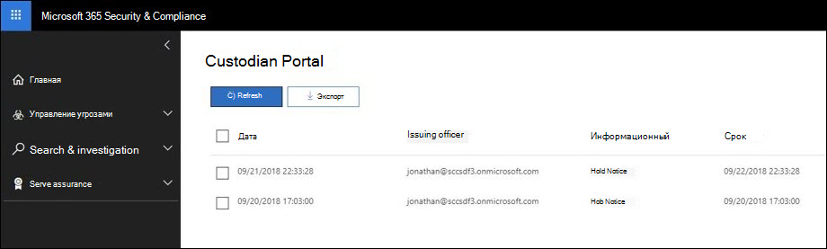

# Подтверждение уведомления об удержании

При ответе на нормативный запрос или расследование может потребоваться информировать хранителей об их обязательствах по сохранению сведений, хранимых в электронном виде (ESI) и любых материалов, которые могут иметь отношение к активному или неизбежному юридическому вопросу. При отправлении юридические группы должны знать, что каждый хранитель получал, читал, понимал и соглашался следовать заданным инструкциям.

Чтобы сократить время, затраты и усилия по совместной работе с хранителями, Advanced eDiscovery позволяет отправлять и выполнять уведомления о удержании по электронной почте. Помимо уведомлений по электронной почте, каждый хранитель будет иметь доступ к индивидуализированному порталу соответствия требованиям, что позволяет хранителям получать информацию об изменениях в их состоянии обязательств.

## Уведомления по электронной почте

После получения уведомления о юридическом удержании каждый хранитель получает уникальное и персонализированное письмо, содержащее определенное уведомление о юридическом удержании и добавленные инструкции. 

> [!TIP]
> Узнайте, как использовать встроенный  редактор связи, чтобы разрешить хранителям получать уведомление или получать доступ к порталу соответствия требованиям непосредственно из электронной почты.

В зависимости от конфигурации уведомления о легальном удержании ваши хранители могут получать следующие уведомления: 

- **Уведомление о выдаче:** Первое уведомление, отправлено вашему хранителу. В этом уведомлении будут содержаться инструкции по выдаче и уведомление о удержании, приданное к концу сообщения.

- **Уведомление о напоминаниях:** Если включено, уведомление о напоминаниях будет отправлено хранителям в зависимости от указанной частоты и интервала. Напоминания будут по-прежнему отправлены либо до тех пор, пока хранитель не подавит уведомление, либо до тех пор, пока количество напоминаний не будет исчерпано.

- **Уведомление об эскалации:** Если включено, уведомление об эскалации будет отправлено вашему хранителу и его руководителю после исчерпания уведомлений о напоминаниях. Система автоматически отправляет уведомления об эскалации до завершения указанного числа эскалаций или до тех пор, пока хранитель не подтвердит уведомление о удержании.

- **Уведомление о переоцене:** В ходе расследования, если содержимое уведомления о удержании будет обновлено, обновленное уведомление автоматически будет отправлено хранителю.

- **Уведомление об освобождении:** Когда хранитель освобождается из дела, им будет отправлено уведомление об освобождении. 

## Портал соответствия требованиям

Помимо уведомлений по электронной почте каждый хранитель будет иметь доступ к уникальному порталу соответствия требованиям. Через портал каждый хранитель может просматривать, получать доступ и подтверждать свои активные уведомления о удержании.

