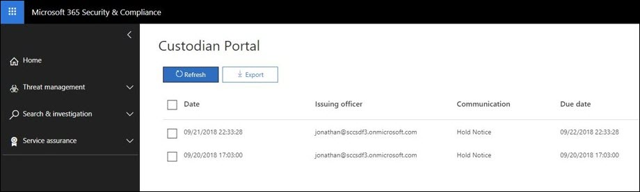

# Подтверждение уведомления об удержании

При ответе на нормативный запрос или исследование вам может потребоваться уведомить custodians о своих обязательствах, чтобы сохранить электронную информацию (РАЗБИРАТЕЛЬСТВАХ) и все материалы, которые могут быть важны для действующего или приближенного юридического лица. После того как вы отправили, юридические команды должны знать, что каждый хранитель получил, прочитал, понятный и согласованный, следуйте указанным инструкциям.

Чтобы сократить время, стоимость и усилия по работе с custodians, Расширенное обнаружение электронных данных позволяет отправлять уведомления о юридических удержаниях через электронную почту. Помимо уведомлений по электронной почте, каждый хранитель будет иметь доступ к отдельному порталу соответствия требованиям, позволяя custodians хранить информацию об изменениях своего состояния обязательства.

## Уведомления по электронной почте

После выдачи уведомления о юридическом удержании каждый хранитель будет получать уникальное и персонализированное сообщение электронной почты, содержащее Ваше заданное уведомление об удержании, и дополнительные инструкции. 

> [!TIP]
> Узнайте, как можно использовать встроенный [Редактор взаимодействия](using-communications-editor.md) , чтобы ваше custodians мог подтвердить свое уведомление или получить доступ к порталу соответствия непосредственно из своей электронной почты.

В зависимости от конфигурации вашего уведомления об судебном удержании ваши custodians могут получать следующие уведомления: 

- **Уведомление о выдаче:** Первое уведомление, отправленное в хранитель. Это уведомление содержит инструкции по выдаче, а уведомление об удержании добавляется в конец сообщения.

- **Уведомление о напоминании:** Если этот параметр включен, уведомление о напоминании будет отправлено в custodians в соответствии с указанной частотой и интервалом. Напоминания продолжат отправку до тех пор, пока в хранитель не будет подтверждено уведомление или пока не будет исчерпано количество напоминаний.

- **Уведомление о эскалации:** Если этот параметр включен, уведомление о эскалации будет отправлено хранитель и руководителю после исчерпания уведомлений. Система автоматически отправляет уведомления о эскалации до завершения указанного количества укрупнений или до тех пор, пока хранитель не подтвердит свое уведомление об удержании.

- **Уведомление о повторной выпуске:** При проведении расследования, если содержимое уведомления об удержании обновляется, то обновленное уведомление будет автоматически отправлено в хранитель.

- **Уведомление о выпуске:** При освобождении хранитель из этого случая ему будет отправлено уведомление о выпуске. 

## Портал соответствия требованиям

Помимо уведомлений по электронной почте, каждый хранитель будет иметь доступ к уникальному порталу соответствия требованиям. С помощью портала каждый хранитель может просматривать и получать доступ к уведомлениям об активных удержаниях, а также получать к ним доступ.

