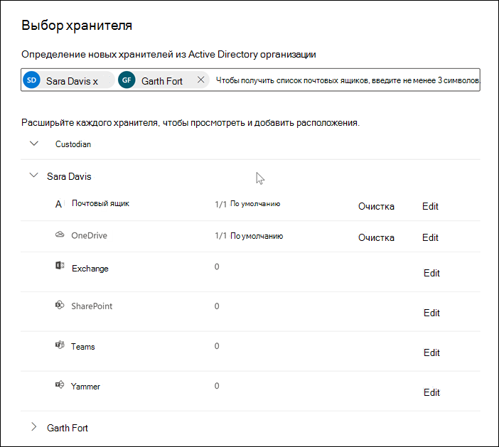
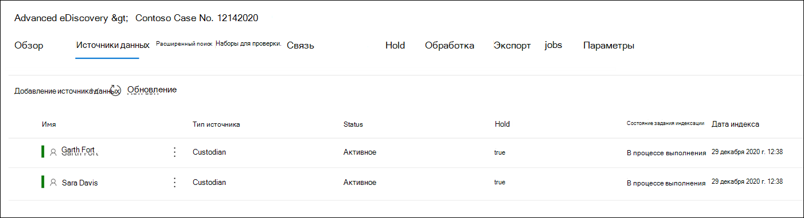

# Добавление хранителей в Advanced eDiscovery случаеAdd custodians to an Advanced eDiscovery case

Используйте встроенный инструмент управления хранителями в Advanced eDiscovery для координации рабочего процесса по управлению хранителями и выявлению соответствующих источников данных, связанных с делом.Use the built-in custodian management tool in Advanced eDiscovery to coordinate your workflows around managing custodians and identifying relevant, custodial data sources associated with a case. При добавлении хранителя система может автоматически идентифицировать и разместить удержание на Exchange и OneDrive для бизнеса учетной записи.When you add a custodian, the system can automatically identify and place a hold on their Exchange mailbox and OneDrive for Business account. В процессе обнаружения при расследовании можно также идентифицировать другие источники данных (например, почтовые ящики, сайты или Teams), к которые был предоставлен доступ к хранителям или к ним.During the discovery process of your investigation, you might also identify other data sources (such as mailboxes, sites, or Teams) that a custodian accessed or contributed to. В этой ситуации можно использовать средство управления хранителями, чтобы связать эти источники данных с конкретным хранителями.In this situation, you can use the custodian management tool to associate those data sources will a specific custodian. После добавления хранителей в дело и связи другого источника данных с ними можно быстро сохранить данные и поиска данных хранения.After you add custodians to a case and associate other data source with them, you can quickly preserve data and search the custodial data.

Вы можете добавлять и управлять хранителями в Advanced eDiscovery в четырех шагах:You can add and manage custodians in Advanced eDiscovery cases in four steps:

1. Определите хранителей.Identify the custodians.

2. Выберите расположения данных хранителя.Choose custodian data locations.

3. Настройка параметров удержания.Configure hold settings.

4. Просмотрите хранителей и завершите процесс.Review the custodians and complete the process.

   

## Убедитесь, что у вас есть необходимые разрешенияMake sure you have the necessary permissions

Чтобы добавить хранителей в дело, необходимо быть членом группы ролей диспетчера электронных открытий.To add custodians to a case, you must be a member of the eDiscovery Manager role group. Это предоставляет вам необходимые разрешения для добавления хранителей в дело и хранения источников данных.This provides you with the necessary permissions to add custodians to a case and place a hold on the custodial data sources. Дополнительные сведения см. в статье [Назначение разрешений на обнаружение электронных данных](get-started-with-advanced-ediscovery.md#step-2-assign-ediscovery-permissions).For more information, see [Assign eDiscovery permissions](get-started-with-advanced-ediscovery.md#step-2-assign-ediscovery-permissions).

## Шаг 1. Определение хранителейStep 1: Identify custodians

1. Войдите и войдите в учетную запись пользователя, которая получила соответствующие разрешения на [https://compliance.microsoft.com](https://compliance.microsoft.com) открытие электронных данных.Go to [https://compliance.microsoft.com](https://compliance.microsoft.com) and sign in with a user account that has been assigned the appropriate eDiscovery permissions.

2. В левой области навигации Центра соответствия требованиям Microsoft 365 нажмите **Показать все** и выберите **Обнаружение электронных данных > Дополнительно**.In the left navigation pane of the Microsoft 365 compliance center, click **Show all**, and then click **eDiscovery > Advanced**.

3. На **Advanced eDiscovery** нажмите вкладку **Cases** и выберите случай, в который необходимо добавить хранителей.On the **Advanced eDiscovery** page, click the **Cases** tab, and then select the case that you want to add custodians to.

4. Щелкните **вкладку Источники** данных и нажмите **кнопку Добавить источник данных** Добавить новые  >  **хранители**.Click the **Data sources** tab and then click **Add data source** > **Add new custodians**.

5. Добавьте в дело одного или несколько пользователей в качестве хранителей, введя первую часть имени или псевдонима пользователя.Add one or more users in your organization as custodians to the case by typing the first part of a person's name or alias. После того как вы найдете правильного человека, выберите его имя, чтобы добавить их в список.After you find the correct person, select their name to add them to the list.

## Шаг 2. Выбор расположения данных хранителяStep 2: Choose custodian data locations

После выбора хранителей система автоматически пытается определить и проверить этих пользователей и их источники данных.After you select custodians, the system automatically attempts to identify and verify these users and their data sources. После добавления хранителей в список средство автоматически включает основной почтовый ящик и OneDrive учетную запись для каждого хранителя.After adding custodians to the list, the tool automatically includes the primary mailbox and OneDrive account for each custodian. Вы можете не включать эти источники данных при добавлении хранителей в дело.You can choose not to include these data sources when adding custodians to the case.

Помимо почтового ящика и учетной записи OneDrive хранителя вы также можете связать другие расположения данных с хранителями, такими как сайт SharePoint или Microsoft Team, в который входит хранитель.In addition to a custodian's mailbox and OneDrive account, you can also associate other data locations to a custodian, such as SharePoint site or a Microsoft Team the custodian is a member of. Это позволяет сохранять, собирать, анализировать и анализировать контент в других источниках данных, связанных с хранителями дела.This allows you to preserve, collect, analyze, and review content in other data sources associated with the custodians of the case.

Для отселки основного почтового ящика и OneDrive учетной записи хранителя:To deselect the primary mailbox and OneDrive account for a custodian:

1. Раздвойте хранителя, чтобы просмотреть основные расположения данных, автоматически связанные с каждым хранителями.Expand the custodian to view the primary data locations that have been automatically associated to each custodian.

2. Выберите **Clear**  рядом с почтовым **ящиком или OneDrive,** чтобы удалить почтовый ящик или OneDrive или учетную запись хранителя в качестве расположения данных для этого хранителя.Select **Clear** next to **Mailbox** or **OneDrive** to remove a custodian's mailbox or OneDrive account from being associated as a data location for this custodian.

   

Чтобы связать другие почтовые ящики, сайты, Teams или Yammer группы с определенным хранителями:To associate other mailboxes, sites, Teams, or Yammer groups to a specific custodian:

1. Развяви хранителя, чтобы отобразить следующие службы, чтобы связать расположения данных с хранителями.Expand a custodian to display the following services to associate data locations with the custodian. Нажмите **кнопку Изменить** рядом со службой, чтобы добавить расположение данных.Click **Edit** next to a service to add a data location.

   - **Exchange:** Используйте для связывать другие почтовые ящики с хранителями.**Exchange**: Use to associate other mailboxes to the custodian. Введите в поле поиска имя или псевдоним (не менее трех символов) почтовых ящиков пользователей или групп рассылки.Type into the search box the name or alias (a minimum of three characters) of user mailboxes or distribution groups. Выберите почтовые ящики для назначения хранителю и нажмите кнопку **Добавить**.Select the mailboxes to assign to the custodian and then click **Add**.

   - **SharePoint:** Используйте для SharePoint сайтов с хранителями.**SharePoint**: Use to associate SharePoint sites to the custodian. Выберите сайт в списке или наведите URL-адрес в поле поиска.Select a site in the list or search for a site by typing a URL in the search box. Выберите сайты для назначения хранителю и нажмите кнопку **Добавить**.Select the sites to assign to the custodian and then click **Add**.

   - **Teams.** Используйте для назначения Microsoft Teams, в который в настоящее время входит хранитель.**Teams**: Use to assign the Microsoft Teams the custodian is currently a member of. Выберите группы, назначив хранителю, а затем нажмите **кнопку Добавить**.Select the teams to assign to the custodian and then click **Add**. После добавления группы система автоматически определяет и находит SharePoint и почтовый ящик группы, связанных с этой группой, и назначает их хранителю.After you add a team, the system automatically identifies and locates the SharePoint site and group mailbox associated to that team and assigns them to the custodian.

   - **Yammer:** Используйте для назначения Yammer групп, в которые в настоящее время входит хранитель.**Yammer**:  Use to assign the Yammer groups the custodian is currently a member of. Выберите группы для назначения хранителю и нажмите кнопку **Добавить**.Select the groups to assign to the custodian and then click **Add**. После добавления группы система автоматически определяет и находит SharePoint и почтовый ящик группы, связанных с этой группой, и назначает их хранителю.After you add a team, the system automatically identifies and locates the SharePoint site and group mailbox associated to that group and assigns them to the custodian.

   > [!NOTE]
   > Вы можете  использовать Exchange и **SharePoint** для связывать другие группы или группы Yammer (в которые хранитель не входит) с хранителями.You can use the **Exchange** and **SharePoint** location pickers to associate other teams or Yammer groups (that a custodian is not a member of) to a custodian. Для этого необходимо добавить почтовый ящик и сайт, связанный с каждой группой или Yammer группой.To do this, you have to add both the mailbox and site associated with each team or Yammer group.

2. Вы можете просмотреть общее число почтовых ящиков, сайтов, Teams и Yammer групп, назначенных каждому хранителя, расширяя каждый хранитель в таблице.You can view the total number of mailboxes, sites, Teams, and Yammer groups assigned to each custodian by expanding each custodian in the table. Когда вы завершите назначенное расположение данных для каждого хранителя, эти ассоциации будут поддерживаться и использоваться во время этапов сбора, обработки и проверки в процессе Advanced eDiscovery процесса.When you've finalized the assigned data locations for each custodian, these associations will be maintained and used during the collection, processing, and review stages in the Advanced eDiscovery workflow.

3. После добавления хранителей и настройки расположения данных щелкните **Далее,** чтобы перейти на страницу **Параметры удержания.**After adding custodians and configuring their data locations, click **Next** to go to the **Hold settings** page.  

## Шаг 3. Настройка параметров удержанияStep 3: Configure hold settings

 После завершения работы с хранителями и расположениями данных можно придержать некоторых или всех хранителей.After you've finalized the custodians and their data locations, you can place some or all of the custodians on hold. При удержании хранителя все содержимое во всех расположениях контента, связанных с хранителями, сохраняется до удаления удержания или освобождения хранителя из удержания.When you place a custodian on hold, all content in all content locations that are associated with the custodian is preserved until you remove the hold or release the custodian from the hold. В некоторых случаях может потребоваться добавить хранителей в дело, не помещая их на удержание.In some cases, you may want to add custodians to a case without placing them on hold.

Для удержания хранителей и источников данных:To place the custodians and data sources on hold:

1. На странице **Параметры удержания** можно применить удержание к отдельным хранителям, выбрав почтовый ящик в столбце **Удержание.**On the **Hold settings** page, you can apply a hold to individual custodians by selecting the checkbox under the **Hold** column.

   Кроме того, вы можете разместить всех хранителей на удержание, выбрав контрольный ящик **Hold** в верхней части столбца.Alternatively, you can place all custodians on hold by selecting the **Hold** checkbox at the top of the column.

2. Проверьте выборы удержания хранителя и нажмите кнопку **Далее**.Verify the custodian hold selections and then click **Next**.

   > [!NOTE]
   > Если не разместить удержание на хранителях, хранитель и связанные с ним источники данных будут добавлены в дело, но содержимое в этих источниках данных не будет сохранено удержанием, связанным с делом.If you don't place a hold on a custodian, the custodian and their associated data sources will be added to the case but the content in those data sources won't preserved by the hold that associated with the case.

## Шаг 4. Просмотр хранителей и завершение процессаStep 4: Review the custodians and complete the process

Перед добавлением хранителей в дело можно просмотреть список хранителей, назначенное им расположение данных и параметры хранения.Before you actually add the custodians to the case, you can review the list of custodians, the data locations assigned to them, and the hold settings.

1. Проверка и проверка всех источников данных и параметр удержания, связанных с каждым хранителями в таблице.Verify and review all the data sources count and the hold setting associated with each custodian in the table. При необходимости перейдите на страницу **Определить хранителя** или **параметры удержания,** чтобы внести какие-либо изменения.If necessary, go back to the **Identify custodian** or **Hold settings** pages to make any changes.

2. Щелкните **Отправить,** чтобы добавить хранителей и их расположения данных в дело и применить все параметры хранения.Click **Submit** to add custodians and their data locations to the case and apply all custodial hold settings.

   Новые хранители добавляются в дело и отображаются на вкладке **Источники** данных.The new custodians are added to the case and displayed on the **Data sources** tab.

   
