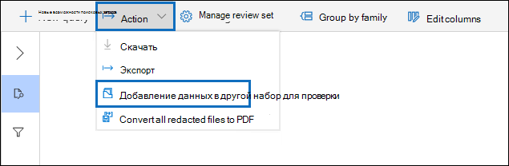

# Добавление данных в набор проверки из другого набора проверки

В некоторых случаях может потребоваться выбрать документы из одного набора проверки и работать с ними по отдельности в другом наборе рецензирования. Это особенно полезно, если вы использи контент из набора проверки и хотите запустить аналитику для подмножества данных.

Выполните действия, описанные в этой статье, чтобы добавить контент из одного набора проверки в другой.

## Создание набора проверки

Прежде чем начать, необходимо создать набор проверки, чтобы добавить данные в.  Новый набор проверки можно добавить на вкладке " **наборы проверки** ". Дополнительные сведения можно найти [в статье Создание набора проверки](managing-review-sets.md#create-a-review-set).

## Шаг 1: Определение контента для добавления в другой набор проверки

Вы можете добавить содержимое из одного набора проверки в другой, выбрав определенные документы в наборе проверки источника или выбрав все элементы, возвращенные в запросе на выборку результатов проверки. Если вы добавляете выбранные элементы, выберите их, выберите **действие**и нажмите кнопку **Добавить в другой набор рецензирования**.

## Шаг 2: Указание параметров для добавления в другой набор рецензирования

В раскрывающейся панели " **Добавить в другую проверку** " выберите набор проверок, в который нужно добавить элементы. Выберите, нужно ли добавить **все результаты поиска** или **Выбранные элементы**.  **Дополнительные сведения** предоставляют параметры для включения всех метаданных из элементов и того, следует ли включать теги (устанавливая флажок **метки** ) из проверки источника при добавлении документов в новый набор рецензирования.  

После нажатия кнопки **ОК**создается новое задание (с именем **Добавление данных в другой набор проверки**) для добавления контента в другой набор рецензирования. Вы можете перейти на вкладку **задания** и следить за ходом выполнения этого задания. Более подробную информацию можно узнать в статье [Управление заданиями](managing-jobs-ediscovery20.md).
