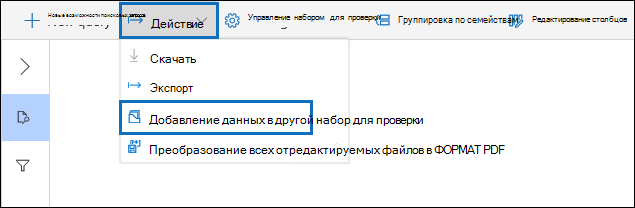

# Добавление данных из одного набора для проверки в другой набор для проверкиAdd data to a review set from another review set

В некоторых случаях может потребоваться выбрать документы из одного набора обзоров и работать с ними по отдельности в другом наборе обзоров.In some cases, it may be necessary to select documents from one review set and work with them individually in another review set. Это особенно полезно, если вы отобрали содержимое из набора для проверки и хотите проанализировать подмножество данных.This is especially useful if you've culled content in a review set and want to run analytics on the subset of data.

Следуйте рабочего процесса в этой статье, чтобы добавить содержимое из одного набора обзоров в другой.Follow the workflow in this article to add content from one review set to another.

## Создание набора отзывовCreate a review set

Перед началом необходимо создать набор отзывов, чтобы добавить данные.Before you start, you'll need to create a review set to add the data to.  Новый набор отзывов можно добавить на **вкладке Наборы** обзоров дела.A new review set can be added on the **Review sets** tab of the case. Дополнительные сведения см. в [обзоре Create a review set.](managing-review-sets.md#create-a-review-set)For more information, see [Create a review set](managing-review-sets.md#create-a-review-set).

## Шаг 1. Определение содержимого для добавления в другой набор обзоровStep 1: Identify content to add to another review set

Вы можете добавить содержимое из одного набора для проверки в другой, выбрав определенные документы в исходном наборе для проверки или выбрав все элементы, возвращенные запросом набора для проверки.You can add content from one review set to another one by selecting specific documents in the source review set or by selecting all items returned by review set query. Если вы добавляете выбранные элементы, выберите элементы, выберите **Действие,** а затем выберите **Добавить к другому набору отзывов.**If you're adding selected items, select the items, select **Action**, and then select **Add to another review set**.

## Шаг 2. Укажите параметры для добавления в другой набор обзоровStep 2: Specify options for adding to another review set

На странице **Добавление к другому набору параметров** обзора выберите набор отзывов, в который необходимо добавить элементы.In the **Add to another review set options** flyout page, choose the review set you want to add the items to. Выберите, добавлять ли **все результаты поиска** или **выбранные элементы.**Choose whether to add **All search results** or **Selected items**.  **Дополнительные** сведения содержат параметры, включающие все метаданные из элементов, а также сведения о том, следует ли включать теги (путем выбора контрольного окна **Метки)** из набора исходных отзывов при добавлении документов в новый набор обзоров.**Additional information** provides options to include all metadata from the items and whether to include the tags (by selecting the **Labels** check box) from the source review set when the documents are added to the new review set.  

После нажатия **кнопки Ок** создается новое задание (с именем **Добавление** данных в другой набор отзывов), чтобы добавить содержимое в другой набор обзоров.After you click **Ok**, a new job (named **Adding data to another review set**) is created to add the content to another review set. Вы можете перейти на **вкладку Jobs** и отслеживать ход выполнения этой работы.You can go to the **Jobs** tab and monitor the progress of this job. Дополнительные сведения см. в см. [в "Управление заданиями".](managing-jobs-ediscovery20.md)For more information, see [Manage jobs](managing-jobs-ediscovery20.md).
