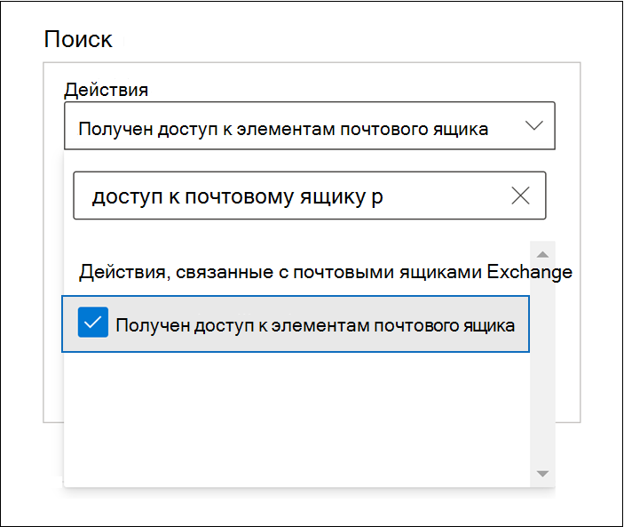
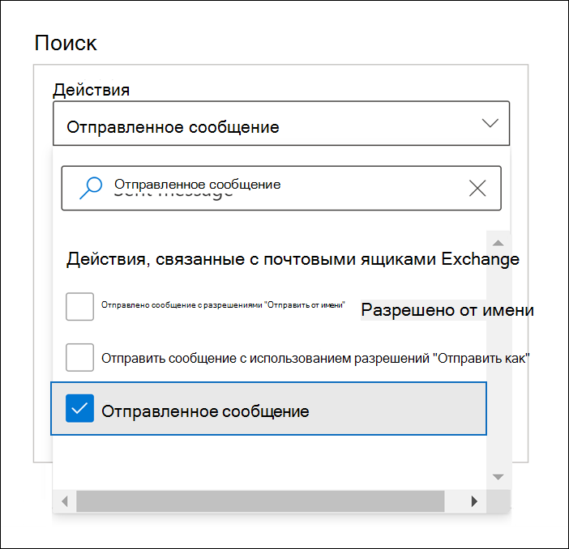
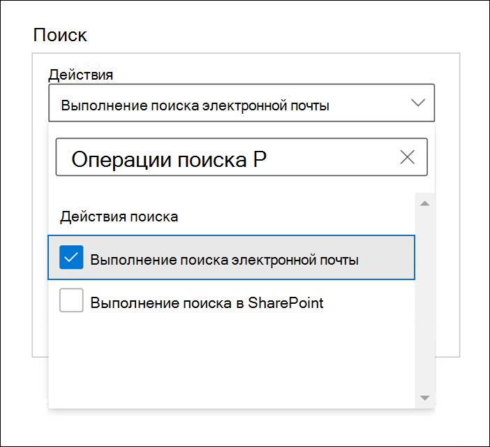
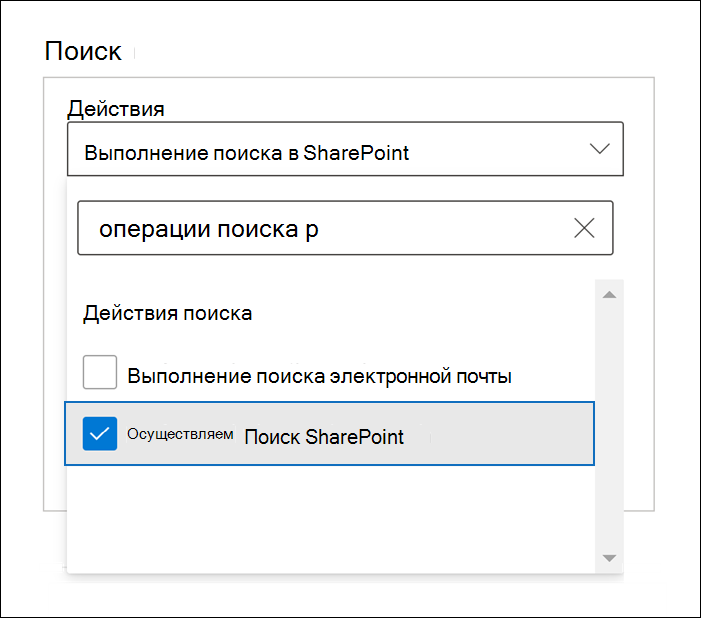

# Расширенный аудит в Microsoft 365

[Функция единого аудита](search-the-audit-log-in-security-and-compliance.md) в Microsoft 365 предоставляет организациям обзор различных типов действий, подлежащих аудиту, в различных службах Microsoft 365. Благодаря расширенному аудиту организации могут проводить расследования и анализ соответствия требованиям, увеличивая срок хранения журнала аудита, необходимого для проведения расследования, и предоставляя доступ к важным событиям, которые помогают определить масштаб угрозы и ускорить доступ к API действий управления Office 365.

> [!NOTE]
> Расширенный аудит доступен организациям с подпиской на Office 365 E5/A5/G5 или Microsoft 365 корпоративный E5/A5/G5. Кроме того, пользователям можно назначать дополнительную лицензию на службу "Соответствие требованиям Microsoft 365 E5/A5/G5" или "Обнаружение электронных данных и аудит в Microsoft 365 E5/A5/G5", когда требуется лицензирование каждого пользователя для функций расширенного аудита, например в случае длительного хранения журналов аудита и доступа к важным событиям для расследований. Дополнительные сведения о лицензировании см. в разделе: - [Требования лицензирования к расширенному аудиту](auditing-solutions-overview.md#licensing-requirements) - [Руководство по лицензированию Microsoft 365 для обеспечения безопасности и соответствия требованиям](/office365/servicedescriptions/microsoft-365-service-descriptions/microsoft-365-tenantlevel-services-licensing-guidance/microsoft-365-security-compliance-licensing-guidance#advanced-audit).

В этой статье содержится обзор возможностей расширенного аудита и показано, как настроить его для пользователей.

## Длительное хранение журналов аудита

Расширенный аудит сохраняет все записи аудита Exchange, SharePoint и Azure Active Directory в течение одного года. Это обеспечивается стандартной политикой хранения журнала аудита, сохраняющей в течение одного года все записи аудита, содержащие значение **Exchange**, **SharePoint** или **AzureActiveDirectory** для свойства **Workload** (указывает службу, в которой произошло действие).  Хранение записей аудита в течение более длительных периодов может помочь при проведении расследований и анализа соответствия требованиям. Дополнительные сведения см. в разделе "Политика хранения журнала аудита по умолчанию" статьи [Управление политиками хранения журнала аудита](audit-log-retention-policies.md#default-audit-log-retention-policy).

Кроме того, мы предоставляем возможность хранить журналы аудита в течение 10 лет. Хранение журналов аудита в течение 10 лет помогает поддержать длительные расследования и реагировать на нормативные, правовые и внутренние обязательства.

> [!NOTE]
> Для хранения журналов аудита в течение 10 лет потребуется дополнительная лицензия. Дополнительные сведения см. в разделе [Вопросы и ответы по расширенному аудиту](#faqs-for-advanced-audit) этой статьи.

### Политики хранения журнала аудита

Все записи аудита, созданные в других службах, не охватываемых политикой хранения журналов аудита по умолчанию (описанной в предыдущем разделе), сохраняются в течение 90 дней. Но вы можете создавать настраиваемые политики хранения журналов аудита для сохранения других записей аудита в течение более длительных периодов времени — до 10 лет. Можно создать политику для хранения записей аудита на основе одного или нескольких условий, указанных ниже:

- Служба Microsoft 365, в которой происходят действия, подлежащие аудиту

- Конкретные действия, подлежащие аудиту.

- Пользователь, выполняющий действие, подлежащее аудиту.

Кроме того, вы можете указать срок хранения записей аудита, соответствующих политике, и уровень приоритета, чтобы определенные политики получали приоритет над другими политиками. Также обратите внимание, что любая настраиваемая политика хранения журнала аудита будет иметь приоритет над политикой хранения аудита по умолчанию, если вам потребуется сохранить записи аудита Exchange, SharePoint или Azure Active Directory сроком менее года (или более 10 лет) для некоторых или всех пользователей в организации. Дополнительные сведения см. в статье [Управление политиками хранения журнала аудита](audit-log-retention-policies.md).

## Доступ к важным событиям для расследований

Благодаря расширенному аудиту организации могут проводить расследования и анализ соответствия требованиям, предоставляя доступ к важным событиям, таким как информация о времени доступа к элементам почты, времени ответа на сообщения или их пересылки, а также о том, когда и что пользователь искал в Exchange Online и SharePoint Online. Эти важные события могут помочь исследовать возможные нарушения безопасности и определить масштаб угрозы.  Расширенный аудит предоставляет следующие важные события:

- [MailItemsAccessed](#mailitemsaccessed)

- [Send](#send)

- [SearchQueryInitiatedExchange](#searchqueryinitiatedexchange)*

- [SearchQueryInitiatedSharePoint](#searchqueryinitiatedsharepoint)*

> [!NOTE]
> * В настоящий момент это событие недоступно в Office 365 и в средах Microsoft 365 для государственных организаций. Включает среды GCC, GCC High и DoD.

### MailItemsAccessed

Событие MailItemsAccessed является действием аудита почтового ящика и инициируется, когда доступ к данным почты осуществляется с помощью почтовых протоколов и почтовых клиентов. Действие MailItemsAccessed помогает следователям выявить нарушения безопасности данных и определить количество сообщений, которые могли быть скомпрометированы. Если злоумышленник получает доступ к сообщениям электронной почты, действие MailItemsAccessed запускается даже в том случае, когда нет явного сигнала, что сообщения были действительно прочитаны (т. е. тип доступа, например с помощью привязки или синхронизации, регистрируется в записи аудита).

Действие почтового ящика MailItemsAccessed заменяет MessageBind в журнале аудита почтового ящика в Exchange Online и предоставляет следующие улучшения:

- Действие MessageBind можно было настраивать только для типа входа пользователя AuditAdmin. Оно не применялось к действиям делегирования или владельца. MailItemsAccessed применяется ко всем типам входа.

- Действие MessageBind охватывает только доступ почтовым клиентом. Оно не применяется к действиям синхронизации. События MailItemsAccessed запускаются с помощью доступа привязки и синхронизации.

- Действия MessageBind запускали создание нескольких записей аудита при обращении к одному сообщению, что приводило к "шуму" в аудите. В отличие от них события MailItemsAccessed собираются в меньшем числе записей аудита.

Сведения о записях аудита см. в статье [Исследование скомпрометированных учетных записей с помощью расширенного аудита](mailitemsaccessed-forensics-investigations.md).

Чтобы найти записи аудита о MailItemsAccessed, можно выполнить поиск по действию **Доступ к элементам почтового ящика** в раскрывающемся списке **Действия для почтового ящика Exchange** в разделе [Инструмент поиска в журнале аудита](search-the-audit-log-in-security-and-compliance.md) в Центре соответствия требованиям Microsoft 365.

Кроме того, можно запустить команду [Search-UnifiedAuditLog -Operations MailItemsAccessed](/powershell/module/exchange/search-unifiedauditlog) или [Search-MailboxAuditLog -Operations MailItemsAccessed](/powershell/module/exchange/search-mailboxauditlog) в Exchange Online PowerShell.

### Send

Событие Send также является действием аудита почтового ящика и инициируется, когда пользователь выполняет одно из указанных ниже действий.

- Отправляет сообщение электронной почты

- Отвечает на сообщение электронной почты

- Пересылает сообщение электронной почты

Следователи могут использовать событие Send для определения сообщений, отправленных из скомпрометированной учетной записи. Запись аудита для события Send содержит сведения о сообщении, например о том, когда сообщение было отправлено, идентификатор сообщения Интернета, строку темы и сведения о том, содержало ли сообщение вложения. Эти данные аудита помогают следователям определить сведения о сообщениях электронной почты, отправленных из скомпрометированной учетной записи или злоумышленником. Кроме того, следователи могут использовать средство обнаружения электронных данных Microsoft 365 для поиска сообщения (используя строку темы или идентификатор сообщения) с целью определения получателей сообщения, а также фактического содержимого отправленного сообщения.

Чтобы найти записи аудита о Send, можно выполнить поиск по действию **Отправленное сообщение** в раскрывающемся списке **Действия для почтового ящика Exchange** в разделе [Инструмент поиска в журнале аудита](search-the-audit-log-in-security-and-compliance.md) в Центре соответствия требованиям Microsoft 365.

Кроме того, можно запустить команду [Search-UnifiedAuditLog -Operations Send](/powershell/module/exchange/search-unifiedauditlog) или [Search-MailboxAuditLog -Operations Send](/powershell/module/exchange/search-mailboxauditlog) в Exchange Online PowerShell.

### SearchQueryInitiatedExchange

Событие SearchQueryInitiatedExchange инициируется, когда кто-нибудь использует Outlook для поиска элементов в почтовом ящике. События инициируются при выполнении поисковых запросов в следующих средах Outlook.

- Outlook (классический клиент)

- Outlook в Интернете (OWA)

- Outlook для iOS

- Outlook для Android

- Приложение "Почта" для Windows 10

Следователи могут использовать событие SearchQueryInitiatedExchange, чтобы определить, пытался ли злоумышленник, который скомпрометировал учетную запись, получить доступ к конфиденциальной информации в почтовом ящике. Запись аудита для события SearchQueryInitiatedExchange содержит такие сведения, как фактический текст поискового запроса. Запись аудита также указывает среду Outlook, в которой выполняется поиск. Просматривая поисковые запросы, которые мог выполнить злоумышленник, следователь может лучше понять цели поиска данных электронной почты.

Чтобы найти записи аудита о SearchQueryInitiatedExchange, можно выполнить поиск по действию **Выполненные поисковые запросы в электронной почте** в раскрывающемся списке **Действия поиска** в разделе [Инструмент поиска в журнале аудита](search-the-audit-log-in-security-and-compliance.md) в Центре соответствия требованиям.

В Exchange Online PowerShell также можно выполнить [Search-UnifiedAuditLog -Operations SearchQueryInitiatedExchange](/powershell/module/exchange/search-unifiedauditlog).

> [!NOTE]
> Необходимо включить запись SearchQueryInitiatedExchange для поиска этого события в журнале аудита. Инструкции см. в разделе [Настройка расширенного аудита](set-up-advanced-audit.md#step-2-enable-crucial-events).

### SearchQueryInitiatedSharePoint

Аналогично поиску элементов в почтовом ящике, событие SearchQueryInitiatedSharePoint инициируется, когда пользователь ищет элементы в SharePoint. События инициируются при выполнении поисковых запросов на следующих типах сайтов SharePoint.

- Домашние сайты

- Информационные сайты

- Центральные сайты

- Сайты, связанные с Microsoft Teams

Следователи могут использовать событие SearchQueryInitiatedSharePoint, чтобы определить, пытался ли злоумышленник найти (и успешно ли) конфиденциальную информацию в SharePoint. Запись аудита для события SearchQueryInitiatedSharePoint также содержит фактический текст поискового запроса. Запись аудита также указывает на тип сайта SharePoint, на котором выполнялся поиск. Просматривая поисковые запросы, которые мог выполнить злоумышленник, следователь может лучше понять цели и объем искомых данных файлов.

Чтобы найти записи аудита о SearchQueryInitiatedSharePoint, можно выполнить поиск по действию **Выполненные поисковые запросы SharePoint** в раскрывающемся списке **Действия поиска** в разделе [Инструмент поиска в журнале аудита](search-the-audit-log-in-security-and-compliance.md) в Центре соответствия требованиям.

В Exchange Online PowerShell также можно выполнить [Search-UnifiedAuditLog -Operations SearchQueryInitiatedSharePoint](/powershell/module/exchange/search-unifiedauditlog).

> [!NOTE]
> Необходимо включить запись SearchQueryInitiatedSharePoint для поиска этого события в журнале аудита. Инструкции см. в разделе [Настройка расширенного аудита](set-up-advanced-audit.md#step-2-enable-crucial-events).

## Доступ с высокой пропускной способностью к API действий управления Office 365

В организациях, обращающихся к журналам аудита с помощью API действий управления Office 365, применялись ограничения регулирования на уровне издателя. Это означает, что для извлечения данных издателем от имени нескольких клиентов ограничение распространялось на всех этих клиентов.

С выпуском расширенного аудита мы переходим с ограничения на уровне издателя к ограничению на уровне клиента. В результате каждая организация будет иметь собственную полностью выделенную квоту пропускной способности для доступа к данным аудита. Пропускная способность не является статическим, предварительно определенным пределом, но она моделируется на основе сочетания факторов, включая число рабочих мест в организации и получение организациями E5/A5/G5 большей пропускной способности по сравнению с организациями без плана E5/A5/G5.

Для всех организаций изначально выделяется базовый уровень 2 000 запросов в минуту. Это ограничение будет динамически увеличиваться в зависимости от числа рабочих мест в организации и их подписок на лицензии. Организации E5/A5/G5 получат примерно вдвое большую пропускную способность, чем организации без плана E5/A5/G5. Для защиты работоспособности службы также будет использоваться ограничение максимальной пропускной способности.

Дополнительные сведения см. в разделе "Регулирование API" статьи [Справочник по API действий управления Office 365](/office/office-365-management-api/office-365-management-activity-api-reference#api-throttling).

## Вопросы и ответы по расширенному аудиту

**Нужна ли каждому пользователю лицензия на выпуск E5/A5/G5, чтобы пользоваться преимуществами расширенного аудита?**

Для доступа пользователя к функциональным возможностям расширенного аудита ему должна быть назначена лицензия E5/A5/G5. Некоторые функции проверяют наличие у пользователя соответствующей лицензии перед тем, как предоставить ему возможность работать с ними. Например, если вы попытаетесь сохранить записи аудита для пользователя, которому не назначена необходимая лицензия на срок более 90 дней, система выведет сообщение об ошибке.

**У моей организации есть подписка E5/A5/G5. Что мне нужно сделать, чтобы получить доступ к записям аудита о важных событиях?**

Соответствующим клиентам и пользователям, которым назначена соответствующая лицензия, не надо предпринимать никаких действий для получения доступа к важным событиям аудита.

**Что произойдет с данными журнала аудита моей организации, если политика 10-летнего срока хранения журналов аудита создана, когда возможность уже стала общедоступной, но до того, как стала доступна дополнительная лицензия?**

Все данные журнала аудита, на которые распространяется политика 10-летнего срока хранения журналов аудита, созданные после того, как возможность стала общедоступной в последний квартал 2020 года, будут храниться в течение 10 лет. Сюда также относятся политики 10-летнего срока хранения журналов аудита, которые были созданы до выпуска в продажу необходимой дополнительной лицензии. Тем не менее, поскольку дополнительная лицензия на 10-летний срок хранения журналов аудита уже доступна, то вам необходимо приобрести эти дополнительные лицензии для всех пользователей, чьи данные аудита хранятся согласно политике 10-летнего срока хранения журналов аудита.

**Доступны ли новые события расширенного аудита в API действий управления Office 365?**

Да. Если для пользователей с соответствующей лицензией создаются записи аудита, то вы можете получить доступ к этим записям через API действий управления Office 365.

**Влияет ли увеличение пропускной способности на уменьшение задержек или улучшение условий соглашения об уровне обслуживания?**

В настоящее время высокая пропускная способность обеспечивает улучшение потока, особенно в организациях с большим объемом сигналов аудита и значительным потреблением. Большая пропускная способность может привести к уменьшению задержек. Однако условия соглашения об уровне обслуживания не связаны с высокой пропускной способностью. В документации зафиксированы стандартные задержки, которые не изменятся с выходом расширенного аудита.
