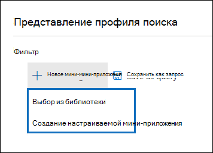

# Расширенная панель мониторинга обнаружения электронных данных для наборов проверок (Предварительная версия)

В некоторых случаях для расширенного обнаружения электронных данных может потребоваться проверить большой объем документов и сообщений электронной почты. Прежде чем начать процесс проверки, можно быстро проанализировать собрании, чтобы определить тенденции или ключевую статистику, которая поможет вам разработать стратегию рецензирования. Для этого вы можете использовать расширенную панель мониторинга обнаружения электронных данных для наборов проверок, чтобы быстро проанализировать собрании.

## Шаг 1: создание мини-приложения на панели мониторинга "набор проверки"

1. В центре безопасности & соответствия требованиям перейдите на **Обнаружение электронных данных > Advanced eDiscovery** для отображения списка дел в Организации.
  
2. Выберите существующее обращение.
  
3. Перейдите на вкладку **Рецензирование** и выберите набор рецензирования.
  
4. В раскрывающемся списке **отдельные результаты** выберите **представление профиля поиска**. 

   

   Отображается страница **представления профиля поиска** ; При первом отображении этой страницы отображаются три стандартных мини-пользователя.

   
  
5. Щелкните **новое мини** -приложение, а затем выберите один из следующих элементов:

   

   - **Выберите из библиотеки:** Отображает библиотеку Widgets по умолчанию. Щелкните мини-приложение и нажмите кнопку **Добавить** , чтобы добавить его в элементы widget на странице **представления профиля поиска** .
  
   - **Создание настраиваемого мини** -приложения: Отображает раскрывающуюся страницу, которую можно использовать для настройки настраиваемого мини-приложения. 

6. Чтобы создать настраиваемое мини-приложение, выполните следующие действия на всплывающей странице **Добавление мини** -приложения:

   

    а. Введите имя мини-приложения, которое отображается в строке заголовка мини-приложения. Имя мини-приложения является обязательным, но оно полезно для определения данных мини-приложения.

    б. Выберите свойство в выпадающем списке **Выбор сводной таблицы** , который будет использоваться для данных мини-приложения. Элементы в этом списке являются свойствами для поиска элементов в наборе рецензирования. Описание этих свойств приведено [в статье Document Metadata Fields in Advanced eDiscovery](document-metadata-fields-in-Advanced-eDiscovery.md). Параметры сведения для мини-приложения перечислены в столбце **имя поля для поиска** в этой статье.

    в. Выберите тип диаграммы, чтобы отобразить данные из выбранного свойства сведения.

  6. Нажмите кнопку **Добавить** , чтобы создать настраиваемое мини-приложение и отобразить его на странице **представления профиля поиска** .

## Шаг 2: Создание запроса на поиск набора проверки

1. Нажмите кнопку **..** . в строке заголовка мини-приложения, а затем выберите команду **применить условие**.

   

2. Чтобы создать фильтр, на всплывающей странице щелкните элемент в разделе Widget или widget Chart (мини-приложение).

   

3. Повторите шаги 1-2 для других графических подэлементов. 

4. Когда все будет готово, нажмите **Сохранить как запрос** , чтобы сохранить условия в качестве нового поискового запроса для набора проверки.

   

5. Закройте **представление профиля поиска** , чтобы вернуться к представлению результатов поиска.

   Если вы создали визуальные фильтры, результирующий запрос применяется к отображаемым результатам поиска, а запрос поиска, сохраненный на шаге 4, отображается в разделе **сохраненные запросы**. Дополнительные сведения о запросах Set см. [в статье запрос данных в наборе рецензирования](review-set-search.md).
