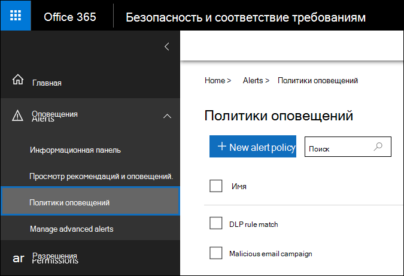
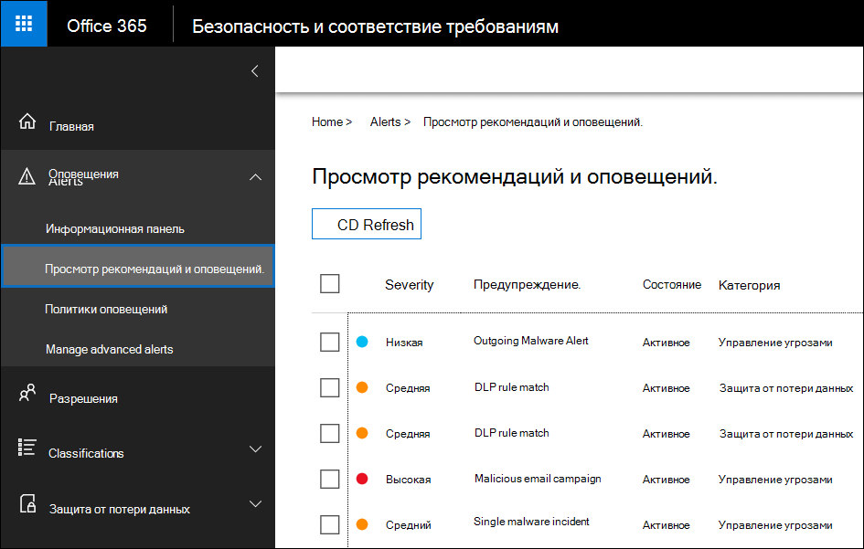
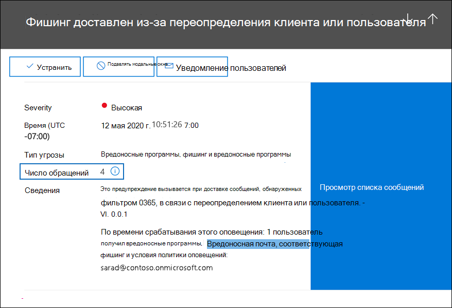
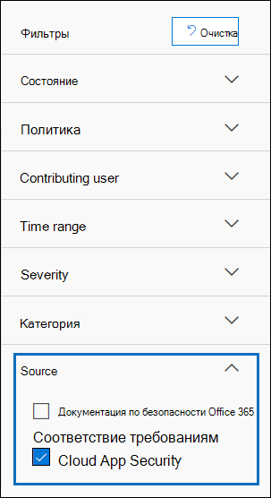
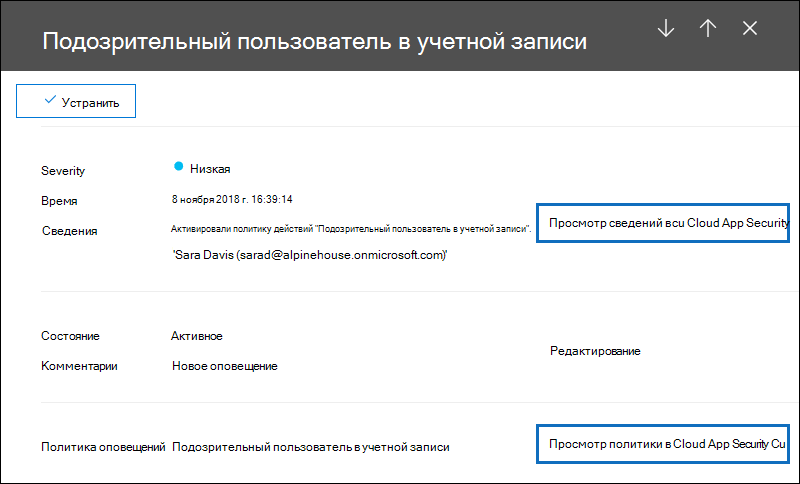

# <a name="alert-policies-in-the-security-and-compliance-center"></a>Политики оповещений в центре безопасности и соответствия

Вы можете использовать средства политики оповещений и панели мониторинга оповещений в центрах безопасности и соответствия требованиям Microsoft 365 для создания политик оповещений и просмотра оповещений, созданных при выполнении пользователем действий, соответствующих условиям политики оповещений.

Политики оповещений разворачивают и расширяют функциональные возможности оповещений о действиях, позволяя классифицировать политику оповещений, применять эту политику ко всем пользователям в Организации, устанавливать пороговый уровень для запуска оповещения, а также принимать уведомления о том, следует ли получать уведомления по электронной почте. Кроме того, в центре безопасности и соответствия требованиям отображается страница **оповещения о просмотре** , в которой можно просматривать и фильтровать оповещения, задавать состояние оповещения, которое поможет вам управлять оповещениями, а затем отклонить оповещения после того, как вы устранили или разрешили соответствующий инцидент. Мы также расширили тип событий, для которых вы можете создавать оповещения. Например, можно создать политики оповещений для отслеживания инцидентов активности вредоносных программ и потери данных. Мы также включили несколько политик оповещений по умолчанию, которые помогают отслеживать действия, такие как назначение привилегий администратора в Exchange Online, атаки вредоносных программ, фишинговых кампаний и необычные уровни удаления файлов и внешнего общего доступа.

> [!NOTE]
> Политики оповещений доступны для организаций с Microsoft 365 Enterprise, Office 365 корпоративный или Office 365 США E1/F1/G1, E3/G3 или/G5. Расширенные функциональные возможности доступны только для организаций с подпиской "1/G5" или для организаций с подпиской E1/F1/G1 или E3/G3 и Office 365 Advanced Threat protection (ATP) P2 или Microsoft 365 (на основе обнаружения электронных данных и аудита по надстройке Microsoft 365). В этой статье выделены функции, требующие использования подписки "/G5" или "добавить надстройку". Также обратите внимание на то, что политики оповещения доступны в средах Office 365 GCC, GCC High и DoD США.

## <a name="how-alert-policies-work"></a>Принципы работы политик оповещений

Ниже приведен краткий обзор действий политик оповещений и оповещений, которые инициируются при условии, что действия пользователя или администратора соответствуют условиям политики оповещений.


1. Администратор в Организации создает, настраивает и включает политику оповещений с помощью страницы **политики оповещений** в центре безопасности и соответствия требованиям. Политики оповещений также можно создать с помощью командлета **New – ProtectionAlert** в PowerShell центра безопасности & соответствия требованиям. Чтобы создать политики оповещений, необходимо назначить роль "Управление оповещениями" или "Настройка организации" в центре безопасности и соответствия требованиям.

   > [!NOTE]
   > После создания или обновления политики оповещений потребуется до 24 часов, прежде чем вы сможете активировать оповещения с помощью политики. Это вызвано тем, что политика должна быть синхронизирована с ядром обнаружения оповещений.

2. Пользователь выполняет действие, которое соответствует условиям политики оповещений. В случае атак вредоносных программ, зараженные сообщения электронной почты, отправленные пользователям в вашей организации, запускают оповещение.

3. Microsoft 365 создает оповещение, которое отображается на странице " **Просмотр оповещений** " центра безопасности & соответствия требованиям. Кроме того, если для политики оповещений включены уведомления по электронной почте, корпорация Майкрософт отправляет уведомление списку получателей. Оповещения, которые могут видеть Администратор или другие пользователи, на странице "Просмотр оповещений" определяются назначенными пользователю ролями. Дополнительные сведения см. в разделе [разрешения RBAC, необходимые для просмотра оповещений](#rbac-permissions-required-to-view-alerts) .

4. Администратор управляет оповещениями в центре безопасности и соответствия требованиям. Управление оповещениями состоит в назначении состояния оповещения для отслеживания и управления исследованием.

## <a name="alert-policy-settings"></a>Параметры политики оповещений

Политика оповещений состоит из набора правил и условий, определяющих действие пользователя или администратора, которое создает оповещение, список пользователей, которые инициируют оповещение, если они выполняют действие, и пороговое значение, определяющее, сколько раз это действие должно произойти до срабатывания оповещения. Вы также распределяете политику и назначаете ее уровню серьезности. Эти два параметра помогут управлять политиками оповещений (и оповещениями, которые запускаются при сосоответствии с условиями политики), так как их можно фильтровать при управлении политиками и просмотре оповещений в центре безопасности и соответствия требованиям. Например, вы можете просматривать оповещения, которые совпадают с условиями одной категории или представления оповещения с одинаковым уровнем серьезности.

Чтобы просмотреть и создать политики оповещений, перейдите в раздел [https://protection.office.com](https://protection.office.com) и выберите пункт **оповещения** о \> **политиках**оповещений.



Политика оповещений состоит из следующих параметров и условий.

- **Действие оповещение отслеживается** — вы создаете политику для отслеживания действий или в некоторых случаях несколько связанных действий, таких как общий доступ к файлу для внешнего пользователя, общий доступ к нему, назначение разрешений на доступ или создание анонимной ссылки. Когда пользователь выполняет действия, определенные политикой, оповещение инициируется на основе параметров порога оповещений.

    > [!NOTE]
    > Действия, которые можно отслеживать, зависят от плана Office 365 корпоративный или Office 365 для государственных организаций США. Как правило, для действий, связанных с кампаниями и фишингами вредоносных программ, требуется подписка с кодом "1/G5" или с подпиской E1/F1/G1 или E3/G3 с подпиской на надстройку [Office 365 Advanced Threat protection](../security/office-365-security/office-365-atp.md) (план 2).

- **Условия действий** — для большинства действий можно определить дополнительные условия, которые должны быть выполнены для запуска оповещения. Распространенные условия включают IP-адреса (поэтому оповещение инициируется, когда пользователь выполняет действия на компьютере с определенным IP-адресом или в диапазоне IP-адресов), является ли оповещение инициированным, если определенный пользователь или пользователи выполняют это действие, а также указывает, выполняется ли действие по определенному имени файла или URL-адресу. Кроме того, можно настроить условие, которое запускает оповещение при выполнении действия любым пользователем в Организации. Доступные условия зависят от выбранного действия.

- **При запуске оповещения** можно настроить параметр, определяющий частоту выполнения действия до запуска оповещения. Это позволяет настроить политику для создания оповещения каждый раз, когда действие соответствует условиям политики, при превышении определенного порогового значения или при возникновении события, которое оповещение становится нетипичным для вашей организации.

    

    Если выбрать параметр на основе необычных действий, Майкрософт устанавливает базовое значение, определяющее нормальную частоту для выбранного действия. Для установки этого базового плана требуется до семи дней, в течение которого не будут создаваться оповещения. После установки базового плана оповещение инициируется, когда частота действий, отслеживаемых политикой оповещений, значительно превышает базовое значение. Для действий, связанных с аудитом (например, для действий с файлами и папками), можно создать базовый план на основе одного пользователя или на основе всех пользователей в Организации; для действий, связанных с вредоносными программами, можно создать базовый план на основе одного семейства вредоносных программ, одного получателя или всех сообщений в Организации.

    > [!NOTE]
    > Для настройки политик оповещений, основанных на пороговом значении или на основе необычных действий, требуется подписка "1/G5", либо подписка E1/F1/G1 или E3/G3 с помощью подписки на Office 365 ATP P2, Microsoft 365 (Майкрософт) или Microsoft 365 eDiscovery и аудиту надстройки. Организации с подпиской E1/F1/G1 и E3/G3 могут создавать только политики оповещений, при которых оповещение инициируется каждый раз при возникновении действия.

- **Категория оповещения** — для отслеживания и управления оповещениями, созданными политикой, можно назначить политику одной из следующих категорий.

  - Защита от потери данных

  - Управление сведениями

  - Поток обработки почты

  - Разрешения

  - Управление угрозами

  - Другие

  Когда происходит действие, которое соответствует условиям политики оповещений, созданное оповещение отмечено категорией, определенной в этом параметре. Это позволяет отслеживать и управлять оповещениями с одинаковыми параметрами категории на странице " **Просмотр оповещений** " в центре безопасности и соответствия требованиям, так как вы можете сортировать и фильтровать оповещения в соответствии с категорией.

- **Серьезность оповещения** — аналогично категории оповещений, для политик оповещений назначается атрибут серьезности (**низкие**, **средние**, **высокие**или **информационные**). Как и категория оповещения, когда происходит действие, которое соответствует условиям политики оповещений, созданное оповещение помечается с использованием того же уровня серьезности, который задан для политики оповещений. Опять же, это позволяет отслеживать оповещения с одинаковым уровнем серьезности на странице " **Просмотр оповещений** " и управлять ими. Например, вы можете отфильтровать список оповещений, чтобы отображались только оповещения с **высокой** степенью серьезности.

    > [!TIP]
    > При настройке политики оповещений рекомендуется назначить действия, которые могут привести к серьезным негативным последствиям, таким как обнаружение вредоносных программ после доставки пользователям, просмотр конфиденциальных или классифицированных данных, совместное использование данных с внешними пользователями или другие действия, которые могут привести к потере данных или угрозам безопасности. Это может помочь при приоритизации оповещений и действиях, которые необходимо выполнить для исследования и разрешения базовых причин.

- **Уведомления по электронной почте** — вы можете настроить политику таким образом, чтобы уведомления по электронной почте отправляются (или не отправляются) в список пользователей при срабатывании оповещения. Вы также можете задать ежедневное ограничение для уведомлений, чтобы при достижении максимального числа уведомлений в течение этого дня не отправлялось больше уведомлений. Кроме уведомлений по электронной почте, вы или другие администраторы могут просматривать оповещения, активируемые политикой на странице " **Просмотр оповещений** ". Рекомендуется включить уведомления по электронной почте для политик оповещений определенной категории или с более высокой степенью серьезности.

## <a name="default-alert-policies"></a>Политики оповещений по умолчанию

Корпорация Майкрософт предоставляет встроенные политики оповещений, помогающие определить разрешения администратора Exchange, опасные действия, потенциальные внешние и внутренние угрозы, а также риски управления сведениями. На странице **политики оповещений** имена этих встроенных политик выделяются полужирным шрифтом, а тип политики определяется как **System**. Эти политики включены по умолчанию. Вы можете отключить эти политики (или снова включить), настроить список получателей для отправки уведомлений по электронной почте и задать ежедневное число уведомлений. Другие параметры для этих политик изменить нельзя.

В следующей таблице перечислены и описаны доступные политики оповещений по умолчанию и категория, которой назначена каждая политика. Категория используется, чтобы определить, какие оповещения может просматривать пользователь на странице "Просмотр оповещений". Дополнительные сведения см. в разделе [разрешения RBAC, необходимые для просмотра оповещений](#rbac-permissions-required-to-view-alerts) .

В таблице также указан план Office 365 корпоративный и Office 365 для государственных учреждений США, необходимый для каждого из них. Некоторые политики оповещений по умолчанию доступны, если ваша организация имеет соответствующую подписку на надстройку в дополнение к подписке E1/F1/G1 или E3/G3.

|**Политика оповещений по умолчанию**|**Описание**|**Категория**|**Подписка на Office 365 корпоративный**|
|:-----|:-----|:-----|:-----|
|**Обнаружен потенциально вредоносный URL-адрес.**|Создает оповещение, если пользователь, защищенный [Office 365 ATP Safe Links](../security/office-365-security/atp-safe-links.md) в вашей организации, щелкает вредоносную ссылку. Это событие инициируется, когда изменения вредоносности URL-адресов идентифицируются в Office 365 ATP или когда пользователи переопределяют страницы безопасных ссылок на Office 365 (на основе политики безопасных ссылок Microsoft 365 для бизнеса ATP). Для этой политики оповещений задана **Высокая** степень серьезности. Для Office 365 ATP P2, а в случае с клиентами, [а затем в office 365 автоматически активируется автоматическое исследование и ответ на](https://www.microsoft.com/?ref=go)него. Дополнительные сведения о событиях, инициирующих это оповещение, приведены в статье [Настройка политик безопасных ссылок на Office 365 ATP](../security/office-365-security/set-up-atp-safe-links-policies.md).|Управление угрозами|Подписка на надстройку "#/G5" или Office 365 ATP P2|
|**Завершенный результат отправки администратором**|Создает оповещение, когда [отправку администратором](../security/office-365-security/admin-submission.md) завершает повторное сканирование отправленной сущности. Оповещение запускается каждый раз при отправке результатов повторного сканирования от администратора. Эти оповещения предназначены для напоминания о [результатах предыдущих](https://protection.office.com/reportsubmission)отправок, отправки сообщений о пользователях, чтобы получить последнюю политику проверки и повторного сканирования вердиктс, а также помочь определить, имеют ли правила фильтрации в вашей организации желаемые последствия. Этот параметр имеет **низкую** серьезность.|Управление угрозами|E1/F1, E3 или "е"|
|**Создание правила переадресации и перенаправления**|Создает оповещение, когда кто-то в Организации создает правило для почтового ящика, которое перенаправляет сообщения на другую учетную запись электронной почты или перенаправляет их на другую учетную запись электронной почты. Эта политика отслеживает только правила для папки "Входящие", которые создаются с помощью Outlook в Интернете (прежнее название — Outlook Web App) или Exchange Online PowerShell. Этот параметр имеет **низкую** серьезность. Дополнительные сведения об использовании правил для папки "Входящие" для переадресации и перенаправления электронной почты в Outlook в Интернете приведены в статье [Использование правил в Outlook в Интернете для автоматической пересылки сообщений в другую учетную запись](https://support.office.com/article/1433e3a0-7fb0-4999-b536-50e05cb67fed).|Управление угрозами|E1/F1/G1, E3/G3, или//G5|
|**Поиск обнаружения электронных данных начат или экспортирован**|Создает оповещение, когда кто-то использует средство поиска контента в центре безопасности и соответствия требованиям. Оповещение инициируется при выполнении следующих действий по поиску контента: <br/><br/>* Начат поиск контента<br/>* Результаты поиска контента экспортируются<br/>* Отчет о поиске контента экспортирован<br/><br/>Оповещения также инициируются при выполнении предыдущих действий по поиску контента в связи с вариантом обнаружения электронных данных. Эта политика имеет параметр **Medium** Severity. Дополнительные сведения о действиях, выполняемых при поиске контента, приведены [в статье Поиск действий eDiscovery в журнале аудита](search-for-ediscovery-activities-in-the-audit-log.md#ediscovery-activities).|Управление угрозами|E1/F1/G1, E3/G3, или//G5|
|**Повышение прав администратора Exchange**|Создает оповещение, когда другому пользователю назначаются административные разрешения в организации Exchange Online. Например, когда пользователь добавляется в группу ролей Управление организацией в Exchange Online. Этот параметр имеет **низкую** серьезность.|Разрешения|E1/F1/G1, E3/G3, или//G5|
|**Сообщения электронной почты, содержащие вредоносную программу, удалена после доставки**|Создает оповещение, когда любые сообщения, содержащие вредоносные программы, доставляются в почтовые ящики в Организации. При возникновении этого события Майкрософт удаляет зараженные сообщения из почтовых ящиков Exchange Online, используя [Автоматическое удаление с нулевым временем](../security/office-365-security/zero-hour-auto-purge.md). Эта политика имеет **информационный** уровень серьезности и автоматически включает [Автоматическое исследование и ответ в Office 365](https://www.microsoft.com/?ref=go).|Управление угрозами|Подписка на надстройку "#/G5" или Office 365 ATP P2|
|**Сообщения электронной почты, содержащие URL-адреса фишинга, удаленные после доставки**|Создает оповещение, когда все сообщения, содержащие фишинг, доставляются в почтовые ящики в Организации. При возникновении этого события Майкрософт удаляет зараженные сообщения из почтовых ящиков Exchange Online, используя [Автоматическое удаление с нулевым временем](../security/office-365-security/zero-hour-auto-purge.md). Эта политика имеет **информационный** уровень серьезности и автоматически включает [Автоматическое исследование и ответ в Office 365](https://www.microsoft.com/?ref=go).|Управление угрозами|Подписка на надстройку "#/G5" или Office 365 ATP P2|
|**Сообщение электронной почты, предоставленное пользователем как вредоносная или фишинг**|Создает оповещение, когда пользователи в организации сообщают сообщения в виде фишинговых сообщений с помощью надстройки Report Message. Эта политика имеет **информационный** уровень серьезности. Дополнительные сведения об этой надстройке можно найти в статье [Использование надстройки Report Message](https://support.office.com/article/b5caa9f1-cdf3-4443-af8c-ff724ea719d2). Для Office 365 ATP P2, а в случае с клиентами, [а затем в office 365 автоматически активируется автоматическое исследование и ответ на](https://www.microsoft.com/?ref=go)него.|Управление угрозами|E1/F1/G1, E3/G3, или//G5|
|**Превышено ограничение на отправку электронной почты**|Создает оповещение, когда кто-то в Организации отправил больше почты, чем разрешено политикой исходящих сообщений о нежелательной почте. Обычно это указывает на то, что пользователь отправляет слишком много сообщений электронной почты или что эта учетная запись может быть скомпрометирована. Эта политика имеет параметр **Medium** Severity. Если вы получаете оповещение, созданное этой политикой оповещений, рекомендуется [проверить, скомпрометирована ли учетная запись пользователя](../security/office-365-security/responding-to-a-compromised-email-account.md).|Управление угрозами|E1/F1/G1, E3/G3, или//G5|
|**Сообщения с задержкой**|Создает оповещение, если корпорация Майкрософт не может доставить сообщения электронной почты в локальную организацию или на сервер-партнер с помощью соединителя. В этом случае сообщение помещается в очередь в Office 365. Это оповещение инициируется при наличии 2 000 или более сообщений в очереди в течение более часа. Для этой политики задана **Высокая** степень серьезности.|Поток обработки почты|E1/F1/G1, E3/G3, или//G5|
|**Обнаружена вредоносная кампания после доставки**|Создает оповещение, когда необычно большое количество сообщений, содержащих вредоносные программы, доставляется в почтовые ящики в Организации. При возникновении этого события Майкрософт удаляет зараженные сообщения из почтовых ящиков Exchange Online. Для этой политики задана **Высокая** степень серьезности.|Управление угрозами|Подписка на надстройку "#/G5" или Office 365 ATP P2|
|**Обнаружена и заблокирована кампания по вредоносным программам**|Создает оповещение, если кто-то попытался отправить необычно большое количество сообщений электронной почты, содержащих определенный тип вредоносных программ, для пользователей в вашей организации. При возникновении этого события зараженные сообщения блокируются корпорацией Майкрософт и не доставляются в почтовые ящики. Этот параметр имеет **низкую** серьезность.|Управление угрозами|Подписка на надстройку "#/G5" или Office 365 ATP P2|
|**В SharePoint и OneDrive обнаружена кампания по вредоносным программам**|Создает оповещение при обнаружении необычно большого объема вредоносных программ или вирусов в файлах, расположенных на сайтах SharePoint или в учетных записях OneDrive в Организации. Для этой политики задана **Высокая** степень серьезности.|Управление угрозами|Подписка на надстройку "#/G5" или Office 365 ATP P2|
|**Фишинг доставлен из-за перекрытия клиента или пользователя**<sup>1</sup>|Создает предупреждение, если корпорация Майкрософт обнаруживает, что администратор или пользователь переопределяет, разрешена ли доставка фишингового сообщения в почтовый ящик. Примеры переопределения включают правило почтового ящика или почтового ящика, которое разрешает сообщения от конкретного отправителя или домена или политику защиты от нежелательной почты, которая разрешает сообщения от определенных отправителей или доменов. Для этой политики задана **Высокая** степень серьезности.|Управление угрозами|Подписка на надстройку "#/G5" или Office 365 ATP P2|
|**Обнаружены подозрительные шаблоны отправки электронной почты**|Создает оповещение, если кто-то из вашей организации отправил подозрительные сообщения электронной почты и подвержено неограниченной отправке электронной почты. Это раннее предупреждение о поведении, которое может означать, что учетная запись скомпрометирована, но недостаточно серьезна для ограничения пользователя. Эта политика имеет параметр **Medium** Severity. Несмотря на то что это редкие, оповещение, создаваемое этой политикой, может быть аномалией. Тем не менее, рекомендуется [проверить, скомпрометирована ли учетная запись пользователя](../security/office-365-security/responding-to-a-compromised-email-account.md).|Управление угрозами|E1/F1/G1, E3/G3, или//G5  |
|**Клиент не ограничен отправку электронной почты**|Создает оповещение, если большая часть трафика электронной почты из вашей организации признана подозрительными, а ваша организация ограничила отправку электронной почты. Изучите все потенциально опасные учетные записи пользователей и администраторов, новые соединители или открывают ретрансляции, а затем обратитесь в службу поддержки Майкрософт, чтобы разблокировать вашу организацию. Для этой политики задана **Высокая** степень серьезности. Дополнительные сведения о том, почему Организации блокируются, можно найти [в статье Устранение проблем с доставкой электронной почты для кода ошибки 5.7.7 XX в Exchange Online](https://go.microsoft.com/fwlink/?linkid=2022138).|Управление угрозами|E1/F1/G1, E3/G3, или//G5|
|**Необычные действия внешнего файла пользователя**|Создает оповещение при необычном большом количестве действий с файлами в SharePoint или OneDrive пользователями, находящимися за пределами Организации. Сюда входят такие действия, как доступ к файлам, Загрузка файлов и удаление файлов. Для этой политики задана **Высокая** степень серьезности.|Управление сведениями|"/G5", "Office 365 ATP P2" или "Microsoft 365": Подписка на надстройку|
|**Нетипичный объем внешнего общего доступа к файлам**|Создает оповещение, если доступ к необычно большому количеству файлов в SharePoint или OneDrive предоставляется пользователям, не входящим в вашу организацию. Эта политика имеет параметр **Medium** Severity.|Управление сведениями|"/G5", "Office 365 ATP P2" или "Microsoft 365": Подписка на надстройку|
|**Нетипичный объем удаления файлов**|Создает оповещение, когда необычно большое количество файлов удаляется в SharePoint или OneDrive в течение короткого промежутка времени. Эта политика имеет параметр **Medium** Severity.|Управление сведениями|"/G5", "Office 365 ATP P2" или "Microsoft 365": Подписка на надстройку|
|**Необычное увеличение сообщения электронной почты в качестве фишинга**|Создает оповещение при значительном увеличении количества людей в Организации с помощью надстройки Message Report в Outlook для отправки сообщений в качестве фишинговых сообщений. Для этой политики задана **Высокая** степень серьезности. Дополнительные сведения об этой надстройке можно найти в статье [Использование надстройки Report Message](https://support.office.com/article/b5caa9f1-cdf3-4443-af8c-ff724ea719d2).|Управление угрозами|Подписка на надстройку "#/G5" или Office 365 ATP P2|
|**Поддельное имя пользователя для олицетворения доставлено в папку "Входящие"/"папка 1"**<sup>,</sup><sup>2</sup>|Создает предупреждение, если корпорация Майкрософт обнаружит, что пользователь, переопределяющий администратора или пользователя, разрешил сообщение о доставке олицетворения пользователя в папку "Входящие" (или в другую папку) почтового ящика. Примеры переопределения включают правило почтового ящика или почтового ящика, которое разрешает сообщения от конкретного отправителя или домена или политику защиты от нежелательной почты, которая разрешает сообщения от определенных отправителей или доменов. Эта политика имеет параметр **Medium** Severity.|Управление угрозами|Подписка на надстройку "#/G5" или Office 365 ATP P2|
|**Пользователю запрещено отправлять электронную почту.**|Создает оповещение, если кто-то из вашей организации запретил отправку исходящей почты. Обычно это происходит, когда учетная запись скомпрометирована, а пользователь отображается на странице " **Пользователи с ограниченным доступом** " в центре безопасности & соответствия требованиям. (Чтобы открыть эту страницу, перейдите в раздел **Управление угрозами > проверить > ограниченных пользователей**). Для этой политики задана **Высокая** степень серьезности. Дополнительные сведения об ограниченных пользователях приведены [в статье Удаление пользователя, домена или IP-адреса из черного списка после отправки нежелательной почты](https://docs.microsoft.com/office365/securitycompliance/removing-user-from-restricted-users-portal-after-spam).|Управление угрозами|E1/F1/G1, E3/G3, или//G5|
|||||

> [!NOTE]
> <sup>1</sup> мы временно удалили эту политику оповещений по умолчанию на основе отзывов пользователей. Мы работаем над ее усовершенствованием и заменили ее новой версией в ближайшем будущем. Пока вы можете создать настраиваемую политику оповещений для замены этой функции, используя следующие параметры:<br/>&nbsp;* Действие обнаружило электронное сообщение с фишингом во время доставки<br/>&nbsp;* Почта не является ZAP<br/>&nbsp;* Направление почты — входящий<br/>&nbsp;* Состояние доставки почты доставлено<br/>&nbsp;* Технология обнаружения это вредоносный URL-адрес, URL-адрес детонации, расширенный фильтр фишинга, общий фильтр фишинга, олицетворение домена, олицетворение пользователя и олицетворение<br/><br/>&nbsp;&nbsp;&nbsp;Дополнительные сведения о защите от фишинга в Office 365 можно найти в статье [Настройка защиты от](../security/office-365-security/set-up-anti-phishing-policies.md)фишинга и антифишинга.<br/><br/><sup>2</sup> чтобы повторно создать эту политику оповещений, следуйте указаниям, приведенным в предыдущей сноске, но выберите олицетворение пользователя в качестве единственной технологии обнаружения.

Необычные действия, контролируемые некоторыми встроенными политиками, основываются на том же процессе, что и ранее описанный параметр порога оповещения. Корпорация Майкрософт устанавливает базовое значение, определяющее нормальную частоту "обычных" действий. Оповещения инициируются, когда частота действий, отслеживаемых встроенной политикой оповещений, значительно превышает базовое значение.

## <a name="viewing-alerts"></a>Просмотр оповещений

Когда действие, выполняемое пользователями в Организации, соответствует параметрам политики оповещений, создается оповещение и отображается на странице " **Просмотр оповещений** " в центре безопасности и соответствия требованиям. В зависимости от параметров политики оповещений по электронной почте также отправляются уведомления по электронной почте в список указанных пользователей при срабатывании оповещения. Для каждого оповещения панель мониторинга на странице " **Просмотр оповещений** " отображает имя соответствующей политики оповещений, серьезность и категорию для оповещения (определенного в политике оповещений), а также число произошедших действий, которые привели к созданию оповещения. Это значение основано на параметре порога политики оповещений. Кроме того, на панели мониторинга отображается состояние каждого оповещения. Для получения дополнительных сведений об использовании свойства Status для управления оповещениями обратитесь к разделу [Управление оповещениями](#managing-alerts) .

Чтобы просмотреть оповещения, перейдите к разделу, [https://protection.office.com](https://protection.office.com) а затем выберите **оповещения** \> **Просмотр оповещений**.



Вы можете использовать следующие фильтры для просмотра подмножества оповещений на странице " **Просмотр оповещений** ".

- **Состояние.** Используйте этот фильтр для отображения оповещений, которым назначено определенное состояние. Состояние по умолчанию — " **активно**". Вы или другие администраторы можете изменить значение состояния.

- **Политику.** Используйте этот фильтр для отображения оповещений, которые совпадают с параметрами одной или нескольких политик оповещений. Вы также можете отобразить все оповещения для всех политик оповещений.

- **Диапазон времени.** Используйте этот фильтр для отображения оповещений, созданных в определенном диапазоне дат и времени.

- **Серьезность.** Используйте этот фильтр для отображения оповещений, которым назначена определенная степень серьезности.

- **Категории.** Используйте этот фильтр для отображения оповещений из одной или нескольких категорий оповещений.

- **Source.** Используйте этот фильтр для отображения оповещений, активированных политиками оповещений в центре безопасности и соответствия требованиям или оповещениями, инициированными политиками безопасности облачных приложений Office 365 или обоими политиками. Дополнительные сведения об оповещениях системы безопасности облачных приложений Office 365 содержатся в разделе [Просмотр оповещений системы безопасности облачных приложений](#viewing-cloud-app-security-alerts) .

## <a name="alert-aggregation"></a>Агрегирование оповещений

Если несколько событий, которые отвечают условиям политики оповещений, выполняются в течение короткого периода времени, они добавляются к существующему оповещению процессом, называемым *объединением оповещений*. Когда событие запускает оповещение, оповещение создается и отображается на странице " **Просмотр оповещений** " и отправляется уведомление. Если одно и то же событие происходит в пределах интервала статистической обработки, Microsoft 365 добавляет сведения о новом событии в существующее оповещение вместо запуска нового оповещения. Цель агрегирования оповещений состоит в том, чтобы уменьшить оповещение "фатигуе" и позволить вам сосредоточиться и предпринимать меры по уменьшению числа оповещений для одного и того же события.

Продолжительность интервала статистической обработки зависит от подписки на Office 365 или Microsoft 365.

|Подписка|Интервал агрегирования|
|:---------|:---------:|
|Office 365 или Microsoft 365 (/G5)|1 мин.|
|Office 365 ATP, План 2 |1 мин.|
|Надстройка, обнаружение и аудит|1 мин.|
|Office 365 или Microsoft 365 E1/F1/G1 или E3/F3/G3|15 мин|
|Office 365 ATP (план 1) или Exchange Online Protection|15 мин|
|||

Когда в пределах интервала агрегирования происходят события, соответствующие одной политике оповещений, сведения о последующем событии добавляются к исходному оповещению. Для всех событий информация о агрегированных событиях отображается в поле сведения и число раз, когда произошло событие с интервалом агрегирования, отображаемым в поле действие/число попаданий. Дополнительные сведения обо всех экземплярах агрегированных событий можно просмотреть, просмотрев список действий.

На следующем снимке экрана показано предупреждение с четырьмя сводными событиями. Список действий содержит сведения о четырех сообщениях электронной почты, относящихся к оповещению.



При объединении оповещений учитывайте следующие моменты.

- Оповещения, активируемые **потенциально вредоносным URL-адресом, были обнаружены, а** [Политика оповещений по умолчанию](#default-alert-policies) не является агрегированной. Это связано с тем, что оповещения, активируемые этой политикой, уникальны для каждого пользователя и сообщения электронной почты.

- В настоящее время свойство оповещения о **числе попаданий** не указывает количество агрегированных событий для всех политик оповещений. Для оповещений, активированных этими политиками оповещений, можно просмотреть агрегированные события, щелкнув **Просмотр списка сообщений** или **Просмотр действий** в оповещении. Мы работаем над тем, чтобы сделать число агрегированных событий, указанных в свойстве оповещений о **количестве попаданий** , доступным для всех политик оповещений.

## <a name="rbac-permissions-required-to-view-alerts"></a>Разрешения RBAC, необходимые для просмотра оповещений

Разрешения управления доступом на основе ролей (RBAC), назначенные пользователям в Организации, определяют, какие оповещения может просматривать пользователь на странице " **Просмотр оповещений** ". Как это сделать? Роли управления, назначенные пользователям (основываясь на их членстве в группах ролей центра безопасности & соответствия требованиям), определяют, какие категории оповещений пользователь может видеть на странице " **Просмотр оповещений** ". Ниже приводятся примеры:

- Члены группы ролей "Управление записями" могут просматривать только оповещения, созданные политиками оповещений, которым назначена категория " **Управление сведениями** ".

- Члены группы ролей "Администратор соответствия" не могут просматривать оповещения, созданные политиками оповещений, которым назначена категория " **Управление угрозами** ".

- Члены группы ролей диспетчера обнаружения электронных данных не могут просматривать оповещения, так как ни одна из назначенных ролей не предоставляет разрешения на Просмотр оповещений из любой категории оповещений.

Эта схема (основанная на разрешениях RBAC) позволяет определять, какие оповещения можно просматривать (и управлять ими) пользователями в определенных ролях в Организации.

В следующей таблице перечислены роли, которые необходимы для просмотра оповещений из шести разных категорий оповещений. В первом столбце в таблицах перечислены все роли в центре безопасности & соответствия требованиям.  Флажок указывает, что пользователь, которому назначена эта роль, может просматривать оповещения из соответствующей категории оповещений, указанной в верхней строке.

Чтобы узнать, по какой категории назначена политика оповещений по умолчанию, просмотрите таблицу в разделе [политики оповещений по умолчанию](#default-alert-policies) .

|&nbsp;|Управление сведениями|Защита от потери данных|Поток обработки почты|Разрешения|Управление угрозами|Другие|
|:---------|:---------:|:---------:|:---------:|:---------:|:---------:|:---------:|
|Журналы аудита|||||||
|Управление обращениями|||||||
|Администратор соответствия|||||||
|Поиск соответствия|||||||
|Управление устройствами|||||||
|Управление ликвидацией|||||||
|Управление соответствием DLP|||||||
|Экспорт|||||||
|Hold|||||||
|Управление оповещениями|||||||
|Конфигурация организации|||||||
|Предварительная версия|||||||
|Управление записями|||||||
|Управление хранением|||||||
|Проверка|||||||
|Расшифровка RMS|||||||
|Управление ролями|||||||
|Поиск и очистка|||||||
|Администратор безопасности|||||||
|Читатель сведений о безопасности||||||
|Представление "гарантия обслуживания"|||||||
|Администратор супервизорной проверки|||||||
|Журналы аудита только для просмотра|||||||
|Управление устройствами только для просмотра|||||||
|Управление соответствием требованиям защиты от потери данных в режиме просмотра|||||||
|Управление оповещениями только для просмотра|||||||
|Получатели только для чтения|||  ||||
|Управление записями только для просмотра|||||||
|Управление хранением только для просмотра|||||||
|||||||

**Совет:** Чтобы просмотреть роли, назначенные каждой из групп ролей по умолчанию, выполните следующие команды в консоли безопасности & "PowerShell" центра соответствия требованиям:

```PowerShell
$RoleGroups = Get-RoleGroup
```

```PowerShell
$RoleGroups | foreach {Write-Output -InputObject `r`n,$_.Name,"-----------------------"; Get-RoleGroup $_.Identity | Select-Object -ExpandProperty Roles}
```

Вы также можете просмотреть роли, назначенные группе ролей, в центре безопасности & соответствия требованиям. Перейдите на страницу **разрешения** и выберите группу ролей. Назначенные роли перечислены в раскрывающейся странице.

## <a name="managing-alerts"></a>Управление оповещениями

После создания оповещений и их отображения на странице " **Просмотр оповещений** " центра безопасности и соответствия требованиям можно проанализировать, исследовать и устранить их. Ниже приведены некоторые задачи, которые можно выполнить для управления оповещениями.

- **Назначение оповещениям состояния.** Для оповещений можно назначить один из следующих состояний: **Активный** (значение по умолчанию), **исследование**, **Устранение, устранение**или **закрытие**. Затем можно выполнить фильтрацию по этому параметру для отображения оповещений с одинаковым параметром status. Этот параметр состояния помогает отслеживать процесс управления оповещениями.

- **Просмотр сведений оповещений.** Вы можете выбрать оповещение для отображения всплывающей страницы со сведениями о предупреждении. Подробные сведения зависят от соответствующей политики оповещений, но обычно включает в себя следующее: имя фактической операции, вызвавшей оповещение (например, командлет), описание действия, запускающего оповещение, пользователя (или списка пользователей), который инициировал оповещение, а также имя (и ссылку на) соответствующей политики оповещений.

  - Имя фактической операции, вызвавшей оповещение, например командлет или операция журнала аудита.

  - Описание действия, вызвавшего оповещение.

  - Пользователь, который инициировал оповещение. Это относится только к политикам оповещений, настроенным для отслеживания отдельного пользователя или одного действия.

  - Количество операций, отслеживаемых оповещением. Это значение не может быть равно фактическому количеству связанных оповещений, перечисленных на странице "Просмотр оповещений", так как могут быть запущены дополнительные оповещения.

  - Ссылка на список действий, включающий в себя элемент для каждого выполняемого действия, вызвавшего оповещение. Каждая запись в этом списке определяет, когда выполнялось действие, имя фактической операции (например, "Филеделетед") и пользователя, выполнившего действие, объект (например, файл, вариант обнаружения электронных данных или почтовый ящик), на котором было выполнено действие, и IP-адрес компьютера пользователя. Для оповещений, связанных с вредоносными программами, эта ссылка на список сообщений.

  - Имя (и ссылка на) соответствующей политики оповещений.

- **Подавлять уведомления по электронной почте.** Вы можете отключить уведомления электронной почты от всплывающей страницы для оповещения. При отключении уведомлений по электронной почте Корпорация Майкрософт не отправляет уведомления при выполнении действий или событий, которые совпадают с условиями политики оповещений. Но оповещения будут инициироваться, когда действия, выполняемые пользователями, совпадают с условиями политики оповещений. Вы также можете отключить уведомления по электронной почте, отредактировав политику оповещений.

- **Разрешите оповещения.** Вы можете пометить оповещение как разрешенное на всплывающей странице оповещения (которое устанавливает состояние оповещения как **разрешенное**). Если не изменить фильтр, оповещения не отображаются на странице **просмотра оповещений** .

## <a name="viewing-cloud-app-security-alerts"></a>Просмотр оповещений системы безопасности облачного приложения

Оповещения, активируемые политиками безопасности облачных приложений Office 365, теперь отображаются на странице **просмотра оповещений** в центре безопасности и соответствия требованиям. Сюда входят оповещения, активируемые политиками действий и оповещениями, которые запускаются политиками обнаружения аномалий в Office 365 Cloud App Security. Это означает, что вы можете просмотреть все оповещения в центре безопасности и соответствия требованиям. Office 365 Cloud App Security предоставляется только организациям, у которых есть подписка на Office 365 корпоративный или Office 365 для государственных учреждений (США) G5. Дополнительные сведения можно найти в разделе [Обзор Cloud App Security](https://docs.microsoft.com/cloud-app-security/what-is-cloud-app-security).

Организации, имеющие Microsoft Cloud App Security в рамках подписки Enterprise Mobility + Security, или как самостоятельная служба, также могут просматривать оповещения системы Cloud App Security, связанные с приложениями и службами Office 365, в центре безопасности & соответствия требованиям.

Чтобы отобразить только оповещения Cloud App Security в центре безопасности и соответствия требованиям, используйте фильтр **источника** и выберите **Cloud App Security**.



Аналогично оповещению, инициированному политикой оповещений в центре безопасности и соответствия требованиям, можно выбрать предупреждение Cloud App Security, чтобы отобразить раскрывающуюся страницу со сведениями об оповещении. Оповещение содержит ссылку для просмотра сведений и управления предупреждением на портале Cloud App Security, а также ссылку на соответствующую политику безопасности Cloud App, запускающую оповещение. Просмотрите [оповещения мониторинга в Cloud App Security](https://docs.microsoft.com/cloud-app-security/monitor-alerts).



> [!IMPORTANT]
> Изменение состояния оповещения Cloud App Security в центре безопасности и соответствия требованиям не приводит к обновлению состояния разрешения для того же оповещения на портале Cloud App Security. Например, если вы помечаете состояние оповещения как **разрешенное** в центре безопасности и соответствия требованиям, состояние оповещения на портале Cloud App Security не изменяется. Чтобы разрешить или отклонить оповещение Cloud App Security, управляйте предупреждением на портале Cloud App Security.
