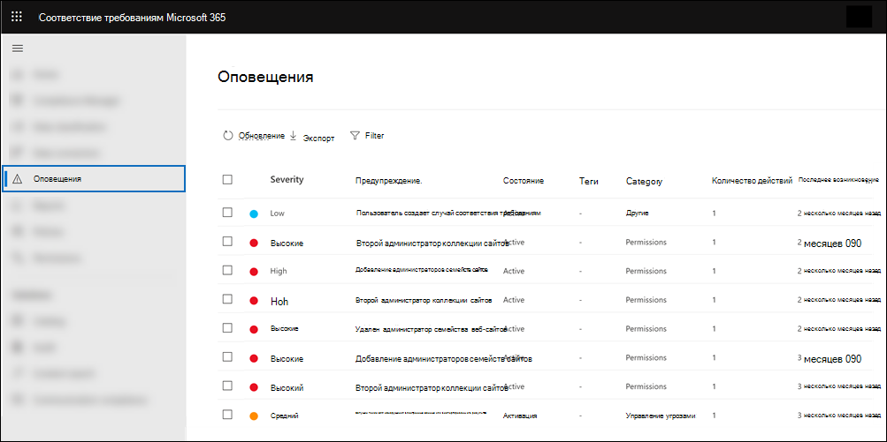

# <a name="alert-policies-in-the-microsoft-365-compliance-center"></a><span data-ttu-id="6c719-103">Политики оповещения в Центр соответствия требованиям Microsoft 365</span><span class="sxs-lookup"><span data-stu-id="6c719-103">Alert policies in the Microsoft 365 compliance center</span></span>

<span data-ttu-id="6c719-104">Вы можете использовать средства мониторинга оповещений и оповещений в Центр соответствия требованиям Microsoft 365 для создания политик оповещения, а затем просмотра оповещений, созданных при выполнении пользователями действий, которые соответствуют условиям политики оповещения.</span><span class="sxs-lookup"><span data-stu-id="6c719-104">You can use the alert policy and alert dashboard tools in the Microsoft 365 compliance center to create alert policies and then view the alerts generated when users perform activities that match the conditions of an alert policy.</span></span> <span data-ttu-id="6c719-105">Существует несколько политик оповещений по умолчанию, которые помогают отслеживать такие действия, как назначение привилегий администратора в Exchange Online, атаки вредоносных программ, фишинговые кампании и необычные уровни удаления файлов и внешнего общего доступа.</span><span class="sxs-lookup"><span data-stu-id="6c719-105">There are several default alert policies that help you monitor activities such as assigning admin privileges in Exchange Online, malware attacks, phishing campaigns, and unusual levels of file deletions and external sharing.</span></span>

<span data-ttu-id="6c719-106">Политики оповещения позволяет классифицировать оповещения, запускаемые политикой, применять политику для всех пользователей в организации, устанавливать пороговый уровень для запуска оповещения и принимать решение о том, следует ли получать уведомления электронной почты при запуске оповещений.</span><span class="sxs-lookup"><span data-stu-id="6c719-106">Alert policies let you categorize the alerts that are triggered by a policy, apply the policy to all users in your organization, set a threshold level for when an alert is triggered, and decide whether to receive email notifications when alerts are triggered.</span></span> <span data-ttu-id="6c719-107">В центре соответствия  требованиям также есть страница Оповещения, на которой можно просматривать и фильтровать оповещения, устанавливать состояние оповещений, чтобы управлять оповещениями, а затем отклонять оповещения после того, как вы устранил или устранил этот инцидент.</span><span class="sxs-lookup"><span data-stu-id="6c719-107">There's also a **Alerts** page in the compliance center where you can view and filter alerts, set an alert status to help you manage alerts, and then dismiss alerts after you've addressed or resolved the underlying incident.</span></span>

> [!NOTE]
> <span data-ttu-id="6c719-108">Политики оповещения доступны для организаций с подпиской Microsoft 365 корпоративный, Office 365 корпоративный или Office 365 правительства США E1/F1/G1, E3/F3/G3 или E5/G5.</span><span class="sxs-lookup"><span data-stu-id="6c719-108">Alert policies are available for organizations with a Microsoft 365 Enterprise, Office 365 Enterprise, or Office 365 US Government E1/F1/G1, E3/F3/G3, or E5/G5 subscription.</span></span> <span data-ttu-id="6c719-109">Расширенные функции доступны только для организаций с подпиской на E5/G5 или для организаций, имеющих подписку на E1/F1/G1 или E3/F3/G3 и Microsoft Defender для Office 365 P2 или Соответствие требованиям Microsoft 365 E5 или подписку на E5 eDiscovery и Audit.</span><span class="sxs-lookup"><span data-stu-id="6c719-109">Advanced functionality is only available for organizations with an E5/G5 subscription, or for organizations that have an E1/F1/G1 or E3/F3/G3 subscription and a Microsoft Defender for Office 365 P2 or a Microsoft 365 E5 Compliance or an E5 eDiscovery and Audit add-on subscription.</span></span> <span data-ttu-id="6c719-110">Функциональность, требуемая подписки на E5/G5 или надстройки, выделена в этом разделе.</span><span class="sxs-lookup"><span data-stu-id="6c719-110">The functionality that requires an E5/G5 or add-on subscription is highlighted in this topic.</span></span> <span data-ttu-id="6c719-111">Также обратите внимание, что политики оповещения доступны в Office 365 GCC, GCC high и DoD в правительственных средах США.</span><span class="sxs-lookup"><span data-stu-id="6c719-111">Also note that alert policies are available in Office 365 GCC, GCC High, and DoD US government environments.</span></span>

## <a name="how-alert-policies-work"></a><span data-ttu-id="6c719-112">Работа политик оповещений</span><span class="sxs-lookup"><span data-stu-id="6c719-112">How alert policies work</span></span>

<span data-ttu-id="6c719-113">Ниже представлен краткий обзор работы политик оповещения и триггеров оповещений, когда действия пользователя или администратора совпадают с условиями политики оповещения.</span><span class="sxs-lookup"><span data-stu-id="6c719-113">Here's a quick overview of how alert policies work and the alerts that are triggers when user or admin activity matches the conditions of an alert policy.</span></span>


1. <span data-ttu-id="6c719-115">Администратор в организации создает, настраивает и включает политику оповещения с помощью страницы политики **оповещения** в центре соответствия требованиям.</span><span class="sxs-lookup"><span data-stu-id="6c719-115">An admin in your organization creates, configures, and turns on an alert policy by using the **Alert policies** page in the compliance center.</span></span> <span data-ttu-id="6c719-116">Вы также можете создавать политики оповещения с помощью [cmdlet New-ProtectionAlert](/powershell/module/exchange/new-protectionalert) в центре безопасности & PowerShell.</span><span class="sxs-lookup"><span data-stu-id="6c719-116">You can also create alert policies by using the [New-ProtectionAlert](/powershell/module/exchange/new-protectionalert) cmdlet in Security & Compliance Center PowerShell.</span></span>

   <span data-ttu-id="6c719-117">Чтобы создать политики оповещения, необходимо навести роль Управление оповещениями или роль конфигурации организации в центре соответствия требованиям.</span><span class="sxs-lookup"><span data-stu-id="6c719-117">To create alert policies, you have to be assigned the Manage Alerts role or the Organization Configuration role in the compliance center.</span></span>

   > [!NOTE]
   > <span data-ttu-id="6c719-118">Это занимает до 24 часов после создания или обновления политики оповещения, прежде чем оповещения могут быть вызваны политикой.</span><span class="sxs-lookup"><span data-stu-id="6c719-118">It takes up to 24 hours after creating or updating an alert policy before alerts can be triggered by the policy.</span></span> <span data-ttu-id="6c719-119">Это потому, что политика должна быть синхронизирована с механизмом обнаружения оповещений.</span><span class="sxs-lookup"><span data-stu-id="6c719-119">This is because the policy has to be synced to the alert detection engine.</span></span>

2. <span data-ttu-id="6c719-120">Пользователь выполняет действия, которые совпадают с условиями политики оповещения.</span><span class="sxs-lookup"><span data-stu-id="6c719-120">A user performs an activity that matches the conditions of an alert policy.</span></span> <span data-ttu-id="6c719-121">В случае атак вредоносных программ зараженные сообщения электронной почты, отправленные пользователям в организации, вызывают оповещение.</span><span class="sxs-lookup"><span data-stu-id="6c719-121">In the case of malware attacks, infected email messages sent to users in your organization trigger an alert.</span></span>

3. <span data-ttu-id="6c719-122">Microsoft 365 создает оповещение, отображаемую на странице **Оповещения** в Центр соответствия требованиям Microsoft 365.</span><span class="sxs-lookup"><span data-stu-id="6c719-122">Microsoft 365 generates an alert that's displayed on the **Alerts** page in Microsoft 365 compliance center.</span></span> <span data-ttu-id="6c719-123">Кроме того, если для политики оповещения включены уведомления электронной почты, Корпорация Майкрософт отправляет уведомление в список получателей.</span><span class="sxs-lookup"><span data-stu-id="6c719-123">Also, if email notifications are enabled for the alert policy, Microsoft sends a notification to a list of recipients.</span></span> <span data-ttu-id="6c719-124">Оповещения, которые администратор или другие пользователи могут видеть на странице Оповещений, определяются ролями, назначенными пользователю.</span><span class="sxs-lookup"><span data-stu-id="6c719-124">The alerts that an admin or other users can see that on the Alerts page is determined by the roles assigned to the user.</span></span> <span data-ttu-id="6c719-125">Дополнительные сведения см. в сведениях [о разрешениях RBAC, необходимых для просмотра оповещений.](#rbac-permissions-required-to-view-alerts)</span><span class="sxs-lookup"><span data-stu-id="6c719-125">For more information, see [RBAC permissions required to view alerts](#rbac-permissions-required-to-view-alerts).</span></span>

4. <span data-ttu-id="6c719-126">Администратор управляет оповещениями в центре соответствия требованиям.</span><span class="sxs-lookup"><span data-stu-id="6c719-126">An admin manages alerts in the compliance center.</span></span> <span data-ttu-id="6c719-127">Управление оповещениями состоит из назначения состояния оповещений для отслеживания и управления любыми расследованиями.</span><span class="sxs-lookup"><span data-stu-id="6c719-127">Managing alerts consists of assigning an alert status to help track and manage any investigation.</span></span>

## <a name="alert-policy-settings"></a><span data-ttu-id="6c719-128">Параметры политики оповещения</span><span class="sxs-lookup"><span data-stu-id="6c719-128">Alert policy settings</span></span>

<span data-ttu-id="6c719-129">Политика оповещения состоит из набора правил и условий, определявших действия пользователя или администратора, которые генерируют оповещение, список пользователей, которые запускают оповещение при выполнении действия, и пороговое значение, которое определяет, сколько раз необходимо выполнить действие до запуска оповещения.</span><span class="sxs-lookup"><span data-stu-id="6c719-129">An alert policy consists of a set of rules and conditions that define the user or admin activity that generates an alert, a list of users who trigger the alert if they perform the activity, and a threshold that defines how many times the activity has to occur before an alert is triggered.</span></span> <span data-ttu-id="6c719-130">Вы также классифицировать политику и назначить ее уровень серьезности.</span><span class="sxs-lookup"><span data-stu-id="6c719-130">You also categorize the policy and assign it a severity level.</span></span> <span data-ttu-id="6c719-131">Эти два параметра помогают управлять политиками оповещений (и оповещениями, которые запускаются при совпадении условий политики), так как эти параметры можно фильтровать при управлении политиками и просмотре оповещений в центре соответствия требованиям.</span><span class="sxs-lookup"><span data-stu-id="6c719-131">These two settings help you manage alert policies (and the alerts that are triggered when the policy conditions are matched) because you can filter on these settings when managing policies and viewing alerts in the compliance center.</span></span> <span data-ttu-id="6c719-132">Например, можно просмотреть оповещения, которые соответствуют условиям из одной категории, или просмотреть оповещений с одинаковым уровнем серьезности.</span><span class="sxs-lookup"><span data-stu-id="6c719-132">For example, you can view alerts that match the conditions from the same category or view alerts with the same severity level.</span></span>

<span data-ttu-id="6c719-133">**Просмотр и создание политик оповещения:**</span><span class="sxs-lookup"><span data-stu-id="6c719-133">**To view and create alert policies:**</span></span>

<span data-ttu-id="6c719-134">Перейдите <https://compliance.microsoft.com> к политикам **оповещений и** выберите политики  >    >  **оповещения.**</span><span class="sxs-lookup"><span data-stu-id="6c719-134">Go to <https://compliance.microsoft.com> and then select **Policies** > **Alert** > **Alert policies**.</span></span> <span data-ttu-id="6c719-135">Кроме того, вы можете перейти непосредственно <https://compliance.microsoft.com/alertpolicies> к .</span><span class="sxs-lookup"><span data-stu-id="6c719-135">Alternatively, you can go directly to <https://compliance.microsoft.com/alertpolicies>.</span></span>


<span data-ttu-id="6c719-137">Политика оповещения состоит из следующих параметров и условий.</span><span class="sxs-lookup"><span data-stu-id="6c719-137">An alert policy consists of the following settings and conditions.</span></span>

- <span data-ttu-id="6c719-138">**Действие, отслеживаемая оповещением.**</span><span class="sxs-lookup"><span data-stu-id="6c719-138">**Activity the alert is tracking**.</span></span> <span data-ttu-id="6c719-139">Вы создаете политику для отслеживания действий или в некоторых случаях нескольких связанных действий, таких как совместное использование файла с внешним пользователем, совместное использование, назначение разрешений на доступ или создание анонимной ссылки.</span><span class="sxs-lookup"><span data-stu-id="6c719-139">You create a policy to track an activity or in some cases a few related activities, such a sharing a file with an external user by sharing it, assigning access permissions, or creating an anonymous link.</span></span> <span data-ttu-id="6c719-140">Когда пользователь выполняет действия, определенные политикой, оповещение запускается в зависимости от параметров порогового значения оповещений.</span><span class="sxs-lookup"><span data-stu-id="6c719-140">When a user performs the activity defined by the policy, an alert is triggered based on the alert threshold settings.</span></span>

    > [!NOTE]
    > <span data-ttu-id="6c719-141">Действия, которые можно отслеживать, зависят от Office 365 корпоративный или Office 365 плана правительства США.</span><span class="sxs-lookup"><span data-stu-id="6c719-141">The activities that you can track depend on your organization's Office 365 Enterprise or Office 365 US Government plan.</span></span> <span data-ttu-id="6c719-142">Как правило, для действий, связанных с вредоносными кампаниями и фишинговыми атаками, требуется подписка на E5/G5 или подписка на E1/F1/G1 или E3/F3/G3 с надстройки [Defender для Office 365](../security/office-365-security/defender-for-office-365.md) Plan 2.</span><span class="sxs-lookup"><span data-stu-id="6c719-142">In general, activities related to malware campaigns and phishing attacks require an E5/G5 subscription or an E1/F1/G1 or E3/F3/G3 subscription with an [Defender for Office 365](../security/office-365-security/defender-for-office-365.md) Plan 2 add-on subscription.</span></span>

- <span data-ttu-id="6c719-143">**Условия активности.**</span><span class="sxs-lookup"><span data-stu-id="6c719-143">**Activity conditions**.</span></span> <span data-ttu-id="6c719-144">Для большинства действий можно определить дополнительные условия, которые должны быть выполнены, чтобы вызвать оповещение.</span><span class="sxs-lookup"><span data-stu-id="6c719-144">For most activities, you can define additional conditions that must be met to trigger an alert.</span></span> <span data-ttu-id="6c719-145">К распространенным условиям относятся IP-адреса (чтобы срабатывает оповещение, когда пользователь выполняет действия на компьютере с определенным IP-адресом или в диапазоне IP-адресов), запускается ли оповещение, если определенный пользователь или пользователи выполняют эту деятельность, и выполняется ли действие на определенном имени файла или URL-адресе.</span><span class="sxs-lookup"><span data-stu-id="6c719-145">Common conditions include IP addresses (so that an alert is triggered when the user performs the activity on a computer with a specific IP address or within an IP address range), whether an alert is triggered if a specific user or users perform that activity, and whether the activity is performed on a specific file name or URL.</span></span> <span data-ttu-id="6c719-146">Можно также настроить условие, которое вызывает оповещение при выполнении действия любым пользователем в организации.</span><span class="sxs-lookup"><span data-stu-id="6c719-146">You can also configure a condition that triggers an alert when the activity is performed by any user in your organization.</span></span> <span data-ttu-id="6c719-147">Доступные условия зависят от выбранной активности.</span><span class="sxs-lookup"><span data-stu-id="6c719-147">The available conditions are dependent on the selected activity.</span></span>

- <span data-ttu-id="6c719-148">**Когда срабатывает оповещение.**</span><span class="sxs-lookup"><span data-stu-id="6c719-148">**When the alert is triggered**.</span></span> <span data-ttu-id="6c719-149">Можно настроить параметр, который определяет, как часто может происходить действие перед срабатывом оповещения.</span><span class="sxs-lookup"><span data-stu-id="6c719-149">You can configure a setting that defines how often an activity can occur before an alert is triggered.</span></span> <span data-ttu-id="6c719-150">Это позволяет настроить политику для создания оповещений каждый раз, когда действия совпадают с условиями политики, при превышении определенного порогового значения или при возникновении отслеживаемого оповещения действия становится необычным для вашей организации.</span><span class="sxs-lookup"><span data-stu-id="6c719-150">This allows you to set up a policy to generate an alert every time an activity matches the policy conditions, when a certain threshold is exceeded, or when the occurrence of the activity the alert is tracking becomes unusual for your organization.</span></span>

    

    <span data-ttu-id="6c719-152">Если выбрать параметр на основе необычных действий, корпорация Майкрософт устанавливает базовое значение, которое определяет нормальную частоту выбранного действия.</span><span class="sxs-lookup"><span data-stu-id="6c719-152">If you select the setting based on unusual activity, Microsoft establishes a baseline value that defines the normal frequency for the selected activity.</span></span> <span data-ttu-id="6c719-153">Создание этого базового плана занимает до семи дней, в течение которого оповещения не будут создаваться.</span><span class="sxs-lookup"><span data-stu-id="6c719-153">It takes up to seven days to establish this baseline, during which alerts won't be generated.</span></span> <span data-ttu-id="6c719-154">После того как базовый уровень установлен, срабатывает оповещение, когда частота активности, отслеживаемой политикой оповещения, значительно превышает базовое значение.</span><span class="sxs-lookup"><span data-stu-id="6c719-154">After the baseline is established, an alert is triggered when the frequency of the activity tracked by the alert policy greatly exceeds the baseline value.</span></span> <span data-ttu-id="6c719-155">Для действий, связанных с аудитом (например, действий файлов и папок), можно установить базовый уровень на основе одного пользователя или на основе всех пользователей в вашей организации; для действий, связанных с вредоносными программами, можно установить базовый уровень на основе одной семьи вредоносных программ, одного получателя или всех сообщений в вашей организации.</span><span class="sxs-lookup"><span data-stu-id="6c719-155">For auditing-related activities (such as file and folder activities), you can establish a baseline based on a single user or based on all users in your organization; for malware-related activities, you can establish a baseline based on a single malware family, a single recipient, or all messages in your organization.</span></span>

    > [!NOTE]
    > <span data-ttu-id="6c719-156">Для настройки политик оповещений на основе порога или на основе необычных действий требуется подписка на E5/G5 или подписка на E1/F1/G1 или E3/F3/G3 с подпиской Microsoft Defender для Office 365 P2, Соответствие требованиям Microsoft 365 E5 или Microsoft 365 eDiscovery and Audit add-on.</span><span class="sxs-lookup"><span data-stu-id="6c719-156">The ability to configure alert policies based on a threshold or based on unusual activity requires an E5/G5 subscription, or an E1/F1/G1 or E3/F3/G3 subscription with a Microsoft Defender for Office 365 P2, Microsoft 365 E5 Compliance, or Microsoft 365 eDiscovery and Audit add-on subscription.</span></span> <span data-ttu-id="6c719-157">Организации, подписав подписку на E1/F1/G1 и E3/F3/G3, могут создавать политики оповещений только при каждом запуске оповещения при каждом действии.</span><span class="sxs-lookup"><span data-stu-id="6c719-157">Organizations with an E1/F1/G1 and E3/F3/G3 subscription can only create alert policies where an alert is triggered every time that an activity occurs.</span></span>

- <span data-ttu-id="6c719-158">**Категория оповещения**.</span><span class="sxs-lookup"><span data-stu-id="6c719-158">**Alert category**.</span></span> <span data-ttu-id="6c719-159">Чтобы помочь в отслеживании и управлении оповещениями, созданными политикой, можно назначить политику одну из следующих категорий.</span><span class="sxs-lookup"><span data-stu-id="6c719-159">To help with tracking and managing the alerts generated by a policy, you can assign one of the following categories to a policy.</span></span>

  - <span data-ttu-id="6c719-160">Защита от потери данных</span><span class="sxs-lookup"><span data-stu-id="6c719-160">Data loss prevention</span></span>

  - <span data-ttu-id="6c719-161">Управление информацией</span><span class="sxs-lookup"><span data-stu-id="6c719-161">Information governance</span></span>

  - <span data-ttu-id="6c719-162">Поток обработки почты</span><span class="sxs-lookup"><span data-stu-id="6c719-162">Mail flow</span></span>

  - <span data-ttu-id="6c719-163">Разрешения</span><span class="sxs-lookup"><span data-stu-id="6c719-163">Permissions</span></span>

  - <span data-ttu-id="6c719-164">Управление угрозами</span><span class="sxs-lookup"><span data-stu-id="6c719-164">Threat management</span></span>

  - <span data-ttu-id="6c719-165">Другие</span><span class="sxs-lookup"><span data-stu-id="6c719-165">Others</span></span>

  <span data-ttu-id="6c719-166">Когда происходит действие, которое соответствует условиям политики оповещения, генерируемая оповещение помечено категорией, определенной в этом параметре.</span><span class="sxs-lookup"><span data-stu-id="6c719-166">When an activity occurs that matches the conditions of the alert policy, the alert that's generated is tagged with the category defined in this setting.</span></span> <span data-ttu-id="6c719-167">Это позволяет отслеживать и управлять оповещениями, которые имеют один  и тот же параметр категории на странице Оповещений в центре соответствия требованиям, так как можно сортировать и фильтровать оповещения в зависимости от категории.</span><span class="sxs-lookup"><span data-stu-id="6c719-167">This allows you to track and manage alerts that have the same category setting on the **Alerts** page in the compliance center because you can sort and filter alerts based on category.</span></span>

- <span data-ttu-id="6c719-168">**Серьезность оповещений.**</span><span class="sxs-lookup"><span data-stu-id="6c719-168">**Alert severity**.</span></span> <span data-ttu-id="6c719-169">Подобно категории оповещений, для политик оповещений назначается атрибут серьезности **(Low,** **Medium,** **High** или **Informational).**</span><span class="sxs-lookup"><span data-stu-id="6c719-169">Similar to the alert category, you assign a severity attribute (**Low**, **Medium**, **High**, or **Informational**) to alert policies.</span></span> <span data-ttu-id="6c719-170">Как и категория оповещений, когда происходит действие, которое соответствует условиям политики оповещения, сгенерированная оповещение помечено с тем же уровнем серьезности, что и для политики оповещения.</span><span class="sxs-lookup"><span data-stu-id="6c719-170">Like the alert category, when an activity occurs that matches the conditions of the alert policy, the alert that's generated is tagged with the same severity level that's set for the alert policy.</span></span> <span data-ttu-id="6c719-171">Опять же, это позволяет отслеживать и управлять оповещениями, которые имеют тот же параметр серьезности на странице **Оповещения.**</span><span class="sxs-lookup"><span data-stu-id="6c719-171">Again, this allows you to track and manage alerts that have the same severity setting on the **Alerts** page.</span></span> <span data-ttu-id="6c719-172">Например, можно отфильтровать список оповещений,  чтобы отображаться только оповещения с высокой степенью серьезности.</span><span class="sxs-lookup"><span data-stu-id="6c719-172">For example, you can filter the list of alerts so that only alerts with a **High** severity are displayed.</span></span>

    > [!TIP]
    > <span data-ttu-id="6c719-173">При настройке политики оповещения следует назначить более высокую степень серьезности действиям, которые могут привести к серьезным негативным последствиям, таким как обнаружение вредоносных программ после доставки пользователям, просмотр конфиденциальных или секретных данных, обмен данными с внешними пользователями или другие действия, которые могут привести к потере данных или угрозам безопасности.</span><span class="sxs-lookup"><span data-stu-id="6c719-173">When setting up an alert policy, consider assigning a higher severity to activities that can result in severely negative consequences, such as detection of malware after delivery to users, viewing of sensitive or classified data, sharing data with external users, or other activities that can result in data loss or security threats.</span></span> <span data-ttu-id="6c719-174">Это поможет вам расставить приоритеты оповещений и действий, которые вы принимаете для расследования и устранения основных причин.</span><span class="sxs-lookup"><span data-stu-id="6c719-174">This can help you prioritize alerts and the actions you take to investigate and resolve the underlying causes.</span></span>

- <span data-ttu-id="6c719-175">**Уведомления электронной почты**.</span><span class="sxs-lookup"><span data-stu-id="6c719-175">**Email notifications**.</span></span> <span data-ttu-id="6c719-176">Вы можете настроить политику таким образом, чтобы уведомления электронной почты отправлялись (или не отправлялись) в список пользователей, когда срабатывает оповещение.</span><span class="sxs-lookup"><span data-stu-id="6c719-176">You can set up the policy so that email notifications are sent (or not sent) to a list of users when an alert is triggered.</span></span> <span data-ttu-id="6c719-177">Кроме того, можно установить ограничение на ежедневное уведомление, чтобы после получения максимального количества уведомлений больше не было отправлено уведомлений для оповещения в течение этого дня.</span><span class="sxs-lookup"><span data-stu-id="6c719-177">You can also set a daily notification limit so that once the maximum number of notifications has been reached, no more notifications are sent for the alert during that day.</span></span> <span data-ttu-id="6c719-178">Помимо уведомлений электронной почты, вы или другие администраторы можете просматривать оповещения, которые запускаются политикой на странице **Оповещений.**</span><span class="sxs-lookup"><span data-stu-id="6c719-178">In addition to email notifications, you or other administrators can view the alerts that are triggered by a policy on the **Alerts** page.</span></span> <span data-ttu-id="6c719-179">Рассмотрите возможность включения уведомлений электронной почты для политик оповещения определенной категории или с более высокой степенью серьезности.</span><span class="sxs-lookup"><span data-stu-id="6c719-179">Consider enabling email notifications for alert policies of a specific category or that have a higher severity setting.</span></span>

## <a name="default-alert-policies"></a><span data-ttu-id="6c719-180">Политики оповещения по умолчанию</span><span class="sxs-lookup"><span data-stu-id="6c719-180">Default alert policies</span></span>

<span data-ttu-id="6c719-181">Корпорация Майкрософт предоставляет встроенные политики оповещений, которые помогают Exchange злоупотребление разрешениями администратора, активность вредоносных программ, потенциальные внешние и внутренние угрозы, а также риски управления информацией.</span><span class="sxs-lookup"><span data-stu-id="6c719-181">Microsoft provides built-in alert policies that help identify Exchange admin permissions abuse, malware activity, potential external and internal threats, and information governance risks.</span></span> <span data-ttu-id="6c719-182">На странице **Политики оповещения** имена этих встроенных политик имеют жирный шрифт, а тип политики определяется как **System**.</span><span class="sxs-lookup"><span data-stu-id="6c719-182">On the **Alert policies** page, the names of these built-in policies are in bold and the policy type is defined as **System**.</span></span> <span data-ttu-id="6c719-183">Эти политики включены по умолчанию.</span><span class="sxs-lookup"><span data-stu-id="6c719-183">These policies are turned on by default.</span></span> <span data-ttu-id="6c719-184">Эти политики можно отключить (или снова включить), настроить список получателей для отправки уведомлений электронной почты и установить ограничение на ежедневное уведомление.</span><span class="sxs-lookup"><span data-stu-id="6c719-184">You can turn off these policies (or back on again), set up a list of recipients to send email notifications to, and set a daily notification limit.</span></span> <span data-ttu-id="6c719-185">Другие параметры этих политик не могут быть изменены.</span><span class="sxs-lookup"><span data-stu-id="6c719-185">The other settings for these policies can't be edited.</span></span>

<span data-ttu-id="6c719-186">В следующей таблице перечислены доступные политики оповещений по умолчанию и присвоена категория каждой политики.</span><span class="sxs-lookup"><span data-stu-id="6c719-186">The following table lists and describes the available default alert policies and the category each policy is assigned to.</span></span> <span data-ttu-id="6c719-187">Эта категория используется для определения оповещений, которые пользователь может просматривать на странице Оповещений.</span><span class="sxs-lookup"><span data-stu-id="6c719-187">The category is used to determine which alerts a user can view on the Alerts page.</span></span> <span data-ttu-id="6c719-188">Дополнительные сведения см. в сведениях [о разрешениях RBAC, необходимых для просмотра оповещений.](#rbac-permissions-required-to-view-alerts)</span><span class="sxs-lookup"><span data-stu-id="6c719-188">For more information, see [RBAC permissions required to view alerts](#rbac-permissions-required-to-view-alerts).</span></span>

<span data-ttu-id="6c719-189">В таблице также указаны Office 365 корпоративный и Office 365 плана правительства США, необходимые для каждого из них.</span><span class="sxs-lookup"><span data-stu-id="6c719-189">The table also indicates the Office 365 Enterprise and Office 365 US Government plan required for each one.</span></span> <span data-ttu-id="6c719-190">Некоторые политики оповещения по умолчанию доступны, если в организации есть соответствующая подписка на надстройки в дополнение к подписке E1/F1/G1 или E3/F3/G3.</span><span class="sxs-lookup"><span data-stu-id="6c719-190">Some default alert policies are available if your organization has the appropriate add-on subscription in addition to an E1/F1/G1 or E3/F3/G3 subscription.</span></span>

| <span data-ttu-id="6c719-191">Политика оповещений по умолчанию</span><span class="sxs-lookup"><span data-stu-id="6c719-191">Default alert policy</span></span> | <span data-ttu-id="6c719-192">Описание</span><span class="sxs-lookup"><span data-stu-id="6c719-192">Description</span></span> | <span data-ttu-id="6c719-193">Category</span><span class="sxs-lookup"><span data-stu-id="6c719-193">Category</span></span> | <span data-ttu-id="6c719-194">Enterprise подписки</span><span class="sxs-lookup"><span data-stu-id="6c719-194">Enterprise subscription</span></span> |
|:-----|:-----|:-----|:-----|
|<span data-ttu-id="6c719-195">**Обнаружен потенциально вредоносный URL-адрес**</span><span class="sxs-lookup"><span data-stu-id="6c719-195">**A potentially malicious URL click was detected**</span></span>|<span data-ttu-id="6c719-196">Создает оповещение, когда пользователь, защищенный Сейф [ссылками](../security/office-365-security/safe-links.md) в организации, щелкает вредоносную ссылку.</span><span class="sxs-lookup"><span data-stu-id="6c719-196">Generates an alert when a user protected by [Safe Links](../security/office-365-security/safe-links.md) in your organization clicks a malicious link.</span></span> <span data-ttu-id="6c719-197">Это событие запускается, когда изменения вердикта URL-адресов определены защитником Microsoft для Office 365 или когда пользователи переопределяют страницы Сейф ссылки (в зависимости от политики Microsoft 365 организации для бизнеса Сейф ссылки).</span><span class="sxs-lookup"><span data-stu-id="6c719-197">This event is triggered when URL verdict changes are identified by Microsoft Defender for Office 365 or when users override the Safe Links pages (based on your organization's Microsoft 365 for business Safe Links policy).</span></span> <span data-ttu-id="6c719-198">Эта политика оповещения имеет параметр **Высокой** серьезности.</span><span class="sxs-lookup"><span data-stu-id="6c719-198">This alert policy has a **High** severity setting.</span></span> <span data-ttu-id="6c719-199">Для клиентов Defender для Office 365 P2, E5, G5 это предупреждение автоматически запускает автоматическое расследование и [ответ в Office 365](../security/office-365-security/office-365-air.md).</span><span class="sxs-lookup"><span data-stu-id="6c719-199">For Defender for Office 365 P2, E5, G5 customers, this alert automatically triggers [automated investigation and response in Office 365](../security/office-365-security/office-365-air.md).</span></span> <span data-ttu-id="6c719-200">Дополнительные сведения о событиях, которые вызывают это оповещение, см. в [Сейф ссылки.](../security/office-365-security/set-up-safe-links-policies.md)</span><span class="sxs-lookup"><span data-stu-id="6c719-200">For more information on events that trigger this alert, see [Set up Safe Links policies](../security/office-365-security/set-up-safe-links-policies.md).</span></span>|<span data-ttu-id="6c719-201">Управление угрозами</span><span class="sxs-lookup"><span data-stu-id="6c719-201">Threat management</span></span>|<span data-ttu-id="6c719-202">Подписка на надстройки E5/G5 или Defender для Office 365 P2</span><span class="sxs-lookup"><span data-stu-id="6c719-202">E5/G5 or Defender for Office 365 P2 add-on subscription</span></span>|
|<span data-ttu-id="6c719-203">**Выполнен результат отправки администратором**</span><span class="sxs-lookup"><span data-stu-id="6c719-203">**Admin Submission result completed**</span></span>|<span data-ttu-id="6c719-204">Создает оповещение, когда [отправка администратора](../security/office-365-security/admin-submission.md) завершает rescan представленного объекта.</span><span class="sxs-lookup"><span data-stu-id="6c719-204">Generates an alert when an [Admin Submission](../security/office-365-security/admin-submission.md) completes the rescan of the submitted entity.</span></span> <span data-ttu-id="6c719-205">Оповещение запускается каждый раз, когда из отправки администратора отрисовывается результат rescan.</span><span class="sxs-lookup"><span data-stu-id="6c719-205">An alert will be triggered every time a rescan result is rendered from an Admin Submission.</span></span> <span data-ttu-id="6c719-206">Эти оповещений [](https://protection.office.com/reportsubmission)призваны напомнить вам, чтобы просмотреть результаты предыдущих представлений, отправить сообщения пользователей, чтобы получить последние проверки политики и rescan вердикты, и помочь вам определить, имеют ли политики фильтрации в вашей организации, имеющие предполагаемые последствия.</span><span class="sxs-lookup"><span data-stu-id="6c719-206">These alerts are meant to remind you to [review the results of previous submissions](https://protection.office.com/reportsubmission), submit user reported messages to get the latest policy check and rescan verdicts, and help you determine if the filtering policies in your organization are having the intended impact.</span></span> <span data-ttu-id="6c719-207">Эта политика имеет параметр **"Информационная** серьезность".</span><span class="sxs-lookup"><span data-stu-id="6c719-207">This policy has a **Informational** severity setting.</span></span>|<span data-ttu-id="6c719-208">Управление угрозами</span><span class="sxs-lookup"><span data-stu-id="6c719-208">Threat management</span></span>|<span data-ttu-id="6c719-209">E1/F1, E3/F3 или E5</span><span class="sxs-lookup"><span data-stu-id="6c719-209">E1/F1, E3/F3, or E5</span></span>|
|<span data-ttu-id="6c719-210">**Администратор вызвал ручное исследование электронной почты**</span><span class="sxs-lookup"><span data-stu-id="6c719-210">**Admin triggered manual investigation of email**</span></span>|<span data-ttu-id="6c719-211">Создает оповещение, когда администратор запускает ручное расследование электронной почты из Обозревателя угроз.</span><span class="sxs-lookup"><span data-stu-id="6c719-211">Generates an alert when an admin triggers the manual investigation of an email from Threat Explorer.</span></span> <span data-ttu-id="6c719-212">Дополнительные сведения [см. в примере. Администратор безопасности запускает расследование из Обозревателя угроз.](../security/office-365-security/automated-investigation-response-office.md#example-a-security-administrator-triggers-an-investigation-from-threat-explorer)</span><span class="sxs-lookup"><span data-stu-id="6c719-212">For more information, see [Example: A security administrator triggers an investigation from Threat Explorer](../security/office-365-security/automated-investigation-response-office.md#example-a-security-administrator-triggers-an-investigation-from-threat-explorer).</span></span> <span data-ttu-id="6c719-213">Это предупреждение оповещает организацию о том, что расследование было начато.</span><span class="sxs-lookup"><span data-stu-id="6c719-213">This alert notifies your organization that the investigation was started.</span></span> <span data-ttu-id="6c719-214">Оповещение содержит сведения о том, кто его вызвал, и содержит ссылку на расследование.</span><span class="sxs-lookup"><span data-stu-id="6c719-214">The alert provides information about who triggered it and includes a link to the investigation.</span></span> <span data-ttu-id="6c719-215">Эта политика имеет параметр **"Информационная** серьезность".</span><span class="sxs-lookup"><span data-stu-id="6c719-215">This policy has an **Informational** severity setting.</span></span>|<span data-ttu-id="6c719-216">Управление угрозами</span><span class="sxs-lookup"><span data-stu-id="6c719-216">Threat management</span></span>| <span data-ttu-id="6c719-217">Подписка на надстройки E5/G5 или Microsoft Defender для Office 365 P2</span><span class="sxs-lookup"><span data-stu-id="6c719-217">E5/G5 or Microsoft Defender for Office 365 P2 add-on subscription</span></span>| 
|<span data-ttu-id="6c719-218">**Создание правила пересылки или перенаправления**</span><span class="sxs-lookup"><span data-stu-id="6c719-218">**Creation of forwarding/redirect rule**</span></span>|<span data-ttu-id="6c719-219">Создает оповещение, когда кто-то в вашей организации создает правило почтового ящика, которое пересылает или перенаправляет сообщения в другую учетную запись электронной почты.</span><span class="sxs-lookup"><span data-stu-id="6c719-219">Generates an alert when someone in your organization creates an inbox rule for their mailbox that forwards or redirects messages to another email account.</span></span> <span data-ttu-id="6c719-220">Эта политика отслеживает только правила почтовых ящиков, созданные с Outlook в Интернете (ранее Outlook Web App) или Exchange Online PowerShell.</span><span class="sxs-lookup"><span data-stu-id="6c719-220">This policy only tracks inbox rules that are created using Outlook on the web (formerly known as Outlook Web App) or Exchange Online PowerShell.</span></span> <span data-ttu-id="6c719-221">Эта политика имеет параметр **"Информационная** серьезность".</span><span class="sxs-lookup"><span data-stu-id="6c719-221">This policy has a **Informational** severity setting.</span></span> <span data-ttu-id="6c719-222">Дополнительные сведения об использовании правил почтовых ящиков для переадресации и перенаправления электронной почты в Outlook в Интернете см. в Outlook в Интернете правилах для автоматической переадресации сообщений на [другую учетную запись.](https://support.office.com/article/1433e3a0-7fb0-4999-b536-50e05cb67fed)</span><span class="sxs-lookup"><span data-stu-id="6c719-222">For more information about using inbox rules to forward and redirect email in Outlook on the web, see [Use rules in Outlook on the web to automatically forward messages to another account](https://support.office.com/article/1433e3a0-7fb0-4999-b536-50e05cb67fed).</span></span>|<span data-ttu-id="6c719-223">Управление угрозами</span><span class="sxs-lookup"><span data-stu-id="6c719-223">Threat management</span></span>|<span data-ttu-id="6c719-224">E1/F1/G1, E3/F3/G3 или E5/G5</span><span class="sxs-lookup"><span data-stu-id="6c719-224">E1/F1/G1, E3/F3/G3, or E5/G5</span></span>|
|<span data-ttu-id="6c719-225">**Поиск по обнаружению электронных обнаружений начался или экспортируется**</span><span class="sxs-lookup"><span data-stu-id="6c719-225">**eDiscovery search started or exported**</span></span>|<span data-ttu-id="6c719-226">Создает оповещение, когда кто-то использует средство поиска контента в центре безопасности и соответствия требованиям.</span><span class="sxs-lookup"><span data-stu-id="6c719-226">Generates an alert when someone uses the Content search tool in the Security and compliance center.</span></span> <span data-ttu-id="6c719-227">При выполнении следующих действий по поиску контента запускается оповещение:</span><span class="sxs-lookup"><span data-stu-id="6c719-227">An alert is triggered when the following content search activities are performed:</span></span> <br/><br/><span data-ttu-id="6c719-228">\* Начинается поиск контента</span><span class="sxs-lookup"><span data-stu-id="6c719-228">\* A content search is started</span></span><br/><span data-ttu-id="6c719-229">\* Экспортируются результаты поиска контента</span><span class="sxs-lookup"><span data-stu-id="6c719-229">\* The results of a content search are exported</span></span><br/><span data-ttu-id="6c719-230">\* Экспортируется отчет о поиске контента</span><span class="sxs-lookup"><span data-stu-id="6c719-230">\* A content search report is exported</span></span><br/><br/><span data-ttu-id="6c719-231">Оповещения также срабатывает при выполнении предыдущих действий по поиску контента в связи с делом об обнаружении электронных обнаружений.</span><span class="sxs-lookup"><span data-stu-id="6c719-231">Alerts are also triggered when the previous content search activities are performed in association with an eDiscovery case.</span></span> <span data-ttu-id="6c719-232">Эта политика имеет параметр **"Информационная** серьезность".</span><span class="sxs-lookup"><span data-stu-id="6c719-232">This policy has a **Informational** severity setting.</span></span> <span data-ttu-id="6c719-233">Дополнительные сведения о действиях по поиску контента см. в журнале [Search for eDiscovery.](search-for-ediscovery-activities-in-the-audit-log.md#ediscovery-activities)</span><span class="sxs-lookup"><span data-stu-id="6c719-233">For more information about content search activities, see [Search for eDiscovery activities in the audit log](search-for-ediscovery-activities-in-the-audit-log.md#ediscovery-activities).</span></span>|<span data-ttu-id="6c719-234">Управление угрозами</span><span class="sxs-lookup"><span data-stu-id="6c719-234">Threat management</span></span>|<span data-ttu-id="6c719-235">E1/F1/G1, E3/F3/G3 или E5/G5</span><span class="sxs-lookup"><span data-stu-id="6c719-235">E1/F1/G1, E3/F3/G3, or E5/G5</span></span>|
|<span data-ttu-id="6c719-236">**Повышение Exchange администратора**</span><span class="sxs-lookup"><span data-stu-id="6c719-236">**Elevation of Exchange admin privilege**</span></span>|<span data-ttu-id="6c719-237">Создает оповещение при присвоении кому-либо административных разрешений в Exchange Online организации.</span><span class="sxs-lookup"><span data-stu-id="6c719-237">Generates an alert when someone is assigned administrative permissions in your Exchange Online organization.</span></span> <span data-ttu-id="6c719-238">Например, при добавлении пользователя в группу ролей управления организацией в Exchange Online.</span><span class="sxs-lookup"><span data-stu-id="6c719-238">For example, when a user is added to the Organization Management role group in Exchange Online.</span></span> <span data-ttu-id="6c719-239">Эта политика имеет параметр **Низкой** серьезности.</span><span class="sxs-lookup"><span data-stu-id="6c719-239">This policy has a **Low** severity setting.</span></span>|<span data-ttu-id="6c719-240">Разрешения</span><span class="sxs-lookup"><span data-stu-id="6c719-240">Permissions</span></span>|<span data-ttu-id="6c719-241">E1/F1/G1, E3/F3/G3 или E5/G5</span><span class="sxs-lookup"><span data-stu-id="6c719-241">E1/F1/G1, E3/F3/G3, or E5/G5</span></span>|
|<span data-ttu-id="6c719-242">**Сообщения электронной почты, содержащие вредоносные программы, удалены после доставки**</span><span class="sxs-lookup"><span data-stu-id="6c719-242">**Email messages containing malware removed after delivery**</span></span>|<span data-ttu-id="6c719-243">Создает оповещение при доставке любых сообщений, содержащих вредоносные программы, в почтовые ящики в организации.</span><span class="sxs-lookup"><span data-stu-id="6c719-243">Generates an alert when any messages containing malware are delivered to mailboxes in your organization.</span></span> <span data-ttu-id="6c719-244">Если это событие происходит, Корпорация Майкрософт удаляет зараженные сообщения из почтовых ящиков Exchange Online с помощью автоматической очистки нулевого [часа](../security/office-365-security/zero-hour-auto-purge.md).</span><span class="sxs-lookup"><span data-stu-id="6c719-244">If this event occurs, Microsoft removes the infected messages from Exchange Online mailboxes using [Zero-hour auto purge](../security/office-365-security/zero-hour-auto-purge.md).</span></span> <span data-ttu-id="6c719-245">Эта политика имеет параметр **"Информационная** серьезность" и автоматически запускает автоматическое исследование и ответ в [Office 365](../security/office-365-security/office-365-air.md).</span><span class="sxs-lookup"><span data-stu-id="6c719-245">This policy has an **Informational** severity setting and automatically triggers [automated investigation and response in Office 365](../security/office-365-security/office-365-air.md).</span></span>|<span data-ttu-id="6c719-246">Управление угрозами</span><span class="sxs-lookup"><span data-stu-id="6c719-246">Threat management</span></span>|<span data-ttu-id="6c719-247">Подписка на надстройки E5/G5 или Microsoft Defender для Office 365 P2</span><span class="sxs-lookup"><span data-stu-id="6c719-247">E5/G5 or Microsoft Defender for Office 365 P2 add-on subscription</span></span>|
|<span data-ttu-id="6c719-248">**Сообщения электронной почты, содержащие фишинговые URL-адреса, удалены после доставки**</span><span class="sxs-lookup"><span data-stu-id="6c719-248">**Email messages containing phish URLs removed after delivery**</span></span>|<span data-ttu-id="6c719-249">Создает оповещение при доставке сообщений, содержащих фишинг, в почтовые ящики в организации.</span><span class="sxs-lookup"><span data-stu-id="6c719-249">Generates an alert when any messages containing phish are delivered to mailboxes in your organization.</span></span> <span data-ttu-id="6c719-250">Если это событие происходит, Корпорация Майкрософт удаляет зараженные сообщения из почтовых ящиков Exchange Online с помощью автоматической очистки нулевого [часа](../security/office-365-security/zero-hour-auto-purge.md).</span><span class="sxs-lookup"><span data-stu-id="6c719-250">If this event occurs, Microsoft removes the infected messages from Exchange Online mailboxes using [Zero-hour auto purge](../security/office-365-security/zero-hour-auto-purge.md).</span></span> <span data-ttu-id="6c719-251">Эта политика имеет параметр **"Информационная** серьезность" и автоматически запускает автоматическое исследование и ответ в [Office 365](../security/office-365-security/office-365-air.md).</span><span class="sxs-lookup"><span data-stu-id="6c719-251">This policy has an **Informational** severity setting and automatically triggers [automated investigation and response in Office 365](../security/office-365-security/office-365-air.md).</span></span>|<span data-ttu-id="6c719-252">Управление угрозами</span><span class="sxs-lookup"><span data-stu-id="6c719-252">Threat management</span></span>|<span data-ttu-id="6c719-253">Подписка на надстройки E5/G5 или Defender для Office 365 P2</span><span class="sxs-lookup"><span data-stu-id="6c719-253">E5/G5 or Defender for Office 365 P2 add-on subscription</span></span>|
|<span data-ttu-id="6c719-254">**Сообщение электронной почты, указанное пользователем как вредоносная программа или фишинг**</span><span class="sxs-lookup"><span data-stu-id="6c719-254">**Email reported by user as malware or phish**</span></span>|<span data-ttu-id="6c719-255">Создает оповещение, когда пользователи в организации сообщают сообщения в качестве фишинговой электронной почты с помощью надстройки Report Message.</span><span class="sxs-lookup"><span data-stu-id="6c719-255">Generates an alert when users in your organization  report messages as phishing email using the Report Message add-in.</span></span> <span data-ttu-id="6c719-256">Эта политика имеет **параметр Низкой** серьезности.</span><span class="sxs-lookup"><span data-stu-id="6c719-256">This policy has an **Low** severity setting.</span></span> <span data-ttu-id="6c719-257">Дополнительные сведения об этой надстройки см. в добавлении ["Сообщение отчета".](https://support.office.com/article/b5caa9f1-cdf3-4443-af8c-ff724ea719d2)</span><span class="sxs-lookup"><span data-stu-id="6c719-257">For more information about this add-in, see [Use the Report Message add-in](https://support.office.com/article/b5caa9f1-cdf3-4443-af8c-ff724ea719d2).</span></span> <span data-ttu-id="6c719-258">Для клиентов Defender для Office 365 P2, E5, G5 это предупреждение автоматически запускает автоматическое расследование и [ответ в Office 365](../security/office-365-security/office-365-air.md).</span><span class="sxs-lookup"><span data-stu-id="6c719-258">For Defender for Office 365 P2, E5, G5 customers, this alert automatically triggers [automated investigation and response in Office 365](../security/office-365-security/office-365-air.md).</span></span>|<span data-ttu-id="6c719-259">Управление угрозами</span><span class="sxs-lookup"><span data-stu-id="6c719-259">Threat management</span></span>|<span data-ttu-id="6c719-260">E1/F1/G1, E3/F3/G3 или E5/G5</span><span class="sxs-lookup"><span data-stu-id="6c719-260">E1/F1/G1, E3/F3/G3, or E5/G5</span></span>|
|<span data-ttu-id="6c719-261">**Превышено ограничение на отправку электронной почты**</span><span class="sxs-lookup"><span data-stu-id="6c719-261">**Email sending limit exceeded**</span></span>|<span data-ttu-id="6c719-262">Создает оповещение, когда кто-то из вашей организации отправил больше почты, чем это разрешено политикой исходящие нежелательной почты.</span><span class="sxs-lookup"><span data-stu-id="6c719-262">Generates an alert when someone in your organization has sent more mail than is allowed by the outbound spam policy.</span></span> <span data-ttu-id="6c719-263">Обычно это указывает на то, что пользователь отправляет слишком много электронной почты или может быть скомпрометирована учетная запись.</span><span class="sxs-lookup"><span data-stu-id="6c719-263">This is usually an indication the user is sending too much email or that the account may be compromised.</span></span> <span data-ttu-id="6c719-264">Эта политика имеет параметр **Средней** серьезности.</span><span class="sxs-lookup"><span data-stu-id="6c719-264">This policy has a **Medium** severity setting.</span></span> <span data-ttu-id="6c719-265">Если вы получаете оповещение, сгенерированное этой политикой оповещений, следует проверить, скомпрометирована ли учетная запись [пользователя.](../security/office-365-security/responding-to-a-compromised-email-account.md)</span><span class="sxs-lookup"><span data-stu-id="6c719-265">If you get an alert generated by this alert policy, it's a good idea to [check whether the user account is compromised](../security/office-365-security/responding-to-a-compromised-email-account.md).</span></span>|<span data-ttu-id="6c719-266">Управление угрозами</span><span class="sxs-lookup"><span data-stu-id="6c719-266">Threat management</span></span>|<span data-ttu-id="6c719-267">E1/F1/G1, E3/F3/G3 или E5/G5</span><span class="sxs-lookup"><span data-stu-id="6c719-267">E1/F1/G1, E3/F3/G3, or E5/G5</span></span>|
|<span data-ttu-id="6c719-268">**Форма заблокирована из-за возможной попытки фишинга**</span><span class="sxs-lookup"><span data-stu-id="6c719-268">**Form blocked due to potential phishing attempt**</span></span>|<span data-ttu-id="6c719-269">Создает оповещение, когда кому-то из вашей организации было запрещено делиться формами и собирать ответы с помощью Microsoft Forms из-за обнаруженного повторного поведения попытки фишинга.</span><span class="sxs-lookup"><span data-stu-id="6c719-269">Generates an alert when someone in your organization has been restricted from sharing forms and collecting responses using Microsoft Forms due to detected repeated phishing attempt behavior.</span></span> <span data-ttu-id="6c719-270">Эта политика имеет **параметр Высокой серьезности.**</span><span class="sxs-lookup"><span data-stu-id="6c719-270">This policy has a **High severity** setting.</span></span>|<span data-ttu-id="6c719-271">Управление угрозами</span><span class="sxs-lookup"><span data-stu-id="6c719-271">Threat management</span></span>|<span data-ttu-id="6c719-272">E1, E3/F3 или E5</span><span class="sxs-lookup"><span data-stu-id="6c719-272">E1, E3/F3, or E5</span></span>|
|<span data-ttu-id="6c719-273">**Форма помечена и подтверждена как фишинг**</span><span class="sxs-lookup"><span data-stu-id="6c719-273">**Form flagged and confirmed as phishing**</span></span>|<span data-ttu-id="6c719-274">Создает оповещение, когда форма, созданная в Microsoft Forms из организации, была определена в качестве потенциального фишинга с помощью злоупотребления отчетами и подтверждена как фишинговая корпорация Майкрософт.</span><span class="sxs-lookup"><span data-stu-id="6c719-274">Generates an alert when a form created in Microsoft Forms from within your organization has been identified as potential phishing through Report Abuse and confirmed as phishing by Microsoft.</span></span> <span data-ttu-id="6c719-275">Эта политика имеет **параметр Высокой** серьезности.</span><span class="sxs-lookup"><span data-stu-id="6c719-275">This policy has a **High** severity setting.</span></span>|<span data-ttu-id="6c719-276">Управление угрозами</span><span class="sxs-lookup"><span data-stu-id="6c719-276">Threat management</span></span>|<span data-ttu-id="6c719-277">E1, E3/F3 или E5</span><span class="sxs-lookup"><span data-stu-id="6c719-277">E1, E3/F3, or E5</span></span>|
|<span data-ttu-id="6c719-278">**Задержки сообщений**</span><span class="sxs-lookup"><span data-stu-id="6c719-278">**Messages have been delayed**</span></span>|<span data-ttu-id="6c719-279">Создает оповещение, когда Корпорация Майкрософт не может доставлять сообщения электронной почты локальной организации или серверу-партнеру с помощью соединитетеля.</span><span class="sxs-lookup"><span data-stu-id="6c719-279">Generates an alert when Microsoft can't deliver email messages to your on-premises organization or a partner server by using a connector.</span></span> <span data-ttu-id="6c719-280">Когда это произойдет, сообщение в очереди в Office 365.</span><span class="sxs-lookup"><span data-stu-id="6c719-280">When this happens, the message is queued in Office 365.</span></span> <span data-ttu-id="6c719-281">Это предупреждение запускается, когда в очереди более часа находятся 2000 сообщений или более.</span><span class="sxs-lookup"><span data-stu-id="6c719-281">This alert is triggered when there are 2,000 messages or more that have been queued for more than an hour.</span></span> <span data-ttu-id="6c719-282">Эта политика имеет **параметр Высокой** серьезности.</span><span class="sxs-lookup"><span data-stu-id="6c719-282">This policy has a **High** severity setting.</span></span>|<span data-ttu-id="6c719-283">Поток обработки почты</span><span class="sxs-lookup"><span data-stu-id="6c719-283">Mail flow</span></span>|<span data-ttu-id="6c719-284">E1/F1/G1, E3/F3/G3 или E5/G5</span><span class="sxs-lookup"><span data-stu-id="6c719-284">E1/F1/G1, E3/F3/G3, or E5/G5</span></span>|
|<span data-ttu-id="6c719-285">**Кампания вредоносных программ, обнаруженная после доставки**</span><span class="sxs-lookup"><span data-stu-id="6c719-285">**Malware campaign detected after delivery**</span></span>|<span data-ttu-id="6c719-286">Создает оповещение, когда необычно большое количество сообщений, содержащих вредоносные программы, доставляется в почтовые ящики в организации.</span><span class="sxs-lookup"><span data-stu-id="6c719-286">Generates an alert when an unusually large number of messages containing malware are delivered to mailboxes in your organization.</span></span> <span data-ttu-id="6c719-287">Если это событие происходит, Корпорация Майкрософт удаляет зараженные сообщения из Exchange Online почтовых ящиков.</span><span class="sxs-lookup"><span data-stu-id="6c719-287">If this event occurs, Microsoft removes the infected messages from Exchange Online mailboxes.</span></span> <span data-ttu-id="6c719-288">Эта политика имеет **параметр Высокой** серьезности.</span><span class="sxs-lookup"><span data-stu-id="6c719-288">This policy has a **High** severity setting.</span></span>|<span data-ttu-id="6c719-289">Управление угрозами</span><span class="sxs-lookup"><span data-stu-id="6c719-289">Threat management</span></span>|<span data-ttu-id="6c719-290">Подписка на надстройки E5/G5 или Microsoft Defender для Office 365 P2</span><span class="sxs-lookup"><span data-stu-id="6c719-290">E5/G5 or Microsoft Defender for Office 365 P2 add-on subscription</span></span>|
|<span data-ttu-id="6c719-291">**Кампания вредоносных программ, обнаруженная и заблокированная**</span><span class="sxs-lookup"><span data-stu-id="6c719-291">**Malware campaign detected and blocked**</span></span>|<span data-ttu-id="6c719-292">Создает оповещение, когда кто-то пытался отправить пользователям в организации необычно большое количество сообщений электронной почты, содержащих определенный тип вредоносных программ.</span><span class="sxs-lookup"><span data-stu-id="6c719-292">Generates an alert when someone has attempted to send an unusually large number of email messages containing a certain type of malware to users in your organization.</span></span> <span data-ttu-id="6c719-293">Если это событие происходит, зараженные сообщения блокированы Корпорацией Майкрософт и не доставляются в почтовые ящики.</span><span class="sxs-lookup"><span data-stu-id="6c719-293">If this event occurs, the infected messages are blocked by Microsoft and not delivered to mailboxes.</span></span> <span data-ttu-id="6c719-294">Эта политика имеет параметр **Низкой** серьезности.</span><span class="sxs-lookup"><span data-stu-id="6c719-294">This policy has a **Low** severity setting.</span></span>|<span data-ttu-id="6c719-295">Управление угрозами</span><span class="sxs-lookup"><span data-stu-id="6c719-295">Threat management</span></span>|<span data-ttu-id="6c719-296">Подписка на надстройки E5/G5 или Defender для Office 365 P2</span><span class="sxs-lookup"><span data-stu-id="6c719-296">E5/G5 or Defender for Office 365 P2 add-on subscription</span></span>|
|<span data-ttu-id="6c719-297">**Кампания вредоносных программ, обнаруженная в SharePoint и OneDrive**</span><span class="sxs-lookup"><span data-stu-id="6c719-297">**Malware campaign detected in SharePoint and OneDrive**</span></span>|<span data-ttu-id="6c719-298">Создает оповещение при обнаружении необычно большого объема вредоносных программ или вирусов в файлах, расположенных в SharePoint сайтах или OneDrive учетных записей в организации.</span><span class="sxs-lookup"><span data-stu-id="6c719-298">Generates an alert when an unusually high volume of malware or viruses is detected in files located in SharePoint sites or OneDrive accounts in your organization.</span></span> <span data-ttu-id="6c719-299">Эта политика имеет **параметр Высокой** серьезности.</span><span class="sxs-lookup"><span data-stu-id="6c719-299">This policy has a **High** severity setting.</span></span>|<span data-ttu-id="6c719-300">Управление угрозами</span><span class="sxs-lookup"><span data-stu-id="6c719-300">Threat management</span></span>|<span data-ttu-id="6c719-301">Подписка на надстройки E5/G5 или Defender для Office 365 P2</span><span class="sxs-lookup"><span data-stu-id="6c719-301">E5/G5 or Defender for Office 365 P2 add-on subscription</span></span>|
|<span data-ttu-id="6c719-302">**Вредоносные программы не отключены из-за отключения ZAP**</span><span class="sxs-lookup"><span data-stu-id="6c719-302">**Malware not zapped because ZAP is disabled**</span></span>| <span data-ttu-id="6c719-303">Создает оповещение, когда Корпорация Майкрософт обнаруживает доставку сообщения вредоносных программ в почтовый ящик, поскольку Zero-Hour автоматической очистки для фишинговых сообщений отключена.</span><span class="sxs-lookup"><span data-stu-id="6c719-303">Generates an alert when Microsoft detects delivery of a malware message to a mailbox because Zero-Hour Auto Purge for Phish messages is disabled.</span></span> <span data-ttu-id="6c719-304">Эта политика имеет параметр **"Информационная** серьезность".</span><span class="sxs-lookup"><span data-stu-id="6c719-304">This policy has an **Informational** severity setting.</span></span> |<span data-ttu-id="6c719-305">Управление угрозами</span><span class="sxs-lookup"><span data-stu-id="6c719-305">Threat management</span></span>|<span data-ttu-id="6c719-306">Подписка на надстройки E5/G5 или Defender для Office 365 P2</span><span class="sxs-lookup"><span data-stu-id="6c719-306">E5/G5 or Defender for Office 365 P2 add-on subscription</span></span>|
|<span data-ttu-id="6c719-307">**Фишинг доставлен из-за отключения папки нежелательной почты пользователя**</span><span class="sxs-lookup"><span data-stu-id="6c719-307">**Phish delivered because a user's Junk Mail folder is disabled**</span></span>|<span data-ttu-id="6c719-308">Создает оповещение, когда Корпорация Майкрософт обнаруживает отключенную папку нежелательной почты пользователя, что позволяет довести сообщение фишинга с высокой уверенностью до почтового ящика.</span><span class="sxs-lookup"><span data-stu-id="6c719-308">Generates an alert when Microsoft detects a user’s Junk Mail folder is disabled, allowing delivery of a high confidence phishing message to a mailbox.</span></span> <span data-ttu-id="6c719-309">Эта политика имеет параметр **"Информационная** серьезность".</span><span class="sxs-lookup"><span data-stu-id="6c719-309">This policy has an **Informational** severity setting.</span></span>|<span data-ttu-id="6c719-310">Управление угрозами</span><span class="sxs-lookup"><span data-stu-id="6c719-310">Threat management</span></span>|<span data-ttu-id="6c719-311">Подписка на надстройки E5/G5 или Defender для Office 365 P1 или P2</span><span class="sxs-lookup"><span data-stu-id="6c719-311">E5/G5 or Defender for Office 365 P1 or P2 add-on subscription</span></span>|
|<span data-ttu-id="6c719-312">**Фишинг, доставленный из-за переопределения ETR**</span><span class="sxs-lookup"><span data-stu-id="6c719-312">**Phish delivered due to an ETR override**</span></span>|<span data-ttu-id="6c719-313">Создает оповещение, когда Корпорация Майкрософт обнаруживает правило Exchange транспорта (ETR), разрешаее доставку сообщения фишинга с высокой уверенностью в почтовый ящик.</span><span class="sxs-lookup"><span data-stu-id="6c719-313">Generates an alert when Microsoft detects an Exchange Transport Rule (ETR) that allowed delivery of a high confidence phishing message to a mailbox.</span></span> <span data-ttu-id="6c719-314">Эта политика имеет параметр **"Информационная** серьезность".</span><span class="sxs-lookup"><span data-stu-id="6c719-314">This policy has an **Informational** severity setting.</span></span> <span data-ttu-id="6c719-315">Дополнительные сведения о правилах Exchange транспорта (правила потока [почты)](/exchange/security-and-compliance/mail-flow-rules/mail-flow-rules)см. в Exchange Online.</span><span class="sxs-lookup"><span data-stu-id="6c719-315">For more information about Exchange Transport Rules (Mail flow rules), see [Mail flow rules (transport rules) in Exchange Online](/exchange/security-and-compliance/mail-flow-rules/mail-flow-rules).</span></span>|<span data-ttu-id="6c719-316">Управление угрозами</span><span class="sxs-lookup"><span data-stu-id="6c719-316">Threat management</span></span>|<span data-ttu-id="6c719-317">Подписка на надстройки E5/G5 или Defender для Office 365 P1 или P2</span><span class="sxs-lookup"><span data-stu-id="6c719-317">E5/G5 or Defender for Office 365 P1 or P2 add-on subscription</span></span>|
|<span data-ttu-id="6c719-318">**Фишинг, доставленный из-за политики ip-допуска**</span><span class="sxs-lookup"><span data-stu-id="6c719-318">**Phish delivered due to an IP allow policy**</span></span>|<span data-ttu-id="6c719-319">Создает оповещение, когда Корпорация Майкрософт обнаруживает политику IP-допуска, которая позволяла довести сообщение фишинга с высокой уверенностью до почтового ящика.</span><span class="sxs-lookup"><span data-stu-id="6c719-319">Generates an alert when Microsoft detects an IP allow policy that allowed delivery of a high confidence phishing message to a mailbox.</span></span> <span data-ttu-id="6c719-320">Эта политика имеет параметр **"Информационная** серьезность".</span><span class="sxs-lookup"><span data-stu-id="6c719-320">This policy has an **Informational** severity setting.</span></span> <span data-ttu-id="6c719-321">Дополнительные сведения о политике ip allow (фильтрация подключений) см. в дополнительных сведениях [о настройке](../security/office-365-security/configure-the-connection-filter-policy.md)политики фильтра подключения по умолчанию — Office 365 .</span><span class="sxs-lookup"><span data-stu-id="6c719-321">For more information about the IP allow policy (connection filtering), see [Configure the default connection filter policy - Office 365](../security/office-365-security/configure-the-connection-filter-policy.md).</span></span>|<span data-ttu-id="6c719-322">Управление угрозами</span><span class="sxs-lookup"><span data-stu-id="6c719-322">Threat management</span></span>|<span data-ttu-id="6c719-323">Подписка на надстройки E5/G5 или Defender для Office 365 P1 или P2</span><span class="sxs-lookup"><span data-stu-id="6c719-323">E5/G5 or Defender for Office 365 P1 or P2 add-on subscription</span></span>|
|<span data-ttu-id="6c719-324">**Фишинг не отключен, так как zaP отключен**</span><span class="sxs-lookup"><span data-stu-id="6c719-324">**Phish not zapped because ZAP is disabled**</span></span>| <span data-ttu-id="6c719-325">Создает оповещение, когда Корпорация Майкрософт обнаруживает доставку сообщения фишинга с высокой уверенностью в почтовый ящик, поскольку Zero-Hour автоматической очистки для фишинговых сообщений отключена.</span><span class="sxs-lookup"><span data-stu-id="6c719-325">Generates an alert when Microsoft detects delivery of a high confidence phishing message to a mailbox because Zero-Hour Auto Purge for Phish messages is disabled.</span></span> <span data-ttu-id="6c719-326">Эта политика имеет параметр **"Информационная** серьезность".</span><span class="sxs-lookup"><span data-stu-id="6c719-326">This policy has an **Informational** severity setting.</span></span>|<span data-ttu-id="6c719-327">Управление угрозами</span><span class="sxs-lookup"><span data-stu-id="6c719-327">Threat management</span></span>|<span data-ttu-id="6c719-328">Подписка на надстройки E5/G5 или Defender для Office 365 P2</span><span class="sxs-lookup"><span data-stu-id="6c719-328">E5/G5 or Defender for Office 365 P2 add-on subscription</span></span>|
|<span data-ttu-id="6c719-329">**Фишинг, доставленный из-за переопределения** клиента или <sup>пользователя 1</sup></span><span class="sxs-lookup"><span data-stu-id="6c719-329">**Phish delivered due to tenant or user override**<sup>1</sup></span></span>|<span data-ttu-id="6c719-330">Создает оповещение, когда Корпорация Майкрософт обнаруживает переопределение администратора или пользователя, разрешенное для доставки фишинговых сообщений в почтовый ящик.</span><span class="sxs-lookup"><span data-stu-id="6c719-330">Generates an alert when Microsoft  detects an admin or user override allowed the delivery of a phishing message to a mailbox.</span></span> <span data-ttu-id="6c719-331">Примеры переопределения включают правило потока почтовых ящиков или почты, которое позволяет отправлять сообщения из определенного отправителей или домена, или политику борьбы со спамом, которая позволяет отправлять сообщения из определенных отправителей или доменов.</span><span class="sxs-lookup"><span data-stu-id="6c719-331">Examples of overrides include an inbox or mail flow rule that allows messages from a specific sender or domain, or an anti-spam policy that allows messages from specific senders or domains.</span></span> <span data-ttu-id="6c719-332">Эта политика имеет **параметр Высокой** серьезности.</span><span class="sxs-lookup"><span data-stu-id="6c719-332">This policy has a **High** severity setting.</span></span>|<span data-ttu-id="6c719-333">Управление угрозами</span><span class="sxs-lookup"><span data-stu-id="6c719-333">Threat management</span></span>|<span data-ttu-id="6c719-334">Подписка на надстройки E5/G5 или Defender для Office 365 P2</span><span class="sxs-lookup"><span data-stu-id="6c719-334">E5/G5 or Defender for Office 365 P2 add-on subscription</span></span>|
|<span data-ttu-id="6c719-335">**Подозрительные действия по пересылке сообщений электронной почты**</span><span class="sxs-lookup"><span data-stu-id="6c719-335">**Suspicious email forwarding activity**</span></span>|<span data-ttu-id="6c719-336">Создает оповещение, когда кто-то из вашей организации автоматически передает электронную почту подозрительной внешней учетной записи.</span><span class="sxs-lookup"><span data-stu-id="6c719-336">Generates an alert when someone in your organization has autoforwarded email to a suspicious external account.</span></span> <span data-ttu-id="6c719-337">Это раннее предупреждение для поведения, которое может указывать на то, что учетная запись скомпрометирована, но недостаточно серьезная, чтобы ограничить пользователя.</span><span class="sxs-lookup"><span data-stu-id="6c719-337">This is an early warning for behavior that may indicate the account is compromised, but not severe enough to restrict the user.</span></span> <span data-ttu-id="6c719-338">Эта политика имеет **параметр Высокой** серьезности.</span><span class="sxs-lookup"><span data-stu-id="6c719-338">This policy has a **High** severity setting.</span></span> <span data-ttu-id="6c719-339">Хотя это редко, предупреждение, генерируемая этой политикой, может быть аномалией.</span><span class="sxs-lookup"><span data-stu-id="6c719-339">Although it's rare, an alert generated by this policy may be an anomaly.</span></span> <span data-ttu-id="6c719-340">Следует проверить, [скомпрометирована ли учетная](../security/office-365-security/responding-to-a-compromised-email-account.md)запись пользователя.</span><span class="sxs-lookup"><span data-stu-id="6c719-340">It's a good idea to [check whether the user account is compromised](../security/office-365-security/responding-to-a-compromised-email-account.md).</span></span>|<span data-ttu-id="6c719-341">Управление угрозами</span><span class="sxs-lookup"><span data-stu-id="6c719-341">Threat management</span></span>|<span data-ttu-id="6c719-342">E1/F1/G1, E3/F3/G3 или E5/G5</span><span class="sxs-lookup"><span data-stu-id="6c719-342">E1/F1/G1, E3/F3/G3, or E5/G5</span></span>|
|<span data-ttu-id="6c719-343">**Обнаруженные подозрительные шаблоны отправки электронной почты**</span><span class="sxs-lookup"><span data-stu-id="6c719-343">**Suspicious email sending patterns detected**</span></span>|<span data-ttu-id="6c719-344">Создает оповещение, когда кто-то из вашей организации отправил подозрительные сообщения электронной почты и может быть ограничен в отправке электронной почты.</span><span class="sxs-lookup"><span data-stu-id="6c719-344">Generates an alert when someone in your organization has sent suspicious email and is at risk of being restricted from sending email.</span></span> <span data-ttu-id="6c719-345">Это раннее предупреждение для поведения, которое может указывать на то, что учетная запись скомпрометирована, но недостаточно серьезная, чтобы ограничить пользователя.</span><span class="sxs-lookup"><span data-stu-id="6c719-345">This is an early warning for behavior that may indicate that the account is compromised, but not severe enough to restrict the user.</span></span> <span data-ttu-id="6c719-346">Эта политика имеет параметр **Средней** серьезности.</span><span class="sxs-lookup"><span data-stu-id="6c719-346">This policy has a **Medium** severity setting.</span></span> <span data-ttu-id="6c719-347">Хотя это редко, предупреждение, генерируемая этой политикой, может быть аномалией.</span><span class="sxs-lookup"><span data-stu-id="6c719-347">Although it's rare, an alert generated by this policy may be an anomaly.</span></span> <span data-ttu-id="6c719-348">Тем не менее, это хорошая идея, чтобы проверить, является ли учетная запись пользователя [скомпрометирована](../security/office-365-security/responding-to-a-compromised-email-account.md).</span><span class="sxs-lookup"><span data-stu-id="6c719-348">However, it's a good idea to [check whether the user account is compromised](../security/office-365-security/responding-to-a-compromised-email-account.md).</span></span>|<span data-ttu-id="6c719-349">Управление угрозами</span><span class="sxs-lookup"><span data-stu-id="6c719-349">Threat management</span></span>|<span data-ttu-id="6c719-350">E1/F1/G1, E3/F3/G3 или E5/G5</span><span class="sxs-lookup"><span data-stu-id="6c719-350">E1/F1/G1, E3/F3/G3, or E5/G5</span></span>  |
|<span data-ttu-id="6c719-351">**Клиент ограничен от отправки электронной почты**</span><span class="sxs-lookup"><span data-stu-id="6c719-351">**Tenant restricted from sending email**</span></span>|<span data-ttu-id="6c719-352">Создает оповещение, когда большая часть трафика электронной почты в организации была обнаружена подозрительной, а Корпорация Майкрософт ограничила отправку электронной почты в организации.</span><span class="sxs-lookup"><span data-stu-id="6c719-352">Generates an alert when most of the email traffic from your organization has been detected as suspicious and Microsoft has restricted your organization from sending email.</span></span> <span data-ttu-id="6c719-353">Изучите потенциально скомпрометированную учетную запись пользователя и администратора, новые соединителей или открытые ретрансляторы, а затем обратитесь в службу поддержки Майкрософт, чтобы разблокировать организацию.</span><span class="sxs-lookup"><span data-stu-id="6c719-353">Investigate any potentially compromised user and admin accounts, new connectors, or open relays, and then contact Microsoft Support to unblock your organization.</span></span> <span data-ttu-id="6c719-354">Эта политика имеет **параметр Высокой** серьезности.</span><span class="sxs-lookup"><span data-stu-id="6c719-354">This policy has a **High** severity setting.</span></span> <span data-ttu-id="6c719-355">Дополнительные сведения о причинах блокировки организаций см. в выпуске Исправление проблем с доставкой электронной почты для кода ошибки [5.7.7xx в Exchange Online.](/Exchange/mail-flow-best-practices/non-delivery-reports-in-exchange-online/fix-error-code-5-7-700-through-5-7-750)</span><span class="sxs-lookup"><span data-stu-id="6c719-355">For more information about why organizations are blocked, see [Fix email delivery issues for error code 5.7.7xx in Exchange Online](/Exchange/mail-flow-best-practices/non-delivery-reports-in-exchange-online/fix-error-code-5-7-700-through-5-7-750).</span></span>|<span data-ttu-id="6c719-356">Управление угрозами</span><span class="sxs-lookup"><span data-stu-id="6c719-356">Threat management</span></span>|<span data-ttu-id="6c719-357">E1/F1/G1, E3/F3/G3 или E5/G5</span><span class="sxs-lookup"><span data-stu-id="6c719-357">E1/F1/G1, E3/F3/G3, or E5/G5</span></span>|
|<span data-ttu-id="6c719-358">**Необычные действия внешних файлов пользователей**</span><span class="sxs-lookup"><span data-stu-id="6c719-358">**Unusual external user file activity**</span></span>|<span data-ttu-id="6c719-359">Создает оповещение, когда необычно большое количество действий выполняется в файлах в SharePoint или OneDrive пользователями за пределами вашей организации.</span><span class="sxs-lookup"><span data-stu-id="6c719-359">Generates an alert when an unusually large number of activities are performed on files in SharePoint or OneDrive by users outside of your organization.</span></span> <span data-ttu-id="6c719-360">Это включает такие действия, как доступ к файлам, скачивание файлов и удаление файлов.</span><span class="sxs-lookup"><span data-stu-id="6c719-360">This includes activities such as accessing files, downloading files, and deleting files.</span></span> <span data-ttu-id="6c719-361">Эта политика имеет **параметр Высокой** серьезности.</span><span class="sxs-lookup"><span data-stu-id="6c719-361">This policy has a **High** severity setting.</span></span>|<span data-ttu-id="6c719-362">Управление информацией</span><span class="sxs-lookup"><span data-stu-id="6c719-362">Information governance</span></span>|<span data-ttu-id="6c719-363">E5/G5, Microsoft Defender для Office 365 P2 или Microsoft 365 E5 надстройки</span><span class="sxs-lookup"><span data-stu-id="6c719-363">E5/G5, Microsoft Defender for Office 365 P2, or Microsoft 365 E5 add-on subscription</span></span>|
|<span data-ttu-id="6c719-364">**Необычный объем внешнего общего доступа к файлам**</span><span class="sxs-lookup"><span data-stu-id="6c719-364">**Unusual volume of external file sharing**</span></span>|<span data-ttu-id="6c719-365">Создает оповещение, когда необычно большое количество файлов в SharePoint или OneDrive совместно с пользователями за пределами вашей организации.</span><span class="sxs-lookup"><span data-stu-id="6c719-365">Generates an alert when an unusually large number of files in SharePoint or OneDrive are shared with users outside of your organization.</span></span> <span data-ttu-id="6c719-366">Эта политика имеет параметр **Средней** серьезности.</span><span class="sxs-lookup"><span data-stu-id="6c719-366">This policy has a **Medium** severity setting.</span></span>|<span data-ttu-id="6c719-367">Управление информацией</span><span class="sxs-lookup"><span data-stu-id="6c719-367">Information governance</span></span>|<span data-ttu-id="6c719-368">Подписка на надстройки E5/G5, Defender для Office 365 P2 или Microsoft 365 E5 надстройки</span><span class="sxs-lookup"><span data-stu-id="6c719-368">E5/G5, Defender for Office 365 P2, or Microsoft 365 E5 add-on subscription</span></span>|
|<span data-ttu-id="6c719-369">**Необычный объем удаления файлов**</span><span class="sxs-lookup"><span data-stu-id="6c719-369">**Unusual volume of file deletion**</span></span>|<span data-ttu-id="6c719-370">Создает оповещение при удалении необычно большого количества файлов в SharePoint или OneDrive в течение короткого времени.</span><span class="sxs-lookup"><span data-stu-id="6c719-370">Generates an alert when an unusually large number of files are deleted in SharePoint or OneDrive within a short time frame.</span></span> <span data-ttu-id="6c719-371">Эта политика имеет параметр **Средней** серьезности.</span><span class="sxs-lookup"><span data-stu-id="6c719-371">This policy has a **Medium** severity setting.</span></span>|<span data-ttu-id="6c719-372">Управление информацией</span><span class="sxs-lookup"><span data-stu-id="6c719-372">Information governance</span></span>|<span data-ttu-id="6c719-373">Подписка на надстройки E5/G5, Defender для Office 365 P2 или Microsoft 365 E5 надстройки</span><span class="sxs-lookup"><span data-stu-id="6c719-373">E5/G5, Defender for Office 365 P2, or Microsoft 365 E5 add-on subscription</span></span>|
|<span data-ttu-id="6c719-374">**Необычное увеличение количества сообщений электронной почты, указанных как фишинг**</span><span class="sxs-lookup"><span data-stu-id="6c719-374">**Unusual increase in email reported as phish**</span></span>|<span data-ttu-id="6c719-375">Создает оповещение при значительном увеличении числа пользователей в организации с помощью надстройки Report Message в Outlook сообщений в качестве фишинговой почты.</span><span class="sxs-lookup"><span data-stu-id="6c719-375">Generates an alert when there's a significant increase in the number of people in your organization using the Report Message add-in in Outlook to report messages as phishing mail.</span></span> <span data-ttu-id="6c719-376">Эта политика имеет параметр **Средней** серьезности.</span><span class="sxs-lookup"><span data-stu-id="6c719-376">This policy has a **Medium** severity setting.</span></span> <span data-ttu-id="6c719-377">Дополнительные сведения об этой надстройки см. в добавлении ["Сообщение отчета".](https://support.office.com/article/b5caa9f1-cdf3-4443-af8c-ff724ea719d2)</span><span class="sxs-lookup"><span data-stu-id="6c719-377">For more information about this add-in, see [Use the Report Message add-in](https://support.office.com/article/b5caa9f1-cdf3-4443-af8c-ff724ea719d2).</span></span>|<span data-ttu-id="6c719-378">Управление угрозами</span><span class="sxs-lookup"><span data-stu-id="6c719-378">Threat management</span></span>|<span data-ttu-id="6c719-379">Подписка на надстройки E5/G5 или Defender для Office 365 P2</span><span class="sxs-lookup"><span data-stu-id="6c719-379">E5/G5 or Defender for Office 365 P2 add-on subscription</span></span>|
|<span data-ttu-id="6c719-380">**Фишинг для пользователя, переданный в папку "Входящие/папки**<sup>1,</sup><sup>2"</sup></span><span class="sxs-lookup"><span data-stu-id="6c719-380">**User impersonation phish delivered to inbox/folder**<sup>1,</sup><sup>2</sup></span></span>|<span data-ttu-id="6c719-381">Создает оповещение, когда Корпорация Майкрософт обнаруживает, что переопределение администратора или пользователя разрешило доставку фишинговых сообщений пользователя в почтовый ящик (или другую папку, доступную пользователю) почтового ящика.</span><span class="sxs-lookup"><span data-stu-id="6c719-381">Generates an alert when Microsoft detects that an admin or user override has allowed the delivery of a user impersonation phishing message to the inbox (or other user-accessible folder) of a mailbox.</span></span> <span data-ttu-id="6c719-382">Примеры переопределения включают правило потока почтовых ящиков или почты, которое позволяет отправлять сообщения из определенного отправителей или домена, или политику борьбы со спамом, которая позволяет отправлять сообщения из определенных отправителей или доменов.</span><span class="sxs-lookup"><span data-stu-id="6c719-382">Examples of overrides include an inbox or mail flow rule that allows messages from a specific sender or domain, or an anti-spam policy that allows messages from specific senders or domains.</span></span> <span data-ttu-id="6c719-383">Эта политика имеет параметр **Средней** серьезности.</span><span class="sxs-lookup"><span data-stu-id="6c719-383">This policy has a **Medium** severity setting.</span></span>|<span data-ttu-id="6c719-384">Управление угрозами</span><span class="sxs-lookup"><span data-stu-id="6c719-384">Threat management</span></span>|<span data-ttu-id="6c719-385">Подписка на надстройки E5/G5 или Defender для Office 365 P2</span><span class="sxs-lookup"><span data-stu-id="6c719-385">E5/G5 or Defender for Office 365 P2 add-on subscription</span></span>|
|<span data-ttu-id="6c719-386">**Пользователь, ограниченный от отправки электронной почты**</span><span class="sxs-lookup"><span data-stu-id="6c719-386">**User restricted from sending email**</span></span>|<span data-ttu-id="6c719-387">Создает оповещение, когда кому-либо из вашей организации запрещено отправлять исходящие сообщения.</span><span class="sxs-lookup"><span data-stu-id="6c719-387">Generates an alert when someone in your organization is restricted from sending outbound mail.</span></span> <span data-ttu-id="6c719-388">Обычно это приводит к взлому учетной записи,  и пользователь указан на странице Ограниченные пользователи в Центр соответствия требованиям Microsoft 365.</span><span class="sxs-lookup"><span data-stu-id="6c719-388">This typically results when an account is compromised, and the user is listed on the **Restricted Users** page in the Microsoft 365 compliance center.</span></span> <span data-ttu-id="6c719-389">(Чтобы получить доступ к этой странице, перейдите к управлению **угрозами > Обзор > Ограниченные пользователи**).</span><span class="sxs-lookup"><span data-stu-id="6c719-389">(To access this page, go to **Threat management > Review > Restricted Users**).</span></span> <span data-ttu-id="6c719-390">Эта политика имеет **параметр Высокой** серьезности.</span><span class="sxs-lookup"><span data-stu-id="6c719-390">This policy has a **High** severity setting.</span></span> <span data-ttu-id="6c719-391">Дополнительные сведения об ограниченных пользователях см. в сообщении Об удалении пользователя, домена или IP-адреса из списка блокировки [после отправки нежелательной почты.](/office365/securitycompliance/removing-user-from-restricted-users-portal-after-spam)</span><span class="sxs-lookup"><span data-stu-id="6c719-391">For more information about restricted users, see [Removing a user, domain, or IP address from a block list after sending spam email](/office365/securitycompliance/removing-user-from-restricted-users-portal-after-spam).</span></span>|<span data-ttu-id="6c719-392">Управление угрозами</span><span class="sxs-lookup"><span data-stu-id="6c719-392">Threat management</span></span>|<span data-ttu-id="6c719-393">E1/F1/G1, E3/F3/G3 или E5/G5</span><span class="sxs-lookup"><span data-stu-id="6c719-393">E1/F1/G1, E3/F3/G3, or E5/G5</span></span>|
|<span data-ttu-id="6c719-394">**Пользователям запрещено делиться формами и собирать ответы**</span><span class="sxs-lookup"><span data-stu-id="6c719-394">**User restricted from sharing forms and collecting responses**</span></span>|<span data-ttu-id="6c719-395">Создает оповещение, когда кому-то из вашей организации было запрещено делиться формами и собирать ответы с помощью Microsoft Forms из-за обнаруженного повторного поведения попытки фишинга.</span><span class="sxs-lookup"><span data-stu-id="6c719-395">Generates an alert when someone in your organization has been restricted from sharing forms and collecting responses using Microsoft Forms due to detected repeated phishing attempt behavior.</span></span> <span data-ttu-id="6c719-396">Эта политика имеет **параметр Высокой** серьезности.</span><span class="sxs-lookup"><span data-stu-id="6c719-396">This policy has a **High** severity setting.</span></span>|<span data-ttu-id="6c719-397">Управление угрозами</span><span class="sxs-lookup"><span data-stu-id="6c719-397">Threat management</span></span>|<span data-ttu-id="6c719-398">E1, E3/F3 или E5</span><span class="sxs-lookup"><span data-stu-id="6c719-398">E1, E3/F3, or E5</span></span>|
|||||

> [!NOTE]
> <span data-ttu-id="6c719-399"><sup>1</sup> Мы временно удалили эту политику оповещения по умолчанию на основе отзывов клиентов.</span><span class="sxs-lookup"><span data-stu-id="6c719-399"><sup>1</sup> We've temporarily removed this default alert policy based on customer feedback.</span></span> <span data-ttu-id="6c719-400">Мы работаем над его улучшением и заменим его новой версией в ближайшем будущем.</span><span class="sxs-lookup"><span data-stu-id="6c719-400">We're working to improve it, and will replace it with a new version in the near future.</span></span> <span data-ttu-id="6c719-401">До этого момента можно создать настраиваемую политику оповещения, чтобы заменить эту функцию с помощью следующих параметров:</span><span class="sxs-lookup"><span data-stu-id="6c719-401">Until then, you can create a custom alert policy to replace this functionality by using the following settings:</span></span><br/><span data-ttu-id="6c719-402">&nbsp; \* Действие — это фишинговая электронная почта, обнаруженная во время доставки</span><span class="sxs-lookup"><span data-stu-id="6c719-402">&nbsp; \* Activity is Phish email detected at time of delivery</span></span><br/><span data-ttu-id="6c719-403">&nbsp; \* Почта не ZAP'd</span><span class="sxs-lookup"><span data-stu-id="6c719-403">&nbsp; \* Mail is not ZAP'd</span></span><br/><span data-ttu-id="6c719-404">&nbsp; \* Направление почты входящий</span><span class="sxs-lookup"><span data-stu-id="6c719-404">&nbsp; \* Mail direction is Inbound</span></span><br/><span data-ttu-id="6c719-405">&nbsp; \* Доставлено состояние доставки почты</span><span class="sxs-lookup"><span data-stu-id="6c719-405">&nbsp; \* Mail delivery status is Delivered</span></span><br/><span data-ttu-id="6c719-406">&nbsp; \* Технология обнаружения — это хранение вредоносных URL-адресов, детонация URL-адресов, расширенный фильтр фишинга, общий фильтр фишинга, обезличение домена, вымысло пользователя и вымышление бренда.</span><span class="sxs-lookup"><span data-stu-id="6c719-406">&nbsp; \* Detection technology is Malicious URL retention, URL detonation, Advanced phish filter, General phish filter, Domain impersonation, User impersonation, and Brand impersonation</span></span><br/><br/><span data-ttu-id="6c719-407">&nbsp;&nbsp;&nbsp;Дополнительные сведения о борьбе с фишингом в Office 365 см. в дополнительных сведениях о настройках политики защиты от фишинга и [фишинга.](../security/office-365-security/set-up-anti-phishing-policies.md)</span><span class="sxs-lookup"><span data-stu-id="6c719-407">&nbsp;&nbsp;&nbsp;For more information about anti-phishing in Office 365, see [Set up anti-phishing and anti-phishing policies](../security/office-365-security/set-up-anti-phishing-policies.md).</span></span><br/><br/><span data-ttu-id="6c719-408"><sup>2</sup> Чтобы воссоздать эту политику оповещения, следуйте указаниям в предыдущей сноске, но выберите имя пользователя как единственную технологию обнаружения.</span><span class="sxs-lookup"><span data-stu-id="6c719-408"><sup>2</sup> To recreate this alert policy, follow the guidance in the previous footnote, but choose User impersonation as the only Detection technology.</span></span>

<span data-ttu-id="6c719-409">Необычное действие, отслеживаемое некоторыми встроенными политиками, основано на том же процессе, что и ранее описанный параметр порога оповещения.</span><span class="sxs-lookup"><span data-stu-id="6c719-409">The unusual activity monitored by some of the built-in policies is based on the same process as the alert threshold setting that was previously described.</span></span> <span data-ttu-id="6c719-410">Корпорация Майкрософт устанавливает базовое значение, которое определяет нормальную частоту для "обычной" активности.</span><span class="sxs-lookup"><span data-stu-id="6c719-410">Microsoft establishes a baseline value that defines the normal frequency for "usual" activity.</span></span> <span data-ttu-id="6c719-411">Затем срабатывает оповещение, когда частота действий, отслеживаемая встроенной политикой оповещения, значительно превышает базовое значение.</span><span class="sxs-lookup"><span data-stu-id="6c719-411">Alerts are then triggered when the frequency of activities tracked by the built-in alert policy greatly exceeds the baseline value.</span></span>

## <a name="viewing-alerts"></a><span data-ttu-id="6c719-412">Просмотр оповещений</span><span class="sxs-lookup"><span data-stu-id="6c719-412">Viewing alerts</span></span>

<span data-ttu-id="6c719-413">Если действия, выполняемые пользователями в организации, совпадают с настройками политики оповещения, оповещение создается и отображается на странице **Оповещения** в центре соответствия требованиям.</span><span class="sxs-lookup"><span data-stu-id="6c719-413">When an activity performed by users in your organization matches the settings of an alert policy, an alert is generated and displayed on the **Alerts** page in the compliance center.</span></span> <span data-ttu-id="6c719-414">В зависимости от параметров политики оповещения уведомление электронной почты также отправляется в список указанных пользователей при запуске оповещений.</span><span class="sxs-lookup"><span data-stu-id="6c719-414">Depending on the settings of an alert policy, an email notification is also sent to a list of specified users when an alert is triggered.</span></span> <span data-ttu-id="6c719-415">В каждом оповещении панель мониторинга на странице **Оповещения** отображает имя соответствующей политики оповещения, серьезность и категорию оповещений (определенных в политике оповещений), а также количество случаев, когда происходило действие, в результате которого создается оповещение.</span><span class="sxs-lookup"><span data-stu-id="6c719-415">For each alert, the dashboard on the **Alerts** page displays the name of the corresponding alert policy, the severity and category for the alert (defined in the alert policy), and the number of times an activity has occurred that resulted in the alert being generated.</span></span> <span data-ttu-id="6c719-416">Это значение основано на пороговом параметре политики оповещения.</span><span class="sxs-lookup"><span data-stu-id="6c719-416">This value is based on the threshold setting of the alert policy.</span></span> <span data-ttu-id="6c719-417">Панель мониторинга также отображает состояние для каждого оповещения.</span><span class="sxs-lookup"><span data-stu-id="6c719-417">The dashboard also shows the status for each alert.</span></span> <span data-ttu-id="6c719-418">Дополнительные сведения об использовании свойства состояния для управления оповещениями см. в [рублях Managing alerts.](#managing-alerts)</span><span class="sxs-lookup"><span data-stu-id="6c719-418">For more information about using the status property to manage alerts, see [Managing alerts](#managing-alerts).</span></span>

<span data-ttu-id="6c719-419">Для просмотра оповещений <https://compliance.microsoft.com> перейдите к и выберите **оповещений.**</span><span class="sxs-lookup"><span data-stu-id="6c719-419">To view alerts, go to <https://compliance.microsoft.com> and then select **Alerts**.</span></span> <span data-ttu-id="6c719-420">Кроме того, вы можете перейти непосредственно <https://compliance.microsoft.com/compliancealerts> к .</span><span class="sxs-lookup"><span data-stu-id="6c719-420">Alternatively, you can go directly to <https://compliance.microsoft.com/compliancealerts>.</span></span>



<span data-ttu-id="6c719-422">Для просмотра подмножество всех оповещений на странице Оповещения можно использовать следующие **фильтры.**</span><span class="sxs-lookup"><span data-stu-id="6c719-422">You can use the following filters to view a subset of all the alerts on the **Alerts** page.</span></span>

- <span data-ttu-id="6c719-423">**Состояние.**</span><span class="sxs-lookup"><span data-stu-id="6c719-423">**Status.**</span></span> <span data-ttu-id="6c719-424">Этот фильтр используется для показа оповещений, которые назначены определенному статусу.</span><span class="sxs-lookup"><span data-stu-id="6c719-424">Use this filter to show alerts that are assigned a particular status.</span></span> <span data-ttu-id="6c719-425">По умолчанию состояние **Active**.</span><span class="sxs-lookup"><span data-stu-id="6c719-425">The default status is **Active**.</span></span> <span data-ttu-id="6c719-426">Вы или другие администраторы можете изменить значение состояния.</span><span class="sxs-lookup"><span data-stu-id="6c719-426">You or other administrators can change the status value.</span></span>

- <span data-ttu-id="6c719-427">**Политика.**</span><span class="sxs-lookup"><span data-stu-id="6c719-427">**Policy.**</span></span> <span data-ttu-id="6c719-428">Этот фильтр используется для демонстрации оповещений, которые соответствуют параметру одной или более политик оповещения.</span><span class="sxs-lookup"><span data-stu-id="6c719-428">Use this filter to show alerts that match the setting of one or more alert policies.</span></span> <span data-ttu-id="6c719-429">Или вы можете отобразить все оповещения для всех политик оповещения.</span><span class="sxs-lookup"><span data-stu-id="6c719-429">Or you can display all alerts for all alert policies.</span></span>

- <span data-ttu-id="6c719-430">**Диапазон времени.**</span><span class="sxs-lookup"><span data-stu-id="6c719-430">**Time range.**</span></span> <span data-ttu-id="6c719-431">Этот фильтр используется для демонстрации оповещений, созданных в определенном диапазоне дат и времени.</span><span class="sxs-lookup"><span data-stu-id="6c719-431">Use this filter to show alerts that were generated within a specific date and time range.</span></span>

- <span data-ttu-id="6c719-432">**Серьезность.**</span><span class="sxs-lookup"><span data-stu-id="6c719-432">**Severity.**</span></span> <span data-ttu-id="6c719-433">Этот фильтр используется для демонстрации оповещений, которые назначены определенной серьезности.</span><span class="sxs-lookup"><span data-stu-id="6c719-433">Use this filter to show alerts that are assigned a specific severity.</span></span>

- <span data-ttu-id="6c719-434">**Категория.**</span><span class="sxs-lookup"><span data-stu-id="6c719-434">**Category.**</span></span> <span data-ttu-id="6c719-435">Этот фильтр используется для демонстрации оповещений из одной или более категорий оповещений.</span><span class="sxs-lookup"><span data-stu-id="6c719-435">Use this filter to show alerts from one or more alert categories.</span></span>

- <span data-ttu-id="6c719-436">**Теги.**</span><span class="sxs-lookup"><span data-stu-id="6c719-436">**Tags.**</span></span> <span data-ttu-id="6c719-437">Этот фильтр используется для демонстрации оповещений с одного или более тегов пользователей.</span><span class="sxs-lookup"><span data-stu-id="6c719-437">Use this filter to show alerts from one or more user tags.</span></span> <span data-ttu-id="6c719-438">Теги отражаются на основе помеченных почтовых ящиков или пользователей, которые отображаются в оповещениях.</span><span class="sxs-lookup"><span data-stu-id="6c719-438">Tags are reflected based on tagged mailboxes or users that appear in the alerts.</span></span> <span data-ttu-id="6c719-439">Дополнительные данные см. в [Office 356 ATP.](../security/office-365-security/user-tags.md)</span><span class="sxs-lookup"><span data-stu-id="6c719-439">See [User tags in Office 356 ATP](../security/office-365-security/user-tags.md) to learn more.</span></span>

- <span data-ttu-id="6c719-440">**Источник.**</span><span class="sxs-lookup"><span data-stu-id="6c719-440">**Source.**</span></span> <span data-ttu-id="6c719-441">Этот фильтр используется для демонстрации оповещений, инициированных политиками оповещений в центре соответствия требованиям, или оповещений, Office 365 Cloud App Security политик или обоих.</span><span class="sxs-lookup"><span data-stu-id="6c719-441">Use this filter to show alerts triggered by alert policies in the compliance center or alerts triggered by Office 365 Cloud App Security policies, or both.</span></span> <span data-ttu-id="6c719-442">Дополнительные сведения о Office 365 Cloud App Security оповещений см. в [Cloud App Security оповещений.](#viewing-cloud-app-security-alerts)</span><span class="sxs-lookup"><span data-stu-id="6c719-442">For more information about Office 365 Cloud App Security alerts, see [Viewing Cloud App Security alerts](#viewing-cloud-app-security-alerts).</span></span>

> [!IMPORTANT]
> <span data-ttu-id="6c719-443">Фильтрация и сортировка по тегам пользователей в настоящее время находятся в режиме предварительного просмотра.</span><span class="sxs-lookup"><span data-stu-id="6c719-443">Filtering and sorting by user tags is currently in public preview.</span></span>
> <span data-ttu-id="6c719-444">Он может быть существенно изменен до его коммерческого выпуска.</span><span class="sxs-lookup"><span data-stu-id="6c719-444">It may be substantially modified before it's commercially released.</span></span> <span data-ttu-id="6c719-445">Корпорация Майкрософт не предоставляет никаких гарантий, не выражая или подразумевая, в отношении сведений, предоставленных о нем.</span><span class="sxs-lookup"><span data-stu-id="6c719-445">Microsoft makes no warranties, express or implied, with respect to the information provided about it.</span></span>

## <a name="alert-aggregation"></a><span data-ttu-id="6c719-446">Агрегация оповещений</span><span class="sxs-lookup"><span data-stu-id="6c719-446">Alert aggregation</span></span>

<span data-ttu-id="6c719-447">Если несколько событий, совпадавших с условиями политики оповещения, происходят с коротким периодом времени, они добавляются в существующее оповещение процессом, называемым агрегированием *оповещений.*</span><span class="sxs-lookup"><span data-stu-id="6c719-447">When multiple events that match the conditions of an alert policy occur with a short period of time, they are added to an existing alert by a process called *alert aggregation*.</span></span> <span data-ttu-id="6c719-448">Когда событие вызывает оповещение, оповещение  создается и отображается на странице Оповещений и отправляется уведомление.</span><span class="sxs-lookup"><span data-stu-id="6c719-448">When an event triggers an alert, the alert is generated and displayed on the **Alerts** page and a notification is sent.</span></span> <span data-ttu-id="6c719-449">Если одно и то же событие происходит в интервале агрегации, Microsoft 365 добавляет сведения о новом событии в существующее оповещение, а не запускает новое оповещение.</span><span class="sxs-lookup"><span data-stu-id="6c719-449">If the same event occurs within the aggregation interval, then Microsoft 365 adds details about the new event to the existing alert instead of triggering a new alert.</span></span> <span data-ttu-id="6c719-450">Цель агрегации оповещений заключается в том, чтобы снизить уровень "усталости" оповещений, а также сосредоточиться на меньшем количество оповещений для того же события.</span><span class="sxs-lookup"><span data-stu-id="6c719-450">The goal of alert aggregation is to help reduce alert "fatigue" and let you focus and take action on fewer alerts for the same event.</span></span>

<span data-ttu-id="6c719-451">Длина интервала агрегации зависит от Office 365 или Microsoft 365 подписки.</span><span class="sxs-lookup"><span data-stu-id="6c719-451">The length of the aggregation interval depends on your Office 365 or Microsoft 365 subscription.</span></span>

|<span data-ttu-id="6c719-452">Подписка</span><span class="sxs-lookup"><span data-stu-id="6c719-452">Subscription</span></span>|<span data-ttu-id="6c719-453">Интервал агрегации</span><span class="sxs-lookup"><span data-stu-id="6c719-453">Aggregation interval</span></span>|
|:---------|:---------:|
|<span data-ttu-id="6c719-454">Office 365 или Microsoft 365 E5/G5</span><span class="sxs-lookup"><span data-stu-id="6c719-454">Office 365 or Microsoft 365 E5/G5</span></span>|<span data-ttu-id="6c719-455">1 минута</span><span class="sxs-lookup"><span data-stu-id="6c719-455">1 minute</span></span>|
|<span data-ttu-id="6c719-456">Defender для Office 365 (план 2)</span><span class="sxs-lookup"><span data-stu-id="6c719-456">Defender for Office 365 Plan 2</span></span> |<span data-ttu-id="6c719-457">1 минута</span><span class="sxs-lookup"><span data-stu-id="6c719-457">1 minute</span></span>|
|<span data-ttu-id="6c719-458">Надстройка соответствия требованиям E5 или надстройка обнаружения и аудита E5</span><span class="sxs-lookup"><span data-stu-id="6c719-458">E5 Compliance add-on or E5 Discovery and Audit add-on</span></span>|<span data-ttu-id="6c719-459">1 минута</span><span class="sxs-lookup"><span data-stu-id="6c719-459">1 minute</span></span>|
|<span data-ttu-id="6c719-460">Office 365 или Microsoft 365 E1/F1/G1 или E3/F3/G3</span><span class="sxs-lookup"><span data-stu-id="6c719-460">Office 365 or Microsoft 365 E1/F1/G1 or E3/F3/G3</span></span>|<span data-ttu-id="6c719-461">15 минут</span><span class="sxs-lookup"><span data-stu-id="6c719-461">15 minutes</span></span>|
|<span data-ttu-id="6c719-462">Defender для Office 365 плана 1 или Exchange Online Protection</span><span class="sxs-lookup"><span data-stu-id="6c719-462">Defender for Office 365 Plan 1 or Exchange Online Protection</span></span>|<span data-ttu-id="6c719-463">15 минут</span><span class="sxs-lookup"><span data-stu-id="6c719-463">15 minutes</span></span>|
|||

<span data-ttu-id="6c719-464">Когда события, совпадают с той же политикой оповещения, происходят в интервале агрегации, сведения о последующем событии добавляются в исходное оповещение.</span><span class="sxs-lookup"><span data-stu-id="6c719-464">When events that match the same alert policy occur within the aggregation interval, details about the subsequent event are added to the original alert.</span></span> <span data-ttu-id="6c719-465">Для всех событий сведения об агрегированных событиях отображаются в поле сведений, а число событий, произошедших с интервалом агрегации, отображается в поле количество действий и попаданий.</span><span class="sxs-lookup"><span data-stu-id="6c719-465">For all events, information about aggregated events is displayed in the details field and the number of times an event occurred with the aggregation interval is displayed in the activity/hit count field.</span></span> <span data-ttu-id="6c719-466">Дополнительные сведения обо всех экземплярах агрегированных событий можно просмотреть в списке действий.</span><span class="sxs-lookup"><span data-stu-id="6c719-466">You can view more information about all aggregated events instances by viewing the activity list.</span></span>

<span data-ttu-id="6c719-467">На следующем скриншоте показано оповещение с четырьмя агрегированные событиями.</span><span class="sxs-lookup"><span data-stu-id="6c719-467">The following screenshot shows an alert with four aggregated events.</span></span> <span data-ttu-id="6c719-468">Список действий содержит сведения о четырех сообщениях электронной почты, соответствующих оповещению.</span><span class="sxs-lookup"><span data-stu-id="6c719-468">The activity list contains information about the four email messages relevant to the alert.</span></span>


<span data-ttu-id="6c719-470">О агрегации оповещений следует помнить следующие вещи:</span><span class="sxs-lookup"><span data-stu-id="6c719-470">Keep the following things in mind about alert aggregation:</span></span>

- <span data-ttu-id="6c719-471">Оповещений, спровоцированных потенциально **вредоносным URL-адресом,** было обнаружено, что политика оповещения по умолчанию [не](#default-alert-policies) агрегируется.</span><span class="sxs-lookup"><span data-stu-id="6c719-471">Alerts triggered by the **A potentially malicious URL click was detected** [default alert policy](#default-alert-policies) are not aggregated.</span></span> <span data-ttu-id="6c719-472">Это вызвано тем, что оповещения, инициированные этой политикой, уникальны для каждого пользователя и сообщения электронной почты.</span><span class="sxs-lookup"><span data-stu-id="6c719-472">This is because alerts triggered by this policy are unique to each user and email message.</span></span>

- <span data-ttu-id="6c719-473">В настоящее время свойство оповещений **"Число** попаданий" не указывает количество агрегированных событий для всех политик оповещения.</span><span class="sxs-lookup"><span data-stu-id="6c719-473">At this time, the **Hit count** alert property doesn't indicate the number of aggregated events for all alert policies.</span></span> <span data-ttu-id="6c719-474">Для оповещений, инициированных этими политиками оповещений, можно просмотреть агрегированные события, щелкнув список сообщений **View** или **просмотреть** действия в оповещении.</span><span class="sxs-lookup"><span data-stu-id="6c719-474">For alerts triggered by these alert policies, you can view the aggregated events by clicking **View message list** or **View activity** on the alert.</span></span> <span data-ttu-id="6c719-475">Мы работаем над тем, чтобы количество агрегированных событий, перечисленных в свойстве **оповещения "Число** ударов", было доступно для всех политик оповещения.</span><span class="sxs-lookup"><span data-stu-id="6c719-475">We're working to make the number of aggregated events listed in the **Hit count** alert property available for all alert policies.</span></span>

## <a name="rbac-permissions-required-to-view-alerts"></a><span data-ttu-id="6c719-476">Разрешения RBAC, необходимые для просмотра оповещений</span><span class="sxs-lookup"><span data-stu-id="6c719-476">RBAC permissions required to view alerts</span></span>

<span data-ttu-id="6c719-477">Разрешения на управление доступом на основе ролей (RBAC), которые назначены пользователям в организации, определяют, какие оповещения пользователь может видеть на странице **Оповещения.**</span><span class="sxs-lookup"><span data-stu-id="6c719-477">The Role Based Access Control (RBAC) permissions assigned to users in your organization determine which alerts a user can see on the **Alerts** page.</span></span> <span data-ttu-id="6c719-478">Как это сделать?</span><span class="sxs-lookup"><span data-stu-id="6c719-478">How is this accomplished?</span></span> <span data-ttu-id="6c719-479">Роли управления, назначенные пользователям (на основе их членства в группах ролей в Центр соответствия требованиям Microsoft 365) определяют,  какие категории оповещений пользователь может видеть на странице Оповещений.</span><span class="sxs-lookup"><span data-stu-id="6c719-479">The management roles assigned to users (based on their membership in role groups in the Microsoft 365 compliance center) determine which alert categories a user can see on the **Alerts** page.</span></span> <span data-ttu-id="6c719-480">Ниже приводятся примеры:</span><span class="sxs-lookup"><span data-stu-id="6c719-480">Here are some examples:</span></span>

- <span data-ttu-id="6c719-481">Члены группы ролей управления записями могут просматривать только оповещения, созданные политиками оповещения, заданной **категории** управления информацией.</span><span class="sxs-lookup"><span data-stu-id="6c719-481">Members of the Records Management role group can view only the alerts that are generated by alert policies that are assigned the **Information governance** category.</span></span>

- <span data-ttu-id="6c719-482">Члены группы ролей администратора соответствия требованиям не могут просматривать оповещения, созданные политиками оповещения, заданной категории **управления угрозами.**</span><span class="sxs-lookup"><span data-stu-id="6c719-482">Members of the Compliance Administrator  role group can't view alerts that are generated by alert policies that are assigned the **Threat management** category.</span></span>

- <span data-ttu-id="6c719-483">Члены группы ролей диспетчера электронных открытий не могут просматривать оповещения, так как ни одна из назначенных ролей не дает разрешения на просмотр оповещений из любой категории оповещений.</span><span class="sxs-lookup"><span data-stu-id="6c719-483">Members of the eDiscovery Manager role group can't view any alerts because none of the assigned roles provide permission to view alerts from any alert category.</span></span>

<span data-ttu-id="6c719-484">Эта конструкция (на основе разрешений RBAC) позволяет определить, какие оповещения могут просматриваться (и управляться) пользователями в определенных ролях задания в организации.</span><span class="sxs-lookup"><span data-stu-id="6c719-484">This design (based on RBAC permissions) lets you determine which alerts can be  viewed (and managed) by users in specific job roles in your organization.</span></span>

<span data-ttu-id="6c719-485">В следующей таблице перечислены роли, необходимые для просмотра оповещений из шести различных категорий оповещений.</span><span class="sxs-lookup"><span data-stu-id="6c719-485">The following table lists the roles that are required to view alerts from the six different alert categories.</span></span> <span data-ttu-id="6c719-486">В первом столбце в таблицах перечислены все роли в Центр соответствия требованиям Microsoft 365.</span><span class="sxs-lookup"><span data-stu-id="6c719-486">The first column in the tables lists all roles in the Microsoft 365 compliance center.</span></span>  <span data-ttu-id="6c719-487">На чековом знаке указывается, что пользователь, которому назначена эта роль, может просматривать оповещения из соответствующей категории оповещений, перечисленных в верхнем ряду.</span><span class="sxs-lookup"><span data-stu-id="6c719-487">A check mark indicates that a user who is assigned that role can view alerts from the corresponding alert category listed in the top row.</span></span>

<span data-ttu-id="6c719-488">Чтобы узнать, к какой категории назначена политика оповещений по умолчанию, см. в таблице в политиках [оповещений](#default-alert-policies)по умолчанию.</span><span class="sxs-lookup"><span data-stu-id="6c719-488">To see which category a default alert policy is assigned to, see the table in [Default alert policies](#default-alert-policies).</span></span>

|<span data-ttu-id="6c719-489">Роль</span><span class="sxs-lookup"><span data-stu-id="6c719-489">Role</span></span>|<span data-ttu-id="6c719-490">Управление информацией</span><span class="sxs-lookup"><span data-stu-id="6c719-490">Information governance</span></span>|<span data-ttu-id="6c719-491">Защита от потери данных</span><span class="sxs-lookup"><span data-stu-id="6c719-491">Data loss prevention</span></span>|<span data-ttu-id="6c719-492">Поток обработки почты</span><span class="sxs-lookup"><span data-stu-id="6c719-492">Mail flow</span></span>|<span data-ttu-id="6c719-493">Разрешения</span><span class="sxs-lookup"><span data-stu-id="6c719-493">Permissions</span></span>|<span data-ttu-id="6c719-494">Управление угрозами</span><span class="sxs-lookup"><span data-stu-id="6c719-494">Threat management</span></span>|<span data-ttu-id="6c719-495">Другие</span><span class="sxs-lookup"><span data-stu-id="6c719-495">Others</span></span>|
|:---------|:---------:|:---------:|:---------:|:---------:|:---------:|:---------:|
|<span data-ttu-id="6c719-496">Журналы аудита</span><span class="sxs-lookup"><span data-stu-id="6c719-496">Audit Logs</span></span>|||||||
|<span data-ttu-id="6c719-497">Управление случаем</span><span class="sxs-lookup"><span data-stu-id="6c719-497">Case Management</span></span>|||||||
|<span data-ttu-id="6c719-498">Администратор соответствия требованиям</span><span class="sxs-lookup"><span data-stu-id="6c719-498">Compliance Administrator</span></span>|||||||
|<span data-ttu-id="6c719-503">Поиск соответствия</span><span class="sxs-lookup"><span data-stu-id="6c719-503">Compliance Search</span></span>|||||||
|<span data-ttu-id="6c719-504">Управление устройствами</span><span class="sxs-lookup"><span data-stu-id="6c719-504">Device Management</span></span>|||||||
|<span data-ttu-id="6c719-505">Управление диспозициями</span><span class="sxs-lookup"><span data-stu-id="6c719-505">Disposition Management</span></span>|||||||
|<span data-ttu-id="6c719-506">Управление соответствием требованиям DLP</span><span class="sxs-lookup"><span data-stu-id="6c719-506">DLP Compliance Management</span></span>|||||||
|<span data-ttu-id="6c719-508">Экспорт</span><span class="sxs-lookup"><span data-stu-id="6c719-508">Export</span></span>|||||||
|<span data-ttu-id="6c719-509">Hold</span><span class="sxs-lookup"><span data-stu-id="6c719-509">Hold</span></span>|||||||
|<span data-ttu-id="6c719-510">Управление оповещениями</span><span class="sxs-lookup"><span data-stu-id="6c719-510">Manage Alerts</span></span>|||||||
|<span data-ttu-id="6c719-512">Конфигурация организации</span><span class="sxs-lookup"><span data-stu-id="6c719-512">Organization Configuration</span></span>|||||||
|<span data-ttu-id="6c719-514">Предварительный просмотр</span><span class="sxs-lookup"><span data-stu-id="6c719-514">Preview</span></span>|||||||
|<span data-ttu-id="6c719-515">Управление записями</span><span class="sxs-lookup"><span data-stu-id="6c719-515">Record Management</span></span>|||||||
|<span data-ttu-id="6c719-517">Управление хранением</span><span class="sxs-lookup"><span data-stu-id="6c719-517">Retention Management</span></span>|||||||
|<span data-ttu-id="6c719-519">Проверка</span><span class="sxs-lookup"><span data-stu-id="6c719-519">Review</span></span>|||||||
|<span data-ttu-id="6c719-520">Расшифровка RMS</span><span class="sxs-lookup"><span data-stu-id="6c719-520">RMS Decrypt</span></span>|||||||
|<span data-ttu-id="6c719-521">Управление ролью</span><span class="sxs-lookup"><span data-stu-id="6c719-521">Role Management</span></span>|||||||
|<span data-ttu-id="6c719-523">Поиск и очистка</span><span class="sxs-lookup"><span data-stu-id="6c719-523">Search And Purge</span></span>|||||||
|<span data-ttu-id="6c719-524">Администратор безопасности</span><span class="sxs-lookup"><span data-stu-id="6c719-524">Security Administrator</span></span>|||||||
|<span data-ttu-id="6c719-529">Читатель сведений о безопасности</span><span class="sxs-lookup"><span data-stu-id="6c719-529">Security Reader</span></span>||||||
|<span data-ttu-id="6c719-534">Представление обеспечения службы</span><span class="sxs-lookup"><span data-stu-id="6c719-534">Service Assurance View</span></span>|||||||
|<span data-ttu-id="6c719-535">Администратор проверки надзора</span><span class="sxs-lookup"><span data-stu-id="6c719-535">Supervisory Review Administrator</span></span>|||||||
|<span data-ttu-id="6c719-536">Журналы аудита только для просмотра</span><span class="sxs-lookup"><span data-stu-id="6c719-536">View-Only Audit Logs</span></span>|||||||
|<span data-ttu-id="6c719-537">View-Only управления устройствами</span><span class="sxs-lookup"><span data-stu-id="6c719-537">View-Only Device Management</span></span>|||||||
|<span data-ttu-id="6c719-538">View-Only управления соответствием требованиям DLP</span><span class="sxs-lookup"><span data-stu-id="6c719-538">View-Only DLP Compliance Management</span></span>|||||||
|<span data-ttu-id="6c719-540">View-Only Управление оповещениями</span><span class="sxs-lookup"><span data-stu-id="6c719-540">View-Only Manage Alerts</span></span>|||||||
|<span data-ttu-id="6c719-542">Получатели только для чтения</span><span class="sxs-lookup"><span data-stu-id="6c719-542">View-Only Recipients</span></span>|||||||
|<span data-ttu-id="6c719-544">View-Only управления записями</span><span class="sxs-lookup"><span data-stu-id="6c719-544">View-Only Record Management</span></span>|||||||
|<span data-ttu-id="6c719-546">View-Only управления хранением</span><span class="sxs-lookup"><span data-stu-id="6c719-546">View-Only Retention Management</span></span>|||||||
|||||||

> [!TIP]
> <span data-ttu-id="6c719-548">Чтобы просмотреть роли, которые назначены каждой из групп ролей по умолчанию, запустите следующие команды в центре & PowerShell:</span><span class="sxs-lookup"><span data-stu-id="6c719-548">To view the roles that are assigned to each of the default role groups, run the following commands in Security & Compliance Center PowerShell:</span></span>
> 
> ```powershell
> $RoleGroups = Get-RoleGroup
> ```
> 
> ```powershell
> $RoleGroups | foreach {Write-Output -InputObject `r`n,$_.Name,"-----------------------"; Get-RoleGroup $_.Identity | Select-Object -ExpandProperty Roles}
> ```
>
> <span data-ttu-id="6c719-549">Вы также можете просмотреть роли, присвоенные группе ролей в Центр соответствия требованиям Microsoft 365.</span><span class="sxs-lookup"><span data-stu-id="6c719-549">You can also view the roles assigned to a role group in the Microsoft 365 compliance center.</span></span> <span data-ttu-id="6c719-550">Перейдите на **страницу Разрешения** и выберите группу ролей.</span><span class="sxs-lookup"><span data-stu-id="6c719-550">Go to the **Permissions** page, and select a role group.</span></span> <span data-ttu-id="6c719-551">Назначенные роли перечислены на странице вылетов.</span><span class="sxs-lookup"><span data-stu-id="6c719-551">The assigned roles are listed on the flyout page.</span></span>

## <a name="managing-alerts"></a><span data-ttu-id="6c719-552">Управление оповещениями</span><span class="sxs-lookup"><span data-stu-id="6c719-552">Managing alerts</span></span>

<span data-ttu-id="6c719-553">После сгенерирований и  отображения оповещений на странице Оповещений в центре соответствия требованиям вы можете их обследовать, исследовать и устранять.</span><span class="sxs-lookup"><span data-stu-id="6c719-553">After alerts have been generated and displayed on the **Alerts** page in the compliance center, you can triage, investigate, and resolve them.</span></span> <span data-ttu-id="6c719-554">Вот некоторые задачи, которые можно выполнить для управления оповещениями.</span><span class="sxs-lookup"><span data-stu-id="6c719-554">Here are some tasks you can perform to manage alerts.</span></span>

- <span data-ttu-id="6c719-555">**Назначение состояния оповещений.**</span><span class="sxs-lookup"><span data-stu-id="6c719-555">**Assign a status to alerts.**</span></span> <span data-ttu-id="6c719-556">Одно из следующих статусов можно назначить оповещениям: **Active** (значение по умолчанию), **Investigating**, **Resolved** или **Dismissed**.</span><span class="sxs-lookup"><span data-stu-id="6c719-556">You can assign one of the following statuses to alerts: **Active** (the default value), **Investigating**, **Resolved**, or **Dismissed**.</span></span> <span data-ttu-id="6c719-557">Затем в этом параметре можно отфильтровать оповещения с тем же параметром состояния.</span><span class="sxs-lookup"><span data-stu-id="6c719-557">Then, you can filter on this setting to display alerts with the same status setting.</span></span> <span data-ttu-id="6c719-558">Этот параметр состояния может помочь отслеживать процесс управления оповещениями.</span><span class="sxs-lookup"><span data-stu-id="6c719-558">This status setting can help track the process of managing alerts.</span></span>

- <span data-ttu-id="6c719-559">**Просмотр сведений об оповещении.**</span><span class="sxs-lookup"><span data-stu-id="6c719-559">**View alert details.**</span></span> <span data-ttu-id="6c719-560">Вы можете выбрать оповещение, чтобы отобразить страницу вылетов с подробными сведениями о предупреждении.</span><span class="sxs-lookup"><span data-stu-id="6c719-560">You can select an alert to display a flyout page with details about the alert.</span></span> <span data-ttu-id="6c719-561">Подробные сведения зависят от соответствующей политики оповещения, но обычно включают в себя следующие сведения:</span><span class="sxs-lookup"><span data-stu-id="6c719-561">The detailed information depends on the corresponding alert policy, but it typically includes the following:</span></span>

  - <span data-ttu-id="6c719-562">Имя фактической операции, которая вызвала оповещение, например, cmdlet или операция журнала аудита.</span><span class="sxs-lookup"><span data-stu-id="6c719-562">The name of the actual operation that triggered the alert, such as a cmdlet or an audit log operation.</span></span>

  - <span data-ttu-id="6c719-563">Описание действия, которое вызвало оповещение.</span><span class="sxs-lookup"><span data-stu-id="6c719-563">A description of the activity that triggered the alert.</span></span>

  - <span data-ttu-id="6c719-564">Пользователь (или список пользователей), который вызвал оповещение.</span><span class="sxs-lookup"><span data-stu-id="6c719-564">The user (or list of users) who triggered the alert.</span></span> <span data-ttu-id="6c719-565">Это включается только для политик оповещения, которые настроены для отслеживания одного пользователя или одного действия.</span><span class="sxs-lookup"><span data-stu-id="6c719-565">This is included only for alert policies that are set up to track a single user or a single activity.</span></span>

  - <span data-ttu-id="6c719-566">Количество выполняемой активности, отслеживаемой оповещением.</span><span class="sxs-lookup"><span data-stu-id="6c719-566">The number of times the activity tracked by the alert was performed.</span></span> <span data-ttu-id="6c719-567">Это число может не совпадать с фактическим числом связанных оповещений, перечисленных на странице Оповещений, так как может быть вызвано больше оповещений.</span><span class="sxs-lookup"><span data-stu-id="6c719-567">This number may not match that actual number of related alerts listed on the Alerts page because more alerts may have been triggered.</span></span>

  - <span data-ttu-id="6c719-568">Ссылка на список действий, включающим элемент для каждого выполненного действия, который вызвал оповещение.</span><span class="sxs-lookup"><span data-stu-id="6c719-568">A link to an activity list that includes an item for each activity that was performed that triggered the alert.</span></span> <span data-ttu-id="6c719-569">Каждая запись в этом списке определяет, когда произошло действие, имя фактической операции (например, "FileDeleted"), пользователя, который выполнял действие, объект (например, файл, случай с электронным открытием или почтовый ящик), на котором выполнялось действие, и IP-адрес компьютера пользователя.</span><span class="sxs-lookup"><span data-stu-id="6c719-569">Each entry in this list identifies when the activity occurred, the name of the actual operation (such as "FileDeleted"), the user who performed the activity, the object (such as a file, an eDiscovery case, or a mailbox) that the activity was performed on, and the IP address of the user's computer.</span></span> <span data-ttu-id="6c719-570">Для оповещений, связанных с вредоносными программами, это ссылки на список сообщений.</span><span class="sxs-lookup"><span data-stu-id="6c719-570">For malware-related alerts, this links to a message list.</span></span>

  - <span data-ttu-id="6c719-571">Имя (и ссылка) соответствующей политики оповещения.</span><span class="sxs-lookup"><span data-stu-id="6c719-571">The name (and link) of the corresponding alert policy.</span></span>

- <span data-ttu-id="6c719-572">**Подавление уведомлений электронной почты.**</span><span class="sxs-lookup"><span data-stu-id="6c719-572">**Suppress email notifications.**</span></span> <span data-ttu-id="6c719-573">Вы можете отключить (или подавлять) уведомления электронной почты со страницы вылетов для оповещения.</span><span class="sxs-lookup"><span data-stu-id="6c719-573">You can turn off (or suppress) email notifications from the flyout page for an alert.</span></span> <span data-ttu-id="6c719-574">При подавлении уведомлений электронной почты Корпорация Майкрософт не будет отправлять уведомления при действиях или событиях, которые соответствуют условиям политики оповещения.</span><span class="sxs-lookup"><span data-stu-id="6c719-574">When you suppress email notifications, Microsoft won't send notifications when activities or events that match the conditions of the alert policy occur.</span></span> <span data-ttu-id="6c719-575">Но оповещения будут запускаться, когда действия, выполняемые пользователями, соответствуют условиям политики оповещения.</span><span class="sxs-lookup"><span data-stu-id="6c719-575">But alerts will be triggered when activities performed by users match the conditions of the alert policy.</span></span> <span data-ttu-id="6c719-576">Вы также можете отключить уведомления электронной почты, редактировать политику оповещения.</span><span class="sxs-lookup"><span data-stu-id="6c719-576">You can also turn off email notifications by editing the alert policy.</span></span>

- <span data-ttu-id="6c719-577">**Устранение оповещений.**</span><span class="sxs-lookup"><span data-stu-id="6c719-577">**Resolve alerts.**</span></span> <span data-ttu-id="6c719-578">Вы можете пометить оповещение как разрешено на странице вылетов для оповещения (которое задает состояние оповещений **к Resolved).**</span><span class="sxs-lookup"><span data-stu-id="6c719-578">You can mark an alert as resolved on the flyout page for an alert (which sets the status of the alert to **Resolved**).</span></span> <span data-ttu-id="6c719-579">Если вы не измените фильтр, разрешенные оповещения не отображаются на странице **Оповещения.**</span><span class="sxs-lookup"><span data-stu-id="6c719-579">Unless you change the filter, resolved alerts aren't displayed on the **Alerts** page.</span></span>

## <a name="viewing-cloud-app-security-alerts"></a><span data-ttu-id="6c719-580">Просмотр Cloud App Security оповещений</span><span class="sxs-lookup"><span data-stu-id="6c719-580">Viewing Cloud App Security alerts</span></span>

<span data-ttu-id="6c719-581">Оповещения, запускаемые Office 365 Cloud App Security, теперь отображаются на странице **Оповещения** в центре соответствия требованиям.</span><span class="sxs-lookup"><span data-stu-id="6c719-581">Alerts that are triggered by Office 365 Cloud App Security policies are now displayed on the **Alerts** page in the compliance center.</span></span> <span data-ttu-id="6c719-582">Это включает оповещения, которые запускаются политиками действий и оповещениями, которые запускаются политиками обнаружения аномалий в Office 365 Cloud App Security.</span><span class="sxs-lookup"><span data-stu-id="6c719-582">This includes alerts that are triggered by activity policies and alerts that are triggered by anomaly detection policies in Office 365 Cloud App Security.</span></span> <span data-ttu-id="6c719-583">Это означает, что вы можете просматривать все оповещения в центре соответствия требованиям.</span><span class="sxs-lookup"><span data-stu-id="6c719-583">This means you can view all alerts in the compliance center.</span></span> <span data-ttu-id="6c719-584">Office 365 Cloud App Security доступна только для организаций с подпиской Office 365 корпоративный E5 или Office 365 G5 правительства США.</span><span class="sxs-lookup"><span data-stu-id="6c719-584">Office 365 Cloud App Security is only available for organizations with an Office 365 Enterprise E5 or Office 365 US Government G5 subscription.</span></span> <span data-ttu-id="6c719-585">Дополнительные сведения см. [в обзоре Cloud App Security.](/cloud-app-security/what-is-cloud-app-security)</span><span class="sxs-lookup"><span data-stu-id="6c719-585">For more information, see [Overview of Cloud App Security](/cloud-app-security/what-is-cloud-app-security).</span></span>

<span data-ttu-id="6c719-586">Организации, Microsoft Cloud App Security в рамках подписки Enterprise Mobility + Security E5 или в качестве автономных служб, также могут просматривать Cloud App Security оповещений, связанных с Microsoft 365 приложениями и службами в Центр соответствия требованиям Microsoft 365.</span><span class="sxs-lookup"><span data-stu-id="6c719-586">Organizations that have Microsoft Cloud App Security as part of an Enterprise Mobility + Security E5 subscription or as a standalone service can also view Cloud App Security alerts that are related to Microsoft 365 apps and services in the Microsoft 365 compliance center.</span></span>

<span data-ttu-id="6c719-587">Чтобы отображать только Cloud App Security оповещений в центре соответствия требованиям, используйте фильтр **Source** и **выберите Cloud App Security**.</span><span class="sxs-lookup"><span data-stu-id="6c719-587">To display only Cloud App Security alerts in the compliance center, use the **Source** filter and select **Cloud App Security**.</span></span>


<span data-ttu-id="6c719-589">Подобно оповещению, срабатываемой политикой оповещения в центре соответствия требованиям, вы можете выбрать предупреждение Cloud App Security для отображения страницы вылетов с подробными сведениями о предупреждении.</span><span class="sxs-lookup"><span data-stu-id="6c719-589">Similar to an alert triggered by an alert policy in the compliance center, you can select a Cloud App Security alert to display a flyout page with details about the alert.</span></span> <span data-ttu-id="6c719-590">Оповещение включает ссылку для просмотра сведений и управления оповещением на портале Cloud App Security и ссылку на соответствующую политику Cloud App Security, которая вызвала оповещение.</span><span class="sxs-lookup"><span data-stu-id="6c719-590">The alert includes a link to view the details and manage the alert in the Cloud App Security portal and a link to the corresponding Cloud App Security policy that triggered the alert.</span></span> <span data-ttu-id="6c719-591">См. [в Cloud App Security.](/cloud-app-security/monitor-alerts)</span><span class="sxs-lookup"><span data-stu-id="6c719-591">See [Monitor alerts in Cloud App Security](/cloud-app-security/monitor-alerts).</span></span>


> [!IMPORTANT]
> <span data-ttu-id="6c719-593">Изменение состояния оповещений Cloud App Security в центре соответствия требованиям не будет обновлять состояние разрешения для того же оповещения на Cloud App Security портале.</span><span class="sxs-lookup"><span data-stu-id="6c719-593">Changing the status of a Cloud App Security alert in the compliance center won't update the resolution status for the same alert in the Cloud App Security portal.</span></span> <span data-ttu-id="6c719-594">Например, если вы отмечаете состояние оповещений как **Resolved** в центре соответствия требованиям, состояние оповещений на портале Cloud App Security не меняется.</span><span class="sxs-lookup"><span data-stu-id="6c719-594">For example, if you mark the status of the alert as **Resolved** in the compliance center, the status of the alert in the Cloud App Security portal is unchanged.</span></span> <span data-ttu-id="6c719-595">Чтобы устранить или отклонять Cloud App Security, управляйте оповещением на Cloud App Security портале.</span><span class="sxs-lookup"><span data-stu-id="6c719-595">To resolve or dismiss a Cloud App Security alert, manage the alert in the Cloud App Security portal.</span></span>
