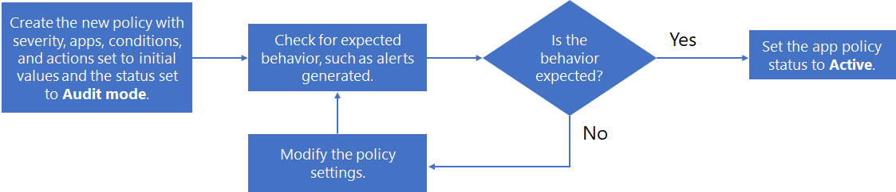

# Создание политик приложенийCreate app policies

>*[Руководство по лицензированию Microsoft 365 для обеспечения безопасности и соответствия требованиям](https://aka.ms/ComplianceSD).**[Microsoft 365 licensing guidance for security & compliance](https://aka.ms/ComplianceSD).*

Наряду со встроенным набором возможностей для обнаружения аномального поведения приложений и создания оповещений, политики приложений в системе управления приложениями Майкрософт позволяют:Along with a built-in set of capabilities to detect anomalous app behavior and generate alerts, app policies in Microsoft app governance are a way for you to:

- Указывать условия, на основании которых система управления приложениями может оповещать вас о поведении приложений для автоматического или ручного исправления.Specify conditions by which app governance can alert you to app behavior for automatic or manual remediation.
- Реализовать политики приложений по соответствию требованиям для вашей организации.Implement the app compliance policies for your organization.

Политики приложений можно создавать на основе предоставленных настраиваемых шаблонов, а также можно создать собственную политику приложений.You can create app policies from provided templates that can be customized, or you can create your own custom app policy.

Чтобы создать новую политику приложений, перейдите в раздел **Центр соответствия требованиям Microsoft 365 > Защита приложений и управление ими > Обзор > Политики**:To create a new app policy, go to **Microsoft 365 Compliance Center > App protection & governance > Overview page > Policies**:

- Чтобы создать политику приложений на основе шаблонов, предназначенных для использования приложений, выберите **Создать политику** в разделе **Создание политики использования приложений**.To create a new app policy with templates designed for app usage, select **Create policy** under **Create an app usage policy**.
- Чтобы создать политику приложений на основе шаблонов, предназначенных для разрешений приложений, выберите **Создать политику** в разделе **Создание политики разрешений**.To create a new app policy with templates designed for app permissions, select **Create policy** under **Create a permissions policy**.
- Чтобы создать политику приложений для сертификации приложения или для настраиваемой политики, выберите **Создать**.To create a new app policy for app certification or for a custom policy, select **Create new**.

## Шаблоны политики приложенийApp policy templates

Чтобы создать политику приложений на основе шаблона политики приложений, на странице **Выбор шаблона политики приложений** выберите категорию шаблона приложения, задайте имя шаблона и затем нажмите **Далее**.To create a new app policy based on an app policy template, on the **Choose App policy template page**, select a category of app template, select the name of the template, and then select **Next**.

В системе управления приложениями есть три категории шаблонов политик приложений.App governance has three categories of app policy templates.

### Доступ пользователей и данных к приложениюApp users and data access

Управление приложениями включает следующие шаблоны для создания оповещений об использовании приложений.App governance includes these templates to generate alerts for app usage.

| Имя шаблонаTemplate name | ОписаниеDescription |
|:-------|:-----|
| Новое приложение с доступом к большому объему данныхNew app with a high volume of data access | Выделяет недавно зарегистрированные приложения с доступом к большому объему данных, чтобы обеспечить предсказуемость шаблонов этих данных.Highlights any recently registered apps with high volume data access to ensure those data patterns are expected.    По умолчанию эта политика помечает все приложения, которые были зарегистрированы за последние 7 дней и которые имели доступ к более чем 1 ГБ данных за этот период.By default, this policy will flag all apps that have been registered in the last 7 days and that have had more than 1 GB in data access over that period. Эту политику можно настроить с помощью дополнительных условий и действий.This policy can be customized with more conditions and actions. |
|||

### Разрешения приложенийApp Permissions

Управление приложениями включает следующие шаблоны для создания оповещений для разрешений приложений.App governance includes these templates to generate alerts for app permissions.

| Имя шаблонаTemplate name | ОписаниеDescription |
|:-------|:-----|
| Приложения с избыточными правамиOverprivileged apps | Выделяет все приложения, которым предоставлено больше разрешений, чем они используют, для выявления возможностей сокращения разрешений.Highlights any apps with more granted permissions than are being used by those apps to identify opportunities for potential permission reduction.    По умолчанию эта политика помечает все приложения, которые помечены как приложения с избыточными правами, если они не используются в течение 90 дней.By default, this policy will flag all apps that are marked as Overprivileged if not used for 90 days. Фильтр периода времени можно настроить с помощью дополнительных условий и действий.This time period filter can be customized with more conditions and actions. |
| Новое приложение с разрешениями с высоким уровнем привилегийNew app with high-privilege permissions | Выделяет все новые приложения с разрешениями с высоким уровнем привилегий для выявления потенциально важных приложений, которые могут потребовать дальнейших исследований.Highlights all new apps with high privilege permissions to identify potential high-footprint apps that may need further investigation.    По умолчанию эта политика помечает все приложения, зарегистрированные за последние 7 дней и имеющие широкий спектр разрешений.By default, this policy will flag all apps registered within the last 7 days that have high-scoped permissions. |
|||

### Сертификация приложенияApp certification

Управление приложениями включает следующие шаблоны для создания оповещений для сертификации приложений.App governance includes these templates to generate alerts for app certification.

| Имя шаблонаTemplate name | ОписаниеDescription |
|:-------|:-----|
| Новое несертифицированное приложениеNew uncertified app | Выделяет новые приложения, которые еще не прошли сертификацию, чтобы убедиться, что они ожидаются в клиенте.Highlights new apps that haven't been through the app certification process to ensure that they are expected in the tenant.    По умолчанию эта политика помечает все приложения, зарегистрированные за последние 7 дней и не прошедшие сертификацию.By default, this policy will flag all apps that were registered in the last 7 days and are uncertified. |
|||

## Настраиваемые политики приложенийCustom app policies

Используйте настраиваемую политику приложений, когда необходимое вам действие не покрывается ни одним из встроенных шаблонов.Use a custom app policy when you need to do something not already done by one of the built-in templates.

Чтобы создать настраиваемую политику приложений, сначала выберите **Создать** на странице **Политики**.To create a new custom app policy, first select **Create new** on the **Policies** page. На странице **Выбор шаблона политики приложений** выберите категорию **Настраиваемая**, затем шаблон **Настраиваемая политика**, а после нажмите **Далее**.On the **Choose App policy template page**, select the **Custom** category, the **Custom policy** template, and then select **Next**.

На странице **Название и описание** настройте следующее:On the **Name and description** page, configure the following:

- Имя политикиPolicy Name

- Описание политикиPolicy Description

- Выберите уровень серьезности политики, который определяет уровень серьезности оповещений, создаваемых этой политикой.Select the policy severity, which sets the severity of alerts generated by this policy.

  - ВысокийHigh
  - СреднийMedium
  - НизкийLow

На странице **Выбор параметров и условий политики** в разделе **Выбор приложений, к которым применима эта политика** выберите:On the **Choose Policy settings and conditions** page, for **Choose which apps this policy is applicable for**, select:

- Все приложенияAll Apps
- Выбор определенных приложенийChoose specific apps

  На панели можно выбрать одно или несколько приложений.A pane allows you to select one or more apps.
  Нажмите **Добавить**.Select **Add**.

Нажмите **Далее**.Select **Next**.

На странице **Выбор параметров и условий политики** выберите **Установить новые условия для политики**, а затем нажмите **Далее**.On the **Choose Policy settings and conditions** page, select **Set new conditions for policy**, and then select **Next**.

На панели **Создание правила** можно выбрать условия для нового правила.The **Create rule** pane allows you to select conditions for a new rule. Нажмите **Добавить условие** и выберите условие из списка, а затем укажите значение условия.Select **Add condition** and select from the list of conditions, and then specify the value of the condition. Можно добавлять несколько условий.You can add multiple conditions.

Ниже перечислены доступные условия для настраиваемой политики приложений.Here are the available conditions for a custom app policy.

|УсловиеCondition | Допустимые значения условияCondition values accepted | Дополнительные сведенияMore information |
|:-------|:-----|:-------|
| Возраст регистрации приложенияApp registration age | В течение последних X днейWithin last X days |  |
| Сертификация приложенияApp certification | Базовое соответствие требованиям, соответствие требованиям MCAS или не применимоBasic compliance, MCAS Compliance, or N/A | [Сертификация Microsoft 365Microsoft 365 Certification](https://docs.microsoft.com/microsoft-365-app-certification/docs/enterprise-app-certification-guide) |
| Проверка издателяPublisher verification | Да или нетYes or No | [Проверка издателяPublisher Verification](https://docs.microsoft.com/azure/active-directory/develop/publisher-verification-overview) |
| Разрешение приложенияApplication Permission | Выберите одно или несколько разрешений API из спискаSelect one or more API permission from list | [Справочник по разрешениям Microsoft GraphMicrosoft Graph permissions reference](https://docs.microsoft.com/graph/permissions-reference) |
| Делегированное разрешениеDelegated Permission | Выберите одно или несколько разрешений API из спискаSelect one or more API permission from list | [Справочник по разрешениям Microsoft GraphMicrosoft Graph permissions reference](https://docs.microsoft.com/graph/permissions-reference) |
| Высокий уровень привилегийHigh privilege | Да или нетYes or No | Это внутреннее обозначение, основанное на той же логике, которая используется MCAS.This is an internal designation based on the same logic used by MCAS. |
| Приложение с избыточными правамиOverprivileged app | Да или нетYes or No | Приложения, которым предоставлено больше разрешений, чем ими используется.Apps with more granted permissions than are being used by those apps. |
| Доступ приложения к даннымApp data access | Доступ к данным размером более X ГБ в часGreater than X GB data access per hour |  |
| Тенденция доступа приложения к даннымApp data access trend | Увеличение использования данных на X% за последние 7 днейX% increase in data usage in last 7 days |  |
| Доступ приложения к APIApp API Access | Число вызовов API, превышающее X в часGreater than X API calls per hour |  |
| Тенденция доступа приложения к APIApp API Access trend | Увеличение вызовов API на X% за последние 7 днейX% increase in API Calls in last 7 days     |  |
| Пользователи, давшие согласиеUsers consented | Пользователей, давших согласие: (более или менее) X(Greater than or Less than) X consented users |  |
| Приоритетный пользователь дал согласиеPriority user consented | Да или нетYes or No | Пользователь с [приоритетной учетной записью](https://docs.microsoft.com/microsoft-365/admin/setup/priority-accounts).A user with a [priority account](https://docs.microsoft.com/microsoft-365/admin/setup/priority-accounts). |
| Согласие на приложение получено отApp consented by | Выберите пользователей из спискаSelect user(s) from list |  |
| Роль пользователя, давшего согласиеConsenting user’s role | Выберите одну или несколько ролей: администратор Teams, читатели каталогов, читатель сведений о безопасности, администратор соответствия требованиям, администратор безопасности, администратор службы поддержки, администратор SharePoint, администратор Exchange, глобальный читатель, глобальный администратор, администратор данных соответствия требованиям, администратор пользователя, администратор поддержки службSelect one or more: Teams Administrator, Directory Readers, Security Reader, Compliance Administrator, Security Administrator, Helpdesk Administrator, SharePoint Administrator, Exchange Administrator, Global Reader, Global Administrator, Compliance Data Administrator, User Administrator, Service Support Administrator | Разрешен выбор нескольких вариантов.Multiple selections allowed.    В этом списке должна быть доступна любая роль Azure AD с назначенным участником.Any Azure AD role with assigned member should be made available in this list. |
| Рабочая нагрузка, к которой получен доступWorkload accessed | OneDrive и/или SharePoint и/или ExchangeOneDrive and/or SharePoint and/or Exchange | Разрешен выбор нескольких вариантов.Multiple selections allowed. |
| Частота ошибокError rate | Частота ошибок превышает X% за последние 7 дней, где значение X определяется администраторомError rate is greater than X% in the last 7 days, where X is an admin-defined value |  |
||||

<!--
NOTE TO WRITER: Replace X in the above table with correct values.
-->

Чтобы эта политика приложений применялась, должны быть выполнены все указанные условия.All of the specified conditions must be met for this app policy to apply.

После указания условий нажмите **Сохранить**, а затем нажмите **Далее**.When you are done specifying the conditions, select **Save**, and then select **Next**.

Если вы хотите, чтобы система управления приложениями отключила приложение при создании оповещения на основе этой политики, на странице **Определение действий политики** выберите **Отключить приложение**, а затем нажмите **Далее**.On the **Define Policy Actions** page, select **Disable app** if you want app governance to disable the app when an alert based on this policy is generated, and then select **Next**.

На странице **Определение состояния политики** выберите один из перечисленных вариантов.On the **Define Policy Status** page, select one of these options:

- **Режим аудита**: политики оцениваются, но настроенные действия не выполняются.**Audit mode**: Policies are evaluated but configured actions will not occur. Политики в режиме аудита отображаются с состоянием **Аудит** в списке политик.Audit mode policies appear with the status of **Audit** in the list of policies.
- **Активная**: политики оцениваются, и выполняются настроенные действия.**Active**: Policies are evaluated and configured actions will occur.
- **Неактивная**: политики не оцениваются, и настроенные действия не выполняются.**Inactive**: Policies are not evaluated and configured actions will not occur.

<!--
## Configure a user-based policy

## Create an app metadata-based policy

Publish metadata-based policies

## Configure access permissions
-->

## Тестирование и мониторинг новой политики приложенийTest and monitor your new app policy

Теперь, когда политика приложений создана, необходимо отслеживать ее на странице **Политики**, чтобы убедиться, что она регистрирует ожидаемое количество активных оповещений и общее количество оповещений во время тестирования.Now that your app policy is created, you should monitor it on the **Policies** page to ensure it is registering an expected number of active alerts and total alerts during testing. 

Если количество оповещений неожиданно низкое, перед установкой состояния политики приложений отредактируйте ее параметры, чтобы убедиться, что настройка сделана правильно.If the number of alerts is an unexpectedly low value, edit the settings of the app policy to ensure you've configured it correctly before setting its status.

Ниже показан пример процесса создания новой политики, ее тестирования и активации.Here is an example of a process for creating a new policy, testing it, and then making it active:

1. Создайте новую политику с начальными значениями для уровня серьезности, приложений, условий и действий и со значением состояния **Режим аудита**.Create the new policy with severity, apps, conditions, and actions set to initial values and the status set to **Audit mode**.
2. Проверьте ожидаемое поведение, например созданные оповещения.Check for expected behavior, such as alerts generated.
3. Если поведение не соответствует ожидаемому, отредактируйте приложения политики, условия и параметры действий по мере необходимости и вернитесь к шагу 2.If the behavior is not expected, edit the policy apps, conditions, and action settings as needed and go back to step 2.
4. Если поведение соответствует ожидаемому, измените политику и переведите ее состояние в **Активная**.If the behavior is expected, edit the policy and change its status to **Active**.

## Следующий шагNext step

[Управление политиками приложений.Manage your app policies.](app-governance-app-policies-manage.md)
