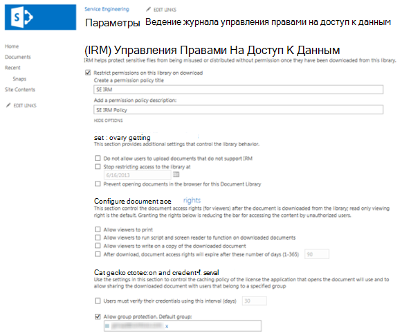
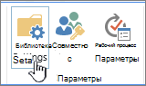

# Применение управления правами на управление правами на данные (IRM) к списку или библиотекеApply Information Rights Management (IRM) to a list or library

Управление правами на управление правами на сведения (IRM) можно использовать для управления и защиты файлов, скачиваемых из списков или библиотек.You can use Information Rights Management (IRM) to help control and protect files that are downloaded from lists or libraries.
  
## Подготовка администратора перед применением IRMAdministrator preparations before applying IRM

- Служба управления правами Azure (Azure RMS) из Azure Information Protection и локального эквивалента служба управления правами Active Directory (AD RMS) поддерживают управление правами на данные для сайтов.The Azure Rights Management service (Azure RMS) from Azure Information Protection, and the on-premises equivalent, Active Directory Rights Management Services (AD RMS), support Information Rights Management for sites. Отдельные или дополнительные установки не требуются.No separate or additional installations are required.

- Прежде чем применять IRM к списку или библиотеке, необходимо включить IRM для своего сайта.Before you apply IRM to a list or library, you need to enable IRM for your site. Чтобы включить IRM, необходимы разрешения администратора.You'll need administrator permissions to enable IRM.

- Чтобы применить IRM к списку или библиотеке, необходимо иметь разрешения администратора для этого списка или библиотеки.To apply IRM to a list or library, you must have administrator permissions for that list or library.

- Если вы используете SharePoint Online, у пользователей могут возникнуть периоды времени, когда вы скачиваете файлы с защитой IRM.If you're using SharePoint Online, your users might experience timeouts when downloading larger IRM-protected files. Чтобы избежать периодов времени, используйте программы Office для применения защиты IRM и храните файлы большего размера в библиотеке SharePoint, которая не использует IRM.To avoid timeouts, use your Office programs to apply IRM protection, and store larger files in a SharePoint library that doesn't use IRM.

> [!NOTE]
> Если вы используете SharePoint Server 2013, администратор сервера должен установить системы защиты на все серверы переднего сервера для каждого типа файлов, которые люди в организации хотят защитить с помощью IRM.If you're using SharePoint Server 2013, a server administrator must install protectors on all front-end Web servers for every file type that the people in your organization want to protect by using IRM.
  
## Применение IRM к списку или библиотекеApply IRM to a list or library

  
1. Перейдите к списку или библиотеке, для которых необходимо настроить IRM.Go to the list or library for which you want to configure IRM.

2. На ленте выберите вкладку **"Библиотека"** и выберите **"Параметры библиотеки".**On the ribbon, select the **Library** tab, and then select **Library Settings**. (Если вы работаете в списке, выберите вкладку **"Список"** и выберите **"Параметры списка").**(If you're working in a list, select the **List** tab, and then select **List Settings**).
    
    
  
3. В **области "Разрешения и управление"** выберите **"Управление правами на доступ к данным".**Under **Permissions and Management**, select **Information Rights Management**. Если ссылка "Управление правами на сведения" не появляется, IRM может быть не включена для вашего сайта.If the Information Rights Management link doesn't appear, IRM might not be enabled for your site. Обратитесь к администратору сервера, чтобы узнать, можно ли включить IRM для вашего сайта.Contact your server administrator to see if you can enable IRM for your site. Ссылка **"Управление правами** на сведения" не появляется для библиотек рисунков.The **Information Rights Management** link doesn't appear for picture libraries.

4. На странице **"Параметры** управления правами на доступ к данным" выберите разрешение "Ограничить доступ к документам в этой библиотеке", чтобы применить ограниченное разрешение к документам, загружаемых пользователями из этого списка или библиотеки. On the **Information Rights Management Settings** page, select the **Restrict permission to documents in this library on download** check box to apply restricted permission to documents users download from this list or library.

5. В поле **"Создание заголовка политики** разрешений" введите описательное имя политики.In the **Create a permission policy title** box, enter a descriptive name for the policy. Используйте имя, которое поможет идентифицировать эту политику из других политик.Use a name that helps you identify this policy from other policies. Например, используйте **"Company Confidential"** для применения ограниченных разрешений к списку или библиотеке, которая содержит конфиденциальные документы компании.For example, use **Company Confidential** to apply restricted permissions to a list or library that contains confidential company documents.

6. В поле **"Добавление** описания политики разрешений" введите описание, которое будет отображаться для людей, которые используют этот список или библиотеку, в которых объясняется, как они должны обрабатывать документы в этом списке или библиотеке.In the **Add a permission policy description** box, type a description that will appear to people who use this list or library that explains how they should handle the documents in this list or library. Например, вы можете  ввести "Обсуждение содержимого этого документа" только с другими сотрудниками, если вы хотите ограничить доступ к информации в этих документах для внутренних сотрудников.For example, you can type **Discuss the contents of this document only with other employees** if you want to restrict access to the information in these documents to internal employees. 

7. Чтобы применить дополнительные ограничения к документам в этом списке или библиотеке, выберите "Показать параметры" и сделайте следующее:To apply additional restrictions to the documents in this list or library, select **Show Options**, and do any of the following:

|**Для этого сделайте следующее:****To do this:**|**Сделайте это:****Do this:**|
|:-----|:-----|
|Разрешить пользователям печатать документы из этого списка или библиотекиAllow people to print documents from this list or library|Select the **Allow viewers to print check** box.Select the **Allow viewers to print** check box.|
|Разрешить пользователям с разрешением по крайней мере на просмотр элементов запускать внедренный код или макрос в документе.Allow people with at least the View Items permission to run embedded code or macros on a document.|Выберите **функцию "Разрешить просмотру сценариев** и чтения с экрана" для работы с загруженными документами. При выборе этого параметра пользователи могут запускать код для извлечения содержимого документа.Select the **Allow viewers to run script and screen reader to function on downloaded documents** check box.If you select this option, users could run code to extract the contents of a document.           |
|Выберите этот параметр, если необходимо ограничить доступ к содержимому указанным периодом времени.Select this option if you want to restrict access to content to a specified period of time. Если выбран этот параметр, срок действия лицензий на выдачу доступа к содержимому истекает через указанное количество дней, и люди должны будут вернуться на сервер, чтобы проверить свои учетные данные и скачать новую копию.If you select this option, people's issuance licenses to access the content will expire after the specified number of days, and people will be required to return to the server to verify their credentials and download a new copy.|Выберите "После скачивания", срок действия прав доступа к документу истекает через указанный срок **(1–365),** а затем укажите количество дней, в течение которых документ должен быть просмотрен.Select the **After download, document access rights will expire after these number of days (1-365)** check box, and then specify the number of days for which you want the document to be viewable.|
| Запретить людям загружать документы, которые не поддерживают IRM, в этот список или библиотеку.Prevent people from uploading documents that do not support IRM to this list or library. При выборе этого параметра пользователи не смогут отправить файлы следующих типов: типы файлов, для которых не установлены соответствующие системы защиты IRM на всех серверах переднего сервера.If you select this option, people will not be able to upload any of the following file types: File types that do not have corresponding IRM protectors installed on all of the front-end web servers. Типы файлов, которые Не удается расшифровать в SharePoint Server 2010.File types that SharePoint Server 2010 cannot decrypt. Типы файлов, защищенные СУИБ в другой программе.File types that are IRM protected in another program.|Выберите **"Не разрешите пользователям загружать документы, которые не поддерживают** проверку IRM".Select the **Do not allow users to upload documents that do not support IRM** check box.|
|Удаление ограниченных разрешений из этого списка или библиотеки в определенную дату.Remove restricted permissions from this list or library on a specific date.|Выберите **"Остановить ограничение доступа к** библиотеке" в этом поле, а затем выберите нужный срок.Select the **Stop restricting access to the library at** check box, and then select the date that you want.|
|У контролируется интервал кэшации учетных данных для программы, у которую есть лицензия на открытие документа.Control the interval that credentials are cached for the program that is licensed to open the document.|Выберите **"Пользователи должны проверить свои** учетные данные с помощью этого интервала (дней)", а затем введите интервал кэшировать учетные данные в течение нескольких дней.Select the **Users must verify their credentials using this interval (days)** check box, then enter the interval for caching credentials in number of days.|
|Разрешить защиту группы, чтобы пользователи могли делиться с членами одной и той же группы.Allow group protection so that users can share with members of the same group.|Выберите **"Разрешить защиту группы"** и введите имя группы для общего доступа.Select **Allow group protection**, and enter the group's name for sharing.|

8. После выбора нужных параметров выберите **"ОК".**After you finish selecting the options you want, select **OK**.
  
## Что такое управление правами на сведения?What is Information Rights Management?

Управление правами на доступ к данным (IRM) позволяет ограничить действия, которые пользователи могут делать с файлами, загруженными из списков или библиотек.Information Rights Management (IRM) enables you to limit the actions that users can take on files that have been downloaded from lists or libraries. IRM выполняет шифрование загруженных файлов и ограничивает набор пользователей и программ, которым разрешается расшифровывать эти файлы.IRM encrypts the downloaded files and limits the set of users and programs that are allowed to decrypt these files. IRM также может ограничить права пользователей, которым разрешается чтение файлов, запрещая им такие действия как печать копий файлов или копирование текста из них.IRM can also limit the rights of the users who are allowed to read files, so that they cannot take actions such as print copies of the files or copy text from them.
  
Для ограничения распространения конфиденциального контента можно использовать IRM в списках или библиотеках.You can use IRM on lists or libraries to limit the dissemination of sensitive content. Например, если вы создаете библиотеку документов для обмена информацией о предстоящих продуктах с выбранными маркетинговыми представителями, вы можете использовать IRM, чтобы запретить этим лицам делиться этим контентом с другими сотрудниками компании.For example, if you are creating a document library to share information about upcoming products with selected marketing representatives, you can use IRM to prevent these individuals from sharing this content with other employees in the company.
  
На сайте IRM применяется к всему списку или библиотеке, а не к отдельным файлам.On a site, you apply IRM to an entire list or library, rather than to individual files. Это упрощает обеспечение согласованного уровня защиты для всего набора документов или файлов.This makes it easier to ensure a consistent level of protection for an entire set of documents or files. Таким образом, IRM может помочь организации применять корпоративные политики, управляющие использованием и распространением конфиденциальной или конфиденциальной информации.IRM can thus help your organization to enforce corporate policies that govern the use and dissemination of confidential or proprietary information.
  
> [!NOTE]
> Информация на этой странице об управлении правами на доступ к данным переоценка любых условий, ссылающихся на "Управление правами на доступ к данным" в любых соглашениях об условиях лицензионного соглашения microsoft SharePoint Server 2013 и SharePoint Server 2016.The information on this page regarding Information Rights Management supersedes any terms that reference 'Information Rights Management' in any Microsoft SharePoint Server 2013 and SharePoint Server 2016 license term agreements. 
  
### Защита контента с помощью IRMHow IRM can help protect content

IRM помогает защитить контент с ограниченным доступом следующими способами:IRM helps to protect restricted content in the following ways:
  
- Помогает предотвратить копирование, изменение, печать, факсимили, копирование и ветвь содержимого для несанкционированного использования авторизованным просмотромHelps to prevent an authorized viewer from copying, modifying, printing, faxing, or copying and pasting the content for unauthorized use
    
- Помогает предотвратить копирование содержимого авторизованным просмотром с помощью функции экрана печати в Microsoft WindowsHelps to prevent an authorized viewer from copying the content by using the Print Screen feature in Microsoft Windows
    
- Помогает предотвратить просмотр неавторизованным просмотром содержимого, если оно отправляется по электронной почте после загрузки с сервераHelps to prevent an unauthorized viewer from viewing the content if it is sent in e-mail after it is downloaded from the server
    
- Ограничивает доступ к содержимому указанным периодом времени, после которого пользователи должны подтвердить свои учетные данные и снова загрузить содержимоеRestricts access to content to a specified period of time, after which users must confirm their credentials and download the content again
    
- Помогает применять корпоративные политики, управляющие использованием и распространением контента в организацииHelps to enforce corporate policies that govern the use and dissemination of content within your organization
    
### Как IRM не может помочь защитить контентHow IRM cannot help protect content

IRM не может защитить содержимое с ограниченным доступом от следующих содержимого:IRM cannot protect restricted content from the following:
  
- Стирание, кража, захват или передача вредоносными программами, такими как троянский вирус, журналы нажатия клавиш и некоторые типы шпионского ПОErasure, theft, capture, or transmission by malicious programs such as Trojan horses, keystroke loggers, and certain types of spyware
    
- Потеря или повреждения из-за действий вирусов компьютераLoss or corruption because of the actions of computer viruses
    
- Копирование или повторное копирование содержимого вручную с экранаManual copying or retyping of content from the display on a screen
    
- Цифровая или видеосъемка содержимого, отображаемого на экранеDigital or film photography of content that is displayed on a screen
    
- Копирование с помощью сторонних программ захвата экранаCopying through the use of third-party screen-capture programs
    
- Копирование метаданных контента (значений столбцов) с помощью сторонних программ захвата экрана или действия копирования и вики-копированияCopying of content metadata (column values) through the use of third-party screen-capture programs or copy-and-paste action
    
[Применение управления правами на доступ к данным к списку или библиотекеApply Information Rights Management to a list or library](https://support.office.com/article/6714cfe3-ef39-43b0-bb65-a887726bb63c)
  
## Как IRM работает для списков и библиотекHow IRM works for lists and libraries

Защита IRM применяется к файлам на уровне списка или библиотеки.IRM protection is applied to files at the list or library level. Если для библиотеки включена IRM, управление правами применяется ко всем файлам в этой библиотеке.When IRM is enabled for a library, rights management applies to all of the files in that library. Если для списка включена IRM, управление правами применяется только к файлам, вложенным в элементы списка, а не к фактическим.When IRM is enabled for a list, rights management applies only to files that are attached to list items, not the actual list items.
  
Когда люди скачивает файлы в списке или библиотеке с поддержкой IRM, они шифруются, чтобы их могли просматривать только авторизованные люди.When people download files in an IRM-enabled list or library, the files are encrypted so that only authorized people can view them. Каждый управляемый правами файл также содержит лицензию на выдачу, которая накладывает ограничения на людей, просматривавших файл.Each rights-managed file also contains an issuance license that imposes restrictions on the people who view the file. Типичные ограничения включают создание файла только для чтения, отключение копирования текста, запрет на сохранение локальной копии и запрет на печать файла.Typical restrictions include making a file read-only, disabling the copying of text, preventing people from saving a local copy, and preventing people from printing the file. Клиентские программы, которые могут читать типы файлов, поддерживаемые IRM, используют лицензию на выдачу в управляемом правами файле для применения этих ограничений.Client programs that can read IRM-supported file types use the issuance license within the rights-managed file to enforce these restrictions. Таким образом управляемый правами файл сохраняет свою защиту даже после загрузки с сервера.This is how a rights-managed file retains its protection even after it is downloaded from the server.
  
Типы ограничений, которые применяются к файлу при его загрузке из списка или библиотеки, основаны на разрешениях отдельного пользователя на сайте, который содержит файл.The types of restrictions that are applied to a file when it is downloaded from a list or library are based on the individual user's permissions on the site that contains the file. В следующей таблице объясняется, как разрешения на сайтах соответствуют разрешениям IRM.The following table explains how the permissions on sites correspond to IRM permissions.
  
|**Разрешения****Permissions**|**Разрешения IRM****IRM Permissions**|
|:-----|:-----|
|Управление разрешениями, управление веб-сайтомManage Permissions, Manage Web Site|**Полный доступ** (как определено клиентской программой): это разрешение, как правило, позволяет пользователю читать, редактировать, копировать, сохранять и изменять разрешения на доступ к контенту, управляемому правами.**Full control** (as defined by the client program): This permission generally allows a user to read, edit, copy, save, and modify permissions of rights-managed content.|
|Редактирование элементов, управление списками, добавление и настройка страницEdit Items, Manage Lists, Add and Customize Pages|**Редактирование,** копирование и сохранение: пользователь может  распечатать файл только в том случае, если на странице "Параметры управления правами на доступ к данным" для списка или библиотеки выбран параметр "Разрешить пользователям печатать документы". **Edit**, **Copy**, and **Save**: A user can print a file only if the **Allow users to print documents** check box is selected on the Information Rights Management Settings page for the list or library.|
|Просмотр элементовView Items|**Чтение:** пользователь может читать документ, но не может копировать или изменять его содержимое.**Read**: A user can read the document, but cannot copy or modify its content. Пользователь может печатать  только в том случае, если на странице "Параметры управления правами на доступ к данным" для списка или библиотеки выбран параметр "Разрешить пользователям печатать документы".A user can print only if the **Allow users to print documents** check box is selected on the Information Rights Management Settings page for the list or library.|
|ДругоеOther|Никакие другие разрешения напрямую не соответствуют разрешениям IRM.No other permissions correspond directly to IRM permissions.|
   
Если включить IRM для списка или библиотеки в SharePoint Server 2013, можно защитить только типы файлов в этом списке или библиотеке, для которых система защиты установлена на всех серверах переднего сервера.When you enable IRM for a list or library in SharePoint Server 2013, you can only protect file types in that list or library for which a protector is installed on all front-end web servers. Система защиты — это программа, которая управляет шифрованием и расшифровка управляемых правами файлов определенного формата.A protector is a program that controls the encryption and decryption of rights-managed files of a specific file format. SharePoint включает в себя точки защиты для следующих типов файлов:SharePoint includes protectors for the following file types:
  
- Microsoft Office infoPathMicrosoft Office InfoPath forms
    
- Форматы файлов 97–2003 для следующих Microsoft Office: Word, Excel и PowerPointThe 97-2003 file formats for the following Microsoft Office programs: Word, Excel, and PowerPoint
    
- Форматы Office Open XML для следующих Microsoft Office: Word, Excel и PowerPointThe Office Open XML Formats for the following Microsoft Office programs: Word, Excel, and PowerPoint
    
- Формат XML Paper Specification (XPS)The XML Paper Specification (XPS) format
    
Если организация планирует использовать IRM для защиты любых других типов файлов в дополнение к перечисленным выше, администратор сервера должен установить системы защиты для этих дополнительных форматов файлов.If your organization plans to use IRM to protect any other file types in addition to those listed above, your server administrator must install protectors for these additional file formats.
  

