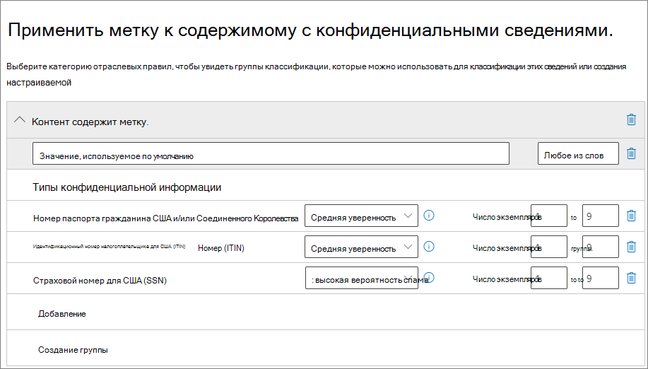

# <a name="automatically-apply-a-retention-label-to-retain-or-delete-content"></a>Автоматическое применение метки хранения для сохранения или удаления контента

>*[Руководство по лицензированию Microsoft 365 для обеспечения безопасности и соответствия требованиям](/office365/servicedescriptions/microsoft-365-service-descriptions/microsoft-365-tenantlevel-services-licensing-guidance/microsoft-365-security-compliance-licensing-guidance).*

> [!NOTE]
> Этот сценарий не поддерживается для [нормативных записей](records-management.md#records).

Одно из главных преимуществ [меток хранения](retention.md) — возможность автоматически их присваивать содержимому, которое соответствует определенным условиям. В этом случае сотрудникам вашей организации не нужно будет самостоятельно присваивать метки хранения. Microsoft 365 все сделает за них.
  
Польза автоматического присваивания меток хранения в том, что:
  
- вам не придется обучать пользователей работе со всеми категориями;
    
- вам не нужно будет рассчитывать на то, что пользователи правильно классифицируют весь контент;
    
- пользователям больше не нужно будет знать о политиках управления данными — они могут сосредоточиться на своей работе.
    
Метки хранения можно автоматически применять к контенту, если он содержит конфиденциальную информацию, ключевые слова, доступные для поиска свойства или совпадение для [обучаемых классификаторов](classifier-get-started-with.md).

> [!TIP]
> С помощью недавно выпущенных свойств, по которым выполняется поиск, можно найти [записи собраний в Teams](#microsoft-teams-meeting-recordings).

Процесс автоматического применения метки хранения основан на этих условиях:


Следуйте инструкциям ниже, чтобы выполнить два действия администратора.

> [!NOTE]
> Автоматические политики используют метки на стороне службы в условиях для автоматического применения меток хранения. Также можно автоматически применить метку хранения с помощью политики меток, как описано ниже. 
>
> - Применение метки хранения к модели осмысления документации в SharePoint Syntex
> - Применение стандартной метки хранения для SharePoint и Outlook
>- Применение метки хранения к сообщению электронной почты с помощью правил Outlook
>
> Дополнительные сведения см. в статье [Создание и применение меток хранения в приложениях](create-apply-retention-labels.md)

## <a name="before-you-begin"></a>Прежде чем начать

Глобальный администратор организации имеет все разрешения на создание и изменение меток хранения и их политик. Если вы входите не как глобальный администратор, см. раздел [Разрешения, необходимые для создания и управления политиками хранения и метками хранения](get-started-with-retention.md#permissions-required-to-create-and-manage-retention-policies-and-retention-labels).

## <a name="how-to-auto-apply-a-retention-label"></a>Автоматическое применение меток хранения

Сначала создайте метку хранения. После этого создайте автоматическую политику для применения метки. Если вы уже создали метку хранения, перейдите к [созданию автоматической политики](#step-2-create-an-auto-apply-policy).

Инструкции по переходу зависят от того, используете ли вы [управление записями](records-management.md) или нет. В обоих случаях доступны соответствующие инструкции.

### <a name="step-1-create-a-retention-label"></a>Этап 1. Создание метки хранения

1. В [Центре соответствия требованиям Microsoft 365](https://compliance.microsoft.com/) перейдите в одно из следующих расположений:
    
    - Если используется управление записями:
        - **Решения** > **Управление записями** > вкладка **План хранения** > **+ Создать метку** > **Метка хранения**
        
    - Если управление записями не используется:
       - **Решения** > **Управление информацией** > вкладка **Метки** > + **Создать метку**
    
    Не отображается необходимый параметр? Сначала выберите **Показать все**. 

2. Следуйте указаниям мастера. Если используется управление записями:
    
    - Дополнительные сведения о дескрипторах плана хранения, см. в статье [Использование плана хранения для управления метками хранения](file-plan-manager.md)
    
    - Чтобы использовать метку хранения для объявления элементов записями, нажмите кнопку **Пометить элементы как записи** или **Пометить элементы как нормативные записи**. Дополнительные сведения см. в статье [Настройка меток хранения для объявления элементов записями](declare-records.md#configuring-retention-labels-to-declare-records)

3. После того, как вы создали метку и просмотрели параметры для ее публикации, автоматически примените метку или просто сохраните ее: выберите пункт **Автоматически применять эту метку к определенному типу содержимого**, а затем выберите **Готово**, чтобы запустить Мастер автоматического создания меток, который сразу переведет вас к действию 2 в процедуре ниже.

Чтобы изменить существующую метку, выберите ее и нажмите **Изменить метку** для запуска Мастера изменения хранения, который позволяет изменить описания меток и любые [доступные параметры](#updating-retention-labels-and-their-policies) на шаге 2.

### <a name="step-2-create-an-auto-apply-policy"></a>Этап 2. Создание политики автоматического применения

При создании политики автоматического применения необходимо выбрать метку хранения, которая будет автоматически применена к содержимому на основе указанных условий.

1. В [Центре соответствия требованиям Microsoft 365](https://compliance.microsoft.com/) перейдите в одно из следующих расположений:
    
    - Если используется управление записями: **Управление информацией**:
        - **Решения** > **Управление записями** >  вкладка **Политики метки** > **Автоматически применить метку**
    
    - Если управление записями не используется:
        - **Решения** > **Управление информацией** >  вкладка **Политики меток** > **Автоматически применить метку**
    
    Не отображается необходимый параметр? Сначала выберите **Показать все**. 

2. Следуйте инструкциям в Мастере автоматического создания меток.
    
    Сведения о настройке условий для автоматического применения метки хранения, см. в разделе [Настройка условий автоматического применения меток хранения](#configuring-conditions-for-auto-apply-retention-labels) на этой странице.
    
    Сведения о расположениях, поддерживаемых метками хранения, см. в разделе [Метки хранения и расположения](retention.md#retention-label-policies-and-locations).

Чтобы изменить существующую политику автоматического применения меток, выберите ее для запуска Мастера изменения политики хранения, который позволяет изменить выбранную метку хранения и [любые доступные параметры](#updating-retention-labels-and-their-policies) на шаге 2.

После применения метки к содержимому с помощью политики автоматического применения меток примененную метку нельзя автоматически удалить или изменить путем изменения содержимого или политики, а также посредством новой политики автоматического применения меток. Дополнительные сведения см. в разделе [Метки хранения присваиваются по одной](retention.md#only-one-retention-label-at-a-time).

### <a name="configuring-conditions-for-auto-apply-retention-labels"></a>Настройка условий для автоматического применения меток хранения

Автоматически применяйте метки хранения к контенту, содержащему:

- [конфиденциальную информацию определенных типов](#auto-apply-labels-to-content-with-specific-types-of-sensitive-information);

- [определенные ключевые слова или доступные для поиска свойства, соответствующие созданному запросу](#auto-apply-labels-to-content-with-keywords-or-searchable-properties);

- [совпадение для обучаемых классификаторов](#auto-apply-labels-to-content-by-using-trainable-classifiers).

#### <a name="auto-apply-labels-to-content-with-specific-types-of-sensitive-information"></a>Автоматическое применение меток к контенту с определенными типами конфиденциальной информации

> [!WARNING]
> В этой конфигурации сейчас присутствует известное ограничение, из-за которого ко всем письмам без меток всегда применяется выбранная метка хранения, если для выбранных типов конфиденциальной информации есть соответствие. Например, даже если вы ограничили область политики автоматического применения определенными пользователями или выбрали расположения, отличные от Exchange, метка всегда применяется к письмам без меток при наличии соответствия.

Когда вы создаете политики автоматического применения меток хранения для конфиденциальной информации, вы видите тот же список шаблонов политик, что и при создании политики защиты от потери данных (DLP). Каждый шаблон предварительно настроен на поиск определенных типов конфиденциальной информации. В следующем примере типы конфиденциальной информации относятся к категории **Конфиденциальность** и шаблону **личных сведений для США**:



Для получения дополнительной информации о типах конфиденциальной информации см. [Определения объектов типа конфиденциальной информации](sensitive-information-type-entity-definitions.md). В настоящее время функции [точного совпадения данных](create-custom-sensitive-information-types-with-exact-data-match-based-classification.md) и [создания отпечатка документа](document-fingerprinting.md) не поддерживаются в этом сценарии.

Выбрав шаблон политики, вы можете добавлять или удалять любые типы конфиденциальной информации, а также менять доверительный уровень и количество экземпляров. На предыдущем снимке экрана с примером эти параметры изменены, чтобы метка хранения автоматически присваивалась только в том случае, если:
  
- Обнаруженный тип конфиденциальной информации имеет точность совпадения ([доверительный уровень](sensitive-information-type-learn-about.md#more-on-confidence-levels)) как минимум равную **среднему доверительному уровню** для двух типов конфиденциальной информации и **высокому доверительному уровню** для одного типа. Многие типы конфиденциальной информации определяются с использованием нескольких шаблонов, где для шаблона с более высокой точностью совпадения требуется больше подтверждающих признаков (например, ключевые слова, даты или адреса). Чем ниже доверительный уровень, тем проще содержимому соответствовать условию, но при этом может возрасти количество ложноположительных результатов.

- В содержимом от 1 до 9 раз встречается любой из перечисленных трех типов конфиденциальной информации. Значение по умолчанию для параметра **to** — **Любое**.

Дополнительные сведения об этих параметрах см. в следующих руководствах в документации по защите от потери данных [Настройка более или менее строгих правил](data-loss-prevention-policies.md#tuning-rules-to-make-them-easier-or-harder-to-match).

Сведения, которые необходимо учитывать при использовании типов конфиденциальной информации для автоматического применения меток хранения.

- Метки можно автоматически применять к новым и измененным элементам.

#### <a name="auto-apply-labels-to-content-with-keywords-or-searchable-properties"></a>Автоматическое применение меток к контенту с ключевыми словами или доступными для поиска свойствами

Метки можно автоматически применять к контенту с помощью запроса, содержащего определенные слова, фразы или значения доступных для поиска свойств. Вы можете уточнить запрос с помощью таких операторов поиска, как AND, OR и NOT.


Дополнительные сведения о синтаксисе языка запросов по ключевым словам (KQL) см. в статье [Справочник по синтаксису языка запросов по ключевым словам (KQL)](/sharepoint/dev/general-development/keyword-query-language-kql-syntax-reference).

Для поиска содержимого политики автоматического применения на основе запросов используют тот же индекс поиска, что и средство обнаружения электронных данных. Дополнительные сведения о доступных для поиска свойствах, которые можно использовать, см. в статье [Запросы с ключевыми словами и условия для поиска содержимого](keyword-queries-and-search-conditions.md).

Сведения, которые необходимо учитывать при использовании ключевых слов или доступных для поиска свойств для автоматического применения меток хранения.

- Метки будут автоматически применяться к новым, измененным и существующим элементам в SharePoint, OneDrive и Exchange.

- В SharePoint свойства для обхода и настраиваемые свойства не поддерживаются для таких запросов по ключевым словам, поэтому необходимо использовать только предварительно настроенные управляемые свойства. Однако можно использовать сопоставления на уровне клиента с предварительно настроенными управляемыми свойствами, которые по умолчанию включены как уточнения (RefinableDate00-19, RefinableString00-99, RefinableInt00-49, RefinableDecimals00-09 и RefinableDouble00-09). Дополнительные сведения см. в статье [Обзор свойств для обхода и управляемых свойств в SharePoint Server](/SharePoint/technical-reference/crawled-and-managed-properties-overview) и [Создание нового управляемого свойства](/sharepoint/manage-search-schema#create-a-new-managed-property).

- Если настраиваемое свойство сопоставляется с одним из свойств уточнения, подождите 24 часа, прежде чем использовать его в запросе по ключевым словам для метки хранения.

- Хотя управляемые свойства SharePoint можно переименовывать с помощью псевдонимов, не используйте их в запросах по ключевым словам для своих меток. Всегда указывайте фактическое имя управляемого свойства, например "RefinableString01".

- При поиске значений, содержащих пробелы или специальные символы, заключайте фразу в двойные кавычки (`" "`). Например: `subject:"Financial Statements"`.

- Для сопоставления элемента на основе его URL-адреса используйте свойство *DocumentLink*, а не *Path*. 

- Поиск с подстановкой суффикса (`*cat`) или подстроки (`*cat*`) не поддерживается. Однако поиск с подстановкой префикса (`cat*`) поддерживается.

- Необходимо учитывать, что при использовании оператора NOT частично индексированные элементы могут стать причиной того, что метки не будут применяться к нужным элементам или будут применяться к элементам, которые необходимо исключить. Дополнительные сведения см. в статье [Частично индексированные элементы в средстве "Поиск содержимого"](partially-indexed-items-in-content-search.md).


Примеры запросов:

| Рабочая нагрузка | Пример |
|:-----|:-----|
|Exchange   | `subject:"Financial Statements"` |
|Exchange   | `recipients:garthf@contoso.com` |
|SharePoint | `contenttype:document` |
|SharePoint | `site:https://contoso.sharepoint.com/sites/teams/procurement AND contenttype:document`|
|Exchange или SharePoint | `"customer information" OR "private"`|

Более сложные примеры.

Приведенный ниже запрос для SharePoint позволяет обнаружить документы Word и электронные таблицы Excel, содержащие ключевые слова **password**, **passwords** или **pw**:

```
(password OR passwords OR pw) AND (filetype:doc* OR filetype:xls*)
```

Приведенный ниже запрос для Exchange позволяет обнаружить документы Word или PDF-файлы, содержащие слово **nda** или фразу **non disclosure agreement**, если эти документы вложены в сообщение электронной почты:

```
(nda OR "non disclosure agreement") AND (attachmentnames:.doc* OR attachmentnames:.pdf)
```

Приведенный ниже запрос для SharePoint позволяет обнаружить документы, содержащие номера кредитных карт: 

```
sensitivetype:"credit card number"
```

Приведенный ниже запрос содержит несколько типичных ключевых слов, которые позволяют обнаружить документы или сообщения электронной почты, содержащие правовую информацию:

```
ACP OR (Attorney Client Privilege*) OR (AC Privilege)
```

Приведенный ниже запрос содержит типичные ключевые слова, позволяющие обнаружить документы или сообщения электронной почты для специалистов отдела кадров: 

```
(resume AND staff AND employee AND salary AND recruitment AND candidate)
```

Обратите внимание, что в последнем примере используется  лучший метод, предусматривающий постоянное применение операторов между ключевыми словами. Пробел между двумя ключевыми словами или двумя выражениями свойство:значение аналогичен оператору AND. Постоянное применение операторов позволяет понять, что для этого примера запроса будет найдено содержимое, включающее все эти ключевые слова, а не какое-либо из этих ключевых слов. Если нужно найти содержимое, включающее любое ключевое слово, укажите OR вместо AND. Как показано в этом примере, при постоянном использовании операторов легче правильно интерпретировать запрос. 

##### <a name="microsoft-teams-meeting-recordings"></a>Записи собраний в Microsoft Teams

> [!NOTE]
> Функция хранения и удаления записей собраний в Teams не работает до сохранения записей в OneDrive или SharePoint. Дополнительные сведения см. в статье [Использование OneDrive для бизнеса, SharePoint или Stream для записи собраний](/MicrosoftTeams/tmr-meeting-recording-change)

Для поиска записей собраний в Microsoft Teams, хранящихся в пользовательских учетных записях OneDrive или SharePoint, укажите для **редактора запросов по ключевым словам** следующую информацию:

``` 
ProgID:Media AND ProgID:Meeting
```

В большинстве случаев записи собраний сохраняются в OneDrive, но записи собраний на каналах сохраняются в SharePoint.


#### <a name="auto-apply-labels-to-content-by-using-trainable-classifiers"></a>Автоматическое применение меток к контенту с помощью обучаемых классификаторов

При использовании варианта для обучаемого классификатора вы можете выбрать один из встроенных классификаторов или настраиваемый классификатор. К встроенным классификаторам относятся **Резюме**, **Исходный код**, **Целенаправленное притеснение**, **Сквернословие** и **Угрозы**.


> [!CAUTION]
> Мы не рекомендуем использовать встроенный классификатор **Оскорбительная лексика**, так как он генерировал большое количество ложных срабатываний. Не используйте этот встроенный классификатор, а если вы применяете его в настоящее время, следует перенести с него свои бизнес-процессы. Вместо него рекомендуем использовать встроенные классификаторы **Целенаправленное притеснение**, **Сквернословие** и **Угрозы**.

Для автоматического применения метки с использованием этого параметра сайты SharePoint и почтовые ящики должны иметь не менее 10 МБ данных.

Дополнительные сведения об обучаемых классификаторах см. в статье [Информация об обучаемых классификаторах](classifier-learn-about.md).

> [!TIP]
> Если вы используете обучаемые классификаторы для Exchange, см. статью [Повторное обучение классификаторов в обозревателе содержимого](classifier-how-to-retrain-content-explorer.md).

Сведения, которые необходимо учитывать при использовании обучаемых классификаторов для автоматического применения меток хранения.

- Метки можно автоматически применять к новым и измененным элементам, а также к существующим элементам за последние шесть месяцев.

## <a name="how-long-it-takes-for-retention-labels-to-take-effect"></a>Срок вступления меток хранения в силу

Когда метки хранения применяются автоматически, может потребоваться до семи дней, чтобы метки хранения были применены ко всему существующему контенту, соответствующему условиям.
  


Если после семи дней ожидаемые метки не появляются, проверьте **Состояние** политики автоматического применения, выбрав ее на странице **Политики меток** в Центре соответствия требованиям. Для повторного развертывания политики (для OneDrive) или если отображается состояние **Отключено (ошибка)**, а в сведениях расположений выводится сообщение о том, что развертывание политики (для SharePoint) занимает больше времени, чем ожидалось, попробуйте выполнить команду [Set-RetentionCompliancePolicy](/powershell/module/exchange/set-retentioncompliancepolicy) в PowerShell, чтобы повторно распространить политику:

1. [Подключение к Центру безопасности и соответствия требованиям Windows PowerShell](/powershell/exchange/connect-to-scc-powershell).

2. Выполните следующую команду:
    
    ``` PowerShell
    Set-RetentionCompliancePolicy -Identity <policy name> -RetryDistribution
   ```

## <a name="updating-retention-labels-and-their-policies"></a>Обновление меток хранения и их политик

При изменении меток хранения или политики авто-применения, когда метка хранения уже применена к контенту, ваши обновленные параметры автоматически применяются к этому контенту, в дополнение к уже определенному.

Некоторые параметры невозможно изменить после создания и сохранения метки или политики, в том числе:
- Имя метки хранения и имя политики, а также параметры хранения, за исключением периода хранения. Однако если период хранения основан на времени применения метки к элементам, его изменить нельзя.
- Параметр, помечающий элементы как запись.

### <a name="deleting-retention-labels"></a>Удаление меток хранения

Вы можете удалить метки хранения, которые в настоящее время не включены ни в одну политику меток хранения, которые не настроены на хранение на основе событий или помечают элементы как нормативные записи.

Для меток хранения, которые вы можете удалить, если они были применены к элементам, удаление не будет выполнено,а вы увидите ссылку на обозреватель содержимого для идентификации помеченных элементов.

Однако отображение помеченных элементов в обозревателе содержимого может занять до двух дней. В этом сценарии возможно удаление метки хранения без отображения ссылки на обозреватель содержимого.

## <a name="locking-the-policy-to-prevent-changes"></a>Блокировка политики для предотвращения изменений

Чтобы гарантировать, что никто не сможет отключить политику, удалить ее или сделать ее менее строгой, см. раздел [Использование блокировки для сохранения для ограничения изменений политик хранения и политик меток хранения](retention-preservation-lock.md).

## <a name="next-steps"></a>Дальнейшие действия

Пример сценария, в котором используется политика автоматического применения меток хранения с управляемыми свойствами в SharePoint и хранение на основе событий, чтобы начать период хранения, см. в статье [Управление жизненным циклом хранящихся в SharePoint документов с помощью меток хранения](auto-apply-retention-labels-scenario.md).