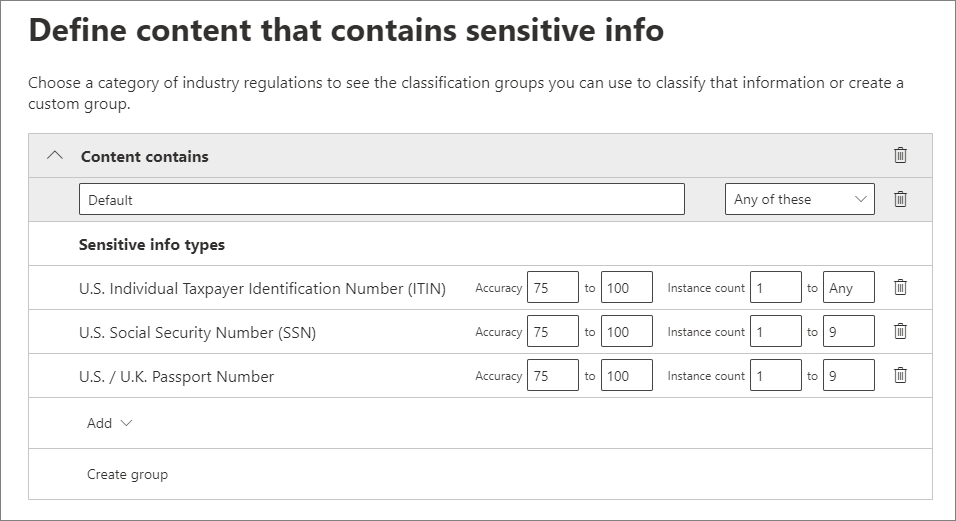

# Автоматическое применение метки хранения для сохранения или удаления контентаAutomatically apply a retention label to retain or delete content

>*[Руководство по лицензированию Microsoft 365 для обеспечения безопасности и соответствия требованиям](https://aka.ms/ComplianceSD).**[Microsoft 365 licensing guidance for security & compliance](https://aka.ms/ComplianceSD).*

Одно из главных преимуществ [меток хранения](retention.md) — возможность автоматически их присваивать содержимому, которое соответствует определенным условиям.One of the most powerful features of [retention labels](retention.md) is the ability to apply them automatically to content that matches specified conditions. В этом случае сотрудникам вашей организации не нужно будет самостоятельно присваивать метки хранения.In this case, people in your organization don't need to apply the retention labels. Microsoft 365 все сделает за них.Microsoft 365 does the work for them.
  
Польза автоматического присваивания меток хранения в том, что:Auto-applying retention labels are powerful because:
  
- вам не придется обучать пользователей работе со всеми категориями;You don't need to train your users on all of your classifications.
    
- вам не нужно будет рассчитывать на то, что пользователи правильно классифицируют весь контент;You don't need to rely on users to classify all content correctly.
    
- пользователям больше не нужно будет знать о политиках управления данными — они могут сосредоточиться на своей работе.Users no longer need to know about data governance policies - they can focus on their work.
    
Метки хранения можно автоматически применять к содержимому, если оно содержит конфиденциальную информацию, ключевые слова или [совпадение для обучаемых классификаторов](classifier-getting-started-with.md).You can apply retention labels to content automatically when that content contains sensitive information, keywords, or a match for [trainable classifiers](classifier-getting-started-with.md).
    
Процесс автоматического применения метки хранения основан на этих условиях:The processes to automatically apply a retention label based on these conditions:

Следуйте инструкциям ниже, чтобы выполнить два действия администратора.Use the following instructions for the two admin steps.

> [!NOTE]
> Автоматические политики используют метки на стороне службы в условиях для автоматического применения меток хранения.Auto-policies use service-side labeling with conditions to automatically apply retention labels. Также можно автоматически применить метку хранения с помощью политики меток, как описано ниже.You can also automatically apply a retention label with a label policy when you do the following: 
>
> - Применение метки хранения по умолчанию к библиотеке SharePoint, папке или набору документов таким образом, чтобы контент без меток помечался автоматически.Apply a default retention label to a SharePoint library, folder, or document set so that unlabeled content in that container is automatically labeled
>- Автоматическое применение метки хранения к электронному сообщению с помощью правилAutomatically applying a retention label to email by using rules
>
> Дополнительные сведения см. в статье [Создание и применение меток хранения в приложениях](create-apply-retention-labels.md)For these scenarios, see [Create and apply retention labels in apps](create-apply-retention-labels.md).

## Прежде чем начатьBefore you begin

Глобальный администратор организации имеет все разрешения на создание и изменение меток хранения и их политик.The global admin for your organization has full permissions to create and edit retention labels and their policies. Если вы входите не как глобальный администратор, см. раздел [Разрешения, необходимые для создания и управления политиками хранения и метками хранения](get-started-with-retention.md#permissions-required-to-create-and-manage-retention-policies-and-retention-labels).If you aren't signing in as a global admin, see [Permissions required to create and manage retention policies and retention labels](get-started-with-retention.md#permissions-required-to-create-and-manage-retention-policies-and-retention-labels).

## Автоматическое применение меток храненияHow to auto-apply a retention label

Сначала создайте метку хранения.First, create your retention label. После этого создайте автоматическую политику для применения метки.Then create an auto-policy to apply that label. Если вы уже создали метку хранения, перейдите к [созданию автоматической политики](#step-2-create-an-auto-apply-policy).If you have already created your retention label, skip to [creating an auto-policy](#step-2-create-an-auto-apply-policy).

Инструкции по переходу зависят от того, используете ли вы [управление записями](records-management.md) или нет.Navigation instructions depend on whether you're using [records management](records-management.md) or not. В обоих случаях доступны соответствующие инструкции.Instructions are provided for both scenarios.

### Этап 1. Создание метки храненияStep 1: Create a retention label

1. В [Центре соответствия требованиям Microsoft 365](https://compliance.microsoft.com/) перейдите в одно из следующих расположений:In the [Microsoft 365 compliance center](https://compliance.microsoft.com/), navigate to one of the following locations:
    
    - Если используется управление записями:If you are using records management:
        - **Решения** > **Управление записями** > вкладка **План хранения** > **+ Создать метку** > **Метка хранения****Solutions** > **Records management** > **File plan** tab > **+ Create a label** > **Retention label**
        
    - Если управление записями не используется:If you are not using records management:
       - **Решения** > **Управление информацией** > вкладка **Метки** > + **Создать метку****Solutions** > **Information governance** > **Labels** tab > + **Create a label**
    
    Не отображается необходимый параметр?Don't immediately see your option? Сначала выберите **Показать все**.First select **Show all**. 

2. Следуйте указаниям мастера.Follow the prompts in the wizard. Если используется управление записями:If you are using records management:
    
    - Дополнительные сведения о дескрипторах плана хранения, см. в статье [Использование плана хранения для управления метками хранения](file-plan-manager.md)For information about the file plan descriptors, see [Use file plan to manage retention labels](file-plan-manager.md)
    
    - Чтобы использовать метку хранения для объявления содержимого записью, включите флажок **Использовать метку, чтобы классифицировать содержимое как "Запись"**.To use the retention label to declare content as a record, enable the checkbox **Use label to classify content as a "Record"**.

Чтобы изменить существующую метку, выберите ее и нажмите **Изменить метку**, чтобы запустить тот же мастер, который позволяет изменить описания меток и любые [доступные параметры](#updating-retention-labels-and-their-policies) на шаге 2.To edit an existing label, select it, and then select **Edit label** to start the same wizard that lets you change the label descriptions and any [eligible settings](#updating-retention-labels-and-their-policies) from step 2. Вместо этого можно выбрать любой из доступных параметров **Редактирования**, чтобы перейти непосредственно на соответствующую страницу для обновления.Alternatively, select any of the available **Edit** options to go directly to the relevant page to make your update.

### Этап 2. Создание политики автоматического примененияStep 2: Create an auto-apply policy

При создании политики автоматического применения необходимо выбрать метку хранения, которая будет автоматически применена к содержимому на основе указанных условий.When you create an auto-apply policy, you select a retention label to automatically apply to content, based on the conditions that you specify.

1. В [Центре соответствия требованиям Microsoft 365](https://compliance.microsoft.com/) перейдите в одно из следующих расположений:In the [Microsoft 365 compliance center](https://compliance.microsoft.com/), navigate to one of the following locations:
    
    - Если используется управление записями: **Управление информацией**:If you are using records management: **Information governance**:
        - **Решения** > **Управление записями** >  вкладка **Политики меток** > **Автоматически применить метку****Solutions** > **Records management** > **Label policies** tab > **Auto-apply label**
    
    - Если управление записями не используется:If you are not using records management:
        - **Решения** > **Управление информацией** >  вкладка **Политики меток** > **Автоматически применить метку****Solutions** > **Information governance** > **Label policies** tab > **Auto-apply label**
    
    Не отображается необходимый параметр?Don't immediately see your option? Сначала выберите **Показать все**.First select **Show all**. 

2. Следуйте указаниям мастера.Follow the prompts in the wizard.
    
    Сведения о настройке условий для автоматического применения метки хранения, см. в разделе [Настройка условий автоматического применения меток хранения](#configuring-conditions-for-auto-apply-retention-labels) на этой странице.For information about configuring the conditions that automatically apply the retention label, see the [Configuring conditions for auto-apply retention labels](#configuring-conditions-for-auto-apply-retention-labels) section on this page.
    
    Сведения о расположениях, поддерживаемых метками хранения, см. в разделе [Метки хранения и расположения](retention.md#retention-label-policies-and-locations).For information about the locations supported by retention labels, see the [Retention labels and locations](retention.md#retention-label-policies-and-locations) section.

Чтобы изменить существующую политику автоматического применения меток, выберите ее и нажмите **Изменить политику**, чтобы запустить тот же мастер, который позволяет изменить описание политики и любые [доступные параметры](#updating-retention-labels-and-their-policies) на шаге 2.To edit an existing auto-apply label policy, select it, and then select **Edit policy** to start the same wizard that lets you change the policy description and any [eligible settings](#updating-retention-labels-and-their-policies) from step 2. Вместо этого можно выбрать любой из доступных параметров **Редактирования**, чтобы перейти непосредственно на соответствующую страницу для обновления.Alternatively, select any of the available **Edit** options to go directly to the relevant page to make your update.

### Настройка условий для автоматического применения меток храненияConfiguring conditions for auto-apply retention labels

Автоматически применяйте метки хранения к контенту, содержащему:You can apply retention labels to content automatically when that content contains:

- [конфиденциальную информацию определенных типов](#auto-apply-labels-to-content-with-specific-types-of-sensitive-information);[Specific types of sensitive information](#auto-apply-labels-to-content-with-specific-types-of-sensitive-information)

- [определенные ключевые слова, соответствующие созданному запросу](#auto-apply-labels-to-content-with-keywords-or-searchable-properties);[Specific keywords that match a query you create](#auto-apply-labels-to-content-with-keywords-or-searchable-properties)

- [совпадение для обучаемых классификаторов](#auto-apply-labels-to-content-by-using-trainable-classifiers).[A match for trainable classifiers](#auto-apply-labels-to-content-by-using-trainable-classifiers)

#### Автоматическое применение меток к контенту с определенными типами конфиденциальной информацииAuto-apply labels to content with specific types of sensitive information

Когда вы создаете автоматически присваиваемые метки хранения для конфиденциальной информации, вы видите тот же список шаблонов политик, что и при создании политики защиты от потери данных (DLP) .When you create auto-apply retention labels for sensitive information, you see the same list of policy templates as when you create a data loss prevention (DLP) policy. Каждый шаблон политик настроен для поиска определенных типов конфиденциальной информации.Each policy template is preconfigured to look for specific types of sensitive information. Например, показанный здесь шаблон служит для выявления идентификационного номера налогоплательщика (ITIN), номера социального страхования (SSN) и номера паспорта в американском формате.For example, the template shown here looks for U.S. ITIN, SSN, and passport numbers. Дополнительные сведения см. в статье [Обзор политик защиты от потери данных](data-loss-prevention-policies.md).To learn more about DLP, see [Overview of data loss prevention policies](data-loss-prevention-policies.md).
  

  
Выбрав шаблон политики, вы можете добавлять или удалять конфиденциальную информацию любых типов, а также менять количество экземпляров и точность совпадения. В приведенном ниже примере метка хранения будет автоматически применяться, только если:After you select a policy template, you can add or remove any types of sensitive information, and you can change the instance count and match accuracy. In the example shown here, a retention label will be auto-applied only when:
  
- контент содержит от 1 до 9 экземпляров любого из этих трех типов конфиденциальной информации. Вы можете удалить **максимальное** значение, чтобы оно изменилось на **Любое**;The content contains between 1 and 9 instances of any of these three sensitive information types. You can delete the **max** value so that it changes to **any**.
    
- Обнаруженный тип конфиденциальной информации имеет точность совпадения (уровень доверия) не менее 75.The type of sensitive information that's detected has a match accuracy (or confidence level) of at least 75. Многие типы конфиденциальной информации определяются с использованием нескольких шаблонов, где для шаблона с более высокой точностью совпадения требуется больше подтверждающих признаков (например, ключевые слова, даты или адреса).Many sensitive information types are defined with multiple patterns, where a pattern with a higher match accuracy requires more evidence to be found (such as keywords, dates, or addresses), while a pattern with a lower match accuracy requires less evidence. Чем меньше минимальное значение точности совпадения (**мин**), тем ниже требования, определяющие соответствие содержимого условию.The lower the **min** match accuracy, the easier it is for content to match the condition. 
    
Дополнительные сведения об этих параметрах см. в разделе [Настройка правил для упрощения или усложнения сопоставления](data-loss-prevention-policies.md#tuning-rules-to-make-them-easier-or-harder-to-match).For more information on these options, see [Tuning rules to make them easier or harder to match](data-loss-prevention-policies.md#tuning-rules-to-make-them-easier-or-harder-to-match).
    

  
#### Автоматическое применение меток к контенту с ключевыми словами или доступными для поиска свойствамиAuto-apply labels to content with keywords or searchable properties

Вы можете автоматически применять метки к контенту, соответствующему определенным условиям. Имеющиеся в данный момент условия поддерживают применение метки к контенту, содержащему определенные слова, фразы или значения доступных для поиска свойств. Вы можете уточнить запрос с помощью таких операторов поиска, как AND, OR и NOT.You can auto-apply labels to content that satisfies certain conditions. The conditions now available support applying a label to content that contains specific words, phrases, or values of searchable properties. You can refine your query by using search operators like AND, OR, and NOT.

Дополнительные сведения о синтаксисе запросов см. в статье:For more information on query syntax, see:

- [Руководство по синтаксису языка запросов по ключевым словам (KQL)Keyword Query Language (KQL) syntax reference](https://docs.microsoft.com/sharepoint/dev/general-development/keyword-query-language-kql-syntax-reference)

Метки на основе запросов используют индекс поиска для определения контента. Дополнительные сведения о допустимых свойствах, доступных для поиска, см. в статьях:Query-based labels use the search index to identify content. For more information on valid searchable properties, see:

- [Запросы ключевых слов и условия поиска контентаKeyword queries and search conditions for Content Search](keyword-queries-and-search-conditions.md)
- [Обзор свойств для обхода и управляемых свойств в SharePoint ServerOverview of crawled and managed properties in SharePoint Server](https://docs.microsoft.com/SharePoint/technical-reference/crawled-and-managed-properties-overview)

Примеры запросов:Examples queries:

- ExchangeExchange
    - subject:"Квартальное финансирование"subject:"Quarterly Financials"
    - recipients:garthfrecipients:garthf<!--nolink-->@contoso.com@contoso.com
- SharePoint и OneDriveSharePoint and OneDrive
    - contenttype:контрактcontenttype:contract
    - site:httpssite:https<!--nolink-->://contoso.sharepoint.com/sites/teams/procurement И contenttype:contract://contoso.sharepoint.com/sites/teams/procurement AND contenttype:contract

#### Автоматическое применение меток к контенту с помощью обучаемых классификаторовAuto-apply labels to content by using trainable classifiers

При использовании варианта для обучаемого классификатора вы можете выбрать один из встроенных классификаторов или настраиваемый классификатор.When you choose the option for a trainable classifier, you can select one of the built-in classifiers, or a custom classifier. К встроенным классификаторам относятся **Резюме**, **Исходный код**, **Целенаправленное притеснение**, **Сквернословие** и **Угрозы**.The built-in classifiers include **Resumes**, **SourceCode**, **Targeted Harassment**, **Profanity**, and **Threat**:

> [!CAUTION]
> Мы не рекомендуем использовать встроенный классификатор **Оскорбительная лексика**, так как он генерировал большое количество ложных срабатываний.We are deprecating the **Offensive Language** built-in classifier because it has been producing a high number of false positives. Не используйте этот встроенный классификатор, а если вы применяете его в настоящее время, следует перенести с него свои бизнес-процессы.Don't use this built-in classifier and if you are currently using it, you should move your business processes off it. Вместо него рекомендуем использовать встроенные классификаторы **Целенаправленное притеснение**, **Сквернословие** и **Угрозы**.We recommend using the **Targeted Harassment**, **Profanity**, and **Threat** built-in classifiers instead.

Для автоматического применения меток с помощью классификатора на сайтах и в почтовых ящиках SharePoint Online должно быть не менее 10 МБ данных.To automatically apply a label by using this option, SharePoint Online sites and mailboxes must have at least 10 MB of data.

Дополнительные сведения об обучаемых классификаторах см. в статье [Начало работы с обучаемыми классификаторами (предварительная версия)](classifier-getting-started-with.md).For more information about trainable classifiers, see [Getting started with trainable classifiers (preview)](classifier-getting-started-with.md).

Пример конфигурации см. в статье [Подготовка к использованию и использование встроенных классификаторов](classifier-using-a-ready-to-use-classifier.md#how-to-verify-that-a-built-in-classifier-will-meet-your-needs).For an example configuration, see [How to prepare for and use a built-in classifier](classifier-using-a-ready-to-use-classifier.md#how-to-verify-that-a-built-in-classifier-will-meet-your-needs).

## Срок вступления меток хранения в силуHow long it takes for retention labels to take effect

Когда метки хранения применяются автоматически, может потребоваться до семи дней, чтобы метки хранения были применены ко всему существующему контенту, соответствующему условиям.When you auto-apply retention labels, it can take up to seven days for the retention labels to be applied to all existing content that matches the conditions.
  

  
## Обновление меток хранения и их политикUpdating retention labels and their policies

При изменении меток хранения или политики авто-применения, когда метка хранения уже применена к контенту, ваши обновленные параметры автоматически применяются к этому контенту, в дополнение к уже определенному.When you edit a retention label or auto-apply policy, and the retention label is already applied to content, your updated settings will automatically be applied to this content in addition to content that's newly identified.

Некоторые параметры невозможно изменить после создания и сохранения метки или политики, в том числе:Some settings can't be changed after the label or policy is created and saved, which include:
- Параметры хранения, за исключением срока хранения, если только метка не настроена на хранение или удаление содержимого в зависимости от момента его создания.The retention settings except the retention period, unless you've configured the label to retain or delete the content based on when it was created.
- Параметр классификации в качестве записи.The option to classify as a record.

## Дальнейшие действияNext steps

Используйте метки хранения с другой формой автоматизации, [хранением, зависящим от возникновения события](event-driven-retention.md).Consider using retention labels with another form of automation, [event-driven retention](event-driven-retention.md). При использовании этой конфигурации старт хранения активируется событием, которое вы определяете.When you use this configuration, the start of retention is triggered by an event that you identify. Можно использовать хранение, зависящее от возникновения событий с помощью автоматической политики или политики меток.You can use event-driven retention with an auto-policy or a label policy.

Подробный сценарий использования управляемых свойств в SharePoint для автоматического применения меток хранения и реализации хранения, зависящего от возникновения события, см. в статье [Управление жизненным циклом документов SharePoint с метками хранения](auto-apply-retention-labels-scenario.md).See [Manage the lifecycle of SharePoint documents with retention labels](auto-apply-retention-labels-scenario.md) for a detailed scenario about using managed properties in SharePoint to auto-apply retention labels and implement event-driven retention.