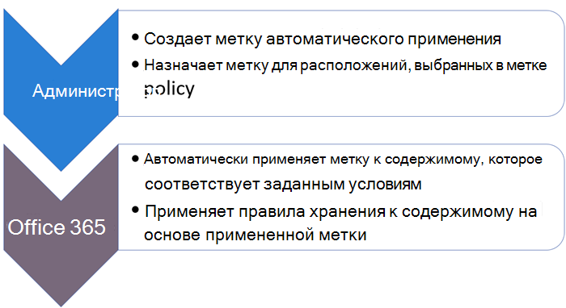

# <a name="automatically-apply-a-retention-label-to-retain-or-delete-content"></a><span data-ttu-id="b0cb5-103">Автоматическое применение метки хранения для сохранения или удаления контента</span><span class="sxs-lookup"><span data-stu-id="b0cb5-103">Automatically apply a retention label to retain or delete content</span></span>

><span data-ttu-id="b0cb5-104">*[Руководство по лицензированию Microsoft 365 для обеспечения безопасности и соответствия требованиям](https://aka.ms/ComplianceSD).*</span><span class="sxs-lookup"><span data-stu-id="b0cb5-104">*[Microsoft 365 licensing guidance for security & compliance](https://aka.ms/ComplianceSD).*</span></span>

> [!NOTE]
> <span data-ttu-id="b0cb5-105">Этот сценарий не поддерживается для [нормативных записей](records-management.md#records).</span><span class="sxs-lookup"><span data-stu-id="b0cb5-105">This scenario is not supported for [regulatory records](records-management.md#records).</span></span>

<span data-ttu-id="b0cb5-106">Одно из главных преимуществ [меток хранения](retention.md) — возможность автоматически их присваивать содержимому, которое соответствует определенным условиям.</span><span class="sxs-lookup"><span data-stu-id="b0cb5-106">One of the most powerful features of [retention labels](retention.md) is the ability to apply them automatically to content that matches specified conditions.</span></span> <span data-ttu-id="b0cb5-107">В этом случае сотрудникам вашей организации не нужно будет самостоятельно присваивать метки хранения.</span><span class="sxs-lookup"><span data-stu-id="b0cb5-107">In this case, people in your organization don't need to apply the retention labels.</span></span> <span data-ttu-id="b0cb5-108">Microsoft 365 все сделает за них.</span><span class="sxs-lookup"><span data-stu-id="b0cb5-108">Microsoft 365 does the work for them.</span></span>
  
<span data-ttu-id="b0cb5-109">Польза автоматического присваивания меток хранения в том, что:</span><span class="sxs-lookup"><span data-stu-id="b0cb5-109">Auto-applying retention labels are powerful because:</span></span>
  
- <span data-ttu-id="b0cb5-110">вам не придется обучать пользователей работе со всеми категориями;</span><span class="sxs-lookup"><span data-stu-id="b0cb5-110">You don't need to train your users on all of your classifications.</span></span>
    
- <span data-ttu-id="b0cb5-111">вам не нужно будет рассчитывать на то, что пользователи правильно классифицируют весь контент;</span><span class="sxs-lookup"><span data-stu-id="b0cb5-111">You don't need to rely on users to classify all content correctly.</span></span>
    
- <span data-ttu-id="b0cb5-112">пользователям больше не нужно будет знать о политиках управления данными — они могут сосредоточиться на своей работе.</span><span class="sxs-lookup"><span data-stu-id="b0cb5-112">Users no longer need to know about data governance policies - they can focus on their work.</span></span>
    
<span data-ttu-id="b0cb5-113">Метки хранения можно автоматически применять к контенту, если он содержит конфиденциальную информацию, ключевые слова, доступные для поиска свойства или совпадение для [обучаемых классификаторов](classifier-get-started-with.md).</span><span class="sxs-lookup"><span data-stu-id="b0cb5-113">You can apply retention labels to content automatically when that content contains sensitive information, keywords or searchable properties, or a match for [trainable classifiers](classifier-get-started-with.md).</span></span>

> [!TIP]
> <span data-ttu-id="b0cb5-114">Теперь в предварительной версии с помощью свойств, по которым выполняется поиск, можно найти [записи собраний в Teams](#microsoft-teams-meeting-recordings).</span><span class="sxs-lookup"><span data-stu-id="b0cb5-114">Now in preview, use searchable properties to identify [Teams meeting recordings](#microsoft-teams-meeting-recordings).</span></span>

<span data-ttu-id="b0cb5-115">Процесс автоматического применения метки хранения основан на этих условиях:</span><span class="sxs-lookup"><span data-stu-id="b0cb5-115">The processes to automatically apply a retention label based on these conditions:</span></span>



<span data-ttu-id="b0cb5-117">Следуйте инструкциям ниже, чтобы выполнить два действия администратора.</span><span class="sxs-lookup"><span data-stu-id="b0cb5-117">Use the following instructions for the two admin steps.</span></span>

> [!NOTE]
> <span data-ttu-id="b0cb5-118">Автоматические политики используют метки на стороне службы в условиях для автоматического применения меток хранения.</span><span class="sxs-lookup"><span data-stu-id="b0cb5-118">Auto-policies use service-side labeling with conditions to automatically apply retention labels.</span></span> <span data-ttu-id="b0cb5-119">Также можно автоматически применить метку хранения с помощью политики меток, как описано ниже.</span><span class="sxs-lookup"><span data-stu-id="b0cb5-119">You can also automatically apply a retention label with a label policy when you do the following:</span></span> 
>
> - <span data-ttu-id="b0cb5-120">Применение метки хранения по умолчанию к библиотеке SharePoint, папке или набору документов таким образом, чтобы контент без меток помечался автоматически.</span><span class="sxs-lookup"><span data-stu-id="b0cb5-120">Apply a default retention label to a SharePoint library, folder, or document set so that unlabeled content in that container is automatically labeled</span></span>
>- <span data-ttu-id="b0cb5-121">Автоматическое применение метки хранения к электронному сообщению с помощью правил</span><span class="sxs-lookup"><span data-stu-id="b0cb5-121">Automatically applying a retention label to email by using rules</span></span>
>
> <span data-ttu-id="b0cb5-122">Дополнительные сведения см. в статье [Создание и применение меток хранения в приложениях](create-apply-retention-labels.md)</span><span class="sxs-lookup"><span data-stu-id="b0cb5-122">For these scenarios, see [Create and apply retention labels in apps](create-apply-retention-labels.md).</span></span>

## <a name="before-you-begin"></a><span data-ttu-id="b0cb5-123">Прежде чем начать</span><span class="sxs-lookup"><span data-stu-id="b0cb5-123">Before you begin</span></span>

<span data-ttu-id="b0cb5-124">Глобальный администратор организации имеет все разрешения на создание и изменение меток хранения и их политик.</span><span class="sxs-lookup"><span data-stu-id="b0cb5-124">The global admin for your organization has full permissions to create and edit retention labels and their policies.</span></span> <span data-ttu-id="b0cb5-125">Если вы входите не как глобальный администратор, см. раздел [Разрешения, необходимые для создания и управления политиками хранения и метками хранения](get-started-with-retention.md#permissions-required-to-create-and-manage-retention-policies-and-retention-labels).</span><span class="sxs-lookup"><span data-stu-id="b0cb5-125">If you aren't signing in as a global admin, see [Permissions required to create and manage retention policies and retention labels](get-started-with-retention.md#permissions-required-to-create-and-manage-retention-policies-and-retention-labels).</span></span>

## <a name="how-to-auto-apply-a-retention-label"></a><span data-ttu-id="b0cb5-126">Автоматическое применение меток хранения</span><span class="sxs-lookup"><span data-stu-id="b0cb5-126">How to auto-apply a retention label</span></span>

<span data-ttu-id="b0cb5-127">Сначала создайте метку хранения.</span><span class="sxs-lookup"><span data-stu-id="b0cb5-127">First, create your retention label.</span></span> <span data-ttu-id="b0cb5-128">После этого создайте автоматическую политику для применения метки.</span><span class="sxs-lookup"><span data-stu-id="b0cb5-128">Then create an auto-policy to apply that label.</span></span> <span data-ttu-id="b0cb5-129">Если вы уже создали метку хранения, перейдите к [созданию автоматической политики](#step-2-create-an-auto-apply-policy).</span><span class="sxs-lookup"><span data-stu-id="b0cb5-129">If you have already created your retention label, skip to [creating an auto-policy](#step-2-create-an-auto-apply-policy).</span></span>

<span data-ttu-id="b0cb5-130">Инструкции по переходу зависят от того, используете ли вы [управление записями](records-management.md) или нет.</span><span class="sxs-lookup"><span data-stu-id="b0cb5-130">Navigation instructions depend on whether you're using [records management](records-management.md) or not.</span></span> <span data-ttu-id="b0cb5-131">В обоих случаях доступны соответствующие инструкции.</span><span class="sxs-lookup"><span data-stu-id="b0cb5-131">Instructions are provided for both scenarios.</span></span>

### <a name="step-1-create-a-retention-label"></a><span data-ttu-id="b0cb5-132">Этап 1. Создание метки хранения</span><span class="sxs-lookup"><span data-stu-id="b0cb5-132">Step 1: Create a retention label</span></span>

1. <span data-ttu-id="b0cb5-133">В [Центре соответствия требованиям Microsoft 365](https://compliance.microsoft.com/) перейдите в одно из следующих расположений:</span><span class="sxs-lookup"><span data-stu-id="b0cb5-133">In the [Microsoft 365 compliance center](https://compliance.microsoft.com/), navigate to one of the following locations:</span></span>
    
    - <span data-ttu-id="b0cb5-134">Если используется управление записями:</span><span class="sxs-lookup"><span data-stu-id="b0cb5-134">If you are using records management:</span></span>
        - <span data-ttu-id="b0cb5-135">**Решения** > **Управление записями** > вкладка **План хранения** > **+ Создать метку** > **Метка хранения**</span><span class="sxs-lookup"><span data-stu-id="b0cb5-135">**Solutions** > **Records management** > **File plan** tab > **+ Create a label** > **Retention label**</span></span>
        
    - <span data-ttu-id="b0cb5-136">Если управление записями не используется:</span><span class="sxs-lookup"><span data-stu-id="b0cb5-136">If you are not using records management:</span></span>
       - <span data-ttu-id="b0cb5-137">**Решения** > **Управление информацией** > вкладка **Метки** > + **Создать метку**</span><span class="sxs-lookup"><span data-stu-id="b0cb5-137">**Solutions** > **Information governance** > **Labels** tab > + **Create a label**</span></span>
    
    <span data-ttu-id="b0cb5-138">Не отображается необходимый параметр?</span><span class="sxs-lookup"><span data-stu-id="b0cb5-138">Don't immediately see your option?</span></span> <span data-ttu-id="b0cb5-139">Сначала выберите **Показать все**.</span><span class="sxs-lookup"><span data-stu-id="b0cb5-139">First select **Show all**.</span></span> 

2. <span data-ttu-id="b0cb5-140">Следуйте указаниям мастера.</span><span class="sxs-lookup"><span data-stu-id="b0cb5-140">Follow the prompts in the wizard.</span></span> <span data-ttu-id="b0cb5-141">Если используется управление записями:</span><span class="sxs-lookup"><span data-stu-id="b0cb5-141">If you are using records management:</span></span>
    
    - <span data-ttu-id="b0cb5-142">Дополнительные сведения о дескрипторах плана хранения, см. в статье [Использование плана хранения для управления метками хранения](file-plan-manager.md)</span><span class="sxs-lookup"><span data-stu-id="b0cb5-142">For information about the file plan descriptors, see [Use file plan to manage retention labels](file-plan-manager.md)</span></span>
    
    - <span data-ttu-id="b0cb5-143">Чтобы использовать метку хранения для объявления элементов записями, нажмите кнопку **Пометить элементы как записи**или **Пометить элементы как нормативные записи**.</span><span class="sxs-lookup"><span data-stu-id="b0cb5-143">To use the retention label to declare records, select **Mark items as records**, or **Mark items as regulatory records**.</span></span> <span data-ttu-id="b0cb5-144">Дополнительные сведения см. в статье [Настройка меток хранения для объявления элементов записями](declare-records.md#configuring-retention-labels-to-declare-records)</span><span class="sxs-lookup"><span data-stu-id="b0cb5-144">For more information, see [Configuring retention labels to declare records](declare-records.md#configuring-retention-labels-to-declare-records).</span></span>

3. <span data-ttu-id="b0cb5-145">После того, как вы создали метку и просмотрели параметры для ее публикации, автоматически примените метку или просто сохраните ее: выберите пункт \*\*Автоматически применять эту метку к определенному типу содержимого \*\*, а затем выберите **Готово**, чтобы запустить Мастер автоматического создания меток, который сразу переведет вас к действию 2 в процедуре ниже.</span><span class="sxs-lookup"><span data-stu-id="b0cb5-145">After you have created the label and you see the options to publish the label, auto-apply the label, or just save the label: Select **Auto-apply this label to a specific type of content**, and then select **Done** to start the Create auto-labeling wizard that takes you directly to step 2 in the following procedure.</span></span>

<span data-ttu-id="b0cb5-146">Чтобы изменить существующую метку, выберите ее и нажмите **Изменить метку** для запуска Мастера изменения хранения, который позволяет изменить описания меток и любые [доступные параметры](#updating-retention-labels-and-their-policies) на шаге 2.</span><span class="sxs-lookup"><span data-stu-id="b0cb5-146">To edit an existing label, select it, and then select the **Edit label** option to start the Edit retention wizard that lets you change the label descriptions and any [eligible settings](#updating-retention-labels-and-their-policies) from step 2.</span></span>


### <a name="step-2-create-an-auto-apply-policy"></a><span data-ttu-id="b0cb5-147">Этап 2. Создание политики автоматического применения</span><span class="sxs-lookup"><span data-stu-id="b0cb5-147">Step 2: Create an auto-apply policy</span></span>

<span data-ttu-id="b0cb5-148">При создании политики автоматического применения необходимо выбрать метку хранения, которая будет автоматически применена к содержимому на основе указанных условий.</span><span class="sxs-lookup"><span data-stu-id="b0cb5-148">When you create an auto-apply policy, you select a retention label to automatically apply to content, based on the conditions that you specify.</span></span>

1. <span data-ttu-id="b0cb5-149">В [Центре соответствия требованиям Microsoft 365](https://compliance.microsoft.com/) перейдите в одно из следующих расположений:</span><span class="sxs-lookup"><span data-stu-id="b0cb5-149">In the [Microsoft 365 compliance center](https://compliance.microsoft.com/), navigate to one of the following locations:</span></span>
    
    - <span data-ttu-id="b0cb5-150">Если используется управление записями: **Управление информацией**:</span><span class="sxs-lookup"><span data-stu-id="b0cb5-150">If you are using records management: **Information governance**:</span></span>
        - <span data-ttu-id="b0cb5-151">**Решения** > **Управление записями** >  вкладка **Политики метки** > **Автоматически применить метку**</span><span class="sxs-lookup"><span data-stu-id="b0cb5-151">**Solutions** > **Records management** > **Label policies** tab > **Auto-apply a label**</span></span>
    
    - <span data-ttu-id="b0cb5-152">Если управление записями не используется:</span><span class="sxs-lookup"><span data-stu-id="b0cb5-152">If you are not using records management:</span></span>
        - <span data-ttu-id="b0cb5-153">**Решения** > **Управление информацией** >  вкладка **Политики меток** > **Автоматически применить метку**</span><span class="sxs-lookup"><span data-stu-id="b0cb5-153">**Solutions** > **Information governance** > **Label policies** tab > **Auto-apply a label**</span></span>
    
    <span data-ttu-id="b0cb5-154">Не отображается необходимый параметр?</span><span class="sxs-lookup"><span data-stu-id="b0cb5-154">Don't immediately see your option?</span></span> <span data-ttu-id="b0cb5-155">Сначала выберите **Показать все**.</span><span class="sxs-lookup"><span data-stu-id="b0cb5-155">First select **Show all**.</span></span> 

2. <span data-ttu-id="b0cb5-156">Следуйте инструкциям в Мастере автоматического создания меток.</span><span class="sxs-lookup"><span data-stu-id="b0cb5-156">Follow the prompts in the Create auto-labeling wizard.</span></span>
    
    <span data-ttu-id="b0cb5-157">Сведения о настройке условий для автоматического применения метки хранения, см. в разделе [Настройка условий автоматического применения меток хранения](#configuring-conditions-for-auto-apply-retention-labels) на этой странице.</span><span class="sxs-lookup"><span data-stu-id="b0cb5-157">For information about configuring the conditions that automatically apply the retention label, see the [Configuring conditions for auto-apply retention labels](#configuring-conditions-for-auto-apply-retention-labels) section on this page.</span></span>
    
    <span data-ttu-id="b0cb5-158">Сведения о расположениях, поддерживаемых метками хранения, см. в разделе [Метки хранения и расположения](retention.md#retention-label-policies-and-locations).</span><span class="sxs-lookup"><span data-stu-id="b0cb5-158">For information about the locations supported by retention labels, see the [Retention labels and locations](retention.md#retention-label-policies-and-locations) section.</span></span>

<span data-ttu-id="b0cb5-159">Чтобы изменить существующую политику автоматического применения меток, выберите ее для запуска Мастера изменения политики хранения, который позволяет изменить выбранную метку хранения и [любые доступные параметры](#updating-retention-labels-and-their-policies) на шаге 2.</span><span class="sxs-lookup"><span data-stu-id="b0cb5-159">To edit an existing auto-apply policy, select it to start the Edit retention policy wizard that lets you change the selected retention label and any [eligible settings](#updating-retention-labels-and-their-policies) from step 2.</span></span>


### <a name="configuring-conditions-for-auto-apply-retention-labels"></a><span data-ttu-id="b0cb5-160">Настройка условий для автоматического применения меток хранения</span><span class="sxs-lookup"><span data-stu-id="b0cb5-160">Configuring conditions for auto-apply retention labels</span></span>

<span data-ttu-id="b0cb5-161">Автоматически применяйте метки хранения к контенту, содержащему:</span><span class="sxs-lookup"><span data-stu-id="b0cb5-161">You can apply retention labels to content automatically when that content contains:</span></span>

- <span data-ttu-id="b0cb5-162">[конфиденциальную информацию определенных типов](#auto-apply-labels-to-content-with-specific-types-of-sensitive-information);</span><span class="sxs-lookup"><span data-stu-id="b0cb5-162">[Specific types of sensitive information](#auto-apply-labels-to-content-with-specific-types-of-sensitive-information)</span></span>

- <span data-ttu-id="b0cb5-163">[определенные ключевые слова или доступные для поиска свойства, соответствующие созданному запросу](#auto-apply-labels-to-content-with-keywords-or-searchable-properties);</span><span class="sxs-lookup"><span data-stu-id="b0cb5-163">[Specific keywords or searchable properties that match a query you create](#auto-apply-labels-to-content-with-keywords-or-searchable-properties)</span></span>

- <span data-ttu-id="b0cb5-164">[совпадение для обучаемых классификаторов](#auto-apply-labels-to-content-by-using-trainable-classifiers).</span><span class="sxs-lookup"><span data-stu-id="b0cb5-164">[A match for trainable classifiers](#auto-apply-labels-to-content-by-using-trainable-classifiers)</span></span>

#### <a name="auto-apply-labels-to-content-with-specific-types-of-sensitive-information"></a><span data-ttu-id="b0cb5-165">Автоматическое применение меток к контенту с определенными типами конфиденциальной информации</span><span class="sxs-lookup"><span data-stu-id="b0cb5-165">Auto-apply labels to content with specific types of sensitive information</span></span>

<span data-ttu-id="b0cb5-166">Когда вы создаете автоматически присваиваемые метки хранения для конфиденциальной информации, вы видите тот же список шаблонов политик, что и при создании политики защиты от потери данных (DLP) .</span><span class="sxs-lookup"><span data-stu-id="b0cb5-166">When you create auto-apply retention labels for sensitive information, you see the same list of policy templates as when you create a data loss prevention (DLP) policy.</span></span> <span data-ttu-id="b0cb5-167">Каждый шаблон предварительно настроен на поиск определенных типов конфиденциальной информации.</span><span class="sxs-lookup"><span data-stu-id="b0cb5-167">Each template is preconfigured to look for specific types of sensitive information.</span></span> <span data-ttu-id="b0cb5-168">Например, шаблон, показанный здесь, ищет номера ITIN, SSN и паспорта США в категории **Конфиденциальность** и в **шаблоне Персональных данных (PII) конечного пользователя для США**:</span><span class="sxs-lookup"><span data-stu-id="b0cb5-168">For example, the template shown here looks for U.S. ITIN, SSN, and passport numbers from the **Privacy** category, and **U.S Personally Identifiable Information (PII) Data template**:</span></span>


<span data-ttu-id="b0cb5-170">Для получения дополнительной информации о типах конфиденциальной информации см. [Определения объектов типа конфиденциальной информации](sensitive-information-type-entity-definitions.md).</span><span class="sxs-lookup"><span data-stu-id="b0cb5-170">To learn more about the sensitivity information types, see [Sensitive information type entity definitions](sensitive-information-type-entity-definitions.md).</span></span>

<span data-ttu-id="b0cb5-171">Выбрав шаблон политики, вы можете добавлять или удалять любые типы конфиденциальной информации, а также менять количество и точность совпадений.</span><span class="sxs-lookup"><span data-stu-id="b0cb5-171">After you select a policy template, you can add or remove any types of sensitive information, and you can change the instance count and match accuracy.</span></span> <span data-ttu-id="b0cb5-172">В примере на снимке экрана ниже показано, что метка хранения будет автоматически применяться только в следующих случаях:</span><span class="sxs-lookup"><span data-stu-id="b0cb5-172">In the example screenshot shown next, a retention label will be auto-applied only when:</span></span>
  
- <span data-ttu-id="b0cb5-173">Обнаруженный тип конфиденциальной информации имеет точность совпадения (уровень доверия) не менее 75.</span><span class="sxs-lookup"><span data-stu-id="b0cb5-173">The type of sensitive information that's detected has a match accuracy (or confidence level) of at least 75.</span></span> <span data-ttu-id="b0cb5-174">Многие типы конфиденциальной информации определяются с использованием нескольких шаблонов, где для шаблона с более высокой точностью совпадения требуется больше подтверждающих признаков (например, ключевые слова, даты или адреса).</span><span class="sxs-lookup"><span data-stu-id="b0cb5-174">Many sensitive information types are defined with multiple patterns, where a pattern with a higher match accuracy requires more evidence to be found (such as keywords, dates, or addresses), while a pattern with a lower match accuracy requires less evidence.</span></span> <span data-ttu-id="b0cb5-175">Чем меньше минимальное значение точности совпадения (**мин**), тем ниже требования, определяющие соответствие содержимого условию.</span><span class="sxs-lookup"><span data-stu-id="b0cb5-175">The lower the **min** match accuracy, the easier it is for content to match the condition.</span></span>

- <span data-ttu-id="b0cb5-176">В содержимом от 1 до 9 раз встречается любой из перечисленных трех типов конфиденциальной информации.</span><span class="sxs-lookup"><span data-stu-id="b0cb5-176">The content contains between 1 and 9 instances of any of these three sensitive information types.</span></span> <span data-ttu-id="b0cb5-177">Вы можете удалить **до значения**, таким образом оно будет изменено на **Любой**.</span><span class="sxs-lookup"><span data-stu-id="b0cb5-177">You can delete the **to** value so that it changes to **Any**.</span></span>

<span data-ttu-id="b0cb5-178">Дополнительные сведения об этих параметрах см. в следующих руководствах в документации по защите от потери данных [Настройка более или менее строгих правил](data-loss-prevention-policies.md#tuning-rules-to-make-them-easier-or-harder-to-match).</span><span class="sxs-lookup"><span data-stu-id="b0cb5-178">For more information about these options, see the following guidance from the DLP documentation [Tuning rules to make them easier or harder to match](data-loss-prevention-policies.md#tuning-rules-to-make-them-easier-or-harder-to-match).</span></span>
    

  
#### <a name="auto-apply-labels-to-content-with-keywords-or-searchable-properties"></a><span data-ttu-id="b0cb5-180">Автоматическое применение меток к контенту с ключевыми словами или доступными для поиска свойствами</span><span class="sxs-lookup"><span data-stu-id="b0cb5-180">Auto-apply labels to content with keywords or searchable properties</span></span>

<span data-ttu-id="b0cb5-p114">Метки можно автоматически применять к контенту с помощью запроса, содержащего определенные слова, фразы или значения доступных для поиска свойств. Вы можете уточнить запрос с помощью таких операторов поиска, как AND, OR и NOT.</span><span class="sxs-lookup"><span data-stu-id="b0cb5-p114">You can auto-apply labels to content by using a query that contains specific words, phrases, or values of searchable properties. You can refine your query by using search operators such as AND, OR, and NOT.</span></span>


<span data-ttu-id="b0cb5-184">Дополнительные сведения о синтаксисе языка запросов по ключевым словам (KQL) см. в статье [Справочник по синтаксису языка запросов по ключевым словам (KQL)](https://docs.microsoft.com/sharepoint/dev/general-development/keyword-query-language-kql-syntax-reference).</span><span class="sxs-lookup"><span data-stu-id="b0cb5-184">For more information about the query syntax that uses Keyword Query Language (KQL), see [Keyword Query Language (KQL) syntax reference](https://docs.microsoft.com/sharepoint/dev/general-development/keyword-query-language-kql-syntax-reference).</span></span>

<span data-ttu-id="b0cb5-185">Метки на основе запросов используют индекс поиска для определения контента.</span><span class="sxs-lookup"><span data-stu-id="b0cb5-185">Query-based labels use the search index to identify content.</span></span> <span data-ttu-id="b0cb5-186">Дополнительные сведения о доступных для поиска свойствах, которые можно использовать, см. в статье:</span><span class="sxs-lookup"><span data-stu-id="b0cb5-186">For more information about the searchable properties that you can use, see:</span></span>

- [<span data-ttu-id="b0cb5-187">Запросы ключевых слов и условия поиска контента</span><span class="sxs-lookup"><span data-stu-id="b0cb5-187">Keyword queries and search conditions for Content Search</span></span>](keyword-queries-and-search-conditions.md)
- [<span data-ttu-id="b0cb5-188">Обзор свойств для обхода и управляемых свойств в SharePoint Server</span><span class="sxs-lookup"><span data-stu-id="b0cb5-188">Overview of crawled and managed properties in SharePoint Server</span></span>](https://docs.microsoft.com/SharePoint/technical-reference/crawled-and-managed-properties-overview)

> [!NOTE]
> <span data-ttu-id="b0cb5-189">Хотя управляемые свойства SharePoint поддерживают псевдонимы, не используйте их при настройке меток хранения.</span><span class="sxs-lookup"><span data-stu-id="b0cb5-189">Although SharePoint managed properties support aliases, don't use these when you configure your retention labels.</span></span> <span data-ttu-id="b0cb5-190">Всегда указывайте фактическое имя управляемого свойства, например RefinableString01.</span><span class="sxs-lookup"><span data-stu-id="b0cb5-190">Always specify the actual name of the managed property, for example, "RefinableString01".</span></span>

<span data-ttu-id="b0cb5-191">Примеры запросов:</span><span class="sxs-lookup"><span data-stu-id="b0cb5-191">Examples queries:</span></span>

| <span data-ttu-id="b0cb5-192">Рабочая нагрузка</span><span class="sxs-lookup"><span data-stu-id="b0cb5-192">Workload</span></span> | <span data-ttu-id="b0cb5-193">Пример</span><span class="sxs-lookup"><span data-stu-id="b0cb5-193">Example</span></span> |
|:-----|:-----|
|<span data-ttu-id="b0cb5-194">Exchange</span><span class="sxs-lookup"><span data-stu-id="b0cb5-194">Exchange</span></span>   | `subject:"Quarterly Financials"` |
|<span data-ttu-id="b0cb5-195">Exchange</span><span class="sxs-lookup"><span data-stu-id="b0cb5-195">Exchange</span></span>   | `recipients:garthf@contoso.com` |
|<span data-ttu-id="b0cb5-196">SharePoint</span><span class="sxs-lookup"><span data-stu-id="b0cb5-196">SharePoint</span></span> | `contenttype:contract` |
|<span data-ttu-id="b0cb5-197">SharePoint</span><span class="sxs-lookup"><span data-stu-id="b0cb5-197">SharePoint</span></span> | `site:https://contoso.sharepoint.com/sites/teams/procurement AND contenttype:contract`|

##### <a name="microsoft-teams-meeting-recordings"></a><span data-ttu-id="b0cb5-198">Записи собраний в Microsoft Teams</span><span class="sxs-lookup"><span data-stu-id="b0cb5-198">Microsoft Teams meeting recordings</span></span>

> [!NOTE]
> <span data-ttu-id="b0cb5-199">Функция хранения и удаления записей собраний в Teams развертывается в предварительной версии и не работает до сохранения записей в OneDrive или SharePoint.</span><span class="sxs-lookup"><span data-stu-id="b0cb5-199">The ability to retain and delete Teams meeting recordings is rolling out in preview and won't work before recordings are saved to OneDrive or SharePoint.</span></span> <span data-ttu-id="b0cb5-200">Дополнительные сведения см. в статье [Использование OneDrive для бизнеса, SharePoint или Stream для записи собраний](https://docs.microsoft.com/MicrosoftTeams/tmr-meeting-recording-change)</span><span class="sxs-lookup"><span data-stu-id="b0cb5-200">For more information, see [Use OneDrive for Business and SharePoint Online or Stream for meeting recordings](https://docs.microsoft.com/MicrosoftTeams/tmr-meeting-recording-change).</span></span>

<span data-ttu-id="b0cb5-201">Для поиска записей собраний в Microsoft Teams, хранящихся в пользовательских учетных записях OneDrive или SharePoint, укажите для **редактора запросов по ключевым словам** следующую информацию:</span><span class="sxs-lookup"><span data-stu-id="b0cb5-201">To identify Microsoft Teams meeting recordings that are stored in users' OneDrive accounts or in SharePoint, specify the following for the **Keyword query editor**:</span></span>

``` 
ProgID:Media AND ProgID:Meeting
```

<span data-ttu-id="b0cb5-202">Для этой метки хранения вам необходимо также опубликовать ее в учетных записях OneDrive или на сайтах SharePoint соответствующих пользователей путем создания политики меток.</span><span class="sxs-lookup"><span data-stu-id="b0cb5-202">For this retention label, you must also publish it to the relevant users' OneDrive accounts or SharePoint sites by creating a label policy.</span></span> <span data-ttu-id="b0cb5-203">В большинстве случаев записи собраний сохраняются в OneDrive, но записи собраний на каналах сохраняются в SharePoint.</span><span class="sxs-lookup"><span data-stu-id="b0cb5-203">Most of the time, the meeting recordings are saved to OneDrive, but for channel meetings, they are saved in SharePoint.</span></span>

<span data-ttu-id="b0cb5-204">После сохранения политики автоматического применения необходимо выполнить указанные ниже действия.</span><span class="sxs-lookup"><span data-stu-id="b0cb5-204">When you have saved the auto-apply policy:</span></span>

1. <span data-ttu-id="b0cb5-205">Нажмите вкладку **Политики меток** > **Публикация меток**</span><span class="sxs-lookup"><span data-stu-id="b0cb5-205">Select **Label policies** tab > **Publish labels**</span></span>

2. <span data-ttu-id="b0cb5-206">Когда будет предложено выбрать метку, выберите ту метку, которую вы создали с помощью запроса по ключевым словам, чтобы найти записи собраний в Teams.</span><span class="sxs-lookup"><span data-stu-id="b0cb5-206">When prompted to select a label, choose the label you created with the KQL query to identify Teams meeting recordings.</span></span>

3. <span data-ttu-id="b0cb5-207">Когда будет предложено выбрать расположение, выберите **Сайты SharePoint** и **Учетные записи OneDrive**.</span><span class="sxs-lookup"><span data-stu-id="b0cb5-207">When prompted for the location, choose **SharePoint sites** and **OneDrive accounts**.</span></span> <span data-ttu-id="b0cb5-208">После этого можно оставить заданное по умолчанию значение **Все** или указать отдельные расположения, например включив или исключив определенные учетные записи OneDrive.</span><span class="sxs-lookup"><span data-stu-id="b0cb5-208">You can then keep the default of **All**, or specify individual locations, such as including or excluding specific OneDrive accounts.</span></span>

4. <span data-ttu-id="b0cb5-209">Завершите работу мастера и сохраните эту политику меток.</span><span class="sxs-lookup"><span data-stu-id="b0cb5-209">Complete the wizard and save this label policy.</span></span>

#### <a name="auto-apply-labels-to-content-by-using-trainable-classifiers"></a><span data-ttu-id="b0cb5-210">Автоматическое применение меток к контенту с помощью обучаемых классификаторов</span><span class="sxs-lookup"><span data-stu-id="b0cb5-210">Auto-apply labels to content by using trainable classifiers</span></span>

<span data-ttu-id="b0cb5-211">При использовании варианта для обучаемого классификатора вы можете выбрать один из встроенных классификаторов или настраиваемый классификатор.</span><span class="sxs-lookup"><span data-stu-id="b0cb5-211">When you choose the option for a trainable classifier, you can select one of the built-in classifiers, or a custom classifier.</span></span> <span data-ttu-id="b0cb5-212">К встроенным классификаторам относятся **Резюме**, **Исходный код**, **Целенаправленное притеснение**, **Сквернословие** и **Угрозы**.</span><span class="sxs-lookup"><span data-stu-id="b0cb5-212">The built-in classifiers include **Resumes**, **SourceCode**, **Targeted Harassment**, **Profanity**, and **Threat**:</span></span>


> [!CAUTION]
> <span data-ttu-id="b0cb5-214">Мы не рекомендуем использовать встроенный классификатор **Оскорбительная лексика**, так как он генерировал большое количество ложных срабатываний.</span><span class="sxs-lookup"><span data-stu-id="b0cb5-214">We are deprecating the **Offensive Language** built-in classifier because it has been producing a high number of false positives.</span></span> <span data-ttu-id="b0cb5-215">Не используйте этот встроенный классификатор, а если вы применяете его в настоящее время, следует перенести с него свои бизнес-процессы.</span><span class="sxs-lookup"><span data-stu-id="b0cb5-215">Don't use this built-in classifier and if you are currently using it, you should move your business processes off it.</span></span> <span data-ttu-id="b0cb5-216">Вместо него рекомендуем использовать встроенные классификаторы **Целенаправленное притеснение**, **Сквернословие** и **Угрозы**.</span><span class="sxs-lookup"><span data-stu-id="b0cb5-216">We recommend using the **Targeted Harassment**, **Profanity**, and **Threat** built-in classifiers instead.</span></span>

<span data-ttu-id="b0cb5-217">Для автоматического применения метки с использованием этого параметра сайты SharePoint и почтовые ящики должны иметь не менее 10 МБ данных.</span><span class="sxs-lookup"><span data-stu-id="b0cb5-217">To automatically apply a label by using this option, SharePoint sites and mailboxes must have at least 10 MB of data.</span></span>

<span data-ttu-id="b0cb5-218">Дополнительные сведения об обучаемых классификаторах см. в статье [Информация об обучаемых классификаторах (предварительная версия)](classifier-learn-about.md).</span><span class="sxs-lookup"><span data-stu-id="b0cb5-218">For more information about trainable classifiers, see [Learn about trainable classifiers (preview)](classifier-learn-about.md).</span></span>

> [!TIP]
> <span data-ttu-id="b0cb5-219">Если вы используете обучаемые классификаторы для Exchange, см. недавно выпущенную статью [Повторное обучение классификаторов в обозревателе содержимого (предварительная версия)](classifier-how-to-retrain-content-explorer.md).</span><span class="sxs-lookup"><span data-stu-id="b0cb5-219">If you use trainable classifiers for Exchange, see the recently released [How to retrain a classifier in content explorer (preview)](classifier-how-to-retrain-content-explorer.md).</span></span>

## <a name="how-long-it-takes-for-retention-labels-to-take-effect"></a><span data-ttu-id="b0cb5-220">Срок вступления меток хранения в силу</span><span class="sxs-lookup"><span data-stu-id="b0cb5-220">How long it takes for retention labels to take effect</span></span>

<span data-ttu-id="b0cb5-221">Когда метки хранения применяются автоматически, может потребоваться до семи дней, чтобы метки хранения были применены ко всему существующему контенту, соответствующему условиям.</span><span class="sxs-lookup"><span data-stu-id="b0cb5-221">When you auto-apply retention labels, it can take up to seven days for the retention labels to be applied to all existing content that matches the conditions.</span></span>
  


<span data-ttu-id="b0cb5-223">Если после семи дней ожидаемые метки не появляются, проверьте **Состояние** политики автоматического применения, выбрав ее на странице **Политики меток** в Центре соответствия требованиям.</span><span class="sxs-lookup"><span data-stu-id="b0cb5-223">If the expected labels don't appear after seven days, check the **Status** of the auto-apply policy by selecting it from the **Label policies** page in the compliance center.</span></span> <span data-ttu-id="b0cb5-224">Для повторного развертывания политики (для OneDrive) или если отображается состояние **Отключено (ошибка)**, а в сведениях расположений выводится сообщение о том, что развертывание политики (для SharePoint) занимает больше времени, чем ожидалось, попробуйте выполнить команду [Set-RetentionCompliancePolicy](https://docs.microsoft.com/powershell/module/exchange/set-retentioncompliancepolicy) в PowerShell, чтобы повторно распространить политику:</span><span class="sxs-lookup"><span data-stu-id="b0cb5-224">If you see the status of **Off (Error)** and in the details for the locations see a message that it's taking longer than expected to deploy the policy (for SharePoint) or to try redeploying the policy (for OneDrive), try running the [Set-RetentionCompliancePolicy](https://docs.microsoft.com/powershell/module/exchange/set-retentioncompliancepolicy) PowerShell command to retry the policy distribution:</span></span>

1. [<span data-ttu-id="b0cb5-225">Подключение к интерфейсу PowerShell Центра безопасности и соответствия требованиям</span><span class="sxs-lookup"><span data-stu-id="b0cb5-225">Connect to Security & Compliance Center PowerShell</span></span>](https://docs.microsoft.com/powershell/exchange/connect-to-scc-powershell)

2. <span data-ttu-id="b0cb5-226">Выполните следующую команду:</span><span class="sxs-lookup"><span data-stu-id="b0cb5-226">Run the following command:</span></span>
    
    ``` PowerShell
    Set-RetentionCompliancePolicy -Identity <policy name> -RetryDistribution
   ```


## <a name="updating-retention-labels-and-their-policies"></a><span data-ttu-id="b0cb5-227">Обновление меток хранения и их политик</span><span class="sxs-lookup"><span data-stu-id="b0cb5-227">Updating retention labels and their policies</span></span>

<span data-ttu-id="b0cb5-228">При изменении меток хранения или политики авто-применения, когда метка хранения уже применена к контенту, ваши обновленные параметры автоматически применяются к этому контенту, в дополнение к уже определенному.</span><span class="sxs-lookup"><span data-stu-id="b0cb5-228">When you edit a retention label or auto-apply policy, and the retention label is already applied to content, your updated settings will automatically be applied to this content in addition to content that's newly identified.</span></span>

<span data-ttu-id="b0cb5-229">Некоторые параметры невозможно изменить после создания и сохранения метки или политики, в том числе:</span><span class="sxs-lookup"><span data-stu-id="b0cb5-229">Some settings can't be changed after the label or policy is created and saved, which include:</span></span>
- <span data-ttu-id="b0cb5-230">Параметры хранения, за исключением срока хранения, если только метка не настроена на хранение или удаление содержимого в зависимости от момента его создания.</span><span class="sxs-lookup"><span data-stu-id="b0cb5-230">The retention settings except the retention period, unless you've configured the label to retain or delete the content based on when it was created.</span></span>
- <span data-ttu-id="b0cb5-231">Параметр, помечающий элементы как запись.</span><span class="sxs-lookup"><span data-stu-id="b0cb5-231">The option to mark items as a record.</span></span>

## <a name="next-steps"></a><span data-ttu-id="b0cb5-232">Дальнейшие действия</span><span class="sxs-lookup"><span data-stu-id="b0cb5-232">Next steps</span></span>

<span data-ttu-id="b0cb5-233">Пример сценария, в котором используется политика автоматического применения с управляемыми свойствами в SharePoint и хранение на основе событий, чтобы начать период хранения, см. в статье [Управление жизненным циклом хранящихся в SharePoint документов с помощью меток хранения](auto-apply-retention-labels-scenario.md).</span><span class="sxs-lookup"><span data-stu-id="b0cb5-233">See [Use retention labels to manage the lifecycle of documents stored in SharePoint](auto-apply-retention-labels-scenario.md) for an example scenario that uses an auto-apply policy with managed properties in SharePoint, and event-based retention to start the retention period.</span></span>
