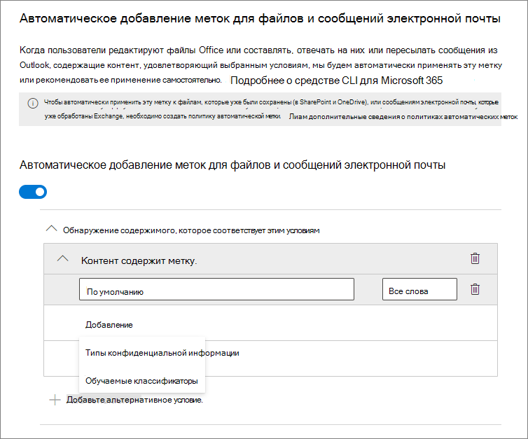
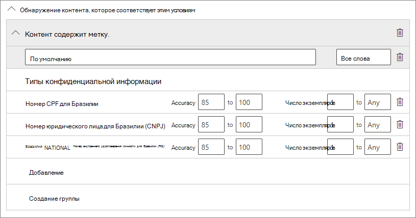
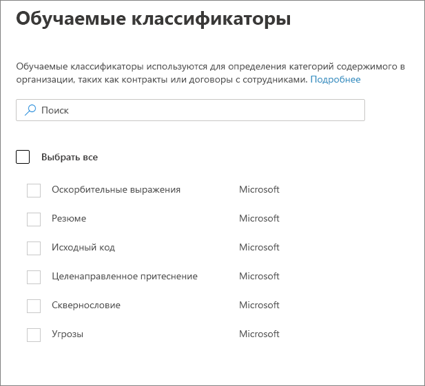
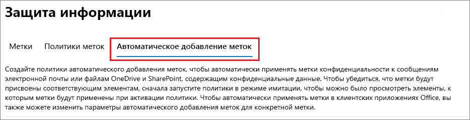

# Автоматическое применение метки конфиденциальности к содержимомуApply a sensitivity label to content automatically

>*[Руководство по лицензированию Microsoft 365 для обеспечения безопасности и соответствия требованиям](https://aka.ms/ComplianceSD).**[Microsoft 365 licensing guidance for security & compliance](https://aka.ms/ComplianceSD).*

При создании метки конфиденциальности можно автоматически назначать эту метку содержимому при выполнении указанных вами условий.When you create a sensitivity label, you can automatically assign that label to content when it matches conditions that you specify.

Возможность автоматически применять метки конфиденциальности к содержимому важна, потому что:The ability to apply sensitivity labels to content automatically is important because:

- не потребуется обучать пользователей работе с классификациями;You don't need to train your users when to use each of your classifications.

- вам не нужно будет рассчитывать на то, что пользователи правильно классифицируют весь контент;You don't need to rely on users to classify all content correctly.

- пользователям больше не нужно будет знать о ваших политиках — они могут сосредоточиться на своей работе;Users no longer need to know about your policies—they can instead focus on their work.

Существует два способа автоматического применения меток конфиденциальности:There are two different methods for automatically applying a sensitivity label:

- **Применение меток на стороне клиента, когда пользователи редактируют документы или составляют сообщения электронной почты (а также пересылают их или отвечают на них)**: используйте метку, настроенную для автоматического применения для приложений Office (Word, Excel, PowerPoint и Outlook).**Client-side labeling when users edit documents or compose (also reply or forward) emails**: Use a label that's configured for auto-labeling for Office apps (Word, Excel, PowerPoint, and Outlook). 
    
    В этом случае поддерживаются рекомендации меток пользователям и автоматическое применение меток.This method supports recommending a label to users, as well as automatically applying a label. В обоих случаях пользователь решает, принять или отклонить метку, чтобы добиться правильного применения меток к содержимому.But in both cases, the user decides whether to accept or reject the label, to help ensure the correct labeling of content. Применение меток на стороне клиента сопряжено с минимальными задержками для документов, поскольку метку можно применить еще до сохранения документа.This client-side labeling has minimal delay for documents because the label can be applied even before the document is saved. Тем не менее, не все клиентские приложения поддерживают автоматическое применение меток.However, not all client apps support auto-labeling. Эта функция поддерживается клиентом унифицированных меток Azure Information Protection и [некоторыми версиями Office](sensitivity-labels-office-apps.md#support-for-sensitivity-label-capabilities-in-apps).This capability is supported by the Azure Information Protection unified labeling client, and [some versions of Office](sensitivity-labels-office-apps.md#support-for-sensitivity-label-capabilities-in-apps). 
    
    Инструкции по настройке см. в разделе [Настройка автоматического применения меток в приложениях Office](#how-to-configure-auto-labeling-for-office-apps) на этой странице.For configuration instructions, see [How to configure auto-labeling for Office apps](#how-to-configure-auto-labeling-for-office-apps) on this page.

- **Применение меток на стороне службы, когда содержимое уже сохранено (в SharePoint или OneDrive) или отправлено по электронной почте (обрабатывается в Exchange Online)**: используйте политику автоматического применения меток.**Service-side labeling when content is already saved (in SharePoint or OneDrive) or emailed (processed by Exchange Online)**: Use an auto-labeling policy. 
    
    Этот метод называется автоматической классификацией с метками конфиденциальности.This method is referred to as auto classification with sensitivity labels. Также он называется автоматическим применением меток к неактивным данным (документы в SharePoint и OneDrive) и к данным при передаче (электронная почта, отправляемая и принимаемая в Exchange).You might also hear it referred to as auto-labeling for data at rest (documents in SharePoint and OneDrive) and data in transit (email that is sent or received by Exchange). В Exchange этот метод не касается к неактивным сообщениям электронной почты (почтовым ящикам).For Exchange, it doesn't include emails at rest (mailboxes). 
    
    Применение меток осуществляется службами, а не приложениями, поэтому можно не беспокоиться о том, какие у пользователей приложения и каких версий.Because this labeling is applied by services rather than by applications, you don't need to worry about what apps users have and what version. Поэтому эта функция доступна сразу во всей организации и пригодна для крупномасштабного применения меток.As a result, this capability is immediately available throughout your organization and suitable for labeling at scale. Политики автоматического применения меток не поддерживают рекомендуемые метки, поскольку пользователь не взаимодействует с процессом применения меток.Auto-labeling policies don't support recommended labeling because the user doesn't interact with the labeling process. Вместо этого администратор запускает политики в режиме имитации, чтобы убедиться в правильности меток содержимого до фактического применения меток.Instead, the administrator runs the policies in simulation mode to help ensure the correct labeling of content before actually applying the label.
    
    Инструкции по настройке см. в разделе [Настройка политик автоматического применения меток для SharePoint, OneDrive и Exchange](#how-to-configure-auto-labeling-policies-for-sharepoint-onedrive-and-exchange) на этой странице.For configuration instructions, see [How to configure auto-labeling policies for SharePoint, OneDrive, and Exchange](#how-to-configure-auto-labeling-policies-for-sharepoint-onedrive-and-exchange) on this page.
    
    Особенности автоматического применения меток для SharePoint и OneDrive:Specific to auto-labeling for SharePoint and OneDrive:
    - Не более 25 000 файлов с автоматически примененными метками (Word, PowerPoint или Excel) в клиенте за деньMaximum of 25,000 automatically labeled files (Word, PowerPoint, or Excel) in your tenant per day
    - Не более 10 семейств веб-сайтов во всех политикахMaximum of 10 sites collections across all policies
    - Не более 10 политик в клиентеMaximum of 10 policies across your tenant
    - Дата изменения не меняется в результате использования политик автоматического применения меток как в режиме имитации, так и при применении метокModified date is not changed as a result of auto-labeling policies—for both simulation mode and when labels are applied

    Особенности автоматического применения меток для Exchange:Specific to auto-labeling for Exchange:
    - В отличие от применения меток вручную или автоматически в приложениях Office, вложения Office также проверяются на соответствие условиям, указанным в политике автоматического применения меток.Unlike manual labeling or auto-labeling with Office apps, Office attachments are also scanned for the conditions you specify in your auto-labeling policy. Если условие выполняется, метка применяется к сообщению, но не к вложению.When there is a match, the email is labeled but not the attachment.
    - Если используются правила потоков обработки почты в Exchange или защиты от потери данных (DLP), применяющие шифрование IRM: когда содержимое идентифицируется этими правилами или политиками и политикой автоматического применения меток, применяется метка.If you have Exchange mail flow rules or data loss prevention (DLP) policies that apply IRM encryption: When content is identified by these rules or policies and an auto-labeling policy, the label is applied. Если метка применяет шифрование, то параметры IRM для правил потоков обработки почты в Exchange или политик DLP игнорируются.If that label applies encryption, the IRM settings from the Exchange mail flow rules or DLP policies are ignored. Тем не менее, если метка не применяет шифрование, то параметры IRM для правил потоков обработки почты или политик DLP применяются в дополнение к метке.However, if that label doesn't apply encryption, the IRM settings from the mail flow rules or DLP policies are applied in addition to the label.
    - Сообщение электронной почты с шифрованием IRM без метки будет заменено меткой с любыми параметрами шифрования, если при автоматическом применении меток есть совпадение.Email that has IRM encryption with no label will be replaced by a label with any encryption settings when there is a match by using auto-labeling.
    - Метки применяются к входящей электронной почте, если обнаружено совпадение с условиями применения меток.Incoming email is labeled when there is a match with your auto-labeling conditions. Тем не менее, если метка настроена для шифрования, то шифрование не применяется.However, if the label is configured for encryption, that encryption isn't applied.
    

## Сравнение автоматического применения меток для приложений Office с помощью политикCompare auto-labeling for Office apps with auto-labeling policies

Используйте следующую таблицу, чтобы определить разницу в порядке работы двух взаимодополняющих методов автоматического применения меток:Use the following table to help you identify the differences in behavior for the two complementary automatic labeling methods:

|Функция или поведениеFeature or behavior|Настройка меток: автоматическое добавление меток для приложений OfficeLabel setting: Auto-labeling for Office apps |Политика: автоматическое добавление метокPolicy: Auto-labeling|
|:-----|:-----|:-----|:-----|
|Зависимость приложенияApp dependency|[ДаYes](sensitivity-labels-office-apps.md#support-for-sensitivity-label-capabilities-in-apps) |НетNo |
|Ограничение по расположениюRestrict by location|НетNo |ДаYes |
|Условия: обучаемые классификаторыConditions: Trainable classifiers|ДаYes |НетNo |
|Условия: параметры общего доступа и дополнительные параметры электронной почтыConditions: Sharing options and additional options for email|НетNo |ДаYes |
|Рекомендации, подсказки политики, возможность переопределения пользователямиRecommendations, policy tooltip, and user overrides|ДаYes |НетNo |
|Режим имитацииSimulation mode|НетNo |ДаYes |
|Проверка условий во вложениях ExchangeExchange attachments checked for conditions|НетNo | ДаYes|
|Применение визуальной маркировкиApply visual markings |ДаYes |Да (только электронная почта)Yes (email only) |
|Переопределение шифрования IRM, примененного без меткиOverride IRM encryption applied without a label|Да, если у пользователя есть необходимые права экспортаYes if the user has the minimum usage right of Export |Да (только электронная почта)Yes (email only) |
|Применение меток ко входящей почтеLabel incoming email|НетNo |Да (шифрование не применяется)Yes (encryption not applied) |

> [!NOTE]
> Если метки применены к содержимому вручную, то эти метки никогда не заменяются на примененные автоматически.When content has been manually labeled, that label will never be replaced by automatic labeling. Тем не менее, политика автоматического применения меток могут заменять [метки низкого приоритета](sensitivity-labels.md#label-priority-order-matters), которые были применены автоматически в приложениях Office.However, auto-labeling policies can replace a [lower priority label](sensitivity-labels.md#label-priority-order-matters) that was applied by using auto-labeling for Office apps.

## Оценка нескольких условий для нескольких метокHow multiple conditions are evaluated when they apply to more than one label

Метки оцениваются в порядке, в котором они указаны в политике: первая метка имеет наименьший приоритет (самый низкий уровень конфиденциальности), а последняя — наибольший приоритет (самый высокий уровень конфиденциальности). Дополнительные сведения о приоритете см. в разделе "Приоритет метки (важен порядок)" [этой статьи](sensitivity-labels.md#label-priority-order-matters).The labels are ordered for evaluation according to their position that you specify in the policy: The label positioned first has the lowest position (least sensitive) and the label positioned last has the highest position (most sensitive). For more information on priority, see [Label priority (order matters)](sensitivity-labels.md#label-priority-order-matters).

## Не настраивайте родительскую метку для автоматического применения или в качестве рекомендуемойDon't configure a parent label to be applied automatically or recommended

Помните, что нельзя применять родительскую метку (метку с подчиненными метками) к содержимому.Remember, you can't apply a parent label (a label with sublabels) to content. Убедитесь, что родительская метка не настроена для автоматического применения или в качестве рекомендуемой в приложениях Office и не выбирайте ее для политики автоматического применения меток.Make sure that you don't configure a parent label to be auto-applied or recommended in Office apps, and don't select a parent label for an auto-labeling policy. В противном случае родительская метка не будет применяться к содержимому.If you do, the parent label won't be applied to content.

Для автоматического применения метки с подчиненными метками обязательно опубликуйте и родительскую метку, и подчиненную метку.To use automatic labeling with sublabels, make sure you publish both the parent label and the sublabel.

Дополнительные сведения о родительских и подчиненных метках см. в статье [Подчиненные метки (метки группирования)](sensitivity-labels.md#sublabels-grouping-labels).For more information on parent labels and sublabels, see [Sublabels (grouping labels)](sensitivity-labels.md#sublabels-grouping-labels).

## Настройка автоматического применения меток в приложениях OfficeHow to configure auto-labeling for Office apps

Автоматическое применение меток в приложениях Office для Windows поддерживается клиентом унифицированных меток Azure Information Protection.Automatic labeling in Office apps for Windows is supported by the Azure Information Protection unified labeling client. Эта возможность для встроенных меток доступна только [в предварительной версии для некоторых приложений Office](sensitivity-labels-office-apps.md#support-for-sensitivity-label-capabilities-in-apps).For built-in labeling in Office apps, this capability is [in preview for some apps](sensitivity-labels-office-apps.md#support-for-sensitivity-label-capabilities-in-apps).

Параметры автоматического присвоения меток в приложениях Office доступны при [создании и редактировании меток конфиденциальности](create-sensitivity-labels.md).The auto-labeling settings for Office apps are available when you [create or edit a sensitivity label](create-sensitivity-labels.md). Вы можете автоматически присваивать метки конфиденциальности содержимому при обнаружении конфиденциальной информации.You can choose to apply sensitivity labels to content automatically when sensitive information is detected. Выберите обучаемые классификаторы или типы конфиденциальной информации из списка.Choose from a list of sensitive info types or trainable classifiers:

Если метка конфиденциальности применяется автоматически, пользователь видит соответствующее уведомление в своем приложении Office.When this sensitivity label is automatically applied, the user sees a notification in their Office app. Пример:For example:

### Настройка типов конфиденциальной информации для меткиConfiguring sensitive info types for a label

При выборе параметра **Типы конфиденциальной информации** вы видите тот же список типов конфиденциальной информации, что и при создании политики защиты от потери данных (DLP).When you select the **Sensitive info types** option, you see the same list of sensitive information types as when you create a data loss prevention (DLP) policy. Например, вы можете автоматически применить метку "Строго конфиденциально" к любому содержимому с персональными данными (PII), такими как номера кредитных карт или номера социального страхования (SSN):So you can, for example, automatically apply a Highly Confidential label to any content that contains customers' personally identifiable information (PII), such as credit card numbers or social security numbers:

Выбрав типы конфиденциальной информации, вы можете уточнить условия, изменив количество экземпляров или точность совпадения.After you select your sensitive information types, you can refine your condition by changing the instance count or match accuracy. Дополнительные сведения см. в разделе [Настройка правил для упрощения или усложнения сопоставления](data-loss-prevention-policies.md#tuning-rules-to-make-them-easier-or-harder-to-match).For more information, see [Tuning rules to make them easier or harder to match](data-loss-prevention-policies.md#tuning-rules-to-make-them-easier-or-harder-to-match).

Более того, можно задать условие, чтобы определялись все типы конфиденциальной информации или только один из них.Further, you can choose whether a condition must detect all sensitive information types, or just one of them. Чтобы условия были более гибкими или сложными, можно добавлять группы и использовать логические операторы в отношении групп.And to make your conditions more flexible or complex, you can add groups and use logical operators between the groups. Дополнительные сведения см. в разделе [Группировка и логические операторы](data-loss-prevention-policies.md#grouping-and-logical-operators).For more information, see [Grouping and logical operators](data-loss-prevention-policies.md#grouping-and-logical-operators).

### Настройка обучаемых классификаторов для меткиConfiguring trainable classifiers for a label

При выборе параметра **Обучаемые классификаторы** укажите один или несколько встроенных обучаемых классификаторов от Майкрософт.When you select the **Trainable classifiers** option, select one or more of the built-in trainable classifiers from Microsoft. Если вы создали собственные обучаемые классификаторы, их также можно выбрать:If you've created your own custom trainable classifiers, these are also available to select:

> [!CAUTION]
> Мы не рекомендуем использовать встроенный классификатор **Оскорбительная лексика**, так как он генерировал большое количество ложных срабатываний.We are deprecating the **Offensive Language** built-in classifier because it has been producing a high number of false positives. Не используйте этот встроенный классификатор, а если вы применяете его в настоящее время, следует перенести с него свои бизнес-процессы.Don't use this built-in classifier and if you are currently using it, you should move your business processes off it. Вместо него рекомендуем использовать встроенные классификаторы **Целенаправленное притеснение**, **Сквернословие** и **Угрозы**.We recommend using the **Targeted Harassment**, **Profanity**, and **Threat** built-in classifiers instead.

Дополнительные сведения об этих классификаторах см. в статье [Начало работы с обучаемыми классификаторами (предварительная версия)](classifier-getting-started-with.md).For more information about these classifiers, see [Getting started with trainable classifiers (preview)](classifier-getting-started-with.md).

В течение периода использования предварительной версии следующие приложения поддерживают обучаемые классификаторы для меток конфиденциальности:During the preview period, the following apps support trainable classifiers for sensitivity labels:

- Приложения Microsoft 365 для предприятий (прежнее название — Office 365 профессиональный плюс) для Windows из [программы предварительной оценки Office](https://office.com/insider):Microsoft 365 Apps for enterprise (formerly Office 365 ProPlus) for Windows, from [Office Insider](https://office.com/insider):
    - WordWord
    - ExcelExcel
    - PowerPointPowerPoint

- Приложения Office для Интернета, если [включены метки конфиденциальности для файлов Office в SharePoint и OneDrive](sensitivity-labels-sharepoint-onedrive-files.md):Office for the web apps, when you have [enabled sensitivity labels for Office files in SharePoint and OneDrive](sensitivity-labels-sharepoint-onedrive-files.md):
    - WordWord
    - ExcelExcel
    - PowerPointPowerPoint
    - OutlookOutlook

### Рекомендация пользователю о применении метки конфиденциальностиRecommend that the user applies a sensitivity label

Если нужно, можно рекомендовать пользователю применить метку.If you prefer, you can recommend to your users that they apply the label. Этот вариант позволяет пользователям принять классификацию и соответствующую защиту или отклонить рекомендацию, если метка не подходит для содержания.With this option, your users can accept the classification and any associated protection, or dismiss the recommendation if the label isn't suitable for their content.

Ниже приведен пример запроса от клиента унифицированной маркировки Azure Information Protection, когда вы настраиваете условие для применения метки в качестве рекомендуемого действия с подсказкой настраиваемой политики.Here's an example of a prompt from the Azure Information Protection unified labeling client when you configure a condition to apply a label as a recommended action, with a custom policy tip. Вы можете выбрать, какой текст будет отображаться в подсказке политики.You can choose what text is displayed in the policy tip.

### Когда применяются автоматические или рекомендованные меткиWhen automatic or recommended labels are applied

Реализация автоматической и рекомендуемой маркировки в приложениях Office зависит от того, используете ли вы встроенную в Office маркировку или клиента унифицированной маркировки Azure Information Protection.The implementation of automatic and recommended labeling in Office apps depend on whether you're using labeling that's built into Office, or the Azure Information Protection unified labeling client. Однако в обоих случаях:In both cases, however:

- Вы не можете использовать автоматическое присвоение меток для документов и сообщений электронной почты, которым ранее была присвоена метка вручную или которым ранее была автоматически присвоена метка более высокого уровня конфиденциальности.You can't use automatic labeling for documents and emails that were previously manually labeled, or previously automatically labeled with a higher sensitivity. Помните, что к документу или сообщению можно применить только одну метку конфиденциальности (в дополнение к одной метке хранения).Remember, you can only apply a single sensitivity label to a document or email (in addition to a single retention label).

- Вы не можете использовать рекомендуемую маркировку для документов или электронных писем, которые ранее были маркированы с более высокой чувствительностью.You can't use recommended labeling for documents or emails that were previously labeled with a higher sensitivity. Для содержимого с меткой более высокого уровня конфиденциальности рекомендация с подсказкой политики не отображается.When the content's already labeled with a higher sensitivity, the user won't see the prompt with the recommendation and policy tip.

Специфично для встроенной маркировки:Specific to built-in labeling:

- Не все приложения Office поддерживают автоматическую (и рекомендуемую) маркировку.Not all Office apps support automatic (and recommended) labeling. Для получения дополнительной информации см. [Поддержка возможностей меток чувствительности в приложениях](sensitivity-labels-office-apps.md#support-for-sensitivity-label-capabilities-in-apps).For more information, see [Support for sensitivity label capabilities in apps](sensitivity-labels-office-apps.md#support-for-sensitivity-label-capabilities-in-apps).

- Для рекомендованных меток в настольных версиях Word конфиденциальный контент, вызвавший рекомендацию, помечается, чтобы пользователи могли просматривать и удалять конфиденциальный контент вместо применения рекомендуемой метки чувствительности.For recommended labels in the desktop versions of Word, the sensitive content that triggered the recommendation is flagged so that users can review and remove the sensitive content instead of applying the recommended sensitivity label.

- Подробные сведения о том, как эти метки применяются в приложениях Office, примеры снимков экрана и способ обнаружения конфиденциальной информации, см. в разделе [Автоматически применять или рекомендовать метки чувствительности к файлам и сообщениям электронной почты в Office](https://support.office.com/ru-RU/article/automatically-apply-or-recommend-sensitivity-labels-to-your-files-and-emails-in-office-622e0d9c-f38c-470a-bcdb-9e90b24d71a1).For details about how these labels are applied in Office apps, example screenshots, and how sensitive information is detected, see [Automatically apply or recommend sensitivity labels to your files and emails in Office](https://support.office.com/ru-RU/article/automatically-apply-or-recommend-sensitivity-labels-to-your-files-and-emails-in-office-622e0d9c-f38c-470a-bcdb-9e90b24d71a1).

Для клиента унифицированной маркировки Azure Information Protection:Specific to the Azure Information Protection unified labeling client:

-  Автоматическая и рекомендуемая маркировка применяется к Word, Excel и PowerPoint при сохранении документа и к Outlook при отправке электронной почты.Automatic and recommended labeling applies to Word, Excel, and PowerPoint when you save a document, and to Outlook when you send an email.

- Чтобы Outlook поддерживал рекомендуемую маркировку, сначала необходимо настроить [расширенный параметр политики](https://docs.microsoft.com/azure/information-protection/rms-client/clientv2-admin-guide-customizations#enable-recommended-classification-in-outlook).For Outlook to support recommended labeling, you must first configure an [advanced policy setting](https://docs.microsoft.com/azure/information-protection/rms-client/clientv2-admin-guide-customizations#enable-recommended-classification-in-outlook).

- Конфиденциальная информация может быть обнаружена в основном тексте документов и электронных писем, а также в верхних и нижних колонтитулах, но не в строке темы или вложениях электронной почты.Sensitive information can be detected in the body text in documents and emails, and to headers and footers—but not in the subject line or attachments of email.

## Настройка политик автоматического применения меток для SharePoint, OneDrive и ExchangeHow to configure auto-labeling policies for SharePoint, OneDrive, and Exchange

Перед настройкой политик автоматического применения меток ознакомьтесь с предварительными требованиями.Make sure you're aware of the prerequisites before you configure auto-labeling policies. 

### Предварительные требования для политик автоматического применения метокPrerequisites for auto-labeling policies

- Режим имитации:Simulation mode:
    - Требуется включить аудит в Microsoft 365.Auditing for Microsoft 365 must be turned on. Чтобы включить аудит или проверить, включен ли он, см. статью [Включение и отключение поиска в журнале аудита](turn-audit-log-search-on-or-off.md).If you need to turn on auditing or you're not sure whether auditing is already on, see [Turn audit log search on or off](turn-audit-log-search-on-or-off.md).
    - Чтобы просмотреть содержимое файлов в исходном представлении (не поддерживается для сообщений электронной почты), вы должны использовать роль **Просмотр содержимого в обозревателе содержимого**, если вы не являетесь глобальным администратором. Если у вас нет этого разрешения, при выборе элемента из вкладки **Соответствующие элементы** область предварительного просмотра не отображается.To view file contents in the source view (not supported for emails), you must have the **Content Explorer Content viewer** role if you're not a global admin. If you don't have this permission, you don't see the previewer pane when you select an item from the **Matched Items** tab.

- Автоматическое применение меток к файлам в SharePoint и OneDrive:To auto-label files in SharePoint and OneDrive:
    - Вы [включили метки конфиденциальности для файлов Office в SharePoint и OneDrive](sensitivity-labels-sharepoint-onedrive-files.md).You have [enabled sensitivity labels for Office files in SharePoint and OneDrive](sensitivity-labels-sharepoint-onedrive-files.md).
    - Во время выполнения этой политики автоматического применения меток файл не должен открываться другим процессом или пользователем.At the time the auto-labeling policy runs, the file mustn't be open by another process or user.

- Если вы планируете использовать [пользовательские типы конфиденциальной информации](custom-sensitive-info-types.md) вместо встроенных типов:If you plan to use [custom sensitive information types](custom-sensitive-info-types.md) rather than the built-in sensitivity types: 
    - Пользовательские типы конфиденциальной информации проверяются на наличие содержимого, созданного после сохранения этих типов.Custom sensitivity information types are evaluated for content that is created after the custom sensitivity information types are saved. 
    - Чтобы протестировать новые пользовательские типы конфиденциальной информации, создайте их перед созданием политики автоматического применения меток, затем создайте новые документы с примерами данных для тестирования.To test new custom sensitive information types, create them before you create your auto-labeling policy, and then create new documents with sample data for testing.

- Одна или несколько меток конфиденциальности [должна быть создана и опубликована](create-sensitivity-labels.md) (по крайней мере для одного пользователя), чтобы можно было выбрать ее для политик автоматического применения меток.One or more sensitivity labels [created and published](create-sensitivity-labels.md) (to at least one user) that you can select for your auto-labeling policies. Для таких меток:For these labels:
    - Неважно, включено ли автоматическое применение меток в приложениях Office. Это применение меток дополняет политики автоматического применения, как было пояснено во введении.It doesn't matter if the auto-labeling in Office apps label setting is turned on or off, because that label setting supplements auto-labeling policies, as explained in the introduction. 
    - Если метки, которые вы хотите использовать для автоматического применения, используют визуальную маркировку (верхние и нижние колонтитулы, водяные знаки), обратите внимание, что они не применяются к документам.If the labels you want to use for auto-labeling are configured to use visual markings (headers, footers, watermarks), note that these are not applied to documents.
    - Если метки применяют шифрование, их необходимо настроить для параметра **Назначить разрешения сейчас**.If the labels apply encryption, they must be configured for the **Assign permissions now** setting.

### Сведения о режиме имитацииLearn about simulation mode

Режим имитации служит только для политик автоматического применения меток и встроен в рабочий процесс.Simulation mode is unique to auto-labeling policies and woven into the workflow. Невозможно автоматически применять метки к документам и сообщениям электронной почты, пока политика не пройдет хотя бы одну имитацию.You can't automatically label documents and emails until your policy has run at least one simulation.

Порядок автоматического применения меток:Workflow for an auto-labeling policy:

1. Создайте и настройте политику автоматического применения метокCreate and configure an auto-labeling policy

2. Запустите политику в режиме имитации и подождите не менее 24 часовRun the policy in simulation mode and wait at least 24 hours

3. Проверьте результаты, при необходимости скорректируйте политику, снова запустите режим имитации и подождите не менее 24 часовReview the results, and if necessary, refine your policy, rerun simulation mode and wait at least 24 hours

4. При необходимости повторите шаг 3Repeat step 3 as needed

5. Разверните в рабочей средеDeploy in production

Имитируемое развертывание выполняется как параметр WhatIf для PowerShell.The simulated deployment runs like the WhatIf parameter for PowerShell. Вы увидите результаты, которые были бы получены при применении выбранной метки политикой автоматического применения меток на основании заданных вами правил.You see results reported as if the auto-labeling policy had applied your selected label, using the rules that you defined. После этого можно уточнить правила, если нужно повысить их точность, и заново запустить имитацию.You can then refine your rules for accuracy if needed, and rerun the simulation. Следует помнить, что автоматическое применение меток в Exchange действует только для отправляемых и получаемых сообщений электронной почты, но не для сообщений, хранящихся в почтовых ящиках. Поэтому результаты имитации для электронной почты не будут согласованными, если вам не удастся отправлять и получать полностью идентичные сообщения электронной почты.However, because auto-labeling for Exchange applies to emails that are sent and received, rather than emails stored in mailboxes, don't expect results for email in a simulation to be consistent unless you're able to send and receive the exact same email messages.

В режиме имитации также можно постепенно увеличивать область действия политики автоматического применения меток перед развертыванием.Simulation mode also lets you gradually increase the scope of your auto-labeling policy before deployment. Например, можно начать с одного расположения, скажем, сайта SharePoint, с одной библиотекой документов.For example, you might start with a single location, such as a SharePoint site, with a single document library. Затем, внося последовательные изменения, можно расширить область до нескольких сайтов, затем включить в нее другое расположение, например OneDrive.Then, with iterative changes, increase the scope to multiple sites, and then to another location, such as OneDrive.

Наконец, можно использовать режим имитации, чтобы получить представление о времени, необходимом для работы политики автоматического применения меток. Это поможет при планировании выполнения этой политики в рабочей среде, без имитации.Finally, you can use simulation mode to provide an approximation of the time needed to run your auto-labeling policy, to help you plan and schedule when to run it without simulation mode.

### Создание политики автоматического применения метокCreating an auto-labeling policy

1. В [Центре соответствия требованиям Microsoft 365](https://compliance.microsoft.com/) перейдите к меткам конфиденциальности:In the [Microsoft 365 compliance center](https://compliance.microsoft.com/), navigate to sensitivity labels:
    
    - **Решения** > **Защита информации****Solutions** > **Information protection**
    
    Если этот параметр не отображается сразу, сначала выберите пункт **Показать все**.If you don't immediately see this option, first select **Show all**.

2. Выберите вкладку **Автоматическое добавление меток**:Select the **Auto-labeling** tab:
    
    
    

3. Нажмите кнопку **+ Создать политику**. Select **+ Create policy**.

4. На странице **Выберите информацию, к которой нужно применять эту метку**: выберите один из шаблонов, например **Финансы** или **Конфиденциальность**.For the page **Choose info you want this label applied to**: Select one of the templates, such as **Financial** or **Privacy**. Можно уточнить поиск, воспользовавшись раскрывающимся списком **Показать параметры для**.You can refine your search by using the **Show options for** dropdown. Также можно выбрать **Пользовательская политика**, если шаблоны не соответствуют вашим требованиям.Or, select **Custom policy** if the templates don't meet your requirements. Нажмите кнопку **Далее**.Select **Next**.

5. На странице **Имя политики автоматического применения меток**: укажите имя, а также необязательное описание, которое поможет определить автоматически применяемую метку, расположения и условия для применения этой метки к содержимому.For the page **Name your auto-labeling policy**: Provide a unique name, and optionally a description to help identify the automatically applied label, locations, and conditions that identify the content to label.

6. На странице**Выбор расположений для применения метки**: выберите и укажите расположения для Exchange, сайтов SharePoint и OneDrive.For the page **Choose locations where you want to apply the label**: Select and specify locations for Exchange, SharePoint sites, and OneDrive. Нажмите кнопку **Далее**.Then select **Next**.
    
    Для OneDrive вы должны указать отдельные учетные записи.For OneDrive, you must specify individual accounts. URL-адрес для хранилища OneDrive пользователя указывается в следующем формате: `https://<tenant name>-my.sharepoint.com/personal/<user_name>_<tenant name>_com`The URL for a user's OneDrive is in the following format: `https://<tenant name>-my.sharepoint.com/personal/<user_name>_<tenant name>_com`
    
    Например, для пользователя в клиенте Contoso с именем пользователя "rsimone": `https://contoso-my.sharepoint.com/personal/rsimone_contoso_onmicrosoft_com`For example, for a user in the contoso tenant that has a user name of "rsimone": `https://contoso-my.sharepoint.com/personal/rsimone_contoso_onmicrosoft_com`
    
    Чтобы проверить синтаксис для клиента и определить URL-адреса для пользователей, ознакомьтесь со статьей [Получение списка всех пользовательских URL-адресов OneDrive в организации](https://docs.microsoft.com/onedrive/list-onedrive-urls).To verify the syntax for your tenant and identify URLs for users, see [Get a list of all user OneDrive URLs in your organization](https://docs.microsoft.com/onedrive/list-onedrive-urls).

7. На странице **Определение параметров политики**: оставьте значение по умолчанию **Найти содержимое с такими элементами**, чтобы определить правила идентификации содержимого для применения меток во всех выбранных расположениях.For the **Define policy settings** page: Keep the default of **Find content that contains** to define rules that identify content to label across all your selected locations. Если для каждого расположения нужны разные правила, выберите **Дополнительные параметры**.If you need different rules per location, select **Advanced settings**. Нажмите кнопку **Далее**.Then select **Next**.
    
    Правила используют условия, которые включают типы конфиденциальной информации и параметры общего доступа:The rules use conditions that include sensitive information types and sharing options:
    - Можно выбирать как встроенные, так и пользовательские типы конфиденциальной информации.For sensitive information types, you can select both built-in and custom sensitive information types.
    - Доступны следующие параметры общего доступа: **только пользователи моей организации** или **пользователи за пределами моей организации**.For the shared options, you can choose **only with people inside my organization** or **with people outside my organization**.
    
    Если единственным расположением является **Exchange** или если выбрать **Дополнительные параметры**, можно выбрать дополнительные условия:If your only location is **Exchange**, or if you select **Advanced settings**, there are additional conditions that you can select:
    - IP-адрес отправителяSender IP address is
    - Домен получателяRecipient domain is
    - ПолучательRecipient is
    - Расширение вложенного файлаAttachment's file extension is
    - Вложение защищено паролемAttachment is password protected
    - Не удалось проверить содержимое любого вложения электронной почтыAny email attachment's content could not be scanned
    - Проверка содержимого любого вложения электронной почты не завершенаAny email attachment's content didn't complete scanning

8. На странице **Настройка правил выбора содержимого для меток**: нажмите кнопку **+ Создать правило**, затем нажмите кнопку **Далее**.For the **Set up rules to define what content is labeled** page: Select **+ Create rule** and then select **Next**.

9. На странице **Создание правила** введите имя и определение правила, используя типы конфиденциальной информации или параметры общего доступа, затем нажмите кнопку **Сохранить**.On the **Create rule** page, name and define your rule, using sensitive information types or the sharing option, and then select **Save**.
    
    Параметры конфигурации для типов конфиденциальной информации такие же, как при автоматическом применении меток для приложений Office.The configuration options for sensitive information types are the same as those you select for auto-labeling for Office apps. Дополнительные сведения см. в разделе [Настройка типов конфиденциальной информации для метки](#configuring-sensitive-info-types-for-a-label).If you need more information, see [Configuring sensitive info types for a label](#configuring-sensitive-info-types-for-a-label).

10. На странице **Настройка правил выбора содержимого для меток**: снова нажмите кнопку **+ Создать правило**, если нужно еще одно правило для идентификации содержимого, к которому нужно применить метку, затем повторите предыдущий шаг.Back on the **Set up rules to define what content is labeled** page: Select **+ Create rule** again if you need another rule to identify the content to label, and repeat the previous step. Определите все необходимые правила, убедитесь что они включены, затем нажмите кнопку **Далее**.When you have defined all the rules you need, and confirmed their status is on, select **Next**.

11. На странице **Выбор метки для автоматического применения**: нажмите кнопку **+ Выбрать метку**, выберите метку в области **Выберите метку конфиденциальности**, затем нажмите кнопку **Далее**.For the **Choose a label to auto-apply** page: Select **+ Choose a label**, select a label from the **Choose a sensitivity label** pane, and then select **Next**.

12. На странице **Решение о запуске имитации политики сейчас или позже**: выберите**Запустить политику в режиме имитации**, если вы готовы прямо сейчас запустить политику автоматического применения меток в режиме имитации.For the **Decide if you want to run policy simulation now or later** page: Select **Run policy in simulation mode** if you're ready to run the auto-labeling policy now, in simulation mode. В противном случае выберите **Оставить политику выключенной**.Otherwise, select **Leave policy turned off**. Нажмите кнопку **Далее**.Select **Next**. 

13. На странице **Сводка**: проверьте конфигурацию политики автоматического применения меток и внесите необходимые изменения, после чего завершите работу мастера.For the **Summary** page: Review the configuration of your auto-labeling policy and make any changes that needed, and complete the wizard.
    
    В отличие от автоматического применения меток для приложений Office, нет отдельной возможности публикации.Unlike auto-labeling for Office apps, there's no separate publish option. Тем не менее, как и при публикации меток, подождите 24 часа, чтобы дождаться репликации политики автоматического применения меток в пределах всей организации.However, as with publishing labels, allow up to 24 hours for the auto-labeling policy to replicate throughout your organization.

Теперь на странице **Защита информации** на вкладке **Автоматическое добавление меток** политика автоматического применения меток будет отображаться либо в разделе **Имитация**, либо в разделе**Выкл.** в зависимости от того, запустили вы эту политику в режиме имитации или нет.Now on the **Information protection** page, **Auto-labeling** tab, you see your auto-labeling policy in the **Simulation** or **Off** section, depending on whether you chose to run it in simulation mode or not. Выберите политику, чтобы получить сведения об ее конфигурации и состоянии (например **Имитация политики еще выполняется**).Select your policy to see the details of the configuration and status (for example, **Policy simulation is still running**). Если политики в режиме имитации выполняются, перейдите на вкладку **Сопоставленные элементы**, чтобы увидеть, какие сообщения электронной почты и документы соответствуют указанным вами правилам.For policies in simulation mode, select the **Matched items** tab to see which emails or documents matched the rules that you specified.

Изменения в свою политику можно вносить прямо через этот интерфейс:You can modify your policy directly from this interface:

- Если политика отображается в разделе **Выкл.**, нажмите кнопку **Изменить политику**.For a policy in the **Off** section, select the **Edit policy** button.

- Если политика отображается в разделе **Имитация**, выберите вариант**Изменить** в верхней части страницы на любой вкладке:For policy in the **Simulation** section, select the **Edit** option at the top of the page, from either tab:
    
    
    
    Когда вы будете готовы запустить политику без имитации, выберите вариант**Включить политику**.When you're ready to run the policy without simulation, select the **Turn on policy** option.

Также можно просмотреть результаты политики автоматического применения меток с помощью [обозревателя содержимого](data-classification-content-explorer.md) при наличии необходимых [разрешений](data-classification-content-explorer.md#permissions):You can also see the results of your auto-labeling policy by using [content explorer](data-classification-content-explorer.md) when you have the appropriate [permissions](data-classification-content-explorer.md#permissions):
- **Представление списков в обозревателе содержимого** позволяет просматривать метку файла, но не содержимое файла.**Content Explorer List viewer** lets you see a file's label but not the file's contents.
- **Представление содержимого в обозревателе содержимого** позволяет просматривать содержимое файла.**Content Explorer Content viewer** lets you see the file's contents.

> [!TIP]
> Также можно использовать обозреватель содержимого, чтобы определять расположения с документами, содержащими конфиденциальную информацию, но не имеющими меток.You can also use content explorer to identify locations that have documents with sensitive information, but are unlabeled. Используйте эту информацию, чтобы рассмотреть возможность добавления этих расположений в политику автоматического применения меток. Также включите обнаруженные типы конфиденциальной информации в качестве правил.Using this information, consider adding these locations to your auto-labeling policy, and include the identified sensitive information types as rules.

