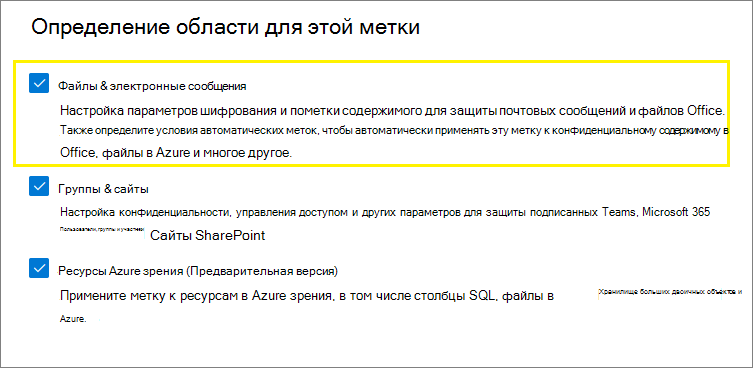
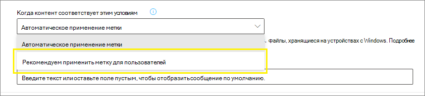

# <a name="apply-a-sensitivity-label-to-content-automatically"></a>Автоматическое применение метки конфиденциальности к содержимому

>*[Руководство по лицензированию Microsoft 365 для обеспечения безопасности и соответствия требованиям](/office365/servicedescriptions/microsoft-365-service-descriptions/microsoft-365-tenantlevel-services-licensing-guidance/microsoft-365-security-compliance-licensing-guidance).*

> [!NOTE]
> Сведения об автоматическом применении меток конфиденциальности в Azure Purview (предварительная версия) см. в статье [Автоматическое применение меток к содержимому в Azure Purview](/azure/purview/create-sensitivity-label).

При создании метки конфиденциальности можно автоматически назначать эту метку файлам и сообщениям электронной почты при выполнении указанных вами условий.

Эта возможность автоматически применять метки конфиденциальности к содержимому важна, потому что:

- не потребуется обучать пользователей работе с классификациями;

- вам не нужно будет рассчитывать на то, что пользователи правильно классифицируют весь контент;

- пользователям больше не нужно будет знать о ваших политиках — они могут сосредоточиться на своей работе.

Если метки применены к содержимому вручную, то эти метки никогда не заменяются на примененные автоматически. Однако автоматическое применение меток может заменять [метки низкого приоритета](sensitivity-labels.md#label-priority-order-matters), назначенные автоматически.

Существует два способа автоматического применения меток конфиденциальности к содержимому в Microsoft 365:

- **Применение меток на стороне клиента, когда пользователи редактируют документы или составляют сообщения электронной почты (а также пересылают их или отвечают на них)**: используйте метку, настроенную для автоматического применения к файлам и сообщениям электронной почты (включая Word, Excel, PowerPoint и Outlook). 
    
    В этом случае поддерживаются рекомендации меток пользователям и автоматическое применение меток. В обоих случаях пользователь решает, принять или отклонить метку, чтобы добиться правильного применения меток к содержимому. Применение меток на стороне клиента сопряжено с минимальными задержками для документов, поскольку метку можно применить еще до сохранения документа. Тем не менее, не все клиентские приложения поддерживают автоматическое применение меток. Эта функция поддерживается клиентом унифицированных меток Azure Information Protection и [некоторыми версиями Office](sensitivity-labels-office-apps.md#support-for-sensitivity-label-capabilities-in-apps). 
    
    Инструкции по настройке см. в разделе [Настройка автоматического применения меток в приложениях Office](#how-to-configure-auto-labeling-for-office-apps) на этой странице.

- **Применение меток на стороне службы, когда содержимое уже сохранено (в SharePoint или OneDrive) или отправлено по электронной почте (обрабатывается в Exchange Online)**: используйте политику автоматического применения меток. 
    
    Этот метод также называется автоматическим применением меток к неактивным данным (документы в SharePoint и OneDrive) и к данным при передаче (электронная почта, отправляемая и принимаемая в Exchange).
    
    Применение меток осуществляется службами, а не приложениями, поэтому можно не беспокоиться о том, какие у пользователей приложения и каких версий. Поэтому эта функция доступна сразу во всей организации и пригодна для крупномасштабного применения меток. Политики автоматического применения меток не поддерживают рекомендуемые метки, поскольку пользователь не взаимодействует с процессом применения меток. Вместо этого администратор запускает политики в режиме имитации, чтобы убедиться в правильности меток содержимого до фактического применения меток.
    
    Инструкции по настройке см. в разделе [Настройка политик автоматического применения меток для SharePoint, OneDrive и Exchange](#how-to-configure-auto-labeling-policies-for-sharepoint-onedrive-and-exchange) на этой странице.
    
    Особенности автоматического применения меток для SharePoint и OneDrive:
    - Поддерживаются файлы Office — Word, PowerPoint и Excel. Поддерживается формат Open XML (например, DOCX или XLSX), но не формат Microsoft Office 97–2003 (например, DOC или XLS).
        - Эти файлы можно автоматически пометить во время хранения до или после создания политик автоматического применения меток. Файлы нельзя пометить автоматически, если они являются частью открытого сеанса (файл открыт).
        - В настоящее время вложения элементов списка не поддерживаются и не будут помечаться автоматически.
    - Не более 25 000 файлов с автоматически примененными метками в клиенте за день.
    - Максимум 10 политик автоматического применения меток на клиент, каждая из которых предназначена не более чем для 10 сайтов (SharePoint или OneDrive).
    - Существующие значения для параметров "Изменено", "Автор изменения" и "Дата" не изменяются при использовании политик автоматического применения меток — как в режиме имитации, так и при применении меток.
    - Когда метка применяет шифрование, [издателем и владельцем в службе управления правами](/azure/information-protection/configure-usage-rights#rights-management-issuer-and-rights-management-owner) является учетная запись, изменившая файл последней.

    Особенности автоматического применения меток для Exchange:
    - В отличие от применения меток вручную или автоматически в приложениях Office, вложения PDF и вложения Office (файлы Word, Excel и PowerPoint) также проверяются на соответствие условиям, указанным в политике автоматического применения меток. Если условие выполняется, метка применяется к сообщению, но не к вложению.
        - Если метка применяет шифрование к PDF-файлам, эти файлы шифруются, когда для вашего клиента [включены вложения в формате PDF](ome-faq.yml#are-pdf-file-attachments-supported-).
        - Для этих файлов Office поддерживается формат Open XML (например, DOCX или XLSX), но не формат Microsoft Office 97–2003 (например, DOC или XLS). Если метка применяет шифрование, эти файлы шифруются.
    - Если используются правила потоков обработки почты в Exchange или защиты от потери данных (DLP), применяющие шифрование IRM: когда содержимое идентифицируется этими правилами или политиками и политикой автоматического применения меток, применяется метка. Если метка применяет шифрование, то параметры IRM для правил потоков обработки почты в Exchange или политик DLP игнорируются. Тем не менее, если метка не применяет шифрование, то параметры IRM для правил потоков обработки почты или политик DLP применяются в дополнение к метке.
    - Сообщение электронной почты с шифрованием IRM без метки будет заменено меткой с любыми параметрами шифрования, если при автоматическом применении меток есть совпадение.
    - Метки применяются к входящей электронной почте, если обнаружено совпадение с условиями применения меток.
        - Если метка настроена для [шифрования](encryption-sensitivity-labels.md), то шифрование не применяется.
        - Если метка настроена для применения [динамической маркировки](sensitivity-labels-office-apps.md#dynamic-markings-with-variables), помните, что в результате имена пользователей могут оказаться вне вашей организации.
    - Когда метка применяет шифрование, [издателем и владельцем в службе управления правами](/azure/information-protection/configure-usage-rights#rights-management-issuer-and-rights-management-owner) является лицо, отправляющее сообщение электронной почты. В настоящее время не существует способа задать владельца диспетчера прав для всех входящих электронных сообщений, которые автоматически шифруются.
    

## <a name="compare-auto-labeling-for-office-apps-with-auto-labeling-policies"></a>Сравнение автоматического применения меток для приложений Office с помощью политик

Используйте следующую таблицу, чтобы определить разницу в порядке работы двух взаимодополняющих методов автоматического применения меток:

|Функция или поведение|Параметр меток: автоматическое применение меток к файлам и сообщениям электронной почты  |Политика: автоматическое добавление меток|
|:-----|:-----|:-----|
|Зависимость приложения|[Да](sensitivity-labels-office-apps.md#support-for-sensitivity-label-capabilities-in-apps) |Нет \* |
|Ограничение по расположению|Нет |Да |
|Условия: обучаемые классификаторы|Да |Нет |
|Условия: параметры общего доступа и дополнительные параметры электронной почты|Нет |Да |
|Рекомендации, подсказки политики, возможность переопределения пользователями|Да |Нет |
|Режим имитации|Нет |Да |
|Проверка условий во вложениях Exchange|Нет | Да|
|Применение визуальной маркировки |Да |Да (только электронная почта) |
|Переопределение шифрования IRM, примененного без метки|Да, если у пользователя есть необходимые права экспорта |Да (только электронная почта) |
|Применение меток ко входящей почте|Нет |Да|

\* В настоящее время автоматическое применение меток доступно не во всех регионах. Если ваш клиент не поддерживает эту функцию, вкладка "Автоматическое применение меток" не отображается в центре применения меток для администраторов.

## <a name="how-multiple-conditions-are-evaluated-when-they-apply-to-more-than-one-label"></a>Оценка нескольких условий для нескольких меток

Метки оцениваются в порядке, в котором они указаны в политике: первая метка имеет наименьший приоритет (самый низкий уровень конфиденциальности), а последняя — наибольший приоритет (самый высокий уровень конфиденциальности). Дополнительные сведения о приоритете см. в разделе "Приоритет метки (важен порядок)" [этой статьи](sensitivity-labels.md#label-priority-order-matters).

## <a name="dont-configure-a-parent-label-to-be-applied-automatically-or-recommended"></a>Не настраивайте родительскую метку для автоматического применения или в качестве рекомендуемой

Помните, что нельзя применять родительскую метку (метку с подчиненными метками) к содержимому. Убедитесь, что родительская метка не настроена для автоматического применения или в качестве рекомендуемой в приложениях Office и не выбирайте ее для политики автоматического применения меток. В противном случае родительская метка не будет применяться к содержимому.

Для автоматического применения метки с подчиненными метками обязательно опубликуйте и родительскую метку, и подчиненную метку.

Дополнительные сведения о родительских и подчиненных метках см. в статье [Подчиненные метки (метки группирования)](sensitivity-labels.md#sublabels-grouping-labels).

## <a name="how-to-configure-auto-labeling-for-office-apps"></a>Настройка автоматического применения меток в приложениях Office

Автоматическое применение меток в приложениях Office для Windows поддерживается клиентом унифицированных меток Azure Information Protection. Для встроенных меток в приложениях Office эта возможность [доступна с некоторыми ограничениями для разных приложений](sensitivity-labels-office-apps.md#support-for-sensitivity-label-capabilities-in-apps).

Параметры автоматического присвоения меток в приложениях Office доступны при [создании и редактировании меток конфиденциальности](create-sensitivity-labels.md). Убедитесь, что для области метки выбраны **Файлы и сообщения электронной почты**. 



По мере продвижения по мастеру появится страница **Автоматическое применение меток для файлов и сообщений электронной почты**, на которой можно выбрать из списка типы конфиденциальной информации или обучаемые классификаторы:


Если метка конфиденциальности применяется автоматически, пользователь видит соответствующее уведомление в своем приложении Office. Пример:


### <a name="configuring-sensitive-info-types-for-a-label"></a>Настройка типов конфиденциальной информации для метки

При выборе параметра **Типы конфиденциальной информации** вы видите тот же список типов конфиденциальной информации, что и при создании политики защиты от потери данных (DLP). Например, вы можете автоматически применить метку "Строго конфиденциально" к любому содержимому с персональными данными, такими как номера кредитных карт, номера социального страхования или номера паспортов:


Аналогично настройке политик защиты от потери данных вы можете затем уточнить условие, изменив количество экземпляров и точность совпадений. Пример:


Дополнительные сведения об этих параметрах настройки см. в документации по защите от потери данных [Настройка более или менее строгих правил](data-loss-prevention-policies.md#tuning-rules-to-make-them-easier-or-harder-to-match).

По аналогии с настройкой политики от защиты данных вы также можете задать условие, чтобы определялись все типы конфиденциальной информации или только один из них. Чтобы условия были более гибкими или сложными, можно добавлять [группы и использовать логические операторы в отношении групп](data-loss-prevention-policies.md#grouping-and-logical-operators).

### <a name="configuring-trainable-classifiers-for-a-label"></a>Настройка обучаемых классификаторов для метки

В настоящее время эта возможность находится на стадии бета-тестирования. Если вы используете эту возможность, опубликуйте в своем клиенте хотя бы одну метку конфиденциальности, настроенную на автоматическое применение и для [типов конфиденциальной информации](#configuring-sensitive-info-types-for-a-label).

При выборе параметра **Обучаемые классификаторы** укажите один или несколько встроенных обучаемых классификаторов от Майкрософт. Если вы создали собственные обучаемые классификаторы, их также можно выбрать:


> [!CAUTION]
> Мы не рекомендуем использовать встроенный классификатор **Оскорбительная лексика**, так как он генерировал большое количество ложных срабатываний. Не используйте этот встроенный классификатор, а если вы применяете его в настоящее время, следует перенести с него свои бизнес-процессы. Вместо него рекомендуем использовать встроенные классификаторы **Целенаправленное притеснение**, **Сквернословие** и **Угрозы**.

Дополнительные сведения об этих классификаторах см. в статье [Информация об обучаемых классификаторах](classifier-learn-about.md).

В течение периода использования предварительной версии указанные ниже приложения поддерживают обучаемые классификаторы для меток конфиденциальности.

- Приложения Microsoft 365 для предприятий ([ранее — Office 365 профессиональный плюс](/deployoffice/name-change)) для Windows, которые сейчас развертываются в [Актуальном канале](/deployoffice/overview-update-channels#current-channel-overview) версии 2006 и более поздних:
    - Word
    - Excel
    - PowerPoint

- Приложения Office для Интернета, если [включены метки конфиденциальности для файлов Office в SharePoint и OneDrive](sensitivity-labels-sharepoint-onedrive-files.md):
    - Word
    - Excel
    - PowerPoint
    - Outlook

### <a name="recommend-that-the-user-applies-a-sensitivity-label"></a>Рекомендация пользователю о применении метки конфиденциальности

Если нужно, можно рекомендовать пользователю применить метку. Этот вариант позволяет пользователям принять классификацию и соответствующую защиту или отклонить рекомендацию, если метка не подходит для содержания.



Ниже приведен пример запроса от клиента для применения унифицированных меток Azure Information Protection, когда вы настраиваете условие применения метки в качестве рекомендуемого действия с подсказкой настраиваемой политики. Вы можете выбрать текст, отображаемый в подсказке о политике.


### <a name="when-automatic-or-recommended-labels-are-applied"></a>Когда применяются автоматические или рекомендованные метки

Реализация автоматического и рекомендуемого применения меток в приложениях Office зависит от того, каким образом применяются метки: используется встроенное применение меток Office или клиент для применения унифицированных меток Azure Information Protection. При этом в обоих случаях:

- Невозможно использовать автоматическое применение меток для документов и сообщений электронной почты, к которым ранее были применены метки вручную или были автоматически применены метки более высокого уровня конфиденциальности. Помните, что к документу или к сообщению электронной почты можно применить только одну метку конфиденциальности (в дополнение к одной метке хранения).

- Невозможно использовать рекомендованное применение меток для документов и сообщений электронной почты, которым ранее была присвоена метка более высокого уровня конфиденциальности. Если к содержимому не применена метка с более высоким уровнем конфиденциальности, у пользователя не появится приглашение с рекомендацией и подсказкой о политике.

Специфично для встроенной маркировки:

- Не все приложения Office поддерживают автоматическую (и рекомендуемую) маркировку. Для получения дополнительной информации см. [Поддержка возможностей меток чувствительности в приложениях](sensitivity-labels-office-apps.md#support-for-sensitivity-label-capabilities-in-apps).

- Для рекомендованных меток в настольных версиях Word конфиденциальный контент, вызвавший рекомендацию, помечается, чтобы пользователи могли просматривать и удалять конфиденциальный контент вместо применения рекомендуемой метки чувствительности.

- Подробные сведения о том, как эти метки применяются в приложениях Office, примеры снимков экрана и способ обнаружения конфиденциальной информации, см. в разделе [Автоматически применять или рекомендовать метки чувствительности к файлам и сообщениям электронной почты в Office](https://support.office.com/en-us/article/automatically-apply-or-recommend-sensitivity-labels-to-your-files-and-emails-in-office-622e0d9c-f38c-470a-bcdb-9e90b24d71a1).

Для клиента унифицированной маркировки Azure Information Protection:

-  Автоматическая и рекомендуемая маркировка применяется к Word, Excel и PowerPoint при сохранении документа и к Outlook при отправке электронной почты.

- Чтобы Outlook поддерживал рекомендуемую маркировку, сначала необходимо настроить [расширенный параметр политики](/azure/information-protection/rms-client/clientv2-admin-guide-customizations#enable-recommended-classification-in-outlook).

- Конфиденциальная информация может быть обнаружена в основном тексте документов и электронных писем, а также в верхних и нижних колонтитулах, но не в строке темы или вложениях электронной почты.

## <a name="how-to-configure-auto-labeling-policies-for-sharepoint-onedrive-and-exchange"></a>Настройка политик автоматического применения меток для SharePoint, OneDrive и Exchange

Перед настройкой политик автоматического применения меток ознакомьтесь с предварительными требованиями. 

### <a name="prerequisites-for-auto-labeling-policies"></a>Предварительные требования для политик автоматического применения меток

- Режим имитации:
    - Требуется включить аудит в Microsoft 365. Чтобы включить аудит или проверить, включен ли он, см. статью [Включение и отключение поиска в журнале аудита](turn-audit-log-search-on-or-off.md).
    - Чтобы просмотреть содержимое файлов или сообщений электронной почты в исходном представлении, у вас должна быть роль **Просмотр содержимого в обозревателе содержимого**. По умолчанию глобальному администратору не назначается эта роль. Если у вас нет такого разрешения, при выборе элемента на вкладке **Соответствующие элементы** вы не увидите область просмотра.

- Автоматическое применение меток к файлам в SharePoint и OneDrive:
    - Вы [включили метки конфиденциальности для файлов Office в SharePoint и OneDrive](sensitivity-labels-sharepoint-onedrive-files.md).
    - Во время выполнения этой политики автоматического применения меток файл не должен открываться другим процессом или пользователем. Файл, извлеченный для изменения, относится к этой категории.

- Если вы планируете использовать [пользовательские типы конфиденциальной информации](sensitive-information-type-learn-about.md) вместо встроенных типов: 
    - Пользовательские типы конфиденциальной информации проверяются на наличие содержимого, которое добавляется в SharePoint или OneDrive после сохранения этих типов. 
    - Чтобы протестировать новые пользовательские типы конфиденциальной информации, создайте их перед созданием политики автоматического применения меток, затем создайте новые документы с примерами данных для тестирования.

- Одна или несколько меток конфиденциальности [должна быть создана и опубликована](create-sensitivity-labels.md) (по крайней мере для одного пользователя), чтобы можно было выбрать ее для политик автоматического применения меток. Для таких меток:
    - Неважно, включено ли автоматическое применение меток в приложениях Office. Это применение меток дополняет политики автоматического применения, как было пояснено во введении.
    - Если метки, которые вы хотите использовать для автоматического применения, используют визуальную маркировку (верхние и нижние колонтитулы, водяные знаки), обратите внимание, что они не применяются к документам.
    - Если метки применяют [шифрование](encryption-sensitivity-labels.md):
        - Если политика автоматического применения меток включает расположения в SharePoint или OneDrive, метку следует настроить с использованием параметра **Назначить разрешения сейчас**.
        - Если политика автоматического применения меток предназначена только для Exchange, метку можно настроить с использованием параметра **Назначить разрешения сейчас** или **Предоставить пользователям назначать решения** (для параметров "Не пересылать" или "Только шифрование").

### <a name="learn-about-simulation-mode"></a>Сведения о режиме имитации

Режим имитации служит только для политик автоматического применения меток и встроен в рабочий процесс. Невозможно автоматически применять метки к документам и сообщениям электронной почты, пока политика не пройдет хотя бы одну имитацию.

Порядок автоматического применения меток:

1. Создайте и настройте политику автоматического применения меток.

2. Запустите политику в режиме имитации (выполнение может занять до 48 часов)

3. Проверьте результаты и при необходимости уточните свою политику. Перезапустите режим имитации и снова дождитесь завершения.

4. При необходимости повторите шаг 3.

5. Разверните в рабочей среде.

Имитируемое развертывание выполняется как параметр WhatIf для PowerShell. Вы увидите результаты, которые были бы получены при применении выбранной метки политикой автоматического применения меток на основании заданных вами правил. После этого можно уточнить правила, если нужно повысить их точность, и заново запустить имитацию. Следует помнить, что автоматическое применение меток в Exchange действует только для отправляемых и получаемых сообщений электронной почты, но не для сообщений, хранящихся в почтовых ящиках. Поэтому результаты имитации для электронной почты не будут согласованными, если вам не удастся отправлять и получать полностью идентичные сообщения электронной почты.

В режиме имитации также можно постепенно увеличивать область действия политики автоматического применения меток перед развертыванием. Например, можно начать с одного расположения, скажем, сайта SharePoint, с одной библиотекой документов. Затем, внося последовательные изменения, можно расширить область до нескольких сайтов, затем включить в нее другое расположение, например OneDrive.

Наконец, можно использовать режим имитации, чтобы получить представление о времени, необходимом для работы политики автоматического применения меток. Это поможет при планировании выполнения этой политики в рабочей среде, без имитации.

### <a name="creating-an-auto-labeling-policy"></a>Создание политики автоматического применения меток

1. В [Центре соответствия требованиям Microsoft 365](https://compliance.microsoft.com/) перейдите к меткам конфиденциальности:
    
    - **Решения** > **Защита информации**
    
    Если этот параметр не отображается сразу, сначала выберите пункт **Показать все**.

2. Выберите вкладку **Автоматическое добавление меток**:
    
    
    
    > [!NOTE]
    > Если вкладка **Автоматическое применение меток** не отображается, эта функция в настоящее время недоступна в вашем регионе.

3. Нажмите **+ Создание политики автоматического применения меток**. Запустится мастер создания политики:
    
    

4. На странице **Выберите информацию, к которой нужно применять эту метку**: выберите один из шаблонов, например **Финансы** или **Конфиденциальность**. Можно уточнить поиск, воспользовавшись раскрывающимся списком **Показать параметры для**. Также можно выбрать **Пользовательская политика**, если шаблоны не соответствуют вашим требованиям. Нажмите кнопку **Далее**.

5. На странице **Имя политики автоматического применения меток**: укажите имя, а также необязательное описание, которое поможет определить автоматически применяемую метку, расположения и условия для применения этой метки к содержимому.

6. На странице **Выбор расположений для применения метки**: выберите и укажите расположения для Exchange, сайтов SharePoint и OneDrive. Нажмите кнопку **Далее**.
    
    
    
    Вы должны указать отдельные сайты SharePoint и учетные записи OneDrive. Для OneDrive: URL-адрес для учетной записи OneDrive пользователя указывается в следующем формате: `https://<tenant name>-my.sharepoint.com/personal/<user_name>_<tenant name>_com`
    
    Например, для пользователя в клиенте Contoso с именем пользователя "rsimone": `https://contoso-my.sharepoint.com/personal/rsimone_contoso_onmicrosoft_com`
    
    Чтобы проверить синтаксис для клиента и определить URL-адреса для пользователей, ознакомьтесь со статьей [Получение списка всех пользовательских URL-адресов OneDrive в организации](/onedrive/list-onedrive-urls).

7. На странице **Настройка общих или расширенных правил**: оставьте значение по умолчанию **Общие правила**, чтобы определить правила идентификации содержимого для применения меток во всех выбранных расположениях. Если для каждого расположения нужны разные правила, выберите **Расширенные правила**. Нажмите кнопку **Далее**.
    
    Правила используют условия, которые включают типы конфиденциальной информации и параметры общего доступа:
    - Можно выбирать как встроенные, так и пользовательские типы конфиденциальной информации.
    - Доступны следующие параметры общего доступа: **только пользователи моей организации** или **пользователи за пределами моей организации**.
    
    Если единственным расположением является **Exchange** или если выбрать **Расширенные правила**, можно выбрать дополнительные условия:
    - IP-адрес отправителя
    - Домен получателя
    - Получатель
    - Расширение вложенного файла
    - Вложение защищено паролем
    - Не удалось проверить содержимое любого вложения электронной почты
    - Проверка содержимого любого вложения электронной почты не завершена

8. В зависимости от ранее выбранных вариантов вы можете создавать новые правила, используя условия и исключения.
    
    Параметры конфигурации для типов конфиденциальной информации такие же, как при автоматическом применении меток для приложений Office. Дополнительные сведения см. в разделе [Настройка типов конфиденциальной информации для метки](#configuring-sensitive-info-types-for-a-label).
    
    Определите все необходимые правила, убедитесь что они включены и нажмите кнопку **Далее**, чтобы перейти к выбору метки для автоматического применения.

11. На странице **Выбор метки для автоматического применения**: нажмите кнопку **+ Выбрать метку**, выберите метку в области **Выберите метку конфиденциальности**, затем нажмите кнопку **Далее**.

12. На странице **Принятие решения о тестировании политики сейчас или позже**: выберите **Запуск политики в режиме имитации**, если вы готовы прямо сейчас запустить политику автоматического применения меток в режиме имитации. В противном случае выберите **Выключение политики**. Нажмите **Далее**: 
    
    

13. На странице **Сводка**: проверьте конфигурацию политики автоматического применения меток и внесите необходимые изменения, после чего завершите работу мастера.

Теперь на странице **Защита информации** > **Автоматическое добавление меток** политика автоматического применения меток будет отображаться либо в разделе **Моделирование**, либо в разделе **Выкл.** в зависимости от того, запустили вы эту политику в режиме имитации или нет. Выберите политику, чтобы получить сведения об ее конфигурации и состоянии (например **Имитация политики еще выполняется**). Если политики в режиме имитации выполняются, перейдите на вкладку **Сопоставленные элементы**, чтобы увидеть, какие сообщения электронной почты и документы соответствуют указанным вами правилам.

Изменения в свою политику можно вносить прямо через этот интерфейс:

- Если политика отображается в разделе **Выкл.**, нажмите кнопку **Изменить политику**.

- Если политика отображается в разделе **Моделирование**, выберите параметр **Изменить политику** в верхней части страницы на любой вкладке:
    
    
    
    Когда вы будете готовы запустить политику без имитации, выберите вариант **Включить политику**.

Политики автоматического применения меток выполняются непрерывно до тех пор, пока не будут удалены. Например, новые и измененные документы будут включены в текущие параметры политики.

Также можно просмотреть результаты политики автоматического применения меток с помощью [обозревателя содержимого](data-classification-content-explorer.md) при наличии необходимых [разрешений](data-classification-content-explorer.md#permissions):
- **Просматривающий списки в обозревателе содержимого** позволяет просматривать метку файла, но не содержимое файла.
- **Просматривающий контент в обозревателе содержимого** позволяет просматривать содержимое файла.

> [!TIP]
> Также можно использовать обозреватель содержимого, чтобы определять расположения с документами, содержащими конфиденциальную информацию, но не имеющими меток. Используйте эту информацию, чтобы рассмотреть возможность добавления этих расположений в политику автоматического применения меток. Также включите обнаруженные типы конфиденциальной информации в качестве правил.

### <a name="use-powershell-for-auto-labeling-policies"></a>Использование PowerShell для политик автоматического применения меток

Для создания и настройки политик автоматического применения меток вы можете использовать [PowerShell в Центре безопасности и соответствия требованиям](/powershell/exchange/scc-powershell). Это означает, что можно использовать полноценный сценарий создания и обслуживания политик автоматического применения меток, который также предоставляет более эффективный метод указания нескольких URL-адресов для расположений OneDrive и SharePoint.

Перед выполнением команд в PowerShell необходимо сначала [подключиться к PowerShell в Центре безопасности и соответствия требованиям](/powershell/exchange/connect-to-scc-powershell).

Создание политики автоматического применения меток: 

```powershell
New-AutoSensitivityLabelPolicy -Name <AutoLabelingPolicyName> -SharePointLocation "<SharePointSiteLocation>" -ApplySensitivityLabel <Label> -Mode TestWithoutNotifications
```
Эта команда создает политику автоматического применения меток для указанного сайта SharePoint. Для расположения OneDrive используйте вместо этого параметр *OneDriveLocation*. 

Добавление других сайтов в существующую политику автоматического применения меток:

```powershell
$spoLocations = @("<SharePointSiteLocation1>","<SharePointSiteLocation2>")
Set-AutoSensitivityLabelPolicy -Identity <AutoLabelingPolicyName> -AddSharePointLocation $spoLocations -ApplySensitivityLabel <Label> -Mode TestWithoutNotifications
```

Эта команда указывает дополнительные URL-адреса SharePoint в переменной, которая затем добавляется в существующую политику автоматического применения меток. Чтобы добавить вместо этого расположение OneDrive, используйте параметр *AddOneDriveLocation* с другой переменной, например *$OneDriveLocations*.

Создание правила политики автоматического применения меток:

```powershell
New-AutoSensitivityLabelRule -Policy <AutoLabelingPolicyName> -Name <AutoLabelingRuleName> -ContentContainsSensitiveInformation @{"name"= "a44669fe-0d48-453d-a9b1-2cc83f2cba77"; "mincount" = "2"} -Workload SharePoint
```

Для существующей политики автоматического применения меток эта команда создает новое правило политики для определения типа конфиденциальной информации **номера социального страхования США (SSN)** с идентификатором объекта a44669fe-0d48-453d-a9b1-2cc83f2cba77. Идентификаторы объектов других типов конфиденциальной информации см. в статье [Определения типов конфиденциальной информации](sensitive-information-type-entity-definitions.md).

Дополнительные сведения о командлетах PowerShell, поддерживающих политики автоматического применения меток, их доступные параметры и некоторые примеры, см. в справке по следующим командлетам:

- [Get-AutoSensitivityLabelPolicy](/powershell/module/exchange/get-autosensitivitylabelpolicy)
- [New-AutoSensitivityLabelPolicy](/powershell/module/exchange/new-autosensitivitylabelpolicy)
- [New-AutoSensitivityLabelRule](/powershell/module/exchange/new-autosensitivitylabelrule)
- [Remove-AutoSensitivityLabelPolicy](/powershell/module/exchange/remove-autosensitivitylabelpolicy)
- [Remove-AutoSensitivityLabelRule](/powershell/module/exchange/remove-autosensitivitylabelrule)
- [Set-AutoSensitivityLabelPolicy](/powershell/module/exchange/set-autosensitivitylabelpolicy)
- [Set-AutoSensitivityLabelRule](/powershell/module/exchange/set-autosensitivitylabelrule)

## <a name="tips-to-increase-labeling-reach"></a>Советы по увеличению охвата метками

Хотя автоматическое присвоение меток является одним из наиболее эффективных способов классификации, пометки и защиты файлов Office, которыми владеет ваша организация, проверьте, можно ли дополнить ее любым из дополнительных методов, чтобы увеличить охват метками:

- При использовании [клиента унифицированных меток Azure Information Protection](/azure/information-protection/rms-client/aip-clientv2):
    
    - Для файлов в локальном хранилище данных, таких как сетевые папки и библиотеки SharePoint Server: используйте [сканер](/azure/information-protection/deploy-aip-scanner) для обнаружения конфиденциальной информации в этих файлах и пометки их соответствующим образом. Если вы планируете перенести или отправить эти файлы в SharePoint в Microsoft 365, используйте сканер для пометки файлов перед их перемещением в облако.
    
    - Если вы использовали другое решение для присвоения меток, прежде чем применить метки конфиденциальности: используйте PowerShell и [дополнительный параметр для повторного использования меток](/azure/information-protection/rms-client/clientv2-admin-guide-customizations#migrate-labels-from-secure-islands-and-other-labeling-solutions) из этих решений.

- Рекомендуйте [применение меток вручную](https://support.microsoft.com/office/apply-sensitivity-labels-to-your-files-and-email-in-office-2f96e7cd-d5a4-403b-8bd7-4cc636bae0f9) после обучения пользователей тому, какие метки конфиденциальности следует применять. Если вы уверены, что пользователи понимают, какие метки нужно применять, рассмотрите возможность настройки метки по умолчанию и обязательного применения меток в виде [параметров политики](sensitivity-labels.md#what-label-policies-can-do). 

Кроме того, рассмотрите возможность [помечать новые файлы как конфиденциальные по умолчанию](/sharepoint/sensitive-by-default) в SharePoint, чтобы запретить гостям доступ к добавленным файлам, пока по крайней мере одна политика защиты от потери данных не проверит содержимое файла.
